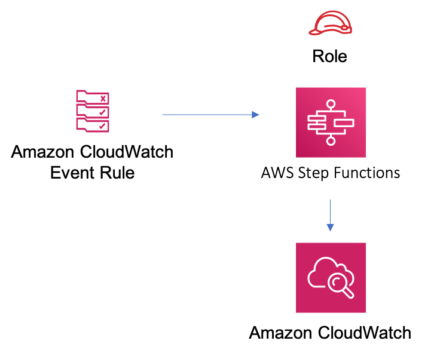

//!!NODE_ROOT <section>
//== aws-eventbridge-stepfunctions module

[.topic]
= aws-eventbridge-stepfunctions
:info_doctype: section
:info_title: aws-eventbridge-stepfunctions

image:https://img.shields.io/badge/cfn--resources-stable-success.svg?style=for-the-badge[Stability:Stable]

[width="100%",cols="<50%,<50%",options="header",]
|===
|*Reference Documentation*:
|https://docs.aws.amazon.com/solutions/latest/constructs/
|===

[width="100%",cols="<46%,54%",options="header",]
|===
|*Language* |*Package*
|image:https://docs.aws.amazon.com/images/solutions/latest/constructs/images/python32.png[Python
Logo] Python
|`aws_solutions_constructs.aws_eventbridge_stepfunctions`

|image:https://docs.aws.amazon.com/images/solutions/latest/constructs/images/typescript32.png[Typescript
Logo] Typescript
|`@aws-solutions-constructs/aws-eventbridge-stepfunctions`

|image:https://docs.aws.amazon.com/images/solutions/latest/constructs/images/java32.png[Java
Logo] Java
|`software.amazon.awsconstructs.services.eventbridgestepfunctions`
|===

== Overview

This AWS Solutions Construct implements an AWS Events rule and an AWS
Step Functions State Machine

Here is a minimal deployable pattern definition:

====
[role="tablist"]
Typescript::
+
[source,typescript]
----
import { Construct } from 'constructs';
import { Stack, StackProps, Duration } from 'aws-cdk-lib';
import { EventbridgeToStepfunctions, EventbridgeToStepfunctionsProps } from '@aws-solutions-constructs/aws-eventbridge-stepfunctions';
import * as stepfunctions from 'aws-cdk-lib/aws-stepfunctions';
import * as events from 'aws-cdk-lib/aws-events';

const startState = new stepfunctions.Pass(this, 'StartState');

const constructProps: EventbridgeToStepfunctionsProps = {
  stateMachineProps: {
    definition: startState
  },
  eventRuleProps: {
    schedule: events.Schedule.rate(Duration.minutes(5))
  }
};

new EventbridgeToStepfunctions(this, 'test-eventbridge-stepfunctions-stack', constructProps);
----

Python::
+
[source,python]
----
from aws_solutions_constructs.aws_eventbridge_stepfunctions import EventbridgeToStepfunctions, EventbridgeToStepfunctionsProps
from aws_cdk import (
    aws_stepfunctions as stepfunctions,
    aws_events as events,
    Duration,
    Stack
)
from constructs import Construct

startState = stepfunctions.Pass(self, 'StartState')

EventbridgeToStepfunctions(self, 'test-eventbridge-stepfunctions-stack',
                            state_machine_props=stepfunctions.StateMachineProps(
                                definition=startState
                            ),
                            event_rule_props=events.RuleProps(
                                schedule=events.Schedule.rate(
                                    Duration.minutes(5))
                            ))
----

Java::
+
[source,java]
----
import software.constructs.Construct;

import software.amazon.awscdk.Stack;
import software.amazon.awscdk.StackProps;
import software.amazon.awscdk.Duration;
import software.amazon.awscdk.services.events.*;
import software.amazon.awscdk.services.stepfunctions.*;
import software.amazon.awsconstructs.services.eventbridgestepfunctions.*;

final Pass startState = new Pass(this, "StartState");

new EventbridgeToStepfunctions(this,
        "test-eventbridge-stepfunctions-stack",
        new EventbridgeToStepfunctionsProps.Builder()
                .stateMachineProps(new StateMachineProps.Builder()
                        .definition(startState)
                        .build())
                .eventRuleProps(new RuleProps.Builder()
                        .schedule(Schedule.rate(Duration.minutes(5)))
                        .build())
                .build());
----
====

== Pattern Construct Props

[width="100%",cols="<30%,<35%,35%",options="header",]
|===
|*Name* |*Type* |*Description*
|stateMachineProps
|https://docs.aws.amazon.com/cdk/api/v2/docs/aws-cdk-lib.aws_stepfunctions.StateMachineProps.html[`sfn.StateMachineProps`]
|Optional user provided props to override the default props for
sfn.StateMachine

|existingEventBusInterface?
|https://docs.aws.amazon.com/cdk/api/v2/docs/aws-cdk-lib.aws_events.IEventBus.html[`events.IEventBus`]
|Optional - user provided custom event bus for this construct to use. Providing both this and `eventBusProps` is
an error.

|eventBusProps?
|https://docs.aws.amazon.com/cdk/api/v2/docs/aws-cdk-lib.aws_events.EventBusProps.html[`events.EventBusProps`]
|Optional - user provided properties to override the default properties when creating a custom EventBus. Setting
this value to `{}` will create a custom EventBus using all default properties. If neither this nor
`existingEventBusInterface` is provided the construct will use the default EventBus. Providing both this and
`existingEventBusInterface` results an error.

|eventRuleProps
|https://docs.aws.amazon.com/cdk/api/v2/docs/aws-cdk-lib.aws_events.RuleProps.html[`events.RuleProps`]
|User provided eventRuleProps to override the defaults

|createCloudWatchAlarms |`boolean` |Whether to create recommended
CloudWatch alarms

|logGroupProps?
|https://docs.aws.amazon.com/cdk/api/v2/docs/aws-cdk-lib.aws_logs.LogGroupProps.html[`logs.LogGroupProps`]
|User provided props to override the default props for for the
CloudWatchLogs LogGroup.
|===

== Pattern Properties

[width="100%",cols="<30%,<35%,35%",options="header",]
|===
|*Name* |*Type* |*Description*
|eventBus?
|https://docs.aws.amazon.com/cdk/api/v2/docs/aws-cdk-lib.aws_events.IEventBus.html[`events.IEventBus`]
|Returns the instance of events.IEventBus used by the construct

|eventsRule
|https://docs.aws.amazon.com/cdk/api/v2/docs/aws-cdk-lib.aws_events.Rule.html[`events.Rule`]
|Returns an instance of events.Rule created by the construct

|stateMachine
|https://docs.aws.amazon.com/cdk/api/v2/docs/aws-cdk-lib.aws_stepfunctions.StateMachine.html[`sfn.StateMachine`]
|Returns an instance of sfn.StateMachine created by the construct

|stateMachineLogGroup
|https://docs.aws.amazon.com/cdk/api/v2/docs/aws-cdk-lib.aws_logs.ILogGroup.html[`logs.ILogGroup`]
|Returns an instance of the ILogGroup created by the construct for
StateMachine

|cloudwatchAlarms?
|https://docs.aws.amazon.com/cdk/api/v2/docs/aws-cdk-lib.aws_cloudwatch.Alarm.html[`cloudwatch.Alarm[\]`]
|Returns a list of cloudwatch.Alarm created by the construct
|===

== Default settings

Out of the box implementation of the Construct without any override will
set the following defaults:

=== Amazon CloudWatch Events Rule

* Grant least privilege permissions to CloudWatch Events to trigger the
Lambda Function

=== AWS Step Function

* Enable CloudWatch logging for API Gateway
* Deploy best practices CloudWatch Alarms for the Step Function

== Architecture

// github block

'''''

© Copyright Amazon.com, Inc. or its affiliates. All Rights Reserved.
