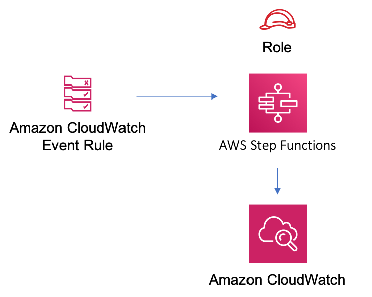

# aws-eventbridge-stepfunctions module
<!--BEGIN STABILITY BANNER-->

---


---
<!--END STABILITY BANNER-->

| **Reference Documentation**:| <span style="font-weight: normal">https://docs.aws.amazon.com/solutions/latest/constructs/</span>|
|:-------------|:-------------|
<div style="height:8px"></div>

| **Language**     | **Package**        |
|:-------------|-----------------|
| Python|`aws_solutions_constructs.aws_eventbridge_stepfunctions`|
| Typescript|`@aws-solutions-constructs/aws-eventbridge-stepfunctions`|
| Java|`software.amazon.awsconstructs.services.eventbridgestepfunctions`|

This AWS Solutions Construct implements an AWS Events rule and an AWS Step Functions State Machine

Here is a minimal deployable pattern definition:

Typescript
``` javascript
import { EventbridgeToStepfunctions, EventbridgeToStepfunctionsProps } from '@aws-solutions-constructs/aws-eventbridge-stepfunctions';
import * as stepfunctions from 'aws-cdk-lib/aws-stepfunctions';
import * as events from 'aws-cdk-lib/aws-events';
import { Duration } from 'aws-cdk-lib';

const startState = new stepfunctions.Pass(this, 'StartState');

const props: EventbridgeToStepfunctionsProps = {
    stateMachineProps: {
        definition: startState
    },
    eventRuleProps: {
        schedule: events.Schedule.rate(Duration.minutes(5))
    }
};

new EventbridgeToStepfunctions(this, 'test-eventbridge-stepfunctions-stack', props);
```

Python
``` python
from aws_solutions_constructs.aws_eventbridge_stepfunctions import EventbridgeToStepfunctions, EventbridgeToStepfunctionsProps
from aws_cdk import (
    aws_stepfunctions as stepfunctions,
    aws_events as events,
    Duration
)

startState = stepfunctions.Pass(self, 'StartState')

props = EventbridgeToStepfunctionsProps(
    state_machine_props=stepfunctions.StateMachineProps(
        definition=startState
    ),
    evnet_rule_props=events.RuleProps(
        schedule=events.Schedule.rate(Duration.minutes(5))
    )
)

EventbridgeToStepfunctions(self, 'test-eventbridge-stepfunctions-stack', props)
```

Java
``` java
import software.amazon.awsconstructs.services.eventbridgestepfunctions.*;
import software.amazon.awscdk.Duration;
import software.amazon.awscdk.services.events.*;
import software.amazon.awscdk.services.stepfunctions.*;

final Pass startState = Pass(this, "StartState");

final EventbridgeToStepfunctions constructStack = EventbridgeToStepfunctions(this, "test-construct",
    new EventbridgeToStepfunctionsProps.Builder()
        .stateMachineProps(new StateMachineProps.Builder()
            .definition(startState))
            .build())
        .eventRuleProps(new RuleProps.Builder()
            .schedule(Schedule.rate(Duration.minutes(5)))
            .build())
        .build());
```

## Pattern Construct Props

| **Name**     | **Type**        | **Description** |
|:-------------|:----------------|-----------------|
|stateMachineProps|[`sfn.StateMachineProps`](https://docs.aws.amazon.com/cdk/api/latest/docs/@aws-cdk_aws-stepfunctions.StateMachineProps.html)|Optional user provided props to override the default props for sfn.StateMachine|
|existingEventBusInterface?|[`events.IEventBus`](https://docs.aws.amazon.com/cdk/api/latest/docs/@aws-cdk_aws-events.IEventBus.html)| Optional user-provided custom EventBus for construct to use. Providing both this and `eventBusProps` results an error.|
|eventBusProps?|[`events.EventBusProps`](https://docs.aws.amazon.com/cdk/api/latest/docs/@aws-cdk_aws-events.EventBusProps.html)|Optional user-provided properties to override the default properties when creating a custom EventBus. Setting this value to `{}` will create a custom EventBus using all default properties. If neither this nor `existingEventBusInterface` is provided the construct will use the `default` EventBus. Providing both this and `existingEventBusInterface` results an error.|
|eventRuleProps|[`events.RuleProps`](https://docs.aws.amazon.com/cdk/api/latest/docs/@aws-cdk_aws-events.RuleProps.html)|User provided eventRuleProps to override the defaults|
|createCloudWatchAlarms|`boolean`|Whether to create recommended CloudWatch alarms|
|logGroupProps?|[`logs.LogGroupProps`](https://docs.aws.amazon.com/cdk/api/latest/docs/@aws-cdk_aws-logs.LogGroupProps.html)|User provided props to override the default props for for the CloudWatchLogs LogGroup.|

## Pattern Properties

| **Name**     | **Type**        | **Description** |
|:-------------|:----------------|-----------------|
|eventBus?|[`events.IEventBus`](https://docs.aws.amazon.com/cdk/api/latest/docs/@aws-cdk_aws-events.IEventBus.html)|Returns the instance of events.IEventBus used by the construct|
|eventsRule|[`events.Rule`](https://docs.aws.amazon.com/cdk/api/latest/docs/@aws-cdk_aws-events.Rule.html)|Returns an instance of events.Rule created by the construct|
|stateMachine|[`sfn.StateMachine`](https://docs.aws.amazon.com/cdk/api/latest/docs/@aws-cdk_aws-stepfunctions.StateMachine.html)|Returns an instance of sfn.StateMachine created by the construct|
|stateMachineLogGroup|[`logs.ILogGroup`](https://docs.aws.amazon.com/cdk/api/latest/docs/@aws-cdk_aws-logs.ILogGroup.html)|Returns an instance of the ILogGroup created by the construct for StateMachine|
|cloudwatchAlarms?|[`cloudwatch.Alarm[]`](https://docs.aws.amazon.com/cdk/api/latest/docs/@aws-cdk_aws-cloudwatch.Alarm.html)|Returns a list of cloudwatch.Alarm created by the construct|

## Default settings

Out of the box implementation of the Construct without any override will set the following defaults:

### Amazon CloudWatch Events Rule
* Grant least privilege permissions to CloudWatch Events to trigger the Lambda Function

### AWS Step Function
* Enable CloudWatch logging for API Gateway
* Deploy best practices CloudWatch Alarms for the Step Function

## Architecture


***
&copy; Copyright 2021 Amazon.com, Inc. or its affiliates. All Rights Reserved.
