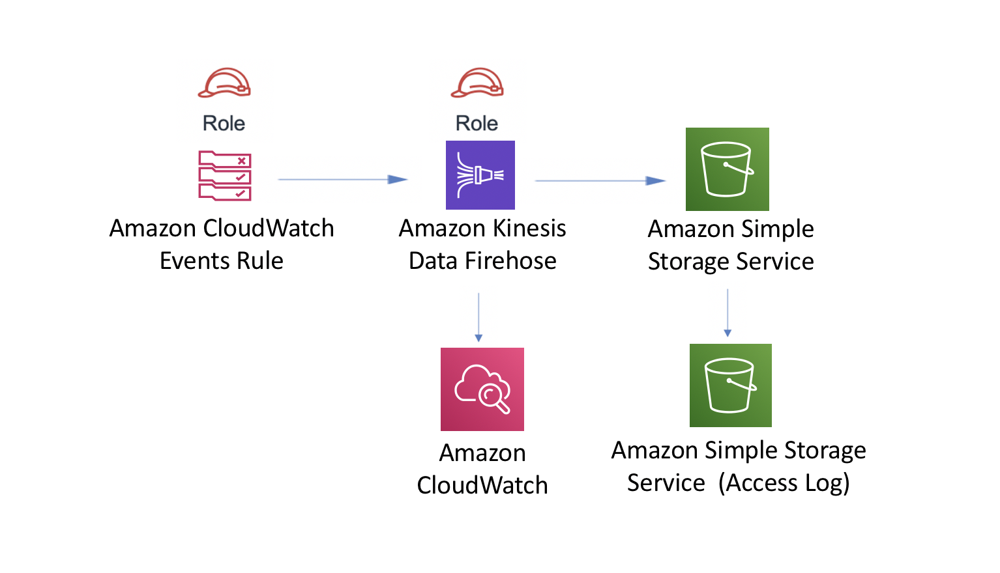

# aws-events-rule-kinesisfirehose-s3 module
<!--BEGIN STABILITY BANNER-->

---


> Some of our early constructs don’t meet the naming standards that evolved for the library. We are releasing completely feature compatible versions with corrected names. The underlying implementation code is the same regardless of whether you deploy the construct using the old or new name. We will support both names for all 1.x releases, but in 2.x we will only publish the correctly named constructs. This construct is being replaced by the functionally identical aws-eventbridge-kinesisfirehose-s3.

---
<!--END STABILITY BANNER-->

| **Reference Documentation**:| <span style="font-weight: normal">https://docs.aws.amazon.com/solutions/latest/constructs/</span>|
|:-------------|:-------------|
<div style="height:8px"></div>

| **Language**     | **Package**        |
|:-------------|-----------------|
| Python|`aws_solutions_constructs.aws_events_rule_kinesisfirehose_s3`|
| Typescript|`@aws-solutions-constructs/aws-events-rule-kinesisfirehose-s3`|
| Java|`software.amazon.awsconstructs.services.eventsrulekinesisfirehoses3`|

This AWS Solutions Construct implements an Amazon CloudWatch Events rule to send data to an Amazon Kinesis Data Firehose delivery stream connected to an Amazon S3 bucket.

Here is a minimal deployable pattern definition in Typescript:

``` javascript
import * as cdk from '@aws-cdk/core';
import { EventsRuleToKinesisFirehoseToS3, EventsRuleToKinesisFirehoseToS3Props } from '@aws-solutions-constructs/aws-events-rule-kinesisfirehose-s3';

const eventsRuleToKinesisFirehoseToS3Props: EventsRuleToKinesisFirehoseToS3Props = {
    eventRuleProps: {
    schedule: events.Schedule.rate(cdk.Duration.minutes(5))
    }
};

new EventsRuleToKinesisFirehoseToS3(this, 'test-events-rule-firehose-s3', eventsRuleToKinesisFirehoseToS3Props);

```

## Initializer

``` text
new EventsRuleToKinesisFirehoseToS3(scope: Construct, id: string, props: EventsRuleToKinesisFirehoseToS3Props);
```

_Parameters_

* scope [`Construct`](https://docs.aws.amazon.com/cdk/api/latest/docs/@aws-cdk_core.Construct.html)
* id `string`
* props [`EventsRuleToKinesisFirehoseToS3Props`](#pattern-construct-props)

## Pattern Construct Props

| **Name**     | **Type**        | **Description** |
|:-------------|:----------------|-----------------|
|existingEventBusInterface?|[`events.IEventBus`](https://docs.aws.amazon.com/cdk/api/latest/docs/@aws-cdk_aws-events.IEventBus.html)| Optional user-provided custom EventBus for construct to use. Providing both this and `eventBusProps` results an error.|
|eventBusProps?|[`events.EventBusProps`](https://docs.aws.amazon.com/cdk/api/latest/docs/@aws-cdk_aws-events.EventBusProps.html)|Optional user-provided properties to override the default properties when creating a custom EventBus. Setting this value to `{}` will create a custom EventBus using all default properties. If neither this nor `existingEventBusInterface` is provided the construct will use the `default` EventBus. Providing both this and `existingEventBusInterface` results an error.|
|eventRuleProps|[`events.RuleProps`](https://docs.aws.amazon.com/cdk/api/latest/docs/@aws-cdk_aws-events.RuleProps.html)|User provided eventRuleProps to override the defaults.|
|kinesisFirehoseProps?|[`kinesisfirehose.CfnDeliveryStreamProps`](https://docs.aws.amazon.com/cdk/api/latest/docs/@aws-cdk_aws-kinesisfirehose.CfnDeliveryStreamProps.html)|Optional user provided props to override the default props for Kinesis Firehose Delivery Stream|
|existingBucketObj?|[`s3.IBucket`](https://docs.aws.amazon.com/cdk/api/latest/docs/@aws-cdk_aws-s3.IBucket.html)|Existing instance of S3 Bucket object. If this is provided, then also providing bucketProps is an error. |
|bucketProps?|[`s3.BucketProps`](https://docs.aws.amazon.com/cdk/api/latest/docs/@aws-cdk_aws-s3.BucketProps.html)|User provided props to override the default props for the S3 Bucket.|
|logGroupProps?|[`logs.LogGroupProps`](https://docs.aws.amazon.com/cdk/api/latest/docs/@aws-cdk_aws-logs.LogGroupProps.html)|User provided props to override the default props for for the CloudWatchLogs LogGroup.|

## Pattern Properties

| **Name**     | **Type**        | **Description** |
|:-------------|:----------------|-----------------|
|eventBus?|[`events.IEventBus`](https://docs.aws.amazon.com/cdk/api/latest/docs/@aws-cdk_aws-events.IEventBus.html)|Returns the instance of events.IEventBus used by the construct|
|eventsRule|[`events.Rule`](https://docs.aws.amazon.com/cdk/api/latest/docs/@aws-cdk_aws-events.Rule.html)|Returns an instance of events.Rule created by the construct.|
|kinesisFirehose|[`kinesisfirehose.CfnDeliveryStream`](https://docs.aws.amazon.com/cdk/api/latest/docs/@aws-cdk_aws-kinesisfirehose.CfnDeliveryStream.html)|Returns an instance of kinesisfirehose.CfnDeliveryStream created by the construct|
|s3Bucket?|[`s3.Bucket`](https://docs.aws.amazon.com/cdk/api/latest/docs/@aws-cdk_aws-s3.Bucket.html)|Returns an instance of s3.Bucket created by the construct|
|s3LoggingBucket?|[`s3.Bucket`](https://docs.aws.amazon.com/cdk/api/latest/docs/@aws-cdk_aws-s3.Bucket.html)|Returns an instance of s3.Bucket created by the construct as the logging bucket for the primary bucket.|
|eventsRole|[`iam.Role`](https://docs.aws.amazon.com/cdk/api/latest/docs/@aws-cdk_aws-iam.Role.html)|Returns an instance of the iam.Role created by the construct for Events Rule|
|kinesisFirehoseRole|[`iam.Role`](https://docs.aws.amazon.com/cdk/api/latest/docs/@aws-cdk_aws-iam.Role.html)|Returns an instance of the iam.Role created by the construct for Kinesis Data Firehose delivery stream|
|kinesisFirehoseLogGroup|[`logs.LogGroup`](https://docs.aws.amazon.com/cdk/api/latest/docs/@aws-cdk_aws-logs.LogGroup.html)|Returns an instance of the LogGroup created by the construct for Kinesis Data Firehose delivery stream|

## Default settings

Out of the box implementation of the Construct without any override will set the following defaults:

### Amazon CloudWatch Events Rule
* Configure least privilege access IAM role for Events Rule to publish to the Kinesis Firehose Delivery Stream.

### Amazon Kinesis Firehose
* Enable CloudWatch logging for Kinesis Firehose
* Configure least privilege access IAM role for Amazon Kinesis Firehose

### Amazon S3 Bucket
* Configure Access logging for S3 Bucket
* Enable server-side encryption for S3 Bucket using AWS managed KMS Key
* Turn on the versioning for S3 Bucket
* Don't allow public access for S3 Bucket
* Retain the S3 Bucket when deleting the CloudFormation stack
* Applies Lifecycle rule to move noncurrent object versions to Glacier storage after 90 days

## Architecture


***
&copy; Copyright 2021 Amazon.com, Inc. or its affiliates. All Rights Reserved.
