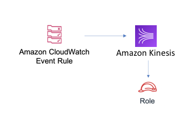

# aws-events-rule-kinesis-stream module
<!--BEGIN STABILITY BANNER-->

---


> All classes are under active development and subject to non-backward compatible changes or removal in any
> future version. These are not subject to the [Semantic Versioning](https://semver.org/) model.
> This means that while you may use them, you may need to update your source code when upgrading to a newer version of this package.

---
<!--END STABILITY BANNER-->

| **Reference Documentation**:| <span style="font-weight: normal">https://docs.aws.amazon.com/solutions/latest/constructs/</span>|
|:-------------|:-------------|
<div style="height:8px"></div>

| **Language**     | **Package**        |
|:-------------|-----------------|
| Python|`aws_solutions_constructs.aws-events-rule-kinesisstream`|
| Typescript|`@aws-solutions-constructs/aws-events-rule-kinesis-stream`|
| Java|`software.amazon.awsconstructs.services.eventsrulekinesisstream`|

This AWS Solutions Construct implements an AWS Events rule and an AWS SNS Topic.

Here is a minimal deployable pattern definition in Typescript:

``` typescript
import {EventsRuleToKinesisStream, EventsRuleToKinesisStreamProps} from "@aws-solutions-constructs/aws-events-rule-kinesis-stream";

const props: EventsRuleToKinesisStreamProps = {
    eventRuleProps: {
      schedule: events.Schedule.rate(Duration.minutes(5)),
    }
};

const constructStack = new EventsRuleToKinesisStream(this, 'test-events-rule-kinesis-stream', props);
```

## Initializer

``` text
new EventsRuleToKinesisStream(scope: Construct, id: string, props: EventsRuleToKinesisStreamProps);
```

_Parameters_

* scope [`Construct`](https://docs.aws.amazon.com/cdk/api/latest/docs/@aws-cdk_core.Construct.html)
* id `string`
* props [`EventsRuleToKinesisStreamProps`](#pattern-construct-props)

## Pattern Construct Props

| **Name**     | **Type**        | **Description** |
|:-------------|:----------------|-----------------|
|eventRuleProps|[`events.RuleProps`](https://docs.aws.amazon.com/cdk/api/latest/docs/@aws-cdk_aws-events.RuleProps.html)|User provided eventRuleProps to override the defaults. |
|existingStreamObj?|[`kinesis.Stream`](https://docs.aws.amazon.com/cdk/api/latest/docs/@aws-cdk_aws-kinesis.Stream.html)|Existing instance of Kinesis Stream, if this is set then kinesisStreamProps is ignored.|
|kinesisStreamProps?|[`kinesis.StreamProps`](https://docs.aws.amazon.com/cdk/api/latest/docs/@aws-cdk_aws-kinesis.StreamProps.html)|Optional user-provided props to override the default props for the Kinesis stream. |

## Pattern Properties

| **Name**     | **Type**        | **Description** |
|:-------------|:----------------|-----------------|
|eventsRule|[`events.Rule`](https://docs.aws.amazon.com/cdk/api/latest/docs/@aws-cdk_aws-events.Rule.html)|Returns an instance of events.Rule created by the construct.|
|kinesisStream|[`kinesis.Stream`](https://docs.aws.amazon.com/cdk/api/latest/docs/@aws-cdk_aws-kinesis.Stream.html)|Returns an instance of the Kinesis stream created by the pattern.|
|eventsRole?|[`iam.Role`](https://docs.aws.amazon.com/cdk/api/latest/docs/@aws-cdk_aws-iam.Role.html)|Returns an instance of the iam.Role created by the construct for events rule.|

## Default settings

Out of the box implementation of the Construct without any override will set the following defaults:

### Amazon CloudWatch Events Rule
* Configure least privilege access IAM role for Events Rule to publish to the Kinesis Stream..

### Amazon Kinesis Stream
* Enable server-side encryption for Kinesis Stream using AWS Managed KMS Key

## Architecture


***
&copy; Copyright 2020 Amazon.com, Inc. or its affiliates. All Rights Reserved.