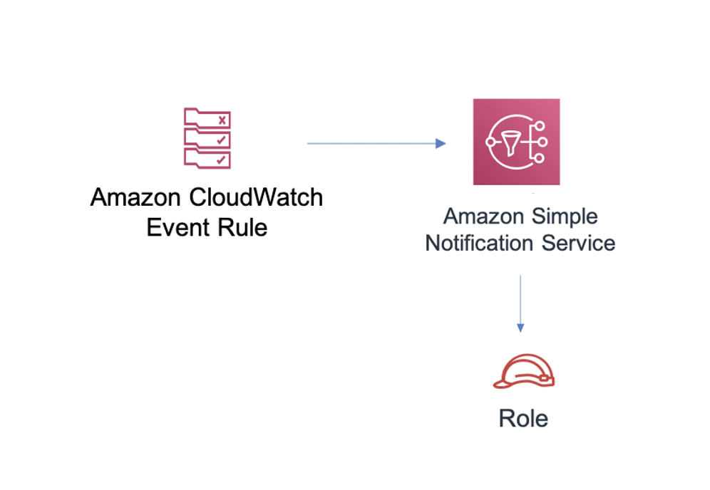

# aws-events-rule-sns module
<!--BEGIN STABILITY BANNER-->

---


> All classes are under active development and subject to non-backward compatible changes or removal in any
> future version. These are not subject to the [Semantic Versioning](https://semver.org/) model.
> This means that while you may use them, you may need to update your source code when upgrading to a newer version of this package.

---
<!--END STABILITY BANNER-->

| **Reference Documentation**:| <span style="font-weight: normal">https://docs.aws.amazon.com/solutions/latest/constructs/</span>|
|:-------------|:-------------|
<div style="height:8px"></div>

| **Language**     | **Package**        |
|:-------------|-----------------|
| Python|`aws_solutions_constructs.aws_events_rule_sns`|
| Typescript|`@aws-solutions-constructs/aws-events-rule-sns`|
| Java|`software.amazon.awsconstructs.services.eventsrulesns`|

This AWS Solutions Construct implements an AWS Events rule and an AWS SNS Topic.

Here is a minimal deployable pattern definition:

``` javascript
const { EventsRuleToSNSTopicProps, EventsRuleToSNSTopic } = require('@aws-solutions-constructs/aws-events-rule-sns');

const props: EventsRuleToSNSTopicProps = {
    eventRuleProps: {
      schedule: events.Schedule.rate(Duration.minutes(5))
    }
};

new EventsRuleToSNSTopic(stack, 'test-events-rule-sns', props);
```

## Initializer

``` text
new EventsRuleToSNSTopic(scope: Construct, id: string, props: EventsRuleToSNSTopicProps);
```

_Parameters_

* scope [`Construct`](https://docs.aws.amazon.com/cdk/api/latest/docs/@aws-cdk_core.Construct.html)
* id `string`
* props [`EventsRuleToSNSTopicProps`](#pattern-construct-props)

## Pattern Construct Props

| **Name**     | **Type**        | **Description** |
|:-------------|:----------------|-----------------|
|snsTopicProps?|[`sns.TopicProps`](https://docs.aws.amazon.com/cdk/api/latest/docs/@aws-cdk_aws-sns.TopicProps.html)|User provided props to override the default props for the SNS Topic. |
|eventRuleProps|[`events.RuleProps`](https://docs.aws.amazon.com/cdk/api/latest/docs/@aws-cdk_aws-events.RuleProps.html)|User provided eventRuleProps to override the defaults. |

## Pattern Properties

| **Name**     | **Type**        | **Description** |
|:-------------|:----------------|-----------------|
|eventsRule|[`events.Rule`](https://docs.aws.amazon.com/cdk/api/latest/docs/@aws-cdk_aws-events.Rule.html)|Returns an instance of events.Rule created by the construct|
|snsTopic|[`sns.Topic`](https://docs.aws.amazon.com/cdk/api/latest/docs/@aws-cdk_aws-sns.Topic.html)|Returns an instance of sns.Topic created by the construct|

## Default settings

Out of the box implementation of the Construct without any override will set the following defaults:

### Amazon CloudWatch Events Rule
* Grant least privilege permissions to CloudWatch Events to publish to the SNS Topic

## Architecture


***
&copy; Copyright 2020 Amazon.com, Inc. or its affiliates. All Rights Reserved.