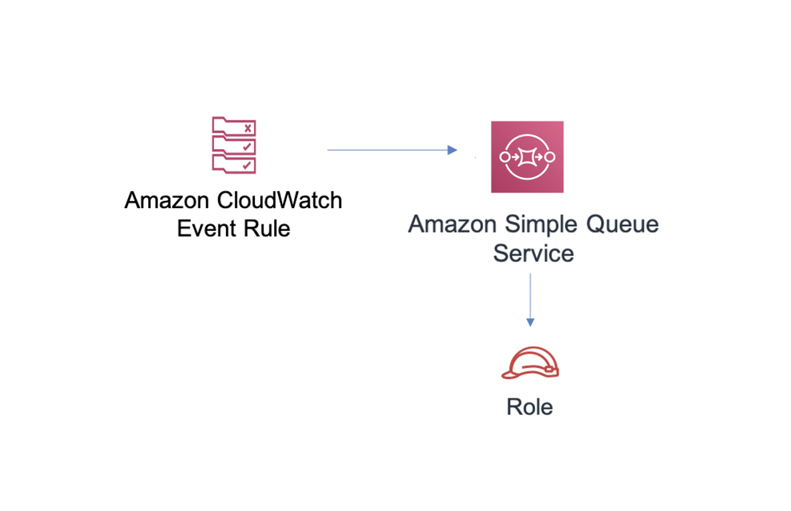

# aws-events-rule-sqs module
<!--BEGIN STABILITY BANNER-->

---


> Some of our early constructs don’t meet the naming standards that evolved for the library. We are releasing completely feature compatible versions with corrected names. The underlying implementation code is the same regardless of whether you deploy the construct using the old or new name. We will support both names for all 1.x releases, but in 2.x we will only publish the correctly named constructs. This construct is being replaced by the functionally identical aws-eventbridge-sqs.

---
<!--END STABILITY BANNER-->

| **Reference Documentation**:| <span style="font-weight: normal">https://docs.aws.amazon.com/solutions/latest/constructs/</span>|
|:-------------|:-------------|
<div style="height:8px"></div>

| **Language**     | **Package**        |
|:-------------|-----------------|
| Python|`aws_solutions_constructs.aws_events_rule_sqs`|
| Typescript|`@aws-solutions-constructs/aws-events-rule-sqs`|
| Java|`software.amazon.awsconstructs.services.eventsrulesqs`|

This AWS Solutions Construct implements an AWS Events rule and an AWS SQS Queue.

Here is a minimal deployable pattern definition:

Typescript
``` typescript
import { Duration } from '@aws-cdk/core';
import * as events from '@aws-cdk/aws-events';
import * as iam from '@aws-cdk/aws-iam';
import { EventsRuleToSqsProps, EventsRuleToSqs } from "@aws-solutions-constructs/aws-events-rule-sqs";

const props: EventsRuleToSqsProps = {
    eventRuleProps: {
        schedule: events.Schedule.rate(Duration.minutes(5))
    }
};

const constructStack = new EventsRuleToSqs(this, 'test-construct', props);

// Grant yourself permissions to use the Customer Managed KMS Key
const policyStatement = new iam.PolicyStatement({
    actions: ["kms:Encrypt", "kms:Decrypt"],
    effect: iam.Effect.ALLOW,
    principals: [new iam.AccountRootPrincipal()],
    resources: ["*"]
});

constructStack.encryptionKey?.addToResourcePolicy(policyStatement);
```

Python
``` python
from aws_solutions_constructs.aws_events_rule_sqs import EventsRuleToSqs
from aws_cdk import (
    aws_events as events,
    aws_iam as iam,
    core
)

construct_stack = EventsRuleToSqs(self, 'test',
                            event_rule_props=events.RuleProps(
                                schedule=events.Schedule.rate(
                                    core.Duration.minutes(5))
                            ))

# Grant yourself permissions to use the Customer Managed KMS Key
policy_statement = iam.PolicyStatement(
    actions=["kms:Encrypt", "kms:Decrypt"],
    effect=iam.Effect.ALLOW,
    principals=[iam.AccountRootPrincipal()],
    resources=["*"]
)

construct_stack.encryption_key.add_to_resource_policy(policy_statement)
```

Java
``` java
import software.constructs.Construct;
import java.util.List;

import software.amazon.awscdk.core.*;
import software.amazon.awscdk.services.events.*;
import software.amazon.awscdk.services.iam.*;
import software.amazon.awsconstructs.services.eventsrulesqs.*;

final EventsRuleToSqs constructStack = new EventsRuleToSqs(this, "test-construct",
        new EventsRuleToSqsProps.Builder()
                .eventRuleProps(new RuleProps.Builder()
                        .schedule(Schedule.rate(Duration.minutes(5)))
                        .build())
                .build());

// Grant yourself permissions to use the Customer Managed KMS Key
final PolicyStatement policyStatement = PolicyStatement.Builder.create()
        .actions(List.of("kms:Encrypt", "kms:Decrypt"))
        .effect(Effect.ALLOW)
        .principals(List.of(new AccountRootPrincipal()))
        .resources(List.of("*"))
        .build();

constructStack.getEncryptionKey().addToResourcePolicy(policyStatement);
```
## Pattern Construct Props

| **Name**     | **Type**        | **Description** |
|:-------------|:----------------|-----------------|
|existingEventBusInterface?|[`events.IEventBus`](https://docs.aws.amazon.com/cdk/api/latest/docs/@aws-cdk_aws-events.IEventBus.html)| Optional user-provided custom EventBus for construct to use. Providing both this and `eventBusProps` results an error.|
|eventBusProps?|[`events.EventBusProps`](https://docs.aws.amazon.com/cdk/api/latest/docs/@aws-cdk_aws-events.EventBusProps.html)|Optional user-provided properties to override the default properties when creating a custom EventBus. Setting this value to `{}` will create a custom EventBus using all default properties. If neither this nor `existingEventBusInterface` is provided the construct will use the `default` EventBus. Providing both this and `existingEventBusInterface` results an error.|
|eventRuleProps|[`events.RuleProps`](https://docs.aws.amazon.com/cdk/api/latest/docs/@aws-cdk_aws-events.RuleProps.html)|User provided eventRuleProps to override the defaults. |
|existingQueueObj?|[`sqs.Queue`](https://docs.aws.amazon.com/cdk/api/latest/docs/@aws-cdk_aws-sqs.Queue.html)|An optional, existing SQS queue to be used instead of the default queue. Providing both this and `queueProps` will cause an error.|
|queueProps?|[`sqs.QueueProps`](https://docs.aws.amazon.com/cdk/api/latest/docs/@aws-cdk_aws-sqs.QueueProps.html)|User provided props to override the default props for the SQS Queue. |
|enableQueuePurging?|`boolean`|Whether to grant additional permissions to the Lambda function enabling it to purge the SQS queue. Defaults to `false`.|
|deployDeadLetterQueue?|`boolean`|Whether to create a secondary queue to be used as a dead letter queue. Defaults to `true`.|
|deadLetterQueueProps?|[`sqs.QueueProps`](https://docs.aws.amazon.com/cdk/api/latest/docs/@aws-cdk_aws-sqs.QueueProps.html)|Optional user-provided props to override the default props for the dead letter queue. Only used if the `deployDeadLetterQueue` property is set to true.|
|maxReceiveCount?|`number`|The number of times a message can be unsuccessfully dequeued before being moved to the dead letter queue. Defaults to `15`.|
|enableEncryptionWithCustomerManagedKey?|`boolean`|Use a KMS Key, either managed by this CDK app, or imported. If importing an encryption key, it must be specified in the encryptionKey property for this construct.|
|encryptionKey?|[`kms.Key`](https://docs.aws.amazon.com/cdk/api/latest/docs/@aws-cdk_aws-kms.Key.html)|An optional, imported encryption key to encrypt the SQS queue.|
|encryptionKeyProps?|[`kms.KeyProps`](https://docs.aws.amazon.com/cdk/api/latest/docs/@aws-cdk_aws-kms.KeyProps.html)|An optional, user provided properties to override the default properties for the KMS encryption key.|

## Pattern Properties

| **Name**     | **Type**        | **Description** |
|:-------------|:----------------|-----------------|
|eventBus?|[`events.IEventBus`](https://docs.aws.amazon.com/cdk/api/latest/docs/@aws-cdk_aws-events.IEventBus.html)|Returns the instance of events.IEventBus used by the construct|
|eventsRule|[`events.Rule`](https://docs.aws.amazon.com/cdk/api/latest/docs/@aws-cdk_aws-events.Rule.html)|Returns an instance of events.Rule created by the construct|
|sqsQueue|[`sqs.Queue`](https://docs.aws.amazon.com/cdk/api/latest/docs/@aws-cdk_aws-sqs.Queue.html)|Returns an instance of sqs.Queue created by the construct|
|encryptionKey?|[`kms.Key`](https://docs.aws.amazon.com/cdk/api/latest/docs/@aws-cdk_aws-kms.Key.html)|Returns an instance of kms Key used for the SQS queue.|
|deadLetterQueue?|[`sqs.Queue`](https://docs.aws.amazon.com/cdk/api/latest/docs/@aws-cdk_aws-sqs.Queue.html)|Returns an instance of the dead-letter SQS queue created by the pattern.|

## Default settings

Out of the box implementation of the Construct without any override will set the following defaults:

### Amazon CloudWatch Events Rule
* Grant least privilege permissions to CloudWatch Events to publish to the SQS Queue.

### Amazon SQS Queue
* Deploy SQS dead-letter queue for the source SQS Queue.
* Enable server-side encryption for source SQS Queue using Customer managed KMS Key.
* Enforce encryption of data in transit.

## Architecture


***
&copy; Copyright 2021 Amazon.com, Inc. or its affiliates. All Rights Reserved.
