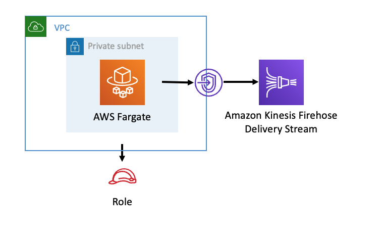

# aws-fargate-kinesisfirehose module
<!--BEGIN STABILITY BANNER-->

---


---
<!--END STABILITY BANNER-->

| **Reference Documentation**:| <span style="font-weight: normal">https://docs.aws.amazon.com/solutions/latest/constructs/</span>|
|:-------------|:-------------|
<div style="height:8px"></div>

| **Language**     | **Package**        |
|:-------------|-----------------|
| Python|`aws_solutions_constructs.aws_fargate_kinesisfirehose`|
| Typescript|`@aws-solutions-constructs/aws-fargate-kinesisfirehose`|
| Java|`software.amazon.awsconstructs.services.fargatekinesisfirehose`|

## Overview
This AWS Solutions Construct deploys an AWS Fargate Service that can put records on an Amazon Firehose Delivery Stream.

Here is a minimal deployable pattern definition:

Typescript
``` typescript
import { Construct } from 'constructs';
import { Stack, StackProps } from 'aws-cdk-lib';
import { FargateToKinesisFirehoseProps } from '@aws-solutions-constructs/aws-fargate-kinesisfirehose';
import * as fargate from 'aws-cdk-lib/aws-fargate';

// The construct requires an existing Firehose Delivery Stream, this can be created in raw CDK or extracted
// from a previously instantiated construct that created an Firehose Delivery Stream
const existingFirehoseDeliveryStream = previouslyCreatedKinesisFirehoseToS3Construct.kinesisFirehose;

new FargateToKinesisFirehose(this, 'FargateToKinesisFirehose', {
  publicApi: true,
  ecrRepositoryArn: "arn:aws:ecr:us-east-1:123456789012:repository/your-ecr-repo",
  existingKinesisFirehose: existingFirehoseDeliveryStream
});
```

Python
``` python
from aws_solutions_constructs.aws_fargate_kinesisfirehose import FargateToKinesisFirehose
from aws_cdk import (
    aws_fargate as _fargate,
    Stack
)
from constructs import Construct

# The construct requires an existing Firehose Delivery Stream, this can be created in raw CDK or extracted
# from a previously instantiated construct that created an Firehose Delivery Stream
const existingFirehoseDeliveryStream = previouslyCreatedKinesisFirehoseToS3Construct.kinesisFirehose;

FargateToKinesisFirehose(self, 'FargateToKinesisFirehose',
                          public_api=True,
                          ecr_repository_arn="arn:aws:ecr:us-east-1:123456789012:repository/your-ecr-repo",
                          existingKinesisFirehose=existingFirehoseDeliveryStream
                       )
```

Java
``` java
import software.constructs.Construct;
import software.amazon.awscdk.Stack;
import software.amazon.awscdk.StackProps;
import software.amazon.awscdk.services.fargate.*;
import software.amazon.awscdk.services.fargate.eventsources.*;
import software.amazon.awscdk.services.fargate.Runtime;
import software.amazon.awsconstructs.services.fargatekinesisfirehose.*;

// The construct requires an existing Firehose Delivery Stream, this can be created in raw CDK or extracted
// from a previously instantiated construct that created an Firehose Delivery Stream
const existingFirehoseDeliveryStream = previouslyCreatedKinesisFirehoseToS3Construct.kinesisFirehose;

new FargateToKinesisFirehose(this, "FargateToKinesisFirehose", new FargateToKinesisFirehoseProps.Builder()
        .publicApi(true)
        .ecrRepositoryArn("arn:aws:ecr:us-east-1:123456789012:repository/your-ecr-repo")
        .existingKinesisFirehose(existingFirehoseDeliveryStream)
        .build());
```

## Pattern Construct Props

| **Name**     | **Type**        | **Description** |
|:-------------|:----------------|-----------------|
| publicApi | `boolean` | True if the VPC provisioned by this construct should contain only Isolated Subnets, otherwise False for the provisioned VPC to contain Public/Private Subnets. Note this property is ignored if an existing VPC is specified in the `existingVpc` property. |
| vpcProps? | [`ec2.VpcProps`](https://docs.aws.amazon.com/cdk/api/v2/docs/aws-cdk-lib.aws_ec2.VpcProps.html) | Optional custom properties for a new VPC the construct will create. Providing both this and `existingVpc` is an error. An Amazon Kinesis Firehose Interface Endpoint will be added to this VPC. |
| existingVpc? | [`ec2.IVpc`](https://docs.aws.amazon.com/cdk/api/v2/docs/aws-cdk-lib.aws_ec2.IVpc.html) | An existing VPC in which to deploy the Fargate Service. Providing both this and `vpcProps` is an error. If the client provides an existing Fargate Service in the `existingFargateServiceObject` property, this value must be the VPC where the service is running. An Amazon Kinesis Firehose Interface Endpoint will be added to this VPC. |
| clusterProps? | [`ecs.ClusterProps`](https://docs.aws.amazon.com/cdk/api/v2/docs/aws-cdk-lib.aws_ecs.ClusterProps.html) | Optional properties to create a new ECS cluster. To provide an existing cluster, use the cluster attribute of fargateServiceProps. |
| ecrRepositoryArn? | `string` | The arn of an ECR Repository containing the image to use to generate the containers. Either this or the image property of containerDefinitionProps must be provided. format: arn:aws:ecr:*region*:*account number*:repository/*Repository Name* |
| ecrImageVersion? | `string` | The version of the image to use from the repository. Defaults to 'Latest' |
| containerDefinitionProps? | [`ecs.ContainerDefinitionProps \| any`](https://docs.aws.amazon.com/cdk/api/v2/docs/aws-cdk-lib.aws_ecs.ContainerDefinitionProps.html) | Optional props to define the container created for the Fargate Service. (defaults found in fargate-defaults.ts) |
| fargateTaskDefinitionProps? | [`ecs.FargateTaskDefinitionProps \| any`](https://docs.aws.amazon.com/cdk/api/v2/docs/aws-cdk-lib.aws_ecs.FargateTaskDefinitionProps.html) | Optional props to define the Fargate Task Definition for this construct. (defaults found in fargate-defaults.ts) |
| fargateServiceProps? | [`ecs.FargateServiceProps \| any`](https://docs.aws.amazon.com/cdk/api/v2/docs/aws-cdk-lib.aws_ecs.FargateServiceProps.html) | Optional values to override default Fargate Task definition properties (fargate-defaults.ts). The construct will default to launching the service is the most isolated subnets available (precedence: Isolated, Private and Public). Override those and other defaults here. |
| existingFargateServiceObject? | [`ecs.FargateService`](https://docs.aws.amazon.com/cdk/api/v2/docs/aws-cdk-lib.aws_ecs.FargateService.html) | A Fargate Service already instantiated (probably by another Solutions Construct). If this is specified, then no props defining a new service can be provided, including: ecrImageVersion, containerDefinitionProps, fargateTaskDefinitionProps, ecrRepositoryArn, fargateServiceProps, clusterProps |
| existingContainerDefinitionObject? | [`ecs.ContainerDefinition`](https://docs.aws.amazon.com/cdk/api/v2/docs/aws-cdk-lib.aws_ecs.ContainerDefinition.html) | A container definition already instantiated as part of a Fargate service. This must be the container in the `existingFargateServiceObject`. |
|existingKinesisFirehose|[kinesisfirehose.CfnDeliveryStream](https://docs.aws.amazon.com/cdk/api/v2/docs/aws-cdk-lib.aws_kinesisfirehose.CfnDeliveryStream.html)|An existing Kinesis Firehose Delivery Stream to which the Fargate container can put data. Note - the delivery stream construct must have already been created and have the deliveryStreamName set. This construct will *not* create a new Delivery Stream.|
|firehoseEnvironmentVariableName?|`string`|Optional Name for the Fargate container environment variable set to the name of the delivery stream. Default: FIREHOSE_DELIVERYSTREAM_NAME |

## Pattern Properties

| **Name**     | **Type**        | **Description** |
|:-------------|:----------------|-----------------|
| vpc | [`ec2.IVpc`](https://docs.aws.amazon.com/cdk/api/v2/docs/aws-cdk-lib.aws_ec2.IVpc.html) | The new or existing VPC used by the construct. |
| fargateService | [`ecs.FargateService`](https://docs.aws.amazon.com/cdk/api/v2/docs/aws-cdk-lib.aws_ecs.FargateService.html) | The new or existing AWS Fargate service used by this construct. |
| container | [`ecs.ContainerDefinition`](https://docs.aws.amazon.com/cdk/api/v2/docs/aws-cdk-lib.aws_ecs.ContainerDefinition.html) | The container associated with the AWS Fargate service in the service property. |
|kinesisFirehose|[kinesisfirehose.CfnDeliveryStream](https://docs.aws.amazon.com/cdk/api/v2/docs/aws-cdk-lib.aws_kinesisfirehose.CfnDeliveryStream.html)|The Kinesis Firehose Delivery Stream used by the construct.|

## Default settings

Out of the box implementation of the Construct without any overrides will set the following defaults:

### AWS Fargate Service
* An AWS Fargate Service running in the isolated subnets of a new VPC
* Minimally-permissive IAM role for the Fargate Service to put records on the Firehose Delivery Stream
* Sets an Environment Variable named FIREHOSE_DELIVERYSTREAM_NAME that holds the Firehose Delivery Stream Name, which is a required property of the Kinesis Firehose SDK when making calls to it

### Amazon Firehose Delivery Stream
* This construct must be provided a configured Firehose Data Stream construct, it does not change this Stream.

## Architecture


***
&copy; Copyright Amazon.com, Inc. or its affiliates. All Rights Reserved.