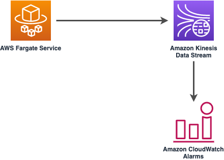

# aws-fargate-kinesisstreams module
<!--BEGIN STABILITY BANNER-->

---


---
<!--END STABILITY BANNER-->

| **Reference Documentation**:| <span style="font-weight: normal">https://docs.aws.amazon.com/solutions/latest/constructs/</span>|
|:-------------|:-------------|
<div style="height:8px"></div>

| **Language**     | **Package**        |
|:-------------|-----------------|
| Python|`aws_solutions_constructs.aws_fargate_kinesis_stream`|
| Typescript|`@aws-solutions-constructs/aws-fargate-kinesisstreams`|
| Java|`software.amazon.awsconstructs.services.fargatekinesisstreams`|

## Overview
This AWS Solutions Construct deploys an AWS Fargate Service that can put records on an Amazon Kinesis Data Stream.

Here is a minimal deployable pattern definition:

Typescript
``` typescript
import { Construct } from 'constructs';
import { Stack, StackProps } from 'aws-cdk-lib';
import { FargateToKinesisStreamsProps } from '@aws-solutions-constructs/aws-fargate-kinesisstreams';
import * as fargate from 'aws-cdk-lib/aws-fargate';

new FargateToKinesisStreams(this, 'FargateToKinesisStreams', {
  publicApi: true,
  ecrRepositoryArn: "arn:aws:ecr:us-east-1:123456789012:repository/your-ecr-repo",
});
```

Python
``` python
from aws_solutions_constructs.aws_fargate_kinesis_stream import FargateToKinesisStreams
from aws_cdk import (
    aws_fargate as _fargate,
    aws_kinesis as kinesis,
    Stack
)
from constructs import Construct

FargateToKinesisStreams(self, 'FargateToKinesisStreams',
                          public_api=True,
                          ecr_repository_arn="arn:aws:ecr:us-east-1:123456789012:repository/your-ecr-repo"
                       )
```

Java
``` java
import software.constructs.Construct;

import software.amazon.awscdk.Stack;
import software.amazon.awscdk.StackProps;
import software.amazon.awscdk.services.fargate.*;
import software.amazon.awscdk.services.fargate.eventsources.*;
import software.amazon.awscdk.services.fargate.Runtime;
import software.amazon.awsconstructs.services.fargatekinesisstreams.*;

new FargateToKinesisStreams(this, "FargateToKinesisStreams", new FargateToKinesisStreamsProps.Builder()
        .publicApi(true)
        .ecrRepositoryArn("arn:aws:ecr:us-east-1:123456789012:repository/your-ecr-repo")
        .build());
```

## Pattern Construct Props

| **Name**     | **Type**        | **Description** |
|:-------------|:----------------|-----------------|
| publicApi | `boolean` | True if the VPC provisioned by this construct should contain only Isolated Subnets, otherwise False for the provisioned VPC to contain Public/Private Subnets. Note this property is ignored if an existing VPC is specified in the `existingVpc` property. |
| vpcProps? | [`ec2.VpcProps`](https://docs.aws.amazon.com/cdk/api/v2/docs/aws-cdk-lib.aws_ec2.VpcProps.html) | Optional custom properties for a new VPC the construct will create. Providing both this and `existingVpc` is an error. An Amazon Kinesis Streams Interface Endpoint will be added to this VPC. |
| existingVpc? | [`ec2.IVpc`](https://docs.aws.amazon.com/cdk/api/v2/docs/aws-cdk-lib.aws_ec2.IVpc.html) | An existing VPC in which to deploy the Fargate Service. Providing both this and `vpcProps` is an error. If the client provides an existing Fargate Service in the `existingFargateServiceObject` property, this value must be the VPC where the service is running. An Amazon Kinesis Streams Interface Endpoint will be added to this VPC. |
| clusterProps? | [`ecs.ClusterProps`](https://docs.aws.amazon.com/cdk/api/v2/docs/aws-cdk-lib.aws_ecs.ClusterProps.html) | Optional properties to create a new ECS cluster. To provide an existing cluster, use the cluster attribute of fargateServiceProps. |
| ecrRepositoryArn? | `string` | The arn of an ECR Repository containing the image to use to generate the containers. Either this or the image property of containerDefinitionProps must be provided. format: arn:aws:ecr:*region*:*account number*:repository/*Repository Name* |
| ecrImageVersion? | `string` | The version of the image to use from the repository. Defaults to 'Latest' |
| containerDefinitionProps? | [`ecs.ContainerDefinitionProps \| any`](https://docs.aws.amazon.com/cdk/api/v2/docs/aws-cdk-lib.aws_ecs.ContainerDefinitionProps.html) | Optional props to define the container created for the Fargate Service. (defaults found in fargate-defaults.ts) |
| fargateTaskDefinitionProps? | [`ecs.FargateTaskDefinitionProps \| any`](https://docs.aws.amazon.com/cdk/api/v2/docs/aws-cdk-lib.aws_ecs.FargateTaskDefinitionProps.html) | Optional props to define the Fargate Task Definition for this construct. (defaults found in fargate-defaults.ts) |
| fargateServiceProps? | [`ecs.FargateServiceProps \| any`](https://docs.aws.amazon.com/cdk/api/v2/docs/aws-cdk-lib.aws_ecs.FargateServiceProps.html) | Optional values to override default Fargate Task definition properties (fargate-defaults.ts). The construct will default to launching the service is the most isolated subnets available (precedence: Isolated, Private and Public). Override those and other defaults here. |
| existingFargateServiceObject? | [`ecs.FargateService`](https://docs.aws.amazon.com/cdk/api/v2/docs/aws-cdk-lib.aws_ecs.FargateService.html) | A Fargate Service already instantiated (probably by another Solutions Construct). If this is specified, then no props defining a new service can be provided, including: ecrImageVersion, containerDefinitionProps, fargateTaskDefinitionProps, ecrRepositoryArn, fargateServiceProps, clusterProps |
| existingContainerDefinitionObject? | [`ecs.ContainerDefinition`](https://docs.aws.amazon.com/cdk/api/v2/docs/aws-cdk-lib.aws_ecs.ContainerDefinition.html) | A container definition already instantiated as part of a Fargate service. This must be the container in the `existingFargateServiceObject`. |
|existingStreamObj?|[`kinesis.Stream`](https://docs.aws.amazon.com/cdk/api/v2/docs/aws-cdk-lib.aws_kinesis.Stream.html) | Existing instance of a Kinesis Data Stream. Providing both this and `kinesisStreamProps` will cause an error. |
|kinesisStreamProps?|[`kinesis.StreamProps`](https://docs.aws.amazon.com/cdk/api/v2/docs/aws-cdk-lib.aws_kinesis.StreamProps.html) | Optional user-provided props to override the default props for the Kinesis Data Stream. Providing both this and `existingStreamObj` will cause an error. |
| createCloudWatchAlarms |`boolean` | Whether to create recommended CloudWatch Alarms for the Kinesis Stream (defaults to true). |
| streamEnvironmentVariableName? | `string` | Optional Name to override the Fargate Service default environment variable name that holds the Kinesis Data Stream name value. Default: KINESIS_DATASTREAM_NAME |

## Pattern Properties

| **Name**     | **Type**        | **Description** |
|:-------------|:----------------|-----------------|
| vpc | [`ec2.IVpc`](https://docs.aws.amazon.com/cdk/api/v2/docs/aws-cdk-lib.aws_ec2.IVpc.html) | The new or existing VPC used by the construct. |
| fargateService | [`ecs.FargateService`](https://docs.aws.amazon.com/cdk/api/v2/docs/aws-cdk-lib.aws_ecs.FargateService.html) | The new or existing AWS Fargate service used by this construct. |
| container | [`ecs.ContainerDefinition`](https://docs.aws.amazon.com/cdk/api/v2/docs/aws-cdk-lib.aws_ecs.ContainerDefinition.html) | The container associated with the AWS Fargate service in the service property. |
| kinesisStream | [`kinesis.Stream`](https://docs.aws.amazon.com/cdk/api/v2/docs/aws-cdk-lib.aws_kinesis.Stream.html) | The new or existing Kinesis Data Stream used by this construct. |
| cloudwatchAlarms? | [`cloudwatch.Alarm[]`](https://docs.aws.amazon.com/cdk/api/v2/docs/aws-cdk-lib.aws_cloudwatch.Alarm.html) | Returns the CloudWatch Alarms created to monitor the Kinesis Data Stream.|

## Default settings

Out of the box implementation of the Construct without any overrides will set the following defaults:

### AWS Fargate Service
* An AWS Fargate Service running in the isolated subnets of a new VPC
* Minimally-permissive IAM role for the Fargate Service to put records on the Kinesis Data Stream
* Sets an Environment Variable named KINESIS_DATASTREAM_NAME that holds the Kinesis Data Stream Name, which is a required property of the Kinesis Data Streams SDK when making calls to it

### Amazon Kinesis Stream
* Enable server-side encryption for the Kinesis Data Stream using AWS Managed CMK
* Deploy best practices CloudWatch Alarms for the Kinesis Data Stream
* An Interface Endpoint on the VPC for private communication between the Fargate Service and the Kinesis Data Stream

## Architecture


***
&copy; Copyright 2022 Amazon.com, Inc. or its affiliates. All Rights Reserved.