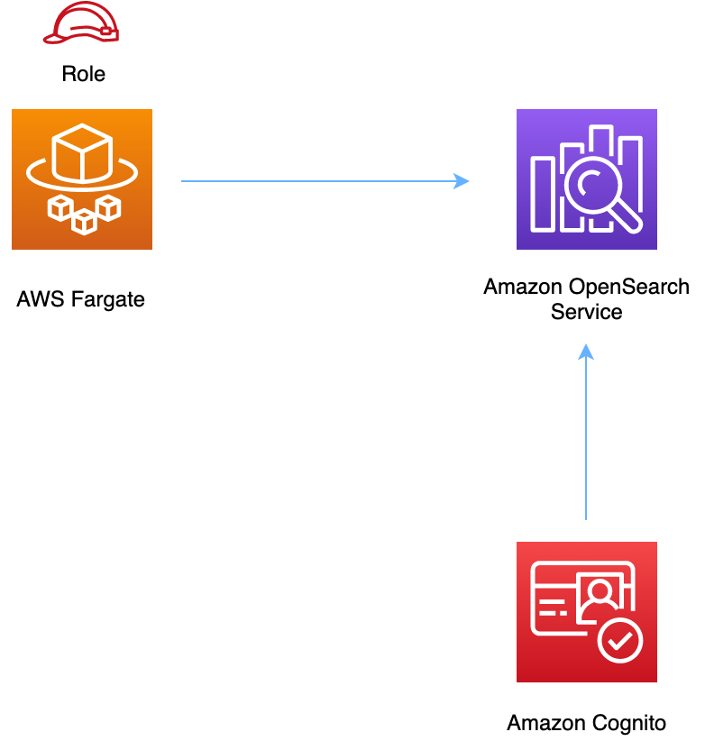

# aws-fargate-opensearch module
<!--BEGIN STABILITY BANNER-->

---


> All classes are under active development and subject to non-backward compatible changes or removal in any
> future version. These are not subject to the [Semantic Versioning](https://semver.org/) model.
> This means that while you may use them, you may need to update your source code when upgrading to a newer version of this package.

---
<!--END STABILITY BANNER-->

| **Reference Documentation**:| <span style="font-weight: normal">https://docs.aws.amazon.com/solutions/latest/constructs/</span>|
|:-------------|:-------------|
<div style="height:8px"></div>

| **Language**     | **Package**        |
|:-------------|-----------------|
| Python|`aws_solutions_constructs.aws_fargate_opensearch`|
| Typescript|`@aws-solutions-constructs/aws-fargate-opensearch`|
| Java|`software.amazon.awsconstructs.services.fargateopensearch`|

## Overview
This AWS Solutions Construct implements an AWS Fargate service that can write/read to an Amazon OpenSearch Service domain.

Here is a minimal deployable pattern definition:

Typescript
``` typescript
import { Construct } from 'constructs';
import { Stack, StackProps } from 'aws-cdk-lib';
import { FargateToOpenSearch, FargateToOpenSearchProps } from '@aws-solutions-constructs/aws-fargate-opensearch';

const constructProps: FargateToOpenSearchProps = {
  publicApi: true,
  ecrRepositoryArn: "arn:aws:ecr:us-east-1:123456789012:repository/your-ecr-repo",
  openSearchDomainName: 'testdomain',
  // TODO: Ensure the Cognito domain name is globally unique
  cognitoDomainName: 'globallyuniquedomain' + Aws.ACCOUNT_ID
};

new FargateToOpenSearch(this, 'test-construct', constructProps);
```

Python
``` python
from aws_solutions_constructs.aws_fargate_opensearch import FargateToOpenSearch, FargateToOpenSearchProps
from aws_cdk import (
    Stack
)
from constructs import Construct

FargateToOpenSearch(self, 'test_construct',
            public_api=True,
            ecr_repository_arn="arn:aws:ecr:us-east-1:123456789012:repository/your-ecr-repo",
            open_search_domain_name='testdomain',
            # TODO: Ensure the Cognito domain name is globally unique
            cognito_domain_name='globallyuniquedomain' + Aws.ACCOUNT_ID)
```

Java
``` java
import software.constructs.Construct;

import software.amazon.awscdk.Stack;
import software.amazon.awscdk.StackProps;
import software.amazon.awsconstructs.services.fargateopensearch.*;

new FargateToOpenSearch(this, "test_construct", new FargateToOpenSearchProps.Builder()
        .publicApi(true)
        .ecrRepositoryArn("arn:aws:ecr:us-east-1:123456789012:repository/your-ecr-repo"
        .openSearchDomainName("testdomain")
        // TODO: Ensure the Cognito domain name is globally unique
        .cognitoDomainName("globallyuniquedomain" + Aws.ACCOUNT_ID)
        .build());
```
## Pattern Construct Props

| **Name**     | **Type**        | **Description** |
|:-------------|:----------------|-----------------|
| publicApi | `boolean` | Whether the construct is deploying a private or public API. This has implications for the VPC. |
| vpcProps? | [`ec2.VpcProps`](https://docs.aws.amazon.com/cdk/api/v2/docs/aws-cdk-lib.aws_ec2.VpcProps.html) | Optional custom properties for a VPC the construct will create. This VPC will be used by any Private Hosted Zone the construct creates (that's why loadBalancerProps and privateHostedZoneProps can't include a VPC). Providing both this and existingVpc is an error. |
| existingVpc? | [`ec2.IVpc`](https://docs.aws.amazon.com/cdk/api/v2/docs/aws-cdk-lib.aws_ec2.IVpc.html) | An existing VPC in which to deploy the construct. Providing both this and vpcProps is an error. If the client provides an existing load balancer and/or existing Private Hosted Zone, those constructs must exist in this VPC. |
| clusterProps? | [`ecs.ClusterProps`](https://docs.aws.amazon.com/cdk/api/v2/docs/aws-cdk-lib.aws_ecs.ClusterProps.html) | Optional properties to create a new ECS cluster. To provide an existing cluster, use the cluster attribute of fargateServiceProps. |
| ecrRepositoryArn? | `string` | The arn of an ECR Repository containing the image to use to generate the containers. Either this or the image property of containerDefinitionProps must be provided. format: arn:aws:ecr:*region*:*account number*:repository/*Repository Name* |
| ecrImageVersion? | `string` | The version of the image to use from the repository. Defaults to 'Latest'. |
| containerDefinitionProps? | [`ecs.ContainerDefinitionProps \| any`](https://docs.aws.amazon.com/cdk/api/v2/docs/aws-cdk-lib.aws_ecs.ContainerDefinitionProps.html) | Optional props to define the container created for the Fargate Service (defaults found in fargate-defaults.ts). |
| fargateTaskDefinitionProps? | [`ecs.FargateTaskDefinitionProps \| any`](https://docs.aws.amazon.com/cdk/api/v2/docs/aws-cdk-lib.aws_ecs.FargateTaskDefinitionProps.html) | Optional props to define the Fargate Task Definition for this construct  (defaults found in fargate-defaults.ts). |
| fargateServiceProps? | [`ecs.FargateServiceProps \| any`](https://docs.aws.amazon.com/cdk/api/v2/docs/aws-cdk-lib.aws_ecs.FargateServiceProps.html) | Optional values to override default Fargate Task definition properties (fargate-defaults.ts). The construct will default to launching the service is the most isolated subnets available (precedence: Isolated, Private and Public). Override those and other defaults here. |
| existingFargateServiceObject? | [`ecs.FargateService`](https://docs.aws.amazon.com/cdk/api/v2/docs/aws-cdk-lib.aws_ecs.FargateService.html) | A Fargate Service already instantiated (probably by another Solutions Construct). If this is specified, then no props defining a new service can be provided, including: ecrImageVersion, containerDefinitionProps, fargateTaskDefinitionProps, ecrRepositoryArn, fargateServiceProps, clusterProps.|
| existingContainerDefinitionObject? | [`ecs.ContainerDefinition`](https://docs.aws.amazon.com/cdk/api/v2/docs/aws-cdk-lib.aws_ecs.ContainerDefinition.html) | A container definition already instantiated as part of a Fargate service. This must be the container in the existingFargateServiceObject.|
|openSearchDomainProps?|[`opensearchservice.CfnDomainProps`](https://docs.aws.amazon.com/cdk/api/v2/docs/aws-cdk-lib.aws_opensearchservice.CfnDomainProps.html)|Optional user provided props to override the default props for the OpenSearch Service.|
|openSearchDomainName|`string`|Domain name for the OpenSearch Service.|
|cognitoDomainName?|`string`|Optional Amazon Cognito domain name. If omitted the Amazon Cognito domain will default to the OpenSearch Service domain name.|
|createCloudWatchAlarms?|`boolean`|Whether to create the recommended CloudWatch alarms.|
|domainEndpointEnvironmentVariableName?|`string`|Optional name for the OpenSearch Service domain endpoint environment variable set for the Lambda function. Defaults is `DOMAIN_ENDPOINT`.|

## Pattern Properties

| **Name**     | **Type**        | **Description** |
|:-------------|:----------------|-----------------|
| vpc | [`ec2.IVpc`](https://docs.aws.amazon.com/cdk/api/v2/docs/aws-cdk-lib.aws_ec2.IVpc.html) | The VPC used by the construct (whether created by the construct or provided by the client). |
| service | [`ecs.FargateService`](https://docs.aws.amazon.com/cdk/api/v2/docs/aws-cdk-lib.aws_ecs.FargateService.html) | The AWS Fargate service used by this construct (whether created by this construct or passed to this construct at initialization). |
| container | [`ecs.ContainerDefinition`](https://docs.aws.amazon.com/cdk/api/v2/docs/aws-cdk-lib.aws_ecs.ContainerDefinition.html) | The container associated with the AWS Fargate service in the service property. |
|userPool|[`cognito.UserPool`](https://docs.aws.amazon.com/cdk/api/v2/docs/aws-cdk-lib.aws_cognito.UserPool.html)|Returns an instance of `cognito.UserPool` created by the construct.|
|userPoolClient|[`cognito.UserPoolClient`](https://docs.aws.amazon.com/cdk/api/v2/docs/aws-cdk-lib.aws_cognito.UserPoolClient.html)|Returns an instance of `cognito.UserPoolClient` created by the construct.|
|identityPool|[`cognito.CfnIdentityPool`](https://docs.aws.amazon.com/cdk/api/v2/docs/aws-cdk-lib.aws_cognito.CfnIdentityPool.html)|Returns an instance of `cognito.CfnIdentityPool` created by the construct.|
|openSearchDomain|[`opensearchservice.CfnDomain`](https://docs.aws.amazon.com/cdk/api/v2/docs/aws-cdk-lib.aws_opensearchservice.CfnDomain.html)|Returns an instance of `opensearch.CfnDomain` created by the construct.|
|openSearchRole|[`iam.Role`](https://docs.aws.amazon.com/cdk/api/v2/docs/aws-cdk-lib.aws_iam.Role.html)|Returns an instance of `iam.Role` created by the construct for `opensearch.CfnDomain`.|
|cloudWatchAlarms?|[`cloudwatch.Alarm[]`](https://docs.aws.amazon.com/cdk/api/v2/docs/aws-cdk-lib.aws_cloudwatch.Alarm.html)|Returns a list of `cloudwatch.Alarm` created by the construct.|

## Default settings

Out of the box implementation of the Construct without any override will set the following defaults:

### AWS Fargate Service
* Sets up an AWS Fargate service
  * Uses the existing service if provided
  * Creates a new service if none provided
    * Service will run in isolated subnets if available, then private subnets if available and finally public subnets
  * Adds environment variables to the container with the OpenSearch Service domain endpoint
  * Add permissions to the container IAM role allowing it to write/read to OpenSearch Service domain endpoint

### Amazon Cognito
* Set password policy for User Pools
* Enforce the advanced security mode for User Pools

### Amazon OpenSearch Service
* Deploy best practices CloudWatch Alarms for the OpenSearch Service domain
* Secure the OpenSearch Service dashboard access with Cognito User Pools
* Enable server-side encryption for OpenSearch Service domain using AWS managed KMS Key
* Enable node-to-node encryption for the OpenSearch Service domain
* Configure the cluster for the OpenSearch Service domain

## Architecture


***
&copy; Copyright 2022 Amazon.com, Inc. or its affiliates. All Rights Reserved.
