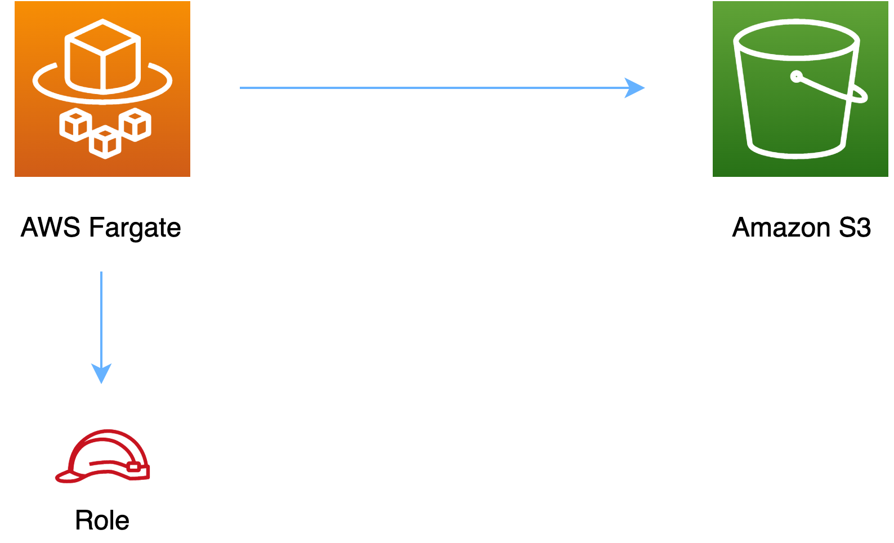

# aws-fargate-s3 module
<!--BEGIN STABILITY BANNER-->

---


> All classes are under active development and subject to non-backward compatible changes or removal in any
> future version. These are not subject to the [Semantic Versioning](https://semver.org/) model.
> This means that while you may use them, you may need to update your source code when upgrading to a newer version of this package.

---
<!--END STABILITY BANNER-->

| **Reference Documentation**:| <span style="font-weight: normal">https://docs.aws.amazon.com/solutions/latest/constructs/</span>|
|:-------------|:-------------|
<div style="height:8px"></div>

| **Language**     | **Package**        |
|:-------------|-----------------|
| Python|`aws_solutions_constructs.aws_fargate_s3`|
| Typescript|`@aws-solutions-constructs/aws-fargate-s3`|
| Java|`software.amazon.awsconstructs.services.fargates3`|

This AWS Solutions Construct implements an AWS Fargate service that can write/read to an Amazon S3 Bucket

Here is a minimal deployable pattern definition in Typescript:

``` typescript
import { FargateToS3, FargateToS3Props } from '@aws-solutions-constructs/aws-fargate-s3';

const props: FargateToS3Props = {
  publicApi: true,
  ecrRepositoryArn: "arn of a repo in ECR in your account",
});

new FargateToS3(stack, 'test-construct', props);
```

## Initializer

``` text
new FargateToS3(scope: Construct, id: string, props: FargateToS3Props);
```

_Parameters_

* scope [`Construct`](https://docs.aws.amazon.com/cdk/api/latest/docs/@aws-cdk_core.Construct.html)
* id `string`
* props [`FargateToS3Props`](#pattern-construct-props)

## Pattern Construct Props

| **Name**     | **Type**        | **Description** |
|:-------------|:----------------|-----------------|
| publicApi | boolean | Whether the construct is deploying a private or public API. This has implications for the VPC and ALB. |
| vpcProps? | [ec2.VpcProps](https://docs.aws.amazon.com/cdk/api/latest/docs/@aws-cdk_aws-ec2.VpcProps.html) | Optional custom properties for a VPC the construct will create. This VPC will be used by the new ALB and any Private Hosted Zone the construct creates (that's why loadBalancerProps and privateHostedZoneProps can't include a VPC). Providing both this and existingVpc is an error. |
| existingVpc? | [ec2.IVpc](https://docs.aws.amazon.com/cdk/api/latest/docs/@aws-cdk_aws-ec2.IVpc.html) | An existing VPC in which to deploy the construct. Providing both this and vpcProps is an error. If the client provides an existing load balancer and/or existing Private Hosted Zone, those constructs must exist in this VPC. |
| clusterProps? | [ecs.ClusterProps](https://docs.aws.amazon.com/cdk/api/v1/docs/@aws-cdk_aws-ecs.ClusterProps.html) | Optional properties to create a new ECS cluster. To provide an existing cluster, use the cluster attribute of fargateServiceProps. |
| ecrRepositoryArn? | string | The arn of an ECR Repository containing the image to use to generate the containers. Either this or the image property of containerDefinitionProps must be provided. format: arn:aws:ecr:*region*:*account number*:repository/*Repository Name* |
| ecrImageVersion? | string | The version of the image to use from the repository. Defaults to 'Latest' |
| containerDefinitionProps? | [ecs.ContainerDefinitionProps \| any](https://docs.aws.amazon.com/cdk/api/v1/docs/@aws-cdk_aws-ecs.ContainerDefinitionProps.html) | Optional props to define the container created for the Fargate Service (defaults found in fargate-defaults.ts) |
| fargateTaskDefinitionProps? | [ecs.FargateTaskDefinitionProps \| any](https://docs.aws.amazon.com/cdk/api/v1/docs/@aws-cdk_aws-ecs.FargateTaskDefinitionProps.html) | Optional props to define the Fargate Task Definition for this construct  (defaults found in fargate-defaults.ts) |
| fargateServiceProps? | [ecs.FargateServiceProps \| any](https://docs.aws.amazon.com/cdk/api/v1/docs/@aws-cdk_aws-ecs.FargateServiceProps.html) | Optional values to override default Fargate Task definition properties (fargate-defaults.ts). The construct will default to launching the service is the most isolated subnets available (precedence: Isolated, Private and Public). Override those and other defaults here. |
| existingFargateServiceObject? | [ecs.FargateService](https://docs.aws.amazon.com/cdk/api/v1/docs/@aws-cdk_aws-ecs.FargateService.html) | A Fargate Service already instantiated (probably by another Solutions Construct). If this is specified, then no props defining a new service can be provided, including: existingImageObject, ecrImageVersion, containerDefintionProps, fargateTaskDefinitionProps, ecrRepositoryArn, fargateServiceProps, clusterProps, existingClusterInterface |
| existingContainerDefinitionObject? | [ecs.ContainerDefinition](https://docs.aws.amazon.com/cdk/api/v1/docs/@aws-cdk_aws-ecs.ContainerDefinition.html) | A container definition already instantiated as part of a Fargate service. This must be the container in the existingFargateServiceObject |
|existingBucketInterface?|[`s3.IBucket`](https://docs.aws.amazon.com/cdk/api/latest/docs/@aws-cdk_aws-s3.IBucket.html)|Existing S3 Bucket interface. Providing this property and `bucketProps` results in an error.|
|bucketProps?|[`s3.BucketProps`](https://docs.aws.amazon.com/cdk/api/latest/docs/@aws-cdk_aws-s3.BucketProps.html)|Optional user provided props to override the default props for the S3 Bucket.|
|loggingBucketProps?|[`s3.BucketProps`](https://docs.aws.amazon.com/cdk/api/latest/docs/@aws-cdk_aws-s3.BucketProps.html)|Optional user provided props to override the default props for the S3 Logging Bucket.|
|logS3AccessLogs?| boolean|Whether to turn on Access Logging for the S3 bucket. Creates an S3 bucket with associated storage costs for the logs. Enabling Access Logging is a best practice. default - true|
|bucketPermissions?|`string[]`|Optional bucket permissions to grant to the Lambda function. One or more of the following may be specified: `Delete`, `Put`, `Read`, `ReadWrite`, `Write`.|
|bucketArnEnvironmentVariableName?|string|Optional Name for the S3 bucket arn environment variable set for the container.|
|bucketEnvironmentVariableName?|string|Optional Name for the S3 bucket name environment variable set for the container.|

## Pattern Properties

| **Name**     | **Type**        | **Description** |
|:-------------|:----------------|-----------------|
| vpc | [ec2.IVpc](https://docs.aws.amazon.com/cdk/api/latest/docs/@aws-cdk_aws-ec2.IVpc.html) | The VPC used by the construct (whether created by the construct or providedb by the client) |
| service | [ecs.FargateService](https://docs.aws.amazon.com/cdk/api/v1/docs/@aws-cdk_aws-ecs.FargateService.html) | The AWS Fargate service used by this construct (whether created by this construct or passed to this construct at initialization) |
| container | [ecs.ContainerDefinition](https://docs.aws.amazon.com/cdk/api/v1/docs/@aws-cdk_aws-ecs.ContainerDefinition.html) | The container associated with the AWS Fargate service in the service property. |
| s3Bucket? |[s3.IBucket](https://docs.aws.amazon.com/cdk/api/latest/docs/@aws-cdk_aws-s3.IBucket.html)|Returns an instance of s3.Bucket created by the construct|
| s3BucketInterface |[`s3.IBucket`](https://docs.aws.amazon.com/cdk/api/latest/docs/@aws-cdk_aws-s3.IBucket.html)|Returns an instance of s3.IBucket created by the construct|
| s3LoggingBucket?	| [s3.Bucket](https://docs.aws.amazon.com/cdk/api/latest/docs/@aws-cdk_aws-s3.Bucket.html)|Returns an instance of s3.Bucket created by the construct|

## Default settings

Out of the box implementation of the Construct without any override will set the following defaults:

### AWS Fargate Service
* Sets up an AWS Fargate service
  * Uses the existing service if provided
  * Creates a new service if none provided.
    * Service will run in isolated subnets if available, then private subnets if available and finally public subnets
  * Adds environment variables to the container with the ARN and Name of the S3 Bucket
  * Add permissions to the container IAM role allowing it to publish to the S3 Bucket

### Amazon S3 Bucket
* Sets up an Amazon S3 Bucket
  * Uses an existing bucket if one is provided, otherwise creates a new one
* Adds an Interface Endpoint to the VPC for S3 (the service by default runs in Isolated or Private subnets)

## Architecture


***
&copy; Copyright 2022 Amazon.com, Inc. or its affiliates. All Rights Reserved.
