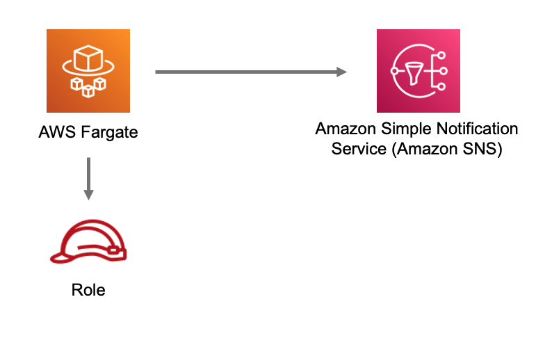

# aws-fargate-sns module
<!--BEGIN STABILITY BANNER-->

---


> All classes are under active development and subject to non-backward compatible changes or removal in any
> future version. These are not subject to the [Semantic Versioning](https://semver.org/) model.
> This means that while you may use them, you may need to update your source code when upgrading to a newer version of this package.

---
<!--END STABILITY BANNER-->

| **Reference Documentation**:| <span style="font-weight: normal">https://docs.aws.amazon.com/solutions/latest/constructs/</span>|
|:-------------|:-------------|
<div style="height:8px"></div>

| **Language**     | **Package**        |
|:-------------|-----------------|
| Python|`aws_solutions_constructs.aws_fargate_sns`|
| Typescript|`@aws-solutions-constructs/aws-fargate-sns`|
| Java|`software.amazon.awsconstructs.services.fargatesns`|

## Overview
This AWS Solutions Construct implements an AWS Fargate service that can write to an Amazon SNS topic

Here is a minimal deployable pattern definition:

Typescript
``` typescript
import { Construct } from 'constructs';
import { Stack, StackProps } from 'aws-cdk-lib';
import { FargateToSns, FargateToSnsProps } from '@aws-solutions-constructs/aws-fargate-sns';

const constructProps: FargateToSnsProps = {
    publicApi: true,
    ecrRepositoryArn: "arn:aws:ecr:us-east-1:123456789012:repository/your-ecr-repo"
};

new FargateToSns(this, 'test-construct', constructProps);
```

Python
``` python
from aws_solutions_constructs.aws_fargate_sns import FargateToSns, FargateToSnsProps
from aws_cdk import (
    Stack
)
from constructs import Construct

FargateToSns(self, 'test_construct',
            public_api=True,
            ecr_repository_arn="arn:aws:ecr:us-east-1:123456789012:repository/your-ecr-repo")
```

Java
``` java
import software.constructs.Construct;

import software.amazon.awscdk.Stack;
import software.amazon.awscdk.StackProps;
import software.amazon.awsconstructs.services.fargatesns.*;

new FargateToSns(this, "test_construct", new FargateToSnsProps.Builder()
        .publicApi(true)
        .ecrRepositoryArn("arn:aws:ecr:us-east-1:123456789012:repository/your-ecr-repo")
        .build());
```

## Pattern Construct Props

| **Name**     | **Type**        | **Description** |
|:-------------|:----------------|-----------------|
| publicApi | boolean | Whether the construct is deploying a private or public API. This has implications for the VPC. |
| vpcProps? | [ec2.VpcProps](https://docs.aws.amazon.com/cdk/api/v2/docs/aws-cdk-lib.aws_ec2.VpcProps.html) | Optional custom properties for a VPC the construct will create. This VPC will be used by any Private Hosted Zone the construct creates (that's why loadBalancerProps and privateHostedZoneProps can't include a VPC). Providing both this and existingVpc is an error. |
| existingVpc? | [ec2.IVpc](https://docs.aws.amazon.com/cdk/api/v2/docs/aws-cdk-lib.aws_ec2.IVpc.html) | An existing VPC in which to deploy the construct. Providing both this and vpcProps is an error. If the client provides an existing load balancer and/or existing Private Hosted Zone, those constructs must exist in this VPC. |
| clusterProps? | [ecs.ClusterProps](https://docs.aws.amazon.com/cdk/api/v2/docs/aws-cdk-lib.aws_ecs.ClusterProps.html) | Optional properties to create a new ECS cluster. To provide an existing cluster, use the cluster attribute of fargateServiceProps. |
| ecrRepositoryArn? | string | The arn of an ECR Repository containing the image to use to generate the containers. Either this or the image property of containerDefinitionProps must be provided. format: arn:aws:ecr:*region*:*account number*:repository/*Repository Name* |
| ecrImageVersion? | string | The version of the image to use from the repository. Defaults to 'Latest' |
| containerDefinitionProps? | [ecs.ContainerDefinitionProps \| any](https://docs.aws.amazon.com/cdk/api/v2/docs/aws-cdk-lib.aws_ecs.ContainerDefinitionProps.html) | Optional props to define the container created for the Fargate Service (defaults found in fargate-defaults.ts) |
| fargateTaskDefinitionProps? | [ecs.FargateTaskDefinitionProps \| any](https://docs.aws.amazon.com/cdk/api/v2/docs/aws-cdk-lib.aws_ecs.FargateTaskDefinitionProps.html) | Optional props to define the Fargate Task Definition for this construct  (defaults found in fargate-defaults.ts) |
| fargateServiceProps? | [ecs.FargateServiceProps \| any](https://docs.aws.amazon.com/cdk/api/v2/docs/aws-cdk-lib.aws_ecs.FargateServiceProps.html) | Optional values to override default Fargate Task definition properties (fargate-defaults.ts). The construct will default to launching the service is the most isolated subnets available (precedence: Isolated, Private and Public). Override those and other defaults here. |
| existingFargateServiceObject? | [ecs.FargateService](https://docs.aws.amazon.com/cdk/api/v2/docs/aws-cdk-lib.aws_ecs.FargateService.html) | A Fargate Service already instantiated (probably by another Solutions Construct). If this is specified, then no props defining a new service can be provided, including: ecrImageVersion, containerDefinitionProps, fargateTaskDefinitionProps, ecrRepositoryArn, fargateServiceProps, clusterProps |
| existingContainerDefinitionObject? | [ecs.ContainerDefinition](https://docs.aws.amazon.com/cdk/api/v2/docs/aws-cdk-lib.aws_ecs.ContainerDefinition.html) | A container definition already instantiated as part of a Fargate service. This must be the container in the existingFargateServiceObject |
|existingTopicObj?|[sns.Topic](https://docs.aws.amazon.com/cdk/api/v2/docs/aws-cdk-lib.aws_sns.Topic.html)|Existing instance of SNS Topic object, providing both this and `topicProps` will cause an error.|
|topicProps?|[sns.TopicProps](https://docs.aws.amazon.com/cdk/api/v2/docs/aws-cdk-lib.aws_sns.TopicProps.html)|Optional user provided properties to override the default properties for the SNS topic.|
|topicArnEnvironmentVariableName?|string|Optional Name for the container environment variable set to the ARN of the topic. Default: SNS_TOPIC_ARN |
|topicNameEnvironmentVariableName?|string|Optional Name for the container environment variable set to the name of the topic. Default: SNS_TOPIC_NAME |
|enableEncryptionWithCustomerManagedKey?|`boolean`|If no key is provided, this flag determines whether the SNS Topic is encrypted with a new CMK or an AWS managed key. This flag is ignored if any of the following are defined: topicProps.masterKey, encryptionKey or encryptionKeyProps.|
|encryptionKey?|[`kms.Key`](https://docs.aws.amazon.com/cdk/api/v2/docs/aws-cdk-lib.aws_kms.Key.html)|An optional, imported encryption key to encrypt the SNS Topic with.|
|encryptionKeyProps?|[`kms.KeyProps`](https://docs.aws.amazon.com/cdk/api/v2/docs/aws-cdk-lib.aws_kms.Key.html#construct-props)|Optional user provided properties to override the default properties for the KMS encryption key used to encrypt the SNS Topic with.|

## Pattern Properties

| **Name**     | **Type**        | **Description** |
|:-------------|:----------------|-----------------|
| vpc | [ec2.IVpc](https://docs.aws.amazon.com/cdk/api/v2/docs/aws-cdk-lib.aws_ec2.IVpc.html) | The VPC used by the construct (whether created by the construct or provided by the client) |
| service | [ecs.FargateService](https://docs.aws.amazon.com/cdk/api/v2/docs/aws-cdk-lib.aws_ecs.FargateService.html) | The AWS Fargate service used by this construct (whether created by this construct or passed to this construct at initialization) |
| container | [ecs.ContainerDefinition](https://docs.aws.amazon.com/cdk/api/v2/docs/aws-cdk-lib.aws_ecs.ContainerDefinition.html) | The container associated with the AWS Fargate service in the service property. |
|snsTopic|[`sns.Topic`](https://docs.aws.amazon.com/cdk/api/v2/docs/aws-cdk-lib.aws_sns.Topic.html)|Returns an instance of the SNS topic created by the pattern.|

## Default settings

Out of the box implementation of the Construct without any override will set the following defaults:

### AWS Fargate Service
* Sets up an AWS Fargate service
  * Uses the existing service if provided
  * Creates a new service if none provided.
    * Service will run in isolated subnets if available, then private subnets if available and finally public subnets
  * Adds environment variables to the container with the ARN and Name of the SNS topic
  * Add permissions to the container IAM role allowing it to publish to the SNS topic

### Amazon SNS Topic
* Sets up an Amazon SNS topic
  * Uses an existing topic if one is provided, otherwise creates a new one
* Adds an Interface Endpoint to the VPC for SNS (the service by default runs in Isolated or Private subnets)

## Architecture


***
&copy; Copyright Amazon.com, Inc. or its affiliates. All Rights Reserved.
