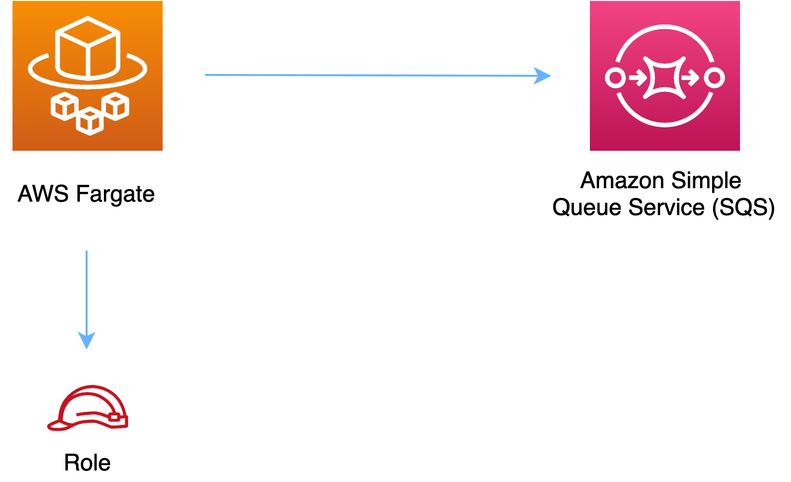

//!!NODE_ROOT <section>
//== aws-fargate-sqs module

[.topic]
= aws-fargate-sqs
:info_doctype: section
:info_title: aws-fargate-sqs

image:https://img.shields.io/badge/stability-Experimental-important.svg?style=for-the-badge[Stability:Experimental]

____
All classes are under active development and subject to non-backward
compatible changes or removal in any future version. These are not
subject to the https://semver.org/[Semantic Versioning] model. This
means that while you may use them, you may need to update your source
code when upgrading to a newer version of this package.
____

[width="100%",cols="<50%,<50%",options="header",]
|===
|*Reference Documentation*:
|https://docs.aws.amazon.com/solutions/latest/constructs/
|===

[width="100%",cols="<46%,54%",options="header",]
|===
|*Language* |*Package*
|image:https://docs.aws.amazon.com/cdk/api/img/python32.png[Python
Logo] Python |`aws_solutions_constructs.aws_fargate_sqs`

|image:https://docs.aws.amazon.com/cdk/api/img/typescript32.png[Typescript
Logo] Typescript |`@aws-solutions-constructs/aws-fargate-sqs`

|image:https://docs.aws.amazon.com/cdk/api/img/java32.png[Java
Logo] Java |`software.amazon.awsconstructs.services.fargatesqs`
|===

== Overview

This AWS Solutions Construct implements an AWS Fargate service that can
write to an Amazon SQS queue

Here is a minimal deployable pattern definition:

====
[role="tablist"]
Typescript::
+
[source,typescript]
----
import { Construct } from 'constructs';
import { Stack, StackProps } from 'aws-cdk-lib';
import { FargateToSqs, FargateToSqsProps } from '@aws-solutions-constructs/aws-fargate-sqs';

const constructProps: FargateToSqsProps = {
    publicApi: true,
    ecrRepositoryArn: "arn:aws:ecr:us-east-1:123456789012:repository/your-ecr-repo"
};

new FargateToSqs(this, 'test-construct', constructProps);
----

Python::
+
[source,python]
----
from aws_solutions_constructs.aws_fargate_sqs import FargateToSqs, FargateToSqsProps
from aws_cdk import (
    Stack
)
from constructs import Construct

FargateToSqs(self, 'test_construct',
            public_api=True,
            ecr_repository_arn="arn:aws:ecr:us-east-1:123456789012:repository/your-ecr-repo")
----

Java::
+
[source,java]
----
import software.constructs.Construct;

import software.amazon.awscdk.Stack;
import software.amazon.awscdk.StackProps;
import software.amazon.awsconstructs.services.fargatesqs.*;

new FargateToSqs(this, "test_construct", new FargateToSqsProps.Builder()
        .publicApi(true)
        .ecrRepositoryArn("arn:aws:ecr:us-east-1:123456789012:repository/your-ecr-repo")
        .build());
----
====

== Pattern Construct Props

[width="100%",cols="<30%,<35%,35%",options="header",]
|===
|*Name* |*Type* |*Description*
|publicApi |boolean |Whether the construct is deploying a private or
public API. This has implications for the VPC.

|vpcProps?
|https://docs.aws.amazon.com/cdk/api/v2/docs/aws-cdk-lib.aws_ec2.VpcProps.html[ec2.VpcProps]
|Optional custom properties for a VPC the construct will create. This
VPC will be used by any Private Hosted Zone the construct creates
(that’s why loadBalancerProps and privateHostedZoneProps can’t include a
VPC). Providing both this and existingVpc is an error.

|existingVpc?
|https://docs.aws.amazon.com/cdk/api/v2/docs/aws-cdk-lib.aws_ec2.IVpc.html[ec2.IVpc]
|An existing VPC in which to deploy the construct. Providing both this
and vpcProps is an error. If the client provides an existing load
balancer and/or existing Private Hosted Zone, those constructs must
exist in this VPC.

|clusterProps?
|https://docs.aws.amazon.com/cdk/api/v2/docs/aws-cdk-lib.aws_ecs.ClusterProps.html[ecs.ClusterProps]
|Optional properties to create a new ECS cluster. To provide an existing
cluster, use the cluster attribute of fargateServiceProps.

|ecrRepositoryArn? |string |The arn of an ECR Repository containing the
image to use to generate the containers. Either this or the image
property of containerDefinitionProps must be provided. format:
arn:aws:ecr:_region_:_account number_:repository/_Repository Name_

|ecrImageVersion? |string |The version of the image to use from the
repository. Defaults to '`Latest`'

|containerDefinitionProps?
|https://docs.aws.amazon.com/cdk/api/v2/docs/aws-cdk-lib.aws_ecs.ContainerDefinitionProps.html[ecs.ContainerDefinitionProps
{vbar} any] |Optional props to define the container created for the
Fargate Service (defaults found in fargate-defaults.ts)

|fargateTaskDefinitionProps?
|https://docs.aws.amazon.com/cdk/api/v2/docs/aws-cdk-lib.aws_ecs.FargateTaskDefinitionProps.html[ecs.FargateTaskDefinitionProps
{vbar} any] |Optional props to define the Fargate Task Definition for
this construct (defaults found in fargate-defaults.ts)

|fargateServiceProps?
|https://docs.aws.amazon.com/cdk/api/v2/docs/aws-cdk-lib.aws_ecs.FargateServiceProps.html[ecs.FargateServiceProps
{vbar} any] |Optional values to override default Fargate Task definition
properties (fargate-defaults.ts). The construct will default to
launching the service is the most isolated subnets available
(precedence: Isolated, Private and Public). Override those and other
defaults here.

|existingFargateServiceObject?
|https://docs.aws.amazon.com/cdk/api/v2/docs/aws-cdk-lib.aws_ecs.FargateService.html[ecs.FargateService]
|A Fargate Service already instantiated (probably by another Solutions
Construct). If this is specified, then no props defining a new service
can be provided, including: ecrImageVersion, containerDefinitionProps,
fargateTaskDefinitionProps, ecrRepositoryArn, fargateServiceProps,
clusterProps

|existingContainerDefinitionObject?
|https://docs.aws.amazon.com/cdk/api/v2/docs/aws-cdk-lib.aws_ecs.ContainerDefinition.html[ecs.ContainerDefinition]
|A container definition already instantiated as part of a Fargate
service. This must be the container in the existingFargateServiceObject

|existingQueueObj?
|https://docs.aws.amazon.com/cdk/api/v2/docs/aws-cdk-lib.aws_sqs.Queue.html[sqs.Queue]
|An optional, existing SQS queue to be used instead of the default
queue. Providing both this and queueProps will cause an error.

|queueProps?
|https://docs.aws.amazon.com/cdk/api/v2/docs/aws-cdk-lib.aws_sqs.QueueProps.html[sqs.QueueProps]
|Optional - user provided properties to override the default properties for the SQS queue. Providing both this and `existingQueueObj` will cause an error.

|deployDeadLetterQueue? |boolean |Whether to create a secondary queue to
be used as a dead letter queue. Defaults to `true`.

|deadLetterQueueProps?
|https://docs.aws.amazon.com/cdk/api/v2/docs/aws-cdk-lib.aws_sqs.QueueProps.html[sqs.QueueProps]
|Optional user-provided props to override the default props for the dead
letter queue. Only used if the `deployDeadLetterQueue` property is set
to true.

|maxReceiveCount? |integer |The number of times a message can be
unsuccessfully dequeued before being moved to the dead letter queue.
Defaults to `15`.

|queueUrlEnvironmentVariableName? |string |Optional Name for the
container environment variable set to the URL of the queue. Default:
SQS_QUEUE_URL

|queueArnEnvironmentVariableName? |string |Optional Name for the
container environment variable set to the arn of the queue. Default:
SQS_QUEUE_ARN

|queuePermissions? |`string[]` |Optional queue permissions to grant
to the Fargate service. One or more of the following may be specified:
`Read`,`Write`. Default is `Write`

|enableEncryptionWithCustomerManagedKey? |`boolean` |If no key is
provided, this flag determines whether the queue is encrypted with a new
CMK or an AWS managed key. This flag is ignored if any of the following
are defined: queueProps.encryptionMasterKey, encryptionKey or
encryptionKeyProps.

|encryptionKey?
|https://docs.aws.amazon.com/cdk/api/v2/docs/aws-cdk-lib.aws_kms.Key.html[`kms.Key`]
|An optional, imported encryption key to encrypt the SQS Queue with.

|encryptionKeyProps?
|https://docs.aws.amazon.com/cdk/api/v2/docs/aws-cdk-lib.aws_kms.Key.html#construct-props[`kms.KeyProps`]
|Optional user provided properties to override the default properties
for the KMS encryption key used to encrypt the SQS queue with.
|===

== Pattern Properties

[width="100%",cols="<30%,<35%,35%",options="header",]
|===
|*Name* |*Type* |*Description*
|vpc
|https://docs.aws.amazon.com/cdk/api/v2/docs/aws-cdk-lib.aws_ec2.IVpc.html[ec2.IVpc]
|The VPC used by the construct (whether created by the construct or
provided by the client)

|service
|https://docs.aws.amazon.com/cdk/api/v2/docs/aws-cdk-lib.aws_ecs.FargateService.html[ecs.FargateService]
|The AWS Fargate service used by this construct (whether created by this
construct or passed to this construct at initialization)

|container
|https://docs.aws.amazon.com/cdk/api/v2/docs/aws-cdk-lib.aws_ecs.ContainerDefinition.html[ecs.ContainerDefinition]
|The container associated with the AWS Fargate service in the service
property.

|sqsQueue
|https://docs.aws.amazon.com/cdk/api/v2/docs/aws-cdk-lib.aws_sqs.Queue.html[sqs.Queue]
|Returns an instance of the SQS queue created by the pattern.

|deadLetterQueue?
|https://docs.aws.amazon.com/cdk/api/v2/docs/aws-cdk-lib.aws_sqs.Queue.html[sqs.Queue]
|Returns an instance of the dead letter queue created by the pattern, if
one is deployed.
|===

== Default settings

Out of the box implementation of the Construct without any override will
set the following defaults:

=== AWS Fargate Service

* Sets up an AWS Fargate service
** Uses the existing service if provided
** Creates a new service if none provided.
*** Service will run in isolated subnets if available, then private
subnets if available and finally public subnets
** Adds environment variables to the container with the name of the SQS
queue
** Add permissions to the container IAM role allowing it to publish to
the SQS queue

=== Amazon SQS Queue

* Sets up an Amazon SQS queue
** Uses an existing queue if one is provided, otherwise creates a new
one
* Adds an Interface Endpoint to the VPC for SQS (the service by default
runs in Isolated or Private subnets)

== Architecture

// github block

'''''

© Copyright Amazon.com, Inc. or its affiliates. All Rights Reserved.
