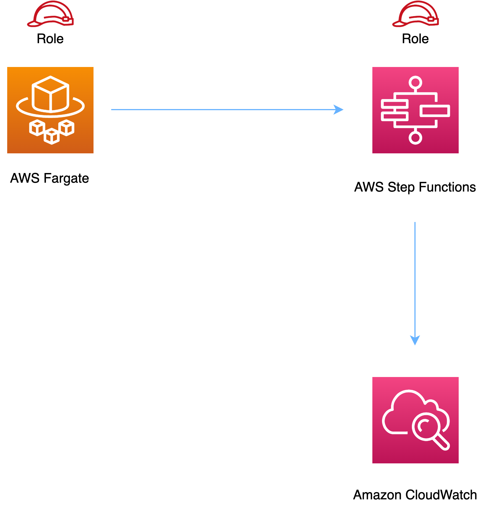

# aws-fargate-stepfunctions module
<!--BEGIN STABILITY BANNER-->

---


> All classes are under active development and subject to non-backward compatible changes or removal in any
> future version. These are not subject to the [Semantic Versioning](https://semver.org/) model.
> This means that while you may use them, you may need to update your source code when upgrading to a newer version of this package.

---
<!--END STABILITY BANNER-->

| **Reference Documentation**:| <span style="font-weight: normal">https://docs.aws.amazon.com/solutions/latest/constructs/</span>|
|:-------------|:-------------|
<div style="height:8px"></div>

| **Language**     | **Package**        |
|:-------------|-----------------|
| Python|`aws_solutions_constructs.aws_fargate_stepfunctions`|
| Typescript|`@aws-solutions-constructs/aws-fargate-stepfunctions`|
| Java|`software.amazon.awsconstructs.services.fargatestepfunctions`|

This AWS Solutions Construct implements an AWS Fargate service that can execute an AWS Step Functions state machine

Here is a minimal deployable pattern definition:

Typescript
``` typescript
import { Construct } from 'constructs';
import { Stack, StackProps } from 'aws-cdk-lib';
import { FargateToStepfunctions, FargateToStepfunctionsProps } from '@aws-solutions-constructs/aws-fargate-stepfunctions';
import * as stepfunctions from 'aws-cdk-lib/aws-stepfunctions';

const startState = new stepfunctions.Pass(this, 'StartState');

const constructProps: FargateToStepfunctionsProps = {
  publicApi: true,
  ecrRepositoryArn: "arn:aws:ecr:us-east-1:123456789012:repository/your-ecr-repo",
  stateMachineProps: {
      definition: startState
    }
};

new FargateToStepfunctions(this, 'test-construct', constructProps);
```

Python
``` python
from aws_solutions_constructs.aws_fargate_stepfunctions import FargateToStepfunctions, FargateToStepfunctionsProps
from aws_cdk import (
    aws_stepfunctions as stepfunctions,
    Stack
)
from constructs import Construct

start_state = stepfunctions.Pass(self, 'start_state')

FargateToStepfunctions(self, 'test_construct',
            public_api=True,
            ecr_repository_arn="arn:aws:ecr:us-east-1:123456789012:repository/your-ecr-repo",
            state_machine_props=stepfunctions.StateMachineProps(
              definition=start_state))
```

Java
``` java
import software.constructs.Construct;

import software.amazon.awscdk.Stack;
import software.amazon.awscdk.StackProps;
import software.amazon.awsconstructs.services.fargatestepfunctions.*;
import software.amazon.awscdk.services.stepfunctions.*;

start_state = stepfunctions.Pass(self, 'start_state')

new FargateToStepfunctions(this, "test-construct", new FargateToStepfunctionsProps.Builder()
        .publicApi(true)
        .ecrRepositoryArn("arn:aws:ecr:us-east-1:123456789012:repository/your-ecr-repo")
        .stateMachineProps(new StateMachineProps.Builder()
                        .definition(startState)
                        .build()
        .build());
```

## Pattern Construct Props

| **Name**     | **Type**        | **Description** |
|:-------------|:----------------|-----------------|
| publicApi | `boolean` | Whether the construct is deploying a private or public API. This has implications for the VPC. |
| vpcProps? | [`ec2.VpcProps`](https://docs.aws.amazon.com/cdk/api/latest/docs/@aws-cdk_aws-ec2.VpcProps.html) | Optional custom properties for a VPC the construct will create. This VPC will be used by any Private Hosted Zone the construct creates (that's why loadBalancerProps and privateHostedZoneProps can't include a VPC). Providing both this and existingVpc is an error. |
| existingVpc? | [`ec2.IVpc`](https://docs.aws.amazon.com/cdk/api/latest/docs/@aws-cdk_aws-ec2.IVpc.html) | An existing VPC in which to deploy the construct. Providing both this and vpcProps is an error. If the client provides an existing load balancer and/or existing Private Hosted Zone, those constructs must exist in this VPC. |
| clusterProps? | [`ecs.ClusterProps`](https://docs.aws.amazon.com/cdk/api/v1/docs/@aws-cdk_aws-ecs.ClusterProps.html) | Optional properties to create a new ECS cluster. To provide an existing cluster, use the cluster attribute of fargateServiceProps. |
| ecrRepositoryArn? | `string` | The arn of an ECR Repository containing the image to use to generate the containers. Either this or the image property of containerDefinitionProps must be provided. format: arn:aws:ecr:*region*:*account number*:repository/*Repository Name* |
| ecrImageVersion? | `string` | The version of the image to use from the repository. Defaults to 'Latest' |
| containerDefinitionProps? | [`ecs.ContainerDefinitionProps \| any`](https://docs.aws.amazon.com/cdk/api/v1/docs/@aws-cdk_aws-ecs.ContainerDefinitionProps.html) | Optional props to define the container created for the Fargate Service (defaults found in fargate-defaults.ts) |
| fargateTaskDefinitionProps? | [`ecs.FargateTaskDefinitionProps \| any`](https://docs.aws.amazon.com/cdk/api/v1/docs/@aws-cdk_aws-ecs.FargateTaskDefinitionProps.html) | Optional props to define the Fargate Task Definition for this construct  (defaults found in fargate-defaults.ts) |
| fargateServiceProps? | [`ecs.FargateServiceProps \| any`](https://docs.aws.amazon.com/cdk/api/v1/docs/@aws-cdk_aws-ecs.FargateServiceProps.html) | Optional values to override default Fargate Task definition properties (fargate-defaults.ts). The construct will default to launching the service is the most isolated subnets available (precedence: Isolated, Private and Public). Override those and other defaults here. |
|existingFargateServiceObject? | [`ecs.FargateService`](https://docs.aws.amazon.com/cdk/api/v1/docs/@aws-cdk_aws-ecs.FargateService.html) | A Fargate Service already instantiated (probably by another Solutions Construct). If this is specified, then no props defining a new service can be provided, including: ecrImageVersion, containerDefinitionProps, fargateTaskDefinitionProps, ecrRepositoryArn, fargateServiceProps, clusterProps |
|existingContainerDefinitionObject? | [`ecs.ContainerDefinition`](https://docs.aws.amazon.com/cdk/api/v1/docs/@aws-cdk_aws-ecs.ContainerDefinition.html) | A container definition already instantiated as part of a Fargate service. This must be the container in the existingFargateServiceObject |
|stateMachineProps|[`sfn.StateMachineProps`](https://docs.aws.amazon.com/cdk/api/latest/docs/@aws-cdk_aws-stepfunctions.StateMachineProps.html)|User provided props to override the default props for sfn.StateMachine.|
| createCloudWatchAlarms? | `boolean`|Whether to create recommended CloudWatch alarms. Default is true.|
|logGroupProps?|[`logs.LogGroupProps`](https://docs.aws.amazon.com/cdk/api/latest/docs/@aws-cdk_aws-logs.LogGroupProps.html)|Optional user provided props to override the default props for for the CloudWatchLogs LogGroup.|
|stateMachineEnvironmentVariableName?|`string`|Optional name for the container environment variable containing the ARN of the state machine.|

## Pattern Properties

| **Name**     | **Type**        | **Description** |
|:-------------|:----------------|-----------------|
| vpc | [`ec2.IVpc`](https://docs.aws.amazon.com/cdk/api/latest/docs/@aws-cdk_aws-ec2.IVpc.html) | The VPC used by the construct (whether created by the construct or provided by the client) |
| service | [`ecs.FargateService`](https://docs.aws.amazon.com/cdk/api/v1/docs/@aws-cdk_aws-ecs.FargateService.html) | The AWS Fargate service used by this construct (whether created by this construct or passed to this construct at initialization) |
| container | [`ecs.ContainerDefinition`](https://docs.aws.amazon.com/cdk/api/v1/docs/@aws-cdk_aws-ecs.ContainerDefinition.html) | The container associated with the AWS Fargate service in the service property. |
| stateMachine| [`sfn.StateMachine`](https://docs.aws.amazon.com/cdk/api/latest/docs/@aws-cdk_aws-stepfunctions.StateMachine.html)|Returns an instance of `sfn.StateMachine` created by the construct.|
| stateMachineLogGroup|[`logs.ILogGroup`](https://docs.aws.amazon.com/cdk/api/latest/docs/@aws-cdk_aws-logs.ILogGroup.html)|Returns an instance of the `logs.ILogGroup` created by the construct for StateMachine.|
| cloudwatchAlarms? | [`cloudwatch.Alarm[]`](https://docs.aws.amazon.com/cdk/api/latest/docs/@aws-cdk_aws-cloudwatch.Alarm.html)|Returns a list of `cloudwatch.Alarm` created by the construct.|

## Default settings

Out of the box implementation of the Construct without any override will set the following defaults:

### AWS Fargate Service
* Sets up an AWS Fargate service
  * Uses the existing service if provided
  * Creates a new service if none provided.
    * Service will run in isolated subnets if available, then private subnets if available and finally public subnets
* Adds an environment variable to the container containing the ARN of the state machine
  * Default name is `STATE_MACHINE_ARN`
* Add permissions to the container IAM role allowing it to start the execution of a state machine

### AWS Step Functions
* Sets up an AWS Step Functions state machine
  * Uses an existing state machine if one is provided, otherwise creates a new one
* Adds an Interface Endpoint to the VPC for Step Functions (the service by default runs in Isolated or Private subnets)
* Enables CloudWatch logging

## Architecture


***
&copy; Copyright 2022 Amazon.com, Inc. or its affiliates. All Rights Reserved.
