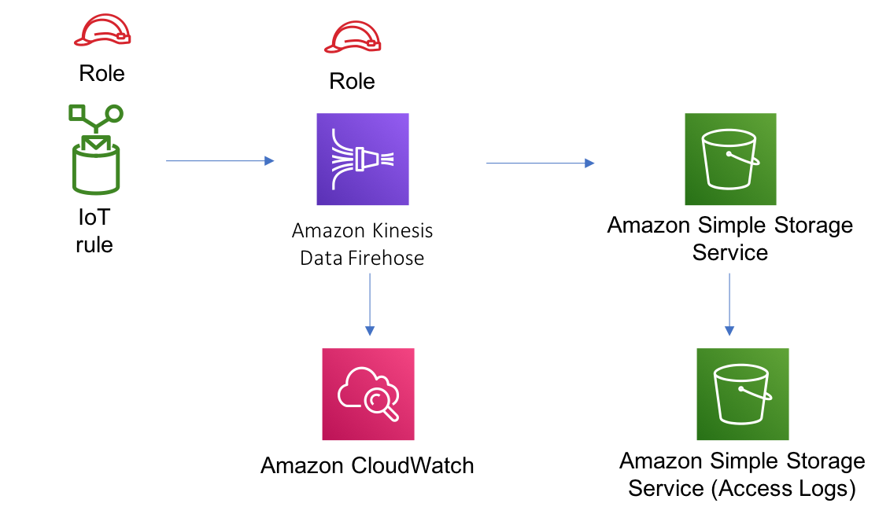

//!!NODE_ROOT <section>
//== aws-iot-kinesisfirehose-s3 module

[.topic]
= aws-iot-kinesisfirehose-s3
:info_doctype: section
:info_title: aws-iot-kinesisfirehose-s3

image:https://img.shields.io/badge/stability-Experimental-important.svg?style=for-the-badge[Stability:Experimental]

____
All classes are under active development and subject to non-backward
compatible changes or removal in any future version. These are not
subject to the https://semver.org/[Semantic Versioning] model. This
means that while you may use them, you may need to update your source
code when upgrading to a newer version of this package.
____

[width="100%",cols="<50%,<50%",options="header",]
|===
|*Reference Documentation*:
|https://docs.aws.amazon.com/solutions/latest/constructs/
|===

[width="100%",cols="<46%,54%",options="header",]
|===
|*Language* |*Package*
|image:https://docs.aws.amazon.com/cdk/api/latest/img/python32.png[Python
Logo] Python
|`aws_solutions_constructs.aws_iot_kinesisfirehose_s3`

|image:https://docs.aws.amazon.com/cdk/api/latest/img/typescript32.png[Typescript
Logo] Typescript |`@aws-solutions-constructs/aws-iot-kinesisfirehose-s3`

|image:https://docs.aws.amazon.com/cdk/api/latest/img/java32.png[Java
Logo] Java
|`software.amazon.awsconstructs.services.iotkinesisfirehoses3`
|===

== Overview

This AWS Solutions Construct implements an AWS IoT MQTT topic rule to
send data to an Amazon Kinesis Data Firehose delivery stream connected
to an Amazon S3 bucket.

Here is a minimal deployable pattern definition:

====
[role="tablist"]
Typescript::
+
[source,typescript]
----
import { Construct } from 'constructs';
import { Stack, StackProps } from 'aws-cdk-lib';
import { IotToKinesisFirehoseToS3Props, IotToKinesisFirehoseToS3 } from '@aws-solutions-constructs/aws-iot-kinesisfirehose-s3';

const constructProps: IotToKinesisFirehoseToS3Props = {
    iotTopicRuleProps: {
        topicRulePayload: {
            ruleDisabled: false,
            description: "Persistent storage of connected vehicle telematics data",
            sql: "SELECT * FROM 'connectedcar/telemetry/#'",
            actions: []
        }
    }
};

new IotToKinesisFirehoseToS3(this, 'test-iot-firehose-s3', constructProps);
----

Python::
+
[source,python]
----
from aws_solutions_constructs.aws_iot_kinesisfirehose_s3 import IotToKinesisFirehoseToS3Props, IotToKinesisFirehoseToS3
from aws_cdk import (
    aws_iot as iot,
    Stack
)
from constructs import Construct

IotToKinesisFirehoseToS3(self, 'test_iot_firehose_s3',
                        iot_topic_rule_props=iot.CfnTopicRuleProps(
                            topic_rule_payload=iot.CfnTopicRule.TopicRulePayloadProperty(
                                rule_disabled=False,
                                description="Persistent storage of connected vehicle telematics data",
                                sql="SELECT * FROM 'connectedcar/telemetry/#'",
                                actions=[]
                            )
                        ))
----

Java::
+
[source,java]
----
import software.constructs.Construct;
import java.util.List;

import software.amazon.awscdk.Stack;
import software.amazon.awscdk.StackProps;
import software.amazon.awscdk.services.iot.*;
import software.amazon.awscdk.services.iot.CfnTopicRule.TopicRulePayloadProperty;
import software.amazon.awsconstructs.services.iotkinesisfirehoses3.*;

new IotToKinesisFirehoseToS3(this, "test-iot-firehose-s3", new IotToKinesisFirehoseToS3Props.Builder()
        .iotTopicRuleProps(new CfnTopicRuleProps.Builder()
                .topicRulePayload(new TopicRulePayloadProperty.Builder()
                        .ruleDisabled(false)
                        .description("Persistent storage of connected vehicle telematics data")
                        .sql("SELECT * FROM 'connectedcar/telemetry/#'")
                        .actions(List.of())
                        .build())
                .build())
        .build());
----
====

== Pattern Construct Props

[width="100%",cols="<30%,<35%,35%",options="header",]
|===
|*Name* |*Type* |*Description*
|iotTopicRuleProps
|https://docs.aws.amazon.com/cdk/api/v2/docs/aws-cdk-lib.aws_iot.CfnTopicRuleProps.html[`iot.CfnTopicRuleProps`]
|User provided CfnTopicRuleProps to override the defaults

|kinesisFirehoseProps?
|https://docs.aws.amazon.com/cdk/api/v2/docs/aws-cdk-lib.aws_kinesisfirehose.CfnDeliveryStreamProps.html[`kinesisfirehose.CfnDeliveryStreamProps`]
|Optional user provided props to override the default props for Kinesis
Firehose Delivery Stream

|existingBucketObj?
|https://docs.aws.amazon.com/cdk/api/v2/docs/aws-cdk-lib.aws_s3.IBucket.html[`s3.IBucket`]
|Existing instance of S3 Bucket object, providing both this and
`bucketProps` will cause an error.

|bucketProps?
|https://docs.aws.amazon.com/cdk/api/v2/docs/aws-cdk-lib.aws_s3.BucketProps.html[`s3.BucketProps`]
|User provided props to override the default props for the S3 Bucket. If
this is provided, then also providing bucketProps is an error.

|logGroupProps?
|https://docs.aws.amazon.com/cdk/api/v2/docs/aws-cdk-lib.aws_logs.LogGroupProps.html[`logs.LogGroupProps`]
|User provided props to override the default props for for the
CloudWatchLogs LogGroup.

|loggingBucketProps?
|https://docs.aws.amazon.com/cdk/api/v2/docs/aws-cdk-lib.aws_s3.BucketProps.html[`s3.BucketProps`]
|Optional user provided props to override the default props for the S3
Logging Bucket.

|logS3AccessLogs? |boolean |Whether to turn on Access Logging for the S3
bucket. Creates an S3 bucket with associated storage costs for the logs.
Enabling Access Logging is a best practice. default - true
|===

== Pattern Properties

[width="100%",cols="<30%,<35%,35%",options="header",]
|===
|*Name* |*Type* |*Description*
|kinesisFirehose
|https://docs.aws.amazon.com/cdk/api/v2/docs/aws-cdk-lib.aws_kinesisfirehose.CfnDeliveryStream.html[`kinesisfirehose.CfnDeliveryStream`]
|Returns an instance of kinesisfirehose.CfnDeliveryStream created by the
construct

|s3Bucket?
|https://docs.aws.amazon.com/cdk/api/v2/docs/aws-cdk-lib.aws_s3.Bucket.html[`s3.Bucket`]
|Returns an instance of s3.Bucket created by the construct

|s3LoggingBucket?
|https://docs.aws.amazon.com/cdk/api/v2/docs/aws-cdk-lib.aws_s3.Bucket.html[`s3.Bucket`]
|Returns an instance of s3.Bucket created by the construct as the
logging bucket for the primary bucket.

|iotTopicRule
|https://docs.aws.amazon.com/cdk/api/v2/docs/aws-cdk-lib.aws_iot.CfnTopicRule.html[`iot.CfnTopicRule`]
|Returns an instance of iot.CfnTopicRule created by the construct

|iotActionsRole
|https://docs.aws.amazon.com/cdk/api/v2/docs/aws-cdk-lib.aws_iam.Role.html[`iam.Role`]
|Returns an instance of the iam.Role created by the construct for IoT
Rule

|kinesisFirehoseRole
|https://docs.aws.amazon.com/cdk/api/v2/docs/aws-cdk-lib.aws_iam.Role.html[`iam.Role`]
|Returns an instance of the iam.Role created by the construct for
Kinesis Data Firehose delivery stream

|kinesisFirehoseLogGroup
|https://docs.aws.amazon.com/cdk/api/v2/docs/aws-cdk-lib.aws_logs.LogGroup.html[`logs.LogGroup`]
|Returns an instance of the LogGroup created by the construct for
Kinesis Data Firehose delivery stream

|s3BucketInterface
|https://docs.aws.amazon.com/cdk/api/v2/docs/aws-cdk-lib.aws_s3.IBucket.html[`s3.IBucket`]
|Returns an instance of s3.IBucket created by the construct
|===

== Default settings

Out of the box implementation of the Construct without any override will
set the following defaults:

=== Amazon IoT Rule

* Configure least privilege access IAM role for Amazon IoT

=== Amazon Kinesis Firehose

* Enable CloudWatch logging for Kinesis Firehose
* Configure least privilege access IAM role for Amazon Kinesis Firehose

=== Amazon S3 Bucket

* Configure Access logging for S3 Bucket
* Enable server-side encryption for S3 Bucket using AWS managed KMS Key
* Enforce encryption of data in transit
* Turn on the versioning for S3 Bucket
* Don’t allow public access for S3 Bucket
* Retain the S3 Bucket when deleting the CloudFormation stack
* Applies Lifecycle rule to move noncurrent object versions to Glacier
storage after 90 days

== Architecture

// github block

'''''

© Copyright Amazon.com, Inc. or its affiliates. All Rights Reserved.
