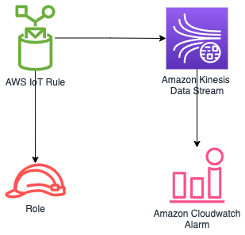

# aws-iot-kinesisstreams module
<!--BEGIN STABILITY BANNER-->

---


> All classes are under active development and subject to non-backward compatible changes or removal in any
> future version. These are not subject to the [Semantic Versioning](https://semver.org/) model.
> This means that while you may use them, you may need to update your source code when upgrading to a newer version of this package.

---
<!--END STABILITY BANNER-->

| **Reference Documentation**:| <span style="font-weight: normal">https://docs.aws.amazon.com/solutions/latest/constructs/</span>|
|:-------------|:-------------|
<div style="height:8px"></div>

| **Language**     | **Package**        |
|:-------------|-----------------|
| Python|`aws_solutions_constructs.aws_iot_kinesisstreams`|
| Typescript|`@aws-solutions-constructs/aws-iot-kinesisstreams`|
| Java|`software.amazon.awsconstructs.services.iotkinesisstreams`|

This AWS Solutions Construct implements an AWS IoT MQTT topic rule to send data to an Amazon Kinesis Data Stream.

Here is a minimal deployable pattern definition in Typescript:

``` typescript
const { IotToKinesisStreamsProps,
        IotToKinesisStreams } from '@aws-solutions-constructs/aws-iot-kinesisstreams';

const props: IotToKinesisStreamsProps = {
    iotTopicRuleProps: {
        topicRulePayload: {
            ruleDisabled: false,
            description: "Sends data to kinesis data stream",
            sql: "SELECT * FROM 'solutions/construct'",
            actions: []
        }
    }
};

new IotToKinesisStreams(this, 'test-iot-kinesisstream', props);

```

## Initializer

``` text
new IotToKinesisStreams(scope: Construct, id: string, props: IotToKinesisStreamsProps);
```

_Parameters_

* scope [`Construct`](https://docs.aws.amazon.com/cdk/api/latest/docs/@aws-cdk_core.Construct.html)
* id `string`
* props [`IotToKinesisStreamsProps`](#pattern-construct-props)

## Pattern Construct Props

| **Name**     | **Type**        | **Description** |
|:-------------|:----------------|-----------------|
|iotTopicRuleProps|[`iot.CfnTopicRuleProps`](https://docs.aws.amazon.com/cdk/api/latest/docs/@aws-cdk_aws-iot.CfnTopicRuleProps.html)|User provided CfnTopicRuleProps to override the defaults|
|existingStreamObj?|[`kinesis.Stream`](https://docs.aws.amazon.com/cdk/api/latest/docs/@aws-cdk_aws-kinesis.Stream.html)|Existing instance of Kinesis Stream, providing both this and `kinesisStreamProps` will cause an error.|
|kinesisStreamProps?|[`kinesis.StreamProps`](https://docs.aws.amazon.com/cdk/api/latest/docs/@aws-cdk_aws-kinesis.StreamProps.html)|Optional user-provided props to override the default props for the Kinesis data stream, providing both this and `existingStreamObj` will cause an error|
|createCloudWatchAlarms|`boolean`|Whether to create recommended CloudWatch alarms for Kinesis Data Stream. |

## Pattern Properties

| **Name**     | **Type**        | **Description** |
|:-------------|:----------------|-----------------|
|iotTopicRule|[`iot.CfnTopicRule`](https://docs.aws.amazon.com/cdk/api/latest/docs/@aws-cdk_aws-iot.CfnTopicRule.html)|Returns an instance of iot.CfnTopicRule created by the construct|
|iotActionsRole|[`iam.Role`](https://docs.aws.amazon.com/cdk/api/latest/docs/@aws-cdk_aws-iam.Role.html)|Returns an instance of the iam.Role created by the construct for IoT Rule|
|kinesisStream|[`kinesis.Stream`](https://docs.aws.amazon.com/cdk/api/latest/docs/@aws-cdk_aws-kinesis.Stream.html)|Returns an instance of the Kinesis stream created by the construct.|
|cloudwatchAlarms?|[`cloudwatch.Alarm[]`](https://docs.aws.amazon.com/cdk/api/latest/docs/@aws-cdk_aws-cloudwatch.Alarm.html)|Returns an array of recommended CloudWatch Alarms created by the construct for Kinesis Data stream|

## Default settings

Out of the box implementation of the Construct without any override will set the following defaults:

### Amazon IoT Rule

* Configure least privilege access IAM role for Amazon IoT Rule

### Amazon Kinesis Data Stream

* Configure recommended CloudWatch Alarms for Amazon Kinesis Data Stream
* Configure least privilege access IAM role for Amazon Kinesis Data Stream

## Architecture



***
&copy; Copyright 2021 Amazon.com, Inc. or its affiliates. All Rights Reserved.