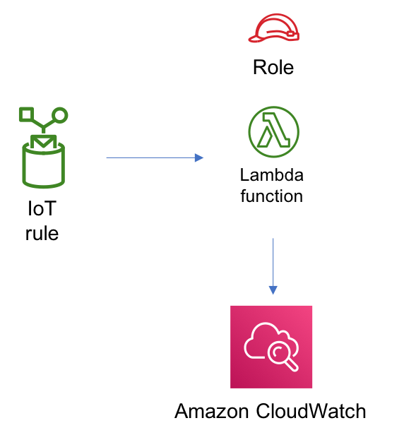

//!!NODE_ROOT <section>
//== aws-iot-lambda module

[.topic]
= aws-iot-lambda
:info_doctype: section
:info_title: aws-iot-lambda

image:https://img.shields.io/badge/cfn--resources-stable-success.svg?style=for-the-badge[Stability:Stable]

[width="100%",cols="<50%,<50%",options="header",]
|===
|*Reference Documentation*:
|https://docs.aws.amazon.com/solutions/latest/constructs/
|===

[width="100%",cols="<46%,54%",options="header",]
|===
|*Language* |*Package*
|image:https://docs.aws.amazon.com/images/solutions/latest/constructs/images/python32.png[Python
Logo] Python |`aws_solutions_constructs.aws_iot_lambda`

|image:https://docs.aws.amazon.com/images/solutions/latest/constructs/images/typescript32.png[Typescript
Logo] Typescript |`@aws-solutions-constructs/aws-iot-lambda`

|image:https://docs.aws.amazon.com/images/solutions/latest/constructs/images/java32.png[Java
Logo] Java |`software.amazon.awsconstructs.services.iotlambda`
|===

== Overview

This AWS Solutions Construct implements an AWS IoT MQTT topic rule and
an AWS Lambda function pattern.

Here is a minimal deployable pattern definition:

====
[role="tablist"]
Typescript::
+
[source,typescript]
----
import { Construct } from 'constructs';
import { Stack, StackProps } from 'aws-cdk-lib';
import { IotToLambdaProps, IotToLambda } from '@aws-solutions-constructs/aws-iot-lambda';
import * as lambda from 'aws-cdk-lib/aws-lambda';

const constructProps: IotToLambdaProps = {
  lambdaFunctionProps: {
    code: lambda.Code.fromAsset(`lambda`),
    runtime: lambda.Runtime.NODEJS_22_X,
    handler: 'index.handler'
  },
  iotTopicRuleProps: {
    topicRulePayload: {
      ruleDisabled: false,
      description: "Processing of DTC messages from the AWS Connected Vehicle Solution.",
      sql: "SELECT * FROM 'connectedcar/dtc/#'",
      actions: []
    }
  }
};

new IotToLambda(this, 'test-iot-lambda-integration', constructProps);
----

Python::
+
[source,python]
----
from aws_solutions_constructs.aws_iot_lambda import IotToLambdaProps, IotToLambda
from aws_cdk import (
    aws_iot as iot,
    aws_lambda as _lambda,
    Stack
)
from constructs import Construct

IotToLambda(self, 'test_iot_lambda',
            lambda_function_props=_lambda.FunctionProps(
                code=_lambda.Code.from_asset('lambda'),
                runtime=_lambda.Runtime.PYTHON_3_11,
                handler='index.handler'
            ),
            iot_topic_rule_props=iot.CfnTopicRuleProps(
                topic_rule_payload=iot.CfnTopicRule.TopicRulePayloadProperty(
                    rule_disabled=False,
                    description="Sends data to kinesis data stream",
                    sql="SELECT * FROM 'solutions/construct'",
                    actions=[]
                )
            ))
----

Java::
+
[source,java]
----
import software.constructs.Construct;
import java.util.List;

import software.amazon.awscdk.Stack;
import software.amazon.awscdk.StackProps;
import software.amazon.awscdk.services.lambda.*;
import software.amazon.awscdk.services.lambda.Runtime;
import software.amazon.awscdk.services.iot.*;
import software.amazon.awscdk.services.iot.CfnTopicRule.TopicRulePayloadProperty;
import software.amazon.awsconstructs.services.iotlambda.*;

new IotToLambda(this, "test-iot-lambda-integration", new IotToLambdaProps.Builder()
        .lambdaFunctionProps(new FunctionProps.Builder()
                .runtime(Runtime.NODEJS_22_X)
                .code(Code.fromAsset("lambda"))
                .handler("index.handler")
                .build())
        .iotTopicRuleProps(new CfnTopicRuleProps.Builder()
                .topicRulePayload(new TopicRulePayloadProperty.Builder()
                        .ruleDisabled(false)
                        .description("Processing of DTC messages from the AWS Connected Vehicle Solution.")
                        .sql("SELECT * FROM 'connectedcar/dtc/#'")
                        .actions(List.of())
                        .build())
                .build())
        .build());
----
====

== Pattern Construct Props

[width="100%",cols="<30%,<35%,35%",options="header",]
|===
|*Name* |*Type* |*Description*
|existingLambdaObj?
|https://docs.aws.amazon.com/cdk/api/v2/docs/aws-cdk-lib.aws_lambda.Function.html[`lambda.Function`]
|Optional - instance of an existing Lambda Function object, providing both this and
`lambdaFunctionProps` will cause an error.

|lambdaFunctionProps?
|https://docs.aws.amazon.com/cdk/api/v2/docs/aws-cdk-lib.aws_lambda.FunctionProps.html[`lambda.FunctionProps`]
|Optional - user provided props to override the default props for the Lambda function. Providing both this and `existingLambdaObj` causes an error.

|iotTopicRuleProps?
|https://docs.aws.amazon.com/cdk/api/v2/docs/aws-cdk-lib.aws_iot.CfnTopicRuleProps.html[`iot.CfnTopicRuleProps`]
|User provided CfnTopicRuleProps to override the defaults
|===

== Pattern Properties

[width="100%",cols="<30%,<35%,35%",options="header",]
|===
|*Name* |*Type* |*Description*
|iotTopicRule
|https://docs.aws.amazon.com/cdk/api/v2/docs/aws-cdk-lib.aws_iot.CfnTopicRule.html[`iot.CfnTopicRule`]
|Returns an instance of iot.CfnTopicRule created by the construct

|lambdaFunction
|https://docs.aws.amazon.com/cdk/api/v2/docs/aws-cdk-lib.aws_lambda.Function.html[`lambda.Function`]
|Returns an instance of lambda.Function created by the construct
|===

== Default settings

Out of the box implementation of the Construct without any override will
set the following defaults:

=== Amazon IoT Rule

* Configure least privilege access IAM role for Amazon IoT

=== AWS Lambda Function

* Configure limited privilege access IAM role for Lambda function
* Enable reusing connections with Keep-Alive for NodeJs Lambda function
* Enable X-Ray Tracing
* Set Environment Variables
** AWS_NODEJS_CONNECTION_REUSE_ENABLED (for Node 10.x
and higher functions)

== Architecture

// github block

'''''

© Copyright Amazon.com, Inc. or its affiliates. All Rights Reserved.
