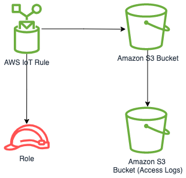

# aws-iot-s3 module
<!--BEGIN STABILITY BANNER-->

---


> All classes are under active development and subject to non-backward compatible changes or removal in any
> future version. These are not subject to the [Semantic Versioning](https://semver.org/) model.
> This means that while you may use them, you may need to update your source code when upgrading to a newer version of this package.

---
<!--END STABILITY BANNER-->

| **Reference Documentation**:| <span style="font-weight: normal">https://docs.aws.amazon.com/solutions/latest/constructs/</span>|
|:-------------|:-------------|
<div style="height:8px"></div>

| **Language**     | **Package**        |
|:-------------|-----------------|
| Python|`aws_solutions_constructs.aws_iot_s3`|
| Typescript|`@aws-solutions-constructs/aws-iot-s3`|
| Java|`software.amazon.awsconstructs.services.iots3`|

This AWS Solutions Construct implements an AWS IoT MQTT topic rule and an Amazon S3 Bucket pattern.

Here is a minimal deployable pattern definition in Typescript:

``` typescript
const { IotToS3Props, IotToS3 } from '@aws-solutions-constructs/aws-iot-s3';

const props: IotToS3Props = {
    iotTopicRuleProps: {
        topicRulePayload: {
            ruleDisabled: false,
            description: "Testing the IotToS3 Pattern",
            sql: "SELECT * FROM 'solutions/constructs'",
            actions: []
        }
    }
};

new IotToS3(this, 'test-iot-s3-integration', props);
```

## Initializer

``` text
new IotToS3(scope: Construct, id: string, props: IotToS3Props);
```

_Parameters_

* scope [`Construct`](https://docs.aws.amazon.com/cdk/api/latest/docs/@aws-cdk_core.Construct.html)
* id `string`
* props [`IotToS3Props`](#pattern-construct-props)

## Pattern Construct Props

| **Name**     | **Type**        | **Description** |
|:-------------|:----------------|-----------------|
|existingBucketObj?|[`s3.IBucket`](https://docs.aws.amazon.com/cdk/api/latest/docs/@aws-cdk_aws-s3.IBucket.html)|Existing instance of S3 Bucket object. Providing this property and `bucketProps` results in an error.|
|bucketProps?|[`s3.BucketProps`](https://docs.aws.amazon.com/cdk/api/latest/docs/@aws-cdk_aws-s3.BucketProps.html)|Optional user provided props to override the default props for the S3 Bucket. Providing this and `existingBucketObj` reults in an error.|
|loggingBucketProps?|[`s3.BucketProps`](https://docs.aws.amazon.com/cdk/api/latest/docs/@aws-cdk_aws-s3.BucketProps.html)|Optional user provided props to override the default props for the S3 Logging Bucket.|
|iotTopicRuleProps?|[`iot.CfnTopicRuleProps`](https://docs.aws.amazon.com/cdk/api/latest/docs/@aws-cdk_aws-iot.CfnTopicRuleProps.html)|User provided CfnTopicRuleProps to override the defaults.|
|s3Key|`string`|User provided s3Key to override the default (`${topic()}/${timestamp()}`) object key. Used to store messages matched by the IoT Rule.|

## Pattern Properties

| **Name**     | **Type**        | **Description** |
|:-------------|:----------------|-----------------|
|s3Bucket|[`s3.Bucket`](https://docs.aws.amazon.com/cdk/api/latest/docs/@aws-cdk_aws-s3.Bucket.html)|Returns an instance of the S3 bucket created by the pattern.|
|s3LoggingBucket?|[`s3.Bucket`](https://docs.aws.amazon.com/cdk/api/latest/docs/@aws-cdk_aws-s3.Bucket.html)|Returns an instance of `s3.Bucket` created by the construct as the logging bucket for the primary bucket.|
|iotActionsRole|[`iam.Role`](https://docs.aws.amazon.com/cdk/api/latest/docs/@aws-cdk_aws-iam.Role.html)|Returns an instance of `iam.Role` created by the construct, which allows IoT to publish messages to the S3 bucket.|
|iotTopicRule|[`iot.CfnTopicRule`](https://docs.aws.amazon.com/cdk/api/latest/docs/@aws-cdk_aws-iot.CfnTopicRule.html)|Returns an instance of `iot.CfnTopicRule` created by the construct|

## Default settings

Out of the box implementation of the Construct without any override will set the following defaults:

### Amazon IoT Rule

* Configure an IoT Rule to send messages to the S3 Bucket

### Amazon IAM Role

* Configure least privilege access IAM role for Amazon IoT to be able to publish messages to the S3 Bucket

### Amazon S3 Bucket

* Configure Access logging for S3 Bucket
* Enable server-side encryption for S3 Bucket using AWS managed KMS Key
* Enforce encryption of data in transit
* Turn on the versioning for S3 Bucket
* Don't allow public access for S3 Bucket
* Retain the S3 Bucket when deleting the CloudFormation stack
* Applies Lifecycle rule to move noncurrent object versions to Glacier storage after 90 days

## Architecture



---
&copy; Copyright 2021 Amazon.com, Inc. or its affiliates. All Rights Reserved.
