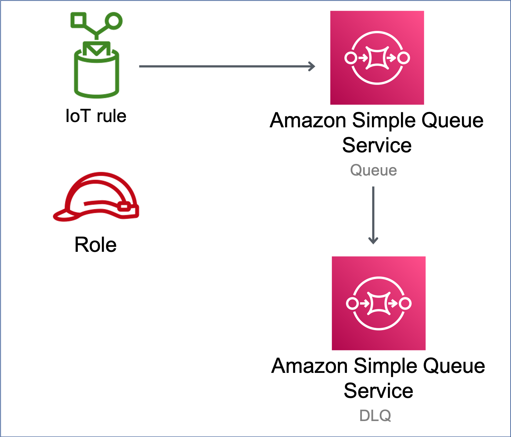

//!!NODE_ROOT <section>
//== aws-iot-sqs module

[.topic]
= aws-iot-sqs
:info_doctype: section
:info_title: aws-iot-sqs

image:https://img.shields.io/badge/cfn--resources-stable-success.svg?style=for-the-badge[Stability:Stable]

[width="100%",cols="<50%,<50%",options="header",]
|===
|*Reference Documentation*:
|https://docs.aws.amazon.com/solutions/latest/constructs/
|===

[width="100%",cols="<46%,54%",options="header",]
|===
|*Language* |*Package*
|image:https://docs.aws.amazon.com/cdk/api/img/python32.png[Python
Logo] Python |`aws_solutions_constructs.aws_iot_sqs`

|image:https://docs.aws.amazon.com/cdk/api/img/typescript32.png[Typescript
Logo] Typescript |`@aws-solutions-constructs/aws-iot-sqs`

|image:https://docs.aws.amazon.com/cdk/api/img/java32.png[Java
Logo] Java |`software.amazon.awsconstructs.services.iotsqs`
|===

== Overview

This AWS Solutions Construct implements an AWS IoT MQTT topic rule and
an AWS SQS Queue pattern.

Here is a minimal deployable pattern definition:

====
[role="tablist"]
Typescript::
+
[source,typescript]
----
import { Construct } from 'constructs';
import { Stack, StackProps } from 'aws-cdk-lib';
import { IotToSqsProps, IotToSqs } from '@aws-solutions-constructs/aws-iot-sqs';

const constructProps: IotToSqsProps = {
  iotTopicRuleProps: {
    topicRulePayload: {
      ruleDisabled: false,
      description: "Testing the IotToSqs Pattern",
      sql: "SELECT * FROM 'iot/sqs/#'",
      actions: []
    }
  }
};

new IotToSqs(this, 'test-iot-sqs-integration', constructProps);
----

Python::
+
[source,python]
----
from aws_solutions_constructs.aws_iot_sqs import IotToSqs
from aws_cdk import (
    aws_iot as iot,
    Stack
)
from constructs import Construct

IotToSqs(self, 'test_iot_sqs',
    iot_topic_rule_props=iot.CfnTopicRuleProps(
        topic_rule_payload=iot.CfnTopicRule.TopicRulePayloadProperty(
            rule_disabled=False,
            description="Testing the IotToSqs Pattern",
            sql="SELECT * FROM 'iot/sqs/#'",
            actions=[]
        )
    ))
----

Java::
+
[source,java]
----
import software.constructs.Construct;
import java.util.List;

import software.amazon.awscdk.Stack;
import software.amazon.awscdk.StackProps;
import software.amazon.awscdk.services.iot.*;
import software.amazon.awscdk.services.iot.CfnTopicRule.TopicRulePayloadProperty;
import software.amazon.awsconstructs.services.iotsqs.*;

new IotToSqs(this, "test_iot_sqs", new IotToSqsProps.Builder()
        .iotTopicRuleProps(new CfnTopicRuleProps.Builder()
                .topicRulePayload(new TopicRulePayloadProperty.Builder()
                        .ruleDisabled(false)
                        .description("Testing the IotToSqs Pattern")
                        .sql("SELECT * FROM 'iot/sqs/#'")
                        .actions(List.of())
                        .build())
                .build())
        .build());
----
====

== Pattern Construct Props

[width="100%",cols="<30%,<35%,35%",options="header",]
|===
|*Name* |*Type* |*Description*
|iotTopicRuleProps
|https://docs.aws.amazon.com/cdk/api/v2/docs/aws-cdk-lib.aws_iot.CfnTopicRuleProps.html[`iot.CfnTopicRuleProps`]
|User provided CfnTopicRuleProps to override the defaults

|existingQueueObj?
|https://docs.aws.amazon.com/cdk/api/v2/docs/aws-cdk-lib.aws_sqs.Queue.html[`sqs.Queue`]
|Existing instance of SQS queue object, providing both this and
`queueProps` will cause an error.

|queueProps?
|https://docs.aws.amazon.com/cdk/api/v2/docs/aws-cdk-lib.aws_sqs.QueueProps.html[`sqs.QueueProps`]
|Optional - user provided properties to override the default properties for the SQS queue. Providing both this and `existingQueueObj` will cause an error.

|deadLetterQueueProps?
|https://docs.aws.amazon.com/cdk/api/v2/docs/aws-cdk-lib.aws_sqs.QueueProps.html[`sqs.QueueProps`]
|Optional user provided properties for the dead letter queue.

|deployDeadLetterQueue? |`boolean` |Whether to deploy a secondary queue
to be used as a dead letter queue. Default `true`.

|maxReceiveCount? |`number` |The number of times a message can be
unsuccessfully dequeued before being moved to the dead-letter queue.
Required field if `deployDeadLetterQueue`=`true`.

|enableEncryptionWithCustomerManagedKey? |`boolean` |If no key is
provided, this flag determines whether the queue is encrypted with a new
CMK or an AWS managed key. This flag is ignored if any of the following
are defined: queueProps.encryptionMasterKey, encryptionKey or
encryptionKeyProps.

|encryptionKey?
|https://docs.aws.amazon.com/cdk/api/v2/docs/aws-cdk-lib.aws_kms.Key.html[`kms.Key`]
|An optional, imported encryption key to encrypt the SQS Queue with.

|encryptionKeyProps?
|https://docs.aws.amazon.com/cdk/api/v2/docs/aws-cdk-lib.aws_kms.Key.html#construct-props[`kms.KeyProps`]
|Optional user provided properties to override the default properties
for the KMS encryption key used to encrypt the SQS queue with.
|===

== Pattern Properties

[width="100%",cols="<30%,<35%,35%",options="header",]
|===
|*Name* |*Type* |*Description*
|encryptionKey?
|https://docs.aws.amazon.com/cdk/api/v2/docs/aws-cdk-lib.aws_kms.Key.html[`kms.Key`]
|Returns an instance of `kms.Key` used for the SQS queue.

|iotActionsRole
|https://docs.aws.amazon.com/cdk/api/v2/docs/aws-cdk-lib.aws_iam.Role.html[`iam.Role`]
|Returns an instance of `iam.Role` created by the construct, which
allows IoT to publish messages to the SQS Queue

|sqsQueue
|https://docs.aws.amazon.com/cdk/api/v2/docs/aws-cdk-lib.aws_sqs.Queue.html[`sqs.Queue`]
|Returns an instance of `sqs.Queue` created by the construct

|deadLetterQueue?
|https://docs.aws.amazon.com/cdk/api/v2/docs/aws-cdk-lib.aws_sqs.Queue.html[`sqs.Queue`]
|Returns an instance of the dead-letter SQS queue created by the
pattern.

|iotTopicRule
|https://docs.aws.amazon.com/cdk/api/v2/docs/aws-cdk-lib.aws_iot.CfnTopicRule.html[`iot.CfnTopicRule`]
|Returns an instance of `iot.CfnTopicRule` created by the construct
|===

== Default settings

Out of the box implementation of the Construct without any override will
set the following defaults:

=== Amazon IoT Rule

* Configure an IoT Rule to send messages to the SQS Queue

=== Amazon IAM Role

* Configure least privilege access IAM role for Amazon IoT to be able to
publish messages to the SQS Queue

=== Amazon SQS Queue

* Deploy a dead-letter queue for the source queue.
* Enable server-side encryption for the source queue using a
customer-managed AWS KMS key.
* Enforce encryption of data in transit.

== Architecture

// github block

'''''

© Copyright Amazon.com, Inc. or its affiliates. All Rights Reserved.
