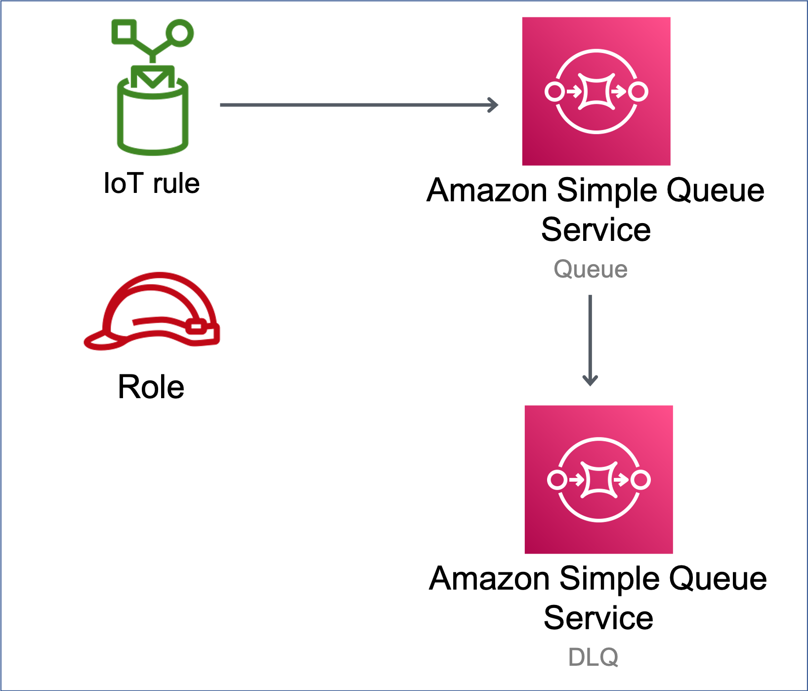

# aws-iot-sqs module
<!--BEGIN STABILITY BANNER-->

---


> All classes are under active development and subject to non-backward compatible changes or removal in any
> future version. These are not subject to the [Semantic Versioning](https://semver.org/) model.
> This means that while you may use them, you may need to update your source code when upgrading to a newer version of this package.

---
<!--END STABILITY BANNER-->

| **Reference Documentation**:| <span style="font-weight: normal">https://docs.aws.amazon.com/solutions/latest/constructs/</span>|
|:-------------|:-------------|
<div style="height:8px"></div>

| **Language**     | **Package**        |
|:-------------|-----------------|
| Python|`aws_solutions_constructs.aws_iot_sqs`|
| Typescript|`@aws-solutions-constructs/aws-iot-sqs`|
| Java|`software.amazon.awsconstructs.services.iotsqs`|

## Overview
This AWS Solutions Construct implements an AWS IoT MQTT topic rule and an AWS SQS Queue pattern.

Here is a minimal deployable pattern definition:

Typescript
``` typescript
import { Construct } from 'constructs';
import { Stack, StackProps } from 'aws-cdk-lib';
import { IotToSqsProps, IotToSqs } from '@aws-solutions-constructs/aws-iot-sqs';

const constructProps: IotToSqsProps = {
  iotTopicRuleProps: {
    topicRulePayload: {
      ruleDisabled: false,
      description: "Testing the IotToSqs Pattern",
      sql: "SELECT * FROM 'iot/sqs/#'",
      actions: []
    }
  }
};

new IotToSqs(this, 'test-iot-sqs-integration', constructProps);
```

Python
``` python
from aws_solutions_constructs.aws_iot_sqs import IotToSqs
from aws_cdk import (
    aws_iot as iot,
    Stack
)
from constructs import Construct

IotToSqs(self, 'test_iot_sqs',
    iot_topic_rule_props=iot.CfnTopicRuleProps(
        topic_rule_payload=iot.CfnTopicRule.TopicRulePayloadProperty(
            rule_disabled=False,
            description="Testing the IotToSqs Pattern",
            sql="SELECT * FROM 'iot/sqs/#'",
            actions=[]
        )
    ))
```

Java
``` java
import software.constructs.Construct;
import java.util.List;

import software.amazon.awscdk.Stack;
import software.amazon.awscdk.StackProps;
import software.amazon.awscdk.services.iot.*;
import software.amazon.awscdk.services.iot.CfnTopicRule.TopicRulePayloadProperty;
import software.amazon.awsconstructs.services.iotsqs.*;

new IotToSqs(this, "test_iot_sqs", new IotToSqsProps.Builder()
        .iotTopicRuleProps(new CfnTopicRuleProps.Builder()
                .topicRulePayload(new TopicRulePayloadProperty.Builder()
                        .ruleDisabled(false)
                        .description("Testing the IotToSqs Pattern")
                        .sql("SELECT * FROM 'iot/sqs/#'")
                        .actions(List.of())
                        .build())
                .build())
        .build());
```

## Pattern Construct Props

| **Name**     | **Type**        | **Description** |
|:-------------|:----------------|-----------------|
|iotTopicRuleProps|[`iot.CfnTopicRuleProps`](https://docs.aws.amazon.com/cdk/api/v2/docs/aws-cdk-lib.aws_iot.CfnTopicRuleProps.html)|User provided CfnTopicRuleProps to override the defaults|
|existingQueueObj?|[`sqs.Queue`](https://docs.aws.amazon.com/cdk/api/v2/docs/aws-cdk-lib.aws_sqs.Queue.html)|Existing instance of SQS queue object, providing both this and `queueProps` will cause an error.|
|queueProps?|[`sqs.QueueProps`](https://docs.aws.amazon.com/cdk/api/v2/docs/aws-cdk-lib.aws_sqs.QueueProps.html)|User provided props to override the default props for the SQS queue.|
|deadLetterQueueProps?|[`sqs.QueueProps`](https://docs.aws.amazon.com/cdk/api/v2/docs/aws-cdk-lib.aws_sqs.QueueProps.html)|Optional user provided properties for the dead letter queue.|
|deployDeadLetterQueue?|`boolean`|Whether to deploy a secondary queue to be used as a dead letter queue. Default `true`.|
|maxReceiveCount?|`number`|The number of times a message can be unsuccessfully dequeued before being moved to the dead-letter queue. Required field if `deployDeadLetterQueue`=`true`.|
|enableEncryptionWithCustomerManagedKey?|`boolean`|If no key is provided, this flag determines whether the queue is encrypted with a new CMK or an AWS managed key. This flag is ignored if any of the following are defined: queueProps.encryptionMasterKey, encryptionKey or encryptionKeyProps.|
|encryptionKey?|[`kms.Key`](https://docs.aws.amazon.com/cdk/api/v2/docs/aws-cdk-lib.aws_kms.Key.html)|An optional, imported encryption key to encrypt the SQS Queue with.|
|encryptionKeyProps?|[`kms.KeyProps`](https://docs.aws.amazon.com/cdk/api/v2/docs/aws-cdk-lib.aws_kms.Key.html#construct-props)|Optional user provided properties to override the default properties for the KMS encryption key used to encrypt the SQS queue with.|


## Pattern Properties

| **Name**     | **Type**        | **Description** |
|:-------------|:----------------|-----------------|
|encryptionKey?|[`kms.Key`](https://docs.aws.amazon.com/cdk/api/v2/docs/aws-cdk-lib.aws_kms.Key.html)|Returns an instance of `kms.Key` used for the SQS queue.|
|iotActionsRole|[`iam.Role`](https://docs.aws.amazon.com/cdk/api/v2/docs/aws-cdk-lib.aws_iam.Role.html)|Returns an instance of `iam.Role` created by the construct, which allows IoT to publish messages to the SQS Queue|
|sqsQueue|[`sqs.Queue`](https://docs.aws.amazon.com/cdk/api/v2/docs/aws-cdk-lib.aws_sqs.Queue.html)|Returns an instance of `sqs.Queue` created by the construct|
|deadLetterQueue?|[`sqs.Queue`](https://docs.aws.amazon.com/cdk/api/v2/docs/aws-cdk-lib.aws_sqs.Queue.html)|Returns an instance of the dead-letter SQS queue created by the pattern.|
|iotTopicRule|[`iot.CfnTopicRule`](https://docs.aws.amazon.com/cdk/api/v2/docs/aws-cdk-lib.aws_iot.CfnTopicRule.html)|Returns an instance of `iot.CfnTopicRule` created by the construct|

## Default settings

Out of the box implementation of the Construct without any override will set the following defaults:

### Amazon IoT Rule
* Configure an IoT Rule to send messages to the SQS Queue

### Amazon IAM Role
* Configure least privilege access IAM role for Amazon IoT to be able to publish messages to the SQS Queue

### Amazon SQS Queue
* Deploy a dead-letter queue for the source queue.
* Enable server-side encryption for the source queue using a customer-managed AWS KMS key.
* Enforce encryption of data in transit.

## Architecture


***
&copy; Copyright Amazon.com, Inc. or its affiliates. All Rights Reserved.