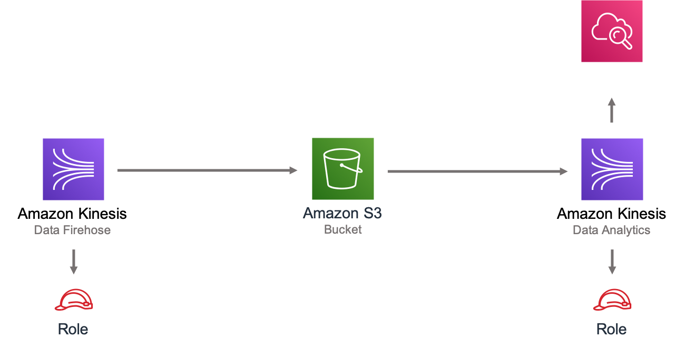

# aws-kinesisfirehose-s3-and-kinesisanalytics module
<!--BEGIN STABILITY BANNER-->

---


> All classes are under active development and subject to non-backward compatible changes or removal in any
> future version. These are not subject to the [Semantic Versioning](https://semver.org/) model.
> This means that while you may use them, you may need to update your source code when upgrading to a newer version of this package.

---
<!--END STABILITY BANNER-->

| **Reference Documentation**:| <span style="font-weight: normal">https://docs.aws.amazon.com/solutions/latest/constructs/</span>|
|:-------------|:-------------|
<div style="height:8px"></div>

| **Language**     | **Package**        |
|:-------------|-----------------|
| Python|`aws_solutions_constructs.aws_kinesisfirehose_s3_and_kinesisanalytics`|
| Typescript|`@aws-solutions-constructs/aws-kinesisfirehose-s3-and-kinesisanalytics`|
| Java|`software.amazon.awsconstructs.services.kinesisfirehoses3kinesisanalytics`|

This AWS Solutions Construct implements an Amazon Kinesis Firehose delivery stream connected to an Amazon S3 bucket, and an Amazon Kinesis Analytics application.

Here is a minimal deployable pattern definition in Typescript:

``` javascript
const { KinesisFirehoseToAnalyticsAndS3 } from '@aws-solutions-constructs/aws-kinesisfirehose-s3-and-kinesisanalytics';

new KinesisFirehoseToAnalyticsAndS3(this, 'FirehoseToS3AndAnalyticsPattern', {
    kinesisAnalyticsProps: {
        inputs: [{
            inputSchema: {
                recordColumns: [{
                    name: 'ticker_symbol',
                    sqlType: 'VARCHAR(4)',
                    mapping: '$.ticker_symbol'
                }, {
                    name: 'sector',
                    sqlType: 'VARCHAR(16)',
                    mapping: '$.sector'
                }, {
                    name: 'change',
                    sqlType: 'REAL',
                    mapping: '$.change'
                }, {
                    name: 'price',
                    sqlType: 'REAL',
                    mapping: '$.price'
                }],
                recordFormat: {
                    recordFormatType: 'JSON'
                },
                recordEncoding: 'UTF-8'
            },
            namePrefix: 'SOURCE_SQL_STREAM'
        }]
    }
});

```

## Initializer

``` text
new KinesisFirehoseToAnalyticsAndS3(scope: Construct, id: string, props: KinesisFirehoseToAnalyticsAndS3Props);
```

_Parameters_

* scope [`Construct`](https://docs.aws.amazon.com/cdk/api/latest/docs/@aws-cdk_core.Construct.html)
* id `string`
* props [`KinesisFirehoseToAnalyticsAndS3Props`](#pattern-construct-props)

## Pattern Construct Props

| **Name**     | **Type**        | **Description** |
|:-------------|:----------------|-----------------|
|kinesisFirehoseProps?|[`kinesisFirehose.CfnDeliveryStreamProps`](https://docs.aws.amazon.com/cdk/api/latest/docs/@aws-cdk_aws-kinesisfirehose.CfnDeliveryStreamProps.html)|Optional user-provided props to override the default props for the Kinesis Firehose delivery stream.|
|kinesisAnalyticsProps?|[`kinesisAnalytics.CfnApplicationProps`](https://docs.aws.amazon.com/cdk/api/latest/docs/@aws-cdk_aws-kinesisanalytics.CfnApplicationProps.html)|Optional user-provided props to override the default props for the Kinesis Analytics application.|
|existingBucketObj?|[`s3.IBucket`](https://docs.aws.amazon.com/cdk/api/latest/docs/@aws-cdk_aws-s3.IBucket.html)|Existing instance of S3 Bucket object. If this is provided, then also providing bucketProps is an error. |
|bucketProps?|[`s3.BucketProps`](https://docs.aws.amazon.com/cdk/api/latest/docs/@aws-cdk_aws-s3.BucketProps.html)|User provided props to override the default props for the S3 Bucket.|
|logGroupProps?|[`logs.LogGroupProps`](https://docs.aws.amazon.com/cdk/api/latest/docs/@aws-cdk_aws-logs.LogGroupProps.html)|User provided props to override the default props for for the CloudWatchLogs LogGroup.|
|loggingBucketProps?|[`s3.BucketProps`](https://docs.aws.amazon.com/cdk/api/latest/docs/@aws-cdk_aws-s3.BucketProps.html)|Optional user provided props to override the default props for the S3 Logging Bucket.|
|logS3AccessLogs?| boolean|Whether to turn on Access Logging for the S3 bucket. Creates an S3 bucket with associated storage costs for the logs. Enabling Access Logging is a best practice. default - true|

## Pattern Properties

| **Name**     | **Type**        | **Description** |
|:-------------|:----------------|-----------------|
|kinesisAnalytics|[`kinesisAnalytics.CfnApplication`](https://docs.aws.amazon.com/cdk/api/latest/docs/@aws-cdk_aws-kinesisanalytics.CfnApplication.html)|Returns an instance of the Kinesis Analytics application created by the pattern.|
|kinesisFirehose|[`kinesisFirehose.CfnDeliveryStream`](https://docs.aws.amazon.com/cdk/api/latest/docs/@aws-cdk_aws-kinesisfirehose.CfnDeliveryStream.html)|Returns an instance of the Kinesis Firehose delivery stream created by the pattern.|
|kinesisFirehoseRole|[`iam.Role`](https://docs.aws.amazon.com/cdk/api/latest/docs/@aws-cdk_aws-iam.Role.html)|Returns an instance of the iam.Role created by the construct for Kinesis Data Firehose delivery stream.|
|kinesisFirehoseLogGroup|[`logs.LogGroup`](https://docs.aws.amazon.com/cdk/api/latest/docs/@aws-cdk_aws-logs.LogGroup.html)|Returns an instance of the LogGroup created by the construct for Kinesis Data Firehose delivery stream|
|s3Bucket?|[`s3.Bucket`](https://docs.aws.amazon.com/cdk/api/latest/docs/@aws-cdk_aws-s3.Bucket.html)|Returns an instance of the S3 bucket created by the pattern.|
|s3LoggingBucket?|[`s3.Bucket`](https://docs.aws.amazon.com/cdk/api/latest/docs/@aws-cdk_aws-s3.Bucket.html)|Returns an instance of s3.Bucket created by the construct as the logging bucket for the primary bucket.|
|s3BucketInterface|[`s3.IBucket`](https://docs.aws.amazon.com/cdk/api/latest/docs/@aws-cdk_aws-s3.IBucket.html)|Returns an instance of s3.IBucket created by the construct.|

## Default settings

Out of the box implementation of the Construct without any override will set the following defaults:

### Amazon Kinesis Firehose
* Enable CloudWatch logging for Kinesis Firehose
* Configure least privilege access IAM role for Amazon Kinesis Firehose

### Amazon S3 Bucket
* Configure Access logging for S3 Bucket
* Enable server-side encryption for S3 Bucket using AWS managed KMS Key
* Enforce encryption of data in transit
* Turn on the versioning for S3 Bucket
* Don't allow public access for S3 Bucket
* Retain the S3 Bucket when deleting the CloudFormation stack
* Applies Lifecycle rule to move noncurrent object versions to Glacier storage after 90 days

### Amazon Kinesis Data Analytics
* Configure least privilege access IAM role for Amazon Kinesis Analytics

## Architecture


***
&copy; Copyright 2021 Amazon.com, Inc. or its affiliates. All Rights Reserved.