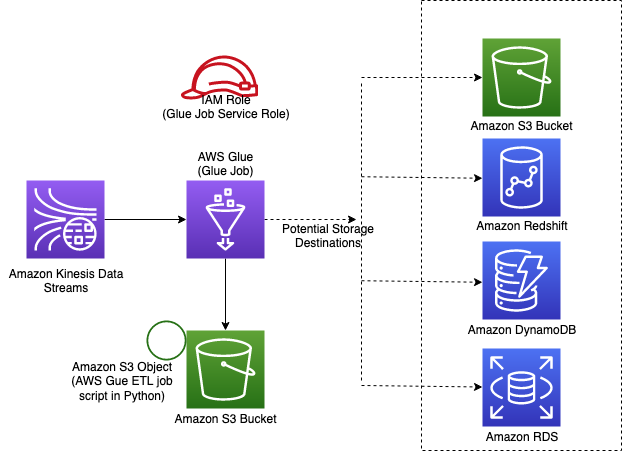

# aws-kinesisstreams-gluejob module

<!--BEGIN STABILITY BANNER-->

---


> All classes are under active development and subject to non-backward compatible changes or removal in any
> future version. These are not subject to the [Semantic Versioning](https://semver.org/) model.
> This means that while you may use them, you may need to update your source code when upgrading to a newer version of this package.

---

<!--END STABILITY BANNER-->

| **Reference Documentation**: | <span style="font-weight: normal">https://docs.aws.amazon.com/solutions/latest/constructs/</span> |
| :--------------------------- | :------------------------------------------------------------------------------------------------ |

<div style="height:8px"></div>

| **Language**                                                                                   | **Package**                                                   |
| :--------------------------------------------------------------------------------------------- | ------------------------------------------------------------- |
|  Python             | `aws_solutions_constructs.aws_kinesis_streams_gluejob`        |
|  Typescript | `@aws-solutions-constructs/aws-kinesisstreams-gluejob`        |
|  Java                   | `software.amazon.awsconstructs.services.kinesisstreamgluejob` |

This AWS Solutions Construct deploys a Kinesis Stream and configures a AWS Glue Job to perform custom ETL transformation with the appropriate resources/properties for interaction and security. It also creates an S3 bucket where the python script for the AWS Glue Job can be uploaded

Here is a minimal deployable pattern definition in Typescript:

```javascript
const _outputBucket = defaults.buildS3Bucket(this, {
    bucketProps: defaults.DefaultS3Props(),
});

const _fieldSchema: CfnTable.ColumnProperty [] = [{
            name: 'id',
            type: 'int',
            comment: '',
        },
        {
            name: 'name',
            type: 'string',
            comment: '',
        },
        {
            name: 'address',
            type: 'string',
            comment: '',
        },
        {
            name: 'value',
            type: 'int',
            comment: '',
        },
    ]
);

const _customEtlJob = new KinesisStreamGlueJob(this, 'CustomETL', {
    glueJobCommandProps: {
        jobCommandName: 'gluestreaming',
        pythonVersion: '3',
        scriptPath: `${__dirname}/../etl/transform.py`,
    },
    fieldSchema: _fieldSchema,
    argumentList: {
        '--job-bookmark-option': 'job-bookmark-enable',
        '--output_path': `s3://${_outputBucket[0].bucketName}/output/`,
    },
});

_outputBucket[0].grantReadWrite(Role.fromRoleArn(this, 'GlueJobRole',  _customEtlJob.glueJob.role));

```

## Initializer

```text
new KinesisStreamGlueJob(scope: Construct, id: string, props: KinesisStreamsToLambdaProps);
```

_Parameters_

-   scope [`Construct`](https://docs.aws.amazon.com/cdk/api/latest/docs/@aws-cdk_core.Construct.html)
-   id `string`
-   props [`KinesisStreamGlueJobProps`](#pattern-construct-props)

## Pattern Construct Props

| **Name**             | **Type**                                                                                                                    | **Description**                                                                                                                                                                                                                                                                                                                                     |
| :------------------- | :-------------------------------------------------------------------------------------------------------------------------- | --------------------------------------------------------------------------------------------------------------------------------------------------------------------------------------------------------------------------------------------------------------------------------------------------------------------------------------------------- |
| kinesisStreamProps?  | [`kinesis.StreamProps`](https://docs.aws.amazon.com/cdk/api/latest/docs/@aws-cdk_aws-kinesis.StreamProps.html)              | Optional user-provided props to override the default props for the Kinesis stream.                                                                                                                                                                                                                                                                  |
| existingStreamObj?   | [`kinesis.Stream`](https://docs.aws.amazon.com/cdk/api/latest/docs/@aws-cdk_aws-kinesis.Stream.html)                        | Existing instance of Kinesis Stream, if this is set then kinesisStreamProps is ignored.                                                                                                                                                                                                                                                             |
| glueJobProps?        | [`cfnJob.CfnJobProps`](https://docs.aws.amazon.com/cdk/api/latest/docs/@aws-cdk_aws-glue.CfnJobProps.html)                  | User provided props to override the default props for the CfnJob.                                                                                                                                                                                                                                                                                   |
| existingGlueJob?     | [`cfnJob.CfnJob`](https://docs.aws.amazon.com/cdk/api/latest/docs/@aws-cdk_aws-glue.CfnJob.html)                            | Existing CfnJob configuration, if this this set then glueJobProps is ignored.                                                                                                                                                                                                                                                                       |
| existingGlueJob?     | [`cfnJob.CfnJob`](https://docs.aws.amazon.com/cdk/api/latest/docs/@aws-cdk_aws-glue.CfnJob.html)                            | Existing CfnJob configuration, if this this set then glueJobProps is ignored.                                                                                                                                                                                                                                                                       |
| glueJobCommandProps? | [`GlueJobCommandProps`](#gluejobcommandprops)                                                                               | @default - using this props the construct will create a default CfnGlueJobProps. This property will be ignored                                                                                                                                                                                                                                      |
| fieldSchema?         | [`CfnTable.ColumnProperty`](https://docs.aws.amazon.com/cdk/api/latest/docs/@aws-cdk_aws-glue.CfnTable.ColumnProperty.html) | Glue Database for this construct. If not provided the construct will create a new Glue Database. The database is where the schema for the data in Kinesis Data Streams is stored                                                                                                                                                                    |
| database?            | [`CfnDatabase`](https://docs.aws.amazon.com/cdk/api/latest/docs/@aws-cdk_aws-glue.CfnDatabase.html)                         | Glue Database for this construct. If not provided the construct will create a new Glue Database. The database is where the schema for the data in Kinesis Data Streams is stored                                                                                                                                                                    |
| table?               | [`CfnTable`](https://docs.aws.amazon.com/cdk/api/latest/docs/@aws-cdk_aws-glue.CfnTable.html)                               | Glue Table for this construct, If not provided the construct will create a new Table in the database. This table should define the schema for the records in the Kinesis Data Streams. Either @table or @fieldSchema is mandatory. If @table is provided then @fieldSchema is ignored                                                               |
| jobArgumentsList     | `{}`                                                                                                                        | List of arguments that can be passed to a CfnJob. This arguments will be augmented with the default                                                                                                                                                                                                                                                 |
| glueVersion          | [`string`](https://docs.aws.amazon.com/cdk/api/latest/docs/@aws-cdk_aws-glue.CfnJob.html)                                   | Glue version as supported by the AWS Glue service. The value defaults to 1.0 in the construct, since glue streaming is not supported by version 2.0 and 1.0 is the only version that supports python 3.0. This property will only be used if @glueJobCommandProps is set. This property will be ingored if @glueJobProps or @existingGlueJob is set |

## GlueJobCommandProps

| **Name**              | **Type** | **Description**                                                                                                                                                                                                 |
| :-------------------- | :------- | --------------------------------------------------------------------------------------------------------------------------------------------------------------------------------------------------------------- |
| jobCommandName        | `string` | The command to execute the Glue Job, The name of the job command. For an Apache Spark ETL job, this must be glueetl. For a Python shell job, it must be pythonshell. For streaming job it must be gluestreaming |
| pythonVersion         | `string` | The Python version being used to execute a Python shell job. Allowed values are 2 or 3.                                                                                                                         |
| scriptPath?           | `string` | The location of the ETL script in your locat directory. If the @s3ObjectUrlForScript parameter is provided, this parmaeter is ignored                                                                           |
| s3ObjectUrlForScript? | `string` | The S3 URL for the ETL script. If this parameter is provided, the @scriptPath parameter is ignored.                                                                                                             |

# Default settings

Out of the box implementation of the Construct without any override will set the following defaults:

### Amazon Kinesis Stream

-   Configure least privilege access IAM role for Kinesis Stream
-   Enable server-side encryption for Kinesis Stream using AWS Managed KMS Key
-   Deploy best practices CloudWatch Alarms for the Kinesis Stream

### AWS Glue Job

-   Create a Glue Security Config that configures encryption for CloudWatch, Job Bookmarks, and S3. CloudWatch and Job Bookmarks are encrypted using AWS Managed KMS Key created for AWS Glue Service. The S3 bucket is configured with SSE-S3 encryption mode
-   Configure service role policies that allow AWS Glue to read from Kinesis Data Streams

### S3 Bucket

-   It creates an AWS S3 Bucket to which the custom ETL Job script can be uploaded
-   Grants read access to AWS Glue Job Service Principal through S3 Bucket Policy

### Glue Database

-   A Glue database to add the table required to define the schema for the Kinesis stream

### Glue Table

-   A Table with storage descriptor and table input properties using the schema details provided for the records in the Kinesis Data Streams

## Architecture



## Reference Implementation

A sample use case which uses this pattern is available under [`use_cases/aws-custom-glue-etl`](https://github.com/awslabs/aws-solutions-constructs/tree/master/source/use_cases/aws-custom-glue-etl).

&copy; Copyright 2020 Amazon.com, Inc. or its affiliates. All Rights Reserved.
