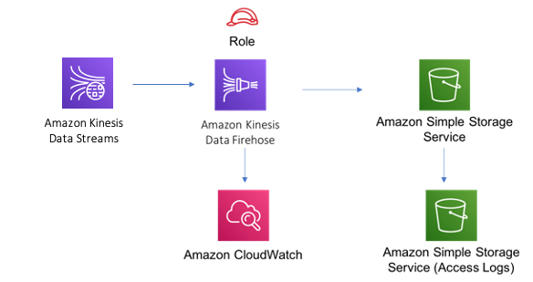

# aws-kinesisstreams-kinesisfirehose-s3 module
<!--BEGIN STABILITY BANNER-->

---


---
<!--END STABILITY BANNER-->

| **Reference Documentation**:| <span style="font-weight: normal">https://docs.aws.amazon.com/solutions/latest/constructs/</span>|
|:-------------|:-------------|
<div style="height:8px"></div>

| **Language**     | **Package**        |
|:-------------|-----------------|
| Python|`aws_solutions_constructs.aws_kinesisstreams_kinesisfirehose_s3`|
| Typescript|`@aws-solutions-constructs/aws-kinesis-streams-kinesis-firehose-s3`|
| Java|`software.amazon.awsconstructs.services.kinesisstreamskinesisfirehoses3`|

This AWS Solutions Construct implements an Amazon Kinesis Data Stream (KDS) connected to Amazon Kinesis Data Firehose (KDF) delivery stream connected to an Amazon S3 bucket.

Here is a minimal deployable pattern definition in Typescript:

``` javascript
import { KinesisStreamsToKinesisFirehoseToS3 } from '@aws-solutions-constructs/aws-kinesisstreams-kinesisfirehose-s3';

new KinesisStreamsToKinesisFirehoseToS3(this, 'test-stream-firehose-s3', {});

```

## Initializer

``` text
new KinesisStreamsToKinesisFirehoseToS3(scope: Construct, id: string, props: KinesisStreamsToKinesisFirehoseToS3Props);
```

_Parameters_

* scope [`Construct`](https://docs.aws.amazon.com/cdk/api/latest/docs/@aws-cdk_core.Construct.html)
* id `string`
* props [`KinesisStreamsToKinesisFirehoseToS3Props`](#pattern-construct-props)

## Pattern Construct Props

| **Name**     | **Type**        | **Description** |
|:-------------|:----------------|-----------------|
|bucketProps?|[`s3.BucketProps`](https://docs.aws.amazon.com/cdk/api/latest/docs/@aws-cdk_aws-s3.BucketProps.html)|Optional user provided props to override the default props for the S3 Bucket.|
|createCloudWatchAlarms?|`boolean`|Optional whether to create recommended CloudWatch alarms.|
|existingBucketObj?|[`s3.IBucket`](https://docs.aws.amazon.com/cdk/api/latest/docs/@aws-cdk_aws-s3.IBucket.html)|Optional existing instance of S3 Bucket object. If this is provided, then also providing bucketProps is an error. |
|existingLoggingBucketObj?|[`s3.IBucket`](https://docs.aws.amazon.com/cdk/api/latest/docs/@aws-cdk_aws-s3.IBucket.html)|Optional existing instance of logging S3 Bucket object for the S3 Bucket created by the pattern.|
|existingStreamObj?|[`kinesis.Stream`](https://docs.aws.amazon.com/cdk/api/latest/docs/@aws-cdk_aws-kinesis.Stream.html)|Optional existing instance of Kinesis Stream, providing both this and `kinesisStreamProps` will cause an error.|
|kinesisFirehoseProps?|[`kinesisfirehose.CfnDeliveryStreamProps`](https://docs.aws.amazon.com/cdk/api/latest/docs/@aws-cdk_aws-kinesisfirehose.CfnDeliveryStreamProps.html)\|`any`|Optional user provided props to override the default props for Kinesis Firehose Delivery Stream.|
|kinesisStreamProps?|[`kinesis.StreamProps`](https://docs.aws.amazon.com/cdk/api/latest/docs/@aws-cdk_aws-kinesis.StreamProps.html)|Optional user-provided props to override the default props for the Kinesis stream.|
|logGroupProps?|[`logs.LogGroupProps`](https://docs.aws.amazon.com/cdk/api/latest/docs/@aws-cdk_aws-logs.LogGroupProps.html)|Optional user provided props to override the default props for for the CloudWatchLogs LogGroup.|

## Pattern Properties

| **Name**     | **Type**        | **Description** |
|:-------------|:----------------|-----------------|
|cloudwatchAlarms?|[`cloudwatch.Alarm[]`](https://docs.aws.amazon.com/cdk/api/latest/docs/@aws-cdk_aws-cloudwatch.Alarm.html)|Returns a list of cloudwatch.Alarm created by the construct|
|kinesisFirehose|[`kinesisfirehose.CfnDeliveryStream`](https://docs.aws.amazon.com/cdk/api/latest/docs/@aws-cdk_aws-kinesisfirehose.CfnDeliveryStream.html)|Returns an instance of kinesisfirehose.CfnDeliveryStream created by the construct|
|kinesisFirehoseLogGroup|[`logs.LogGroup`](https://docs.aws.amazon.com/cdk/api/latest/docs/@aws-cdk_aws-logs.LogGroup.html)|Returns an instance of the logs.LogGroup created by the construct for Kinesis Data Firehose delivery stream|
|kinesisFirehoseRole|[`iam.Role`](https://docs.aws.amazon.com/cdk/api/latest/docs/@aws-cdk_aws-iam.Role.html)|Returns an instance of the iam.Role created by the construct for Kinesis Data Firehose delivery stream|
|kinesisStream|[`kinesis.Stream`](https://docs.aws.amazon.com/cdk/api/latest/docs/@aws-cdk_aws-kinesis.Stream.html)|Returns an instance of the Kinesis stream created by the pattern|
|kinesisStreamRole|[`iam.Role`](https://docs.aws.amazon.com/cdk/api/latest/docs/@aws-cdk_aws-iam.Role.html)|Returns an instance of the iam.Role created by the construct for Kinesis stream|
|s3Bucket?|[`s3.Bucket`](https://docs.aws.amazon.com/cdk/api/latest/docs/@aws-cdk_aws-s3.Bucket.html)|Returns an instance of s3.Bucket created by the construct|
|s3LoggingBucket?|[`s3.Bucket`](https://docs.aws.amazon.com/cdk/api/latest/docs/@aws-cdk_aws-s3.Bucket.html)|Returns an instance of s3.Bucket created by the construct as the logging bucket for the primary bucket|

## Default settings

Out of the box implementation of the Construct without any override will set the following defaults:

### Amazon Kinesis Stream
* Configure least privilege access IAM role for Kinesis Stream
* Enable server-side encryption for Kinesis Stream using AWS Managed KMS Key
* Deploy best practices CloudWatch Alarms for the Kinesis Stream

### Amazon Kinesis Firehose
* Enable CloudWatch logging for Kinesis Firehose
* Configure least privilege access IAM role for Amazon Kinesis Firehose

### Amazon S3 Bucket
* Configure Access logging for S3 Bucket
* Enable server-side encryption for S3 Bucket using AWS managed KMS Key
* Enforce encryption of data in transit
* Turn on the versioning for S3 Bucket
* Don't allow public access for S3 Bucket
* Retain the S3 Bucket when deleting the CloudFormation stack
* Applies Lifecycle rule to move noncurrent object versions to Glacier storage after 90 days

## Architecture


***
&copy; Copyright 2021 Amazon.com, Inc. or its affiliates. All Rights Reserved.
