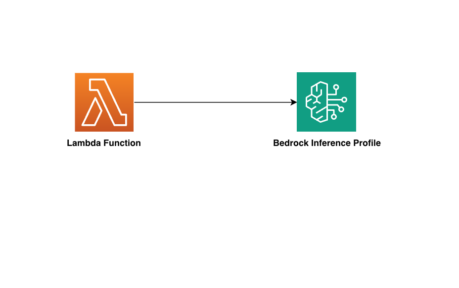

//!!NODE_ROOT <section>
//== aws-lambda-bedrockinferenceprofile module

[.topic]
= aws-lambda-bedrockinferenceprofile
:info_doctype: section
:info_title: aws-lambda-bedrockinferenceprofile

image:https://img.shields.io/badge/stability-Experimental-important.svg?style=for-the-badge[Stability:Experimental]

____
All classes are under active development and subject to non-backward
compatible changes or removal in any future version. These are not
subject to the https://semver.org/[Semantic Versioning] model. This
means that while you may use them, you may need to update your source
code when upgrading to a newer version of this package.
____

[width="100%",cols="<50%,<50%",options="header",]
|===
|*Reference Documentation*:
|https://docs.aws.amazon.com/solutions/latest/constructs/
|===

[width="100%",cols="<46%,54%",options="header",]
|===
|*Language* |*Package*
|image:https://docs.aws.amazon.com/cdk/api/img/python32.png[Python
Logo] Python
|`aws_solutions_constructs.aws_lambda_bedrockinferenceprofile`

|image:https://docs.aws.amazon.com/cdk/api/img/typescript32.png[Typescript
Logo] Typescript
|`@aws-solutions-constructs/aws-lambda-bedrockinferenceprofile`

|image:https://docs.aws.amazon.com/cdk/api/img/java32.png[Java
Logo] Java
|`software.amazon.awsconstructs.services.lambdabedrockinferenceprofile`
|===

== Overview

This AWS Solutions Construct implements a Lambda function granted access
to a new Bedrock Inference Profile.
https://aws.amazon.com/blogs/machine-learning/getting-started-with-cross-region-inference-in-amazon-bedrock/[Inference
profiles] allow: * Greater scalability of applications by
distributing Bedrock Invoke calls across multiple regions * Cost
management by adding Cost Allocation Tags to an inference to track costs
for specific applications.

Here is a minimal deployable pattern definition:

====
[role="tablist"]
Typescript::
+
[source,typescript]
----
import { Construct } from 'constructs';
import { Stack, StackProps } from 'aws-cdk-lib';
import { LambdaToBedrockInferenceProfile } from "@aws-solutions-constructs/aws-lambda-bedrockinferenceprofile";
import * as lambda from 'aws-cdk-lib/aws-lambda';

new LambdaToBedrockInferenceProfile(this, 'LambdaToBedrockPattern', {
    lambdaFunctionProps: {
        runtime: lambda.Runtime.NODEJS_22_X,
        handler: 'index.handler',
        code: lambda.Code.fromAsset(`lambda`)
    },
    model: "amazon.nova-lite-v1:0"
});
----

Python::
+
[source,python]
----
from constructs import Construct
from aws_cdk import (
    aws_lambda as _lambda,
    Stack
)

from aws_solutions_constructs import (
    aws_lambda_bedrockinferenceprofile as lambda_bedrock
)

lambda_bedrock.LambdaToBedrockinferenceprofile(
    self, 'bedrock-construct',
    bedrock_model_id="amazon.nova-lite-v1:0",
    lambda_function_props=_lambda.FunctionProps(
        runtime=_lambda.Runtime.NODEJS_22_X,
        code=_lambda.Code.from_asset('lambda'),
        handler='index.handler',
    )
)
----

Java::
+
[source,java]
----
import software.constructs.Construct;

import software.amazon.awscdk.Stack;
import software.amazon.awscdk.StackProps;
import software.amazon.awscdk.services.lambda.*;
import software.amazon.awscdk.services.lambda.Runtime;
import software.amazon.awsconstructs.services.lambdabedrockinferenceprofile.*;

  new LambdaToBedrockinferenceprofile(this, "ApiGatewayToLambdaPattern", new LambdaToBedrockinferenceprofileProps.Builder()
          .lambdaFunctionProps(new FunctionProps.Builder()
                  .runtime(Runtime.NODEJS_22_X)
                  .code(Code.fromAsset("lambda"))
                  .handler("index.handler")
                  .build())
          .bedrockModelId("amazon.nova-lite-v1:0")
          .build());
----
====

== Pattern Construct Props

[width="100%",cols="<30%,<35%,35%",options="header",]
|===
|*Name* |*Type* |*Description*
|existingLambdaObj?
|https://docs.aws.amazon.com/cdk/api/v2/docs/aws-cdk-lib.aws_lambda.Function.html[`lambda.Function`]
|Optional - instance of an existing Lambda Function object, providing both this and
`lambdaFunctionProps` will cause an error.

|lambdaFunctionProps?
|https://docs.aws.amazon.com/cdk/api/v2/docs/aws-cdk-lib.aws_lambda.FunctionProps.html[`lambda.FunctionProps`]
|Optional - user provided props to override the default props for the Lambda function. Providing both this and `existingLambdaObj` is an error.

|existingVpc?
|https://docs.aws.amazon.com/cdk/api/v2/docs/aws-cdk-lib.aws_ec2.IVpc.html[`ec2.IVpc`]
|An optional, existing VPC into which this pattern should be deployed.
When deployed in a VPC, the Lambda function will use ENIs in the VPC to
access network resources and an Interface Endpoint will be created in
the VPC for Amazon Bedrock and Bedrock-Runtime. If an existing VPC is
provided, the `deployVpc` property cannot be `true`. This uses
`ec2.IVpc` to allow clients to supply VPCs that exist outside the stack
using the
https://docs.aws.amazon.com/cdk/api/v2/docs/aws-cdk-lib.aws_ec2.Vpc.html#static-fromwbrlookupscope-id-options[`ec2.Vpc.fromLookup()`]
method.

|vpcProps?
|https://docs.aws.amazon.com/cdk/api/v2/docs/aws-cdk-lib.aws_ec2.VpcProps.html[`ec2.VpcProps`]
|Optional user provided properties to override the default properties
for the new VPC. `enableDnsHostnames`, `enableDnsSupport`, `natGateways`
and `subnetConfiguration` are set by the pattern, so any values for
those properties supplied here will be overridden. If `deployVpc` is not
`true` then this property will be ignored.

|deployVpc? |`boolean` |Whether to create a new VPC based on `vpcProps`
into which to deploy this pattern. Setting this to true will deploy the
minimal, most private VPC to run the pattern:

|bedrockModelId |`string` |The foundation model to use with the
inference profile. Depending on whether the deployment is cross region
or single region, he construct will create the correct inference profile
name and and assign IAM permissions to the Lambda function allowing
access to the foundation model in all appropriate regions. For all of
this to occur, the model must be specified here and _not_ in
`inferenceProfileProps`. Be certain that the account is granted access
to the foundation model in
https://docs.aws.amazon.com/bedrock/latest/userguide/inference-profiles-support.html[all
the regions covered by the cross-region inference profile].

|inferenceProfileProps?
|https://docs.aws.amazon.com/cdk/api/v2/docs/aws-cdk-lib.aws_bedrock.CfnApplicationInferenceProfileProps.html[`bedrock.CfnApplicationInferenceProfileProps`]
|This is where you set tags required for tracking inference calls. Do
not populate the copyFrom attribute - the construct will populate this
based upon the model sent in bedrockModelId (this allows the construct
to correctly create all the other dependencies like the required IAM
policies). If the copyFrom attribute is supplied here the construct will
throw an error. The construct will also set a unique, stack specific
inferenceProfileName - you may override that name here, but it is not
recommended.

|deployCrossRegionProfile |boolean |Whether to deploy a cross-region
inference profile that will automatically distribute Invoke calls across
multiple regions. Note that at the time of this writing, cross-region
profiles are only available in
https://docs.aws.amazon.com/bedrock/latest/userguide/inference-profiles-support.html[US&#44;
EMEA and APAC]. Single region profiles are available in every region
supporting Bedrock models. Defaults to `true`.

|foundationModelEnvironmentVariableName? |string |Optional Name for the
Lambda function environment variable set to the Model name. Defaults to
BEDROCK_MODEL

|inferenceProfileEnvironmentVariableName? |string |Optional Name for the
Lambda function environment variable set to the inference profile arn.
Defaults to BEDROCK_PROFILE
|===

== Pattern Properties

[width="100%",cols="<30%,<35%,35%",options="header",]
|===
|*Name* |*Type* |*Description*
|lambdaFunction
|https://docs.aws.amazon.com/cdk/api/v2/docs/aws-cdk-lib.aws_lambda.Function.html[`lambda.Function`]
|Returns an instance of the Lambda function created by the pattern.

|inferenceProfile
|https://docs.aws.amazon.com/cdk/api/v2/docs/aws-cdk-lib.aws_bedrock.CfnApplicationInferenceProfile.html[`CfnApplicationInferenceProfile`]
|The inference profile created by the construct.

|vpc?
|https://docs.aws.amazon.com/cdk/api/v2/docs/aws-cdk-lib.aws_ec2.IVpc.html[`ec2.IVpc`]
|Returns an interface on the VPC used by the pattern (if any). This may
be a VPC created by the pattern or the VPC supplied to the pattern
constructor.
|===

== Default settings

Out of the box implementation of the Construct without any override will
set the following defaults:

=== AWS Lambda Function

* Configure limited privilege access IAM role for Lambda function,
granting Invoke privileges for:
** The new inference profile +
** The appropriate foundation model in all regions in the geographic
area. For single region inference profiles, access is only granted to
model in the current region.
* Enable reusing connections with Keep-Alive for NodeJs Lambda function
* Enable X-Ray Tracing
* Set Environment Variables
** (default) BEDROCK_PROFILE
** (default) BEDROCK_MODEL

=== Amazon Bedrock Inference Profile

* Cross-region inference profile for provided model by default
* Geographic area prefix in arn defaults to value appropriate for
deployment region (e.g. would us '`us`' for us-east-1 deployment)

== Architecture

// github block

'''''

© Copyright Amazon.com, Inc. or its affiliates. All Rights Reserved.
