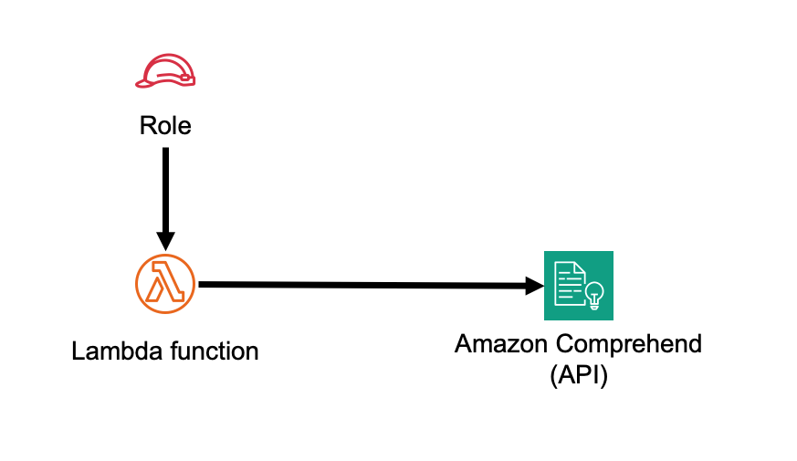
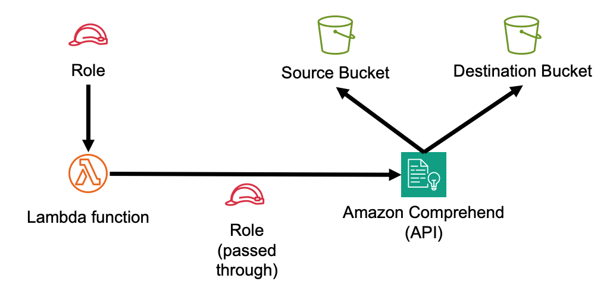

//!!NODE_ROOT <section>
//== aws-lambda-comprehend module

[.topic]
= aws-lambda-comprehend
:info_doctype: section
:info_title: aws-lambda-comprehend

image:https://img.shields.io/badge/stability-Experimental-important.svg?style=for-the-badge[Stability:Experimental]

[width="100%",cols="<50%,<50%",options="header",]
|===
|*Reference Documentation*:
|https://docs.aws.amazon.com/solutions/latest/constructs/
|===

[width="100%",cols="<46%,54%",options="header",]
|===
|*Language* |*Package*
|image:https://docs.aws.amazon.com/images/solutions/latest/constructs/images/python32.png[Python
Logo] Python |`aws_solutions_constructs.aws_lambda_comprehend`

|image:https://docs.aws.amazon.com/images/solutions/latest/constructs/images/typescript32.png[Typescript
Logo] Typescript |`@aws-solutions-constructs/aws-lambda-comprehend`

|image:https://docs.aws.amazon.com/images/solutions/latest/constructs/images/java32.png[Java
Logo] Java |`software.amazon.awsconstructs.services.lambdacomprehend`
|===

== Overview

This AWS Solutions Construct implements an AWS Lambda function connected to the
Amazon Comprehend natural language processing service.

The IAM permissions granted to the Lambda function are the cross product of two
independent selections: the Comprehend processing modes the function uses
(`comprehendUseCases`) and the analysis families it uses (`analysisTypes`). A function
that only calls `DetectSentiment` receives permission for that operation and nothing
else. When `ComprehendUseCase.ASYNC_BATCH` is selected, the construct additionally
creates source and destination S3 buckets and the IAM role Amazon Comprehend assumes
to read and write them.

Here is a minimal deployable pattern definition:

====
[role="tablist"]
Typescript::
+
[source,typescript]
----
import { Construct } from 'constructs';
import { Stack, StackProps } from 'aws-cdk-lib';
import { LambdaToComprehend } from '@aws-solutions-constructs/aws-lambda-comprehend';
import * as lambda from 'aws-cdk-lib/aws-lambda';

new LambdaToComprehend(this, 'LambdaToComprehendPattern', {
    lambdaFunctionProps: {
        runtime: lambda.Runtime.NODEJS_22_X,
        handler: 'index.handler',
        code: lambda.Code.fromAsset(`lambda`)
    }
});
----

Python::
+
[source,python]
----
from aws_solutions_constructs.aws_lambda_comprehend import LambdaToComprehend
from aws_cdk import (
    aws_lambda as _lambda,
    Stack
)
from constructs import Construct

LambdaToComprehend(self, 'LambdaToComprehendPattern',
        lambda_function_props=_lambda.FunctionProps(
            code=_lambda.Code.from_asset('lambda'),
            runtime=_lambda.Runtime.PYTHON_3_14,
            handler='index.handler'
        )
        )
----

Java::
+
[source,java]
----
import software.constructs.Construct;

import software.amazon.awscdk.Stack;
import software.amazon.awscdk.StackProps;
import software.amazon.awscdk.services.lambda.*;
import software.amazon.awscdk.services.lambda.Runtime;
import software.amazon.awsconstructs.services.lambdacomprehend.*;

new LambdaToComprehend(this, "LambdaToComprehendPattern", new LambdaToComprehendProps.Builder()
        .lambdaFunctionProps(new FunctionProps.Builder()
                .runtime(Runtime.NODEJS_22_X)
                .code(Code.fromAsset("lambda"))
                .handler("index.handler")
                .build())
        .build());
----
====

== Pattern Construct Props

[width="100%",cols="<30%,<35%,35%",options="header",]
|===
|*Name* |*Type* |*Description*
|existingLambdaObj?
|https://docs.aws.amazon.com/cdk/api/v2/docs/aws-cdk-lib.aws_lambda.Function.html[`lambda.Function`]
|Optional - instance of an existing Lambda Function object, providing both this and
`lambdaFunctionProps` will cause an error.

|lambdaFunctionProps?
|https://docs.aws.amazon.com/cdk/api/v2/docs/aws-cdk-lib.aws_lambda.FunctionProps.html[`lambda.FunctionProps`]
|Optional - user provided props to override the default props for the Lambda function.
Providing both this and `existingLambdaObj` causes an error.

|comprehendUseCases? |`ComprehendUseCase[]`
|The Amazon Comprehend processing modes the Lambda function will use. Selecting
ASYNC_BATCH causes source and destination S3 buckets and a Comprehend data access role
to be created. Default: [ComprehendUseCase.SINGLE_DOCUMENT_SYNC, ComprehendUseCase.MULTI_DOCUMENT_SYNC]

|analysisTypes? |`ComprehendAnalysisType[]`
|The Amazon Comprehend analysis families the Lambda function will use. The IAM policy
granted to the Lambda function is the cross product of comprehendUseCases and
analysisTypes. Default: All analysis types

|additionalPermissions? |`string[]`
|Optional array of additional IAM permissions to grant to the Lambda function for Amazon
Comprehend. This is intended for use with Comprehend actions and will assign a resource
of '*' - permissions for other services with specific resources should add the permission
using Function.addToRolePolicy().

|existingSourceBucketObj?
|https://docs.aws.amazon.com/cdk/api/v2/docs/aws-cdk-lib.aws_s3.IBucket.html[`s3.IBucket`]
|Existing instance of S3 Bucket object for source documents. If this is provided, then also
providing sourceBucketProps causes an error. Only valid when comprehendUseCases includes
ComprehendUseCase.ASYNC_BATCH.

|sourceBucketProps?
|https://docs.aws.amazon.com/cdk/api/v2/docs/aws-cdk-lib.aws_s3.BucketProps.html[`s3.BucketProps`]
|Optional user provided props to override the default props for the source S3
Bucket. Only valid when comprehendUseCases includes ComprehendUseCase.ASYNC_BATCH.

|existingDestinationBucketObj?
|https://docs.aws.amazon.com/cdk/api/v2/docs/aws-cdk-lib.aws_s3.IBucket.html[`s3.IBucket`]
|Existing instance of S3 Bucket object for analysis results. If this is provided, then also
providing destinationBucketProps causes an error. Only valid when comprehendUseCases includes
ComprehendUseCase.ASYNC_BATCH.

|destinationBucketProps?
|https://docs.aws.amazon.com/cdk/api/v2/docs/aws-cdk-lib.aws_s3.BucketProps.html[`s3.BucketProps`]
|Optional user provided props to override the default props for the destination S3
Bucket. Only valid when comprehendUseCases includes ComprehendUseCase.ASYNC_BATCH.

|useSameBucket? |`boolean`
|Whether to use the same S3 bucket for both source documents and analysis results.
When true, only the source bucket will be created and used for both purposes. Only valid
when comprehendUseCases includes ComprehendUseCase.ASYNC_BATCH. Default: false

|sourceLoggingBucketProps?
|https://docs.aws.amazon.com/cdk/api/v2/docs/aws-cdk-lib.aws_s3.BucketProps.html[`s3.BucketProps`]
|Optional user provided props to override the default props for the source S3
Logging Bucket. Only valid when comprehendUseCases includes ComprehendUseCase.ASYNC_BATCH.

|destinationLoggingBucketProps?
|https://docs.aws.amazon.com/cdk/api/v2/docs/aws-cdk-lib.aws_s3.BucketProps.html[`s3.BucketProps`]
|Optional user provided props to override the default props for the destination S3
Logging Bucket. Only valid when comprehendUseCases includes ComprehendUseCase.ASYNC_BATCH.

|logSourceS3AccessLogs? |`boolean`
|Whether to turn on Access Logging for the source S3 bucket. Creates an S3 bucket with
associated storage costs for the logs. Enabling Access Logging is a best practice. Only valid
when comprehendUseCases includes ComprehendUseCase.ASYNC_BATCH. Default: true

|logDestinationS3AccessLogs? |`boolean`
|Whether to turn on Access Logging for the destination S3 bucket. Creates an S3 bucket with
associated storage costs for the logs. Enabling Access Logging is a best practice. Only valid
when comprehendUseCases includes ComprehendUseCase.ASYNC_BATCH. Default: true

|sourceBucketEnvironmentVariableName? |`string`
|Optional Name for the Lambda function environment variable set to the name of the source
bucket. Only valid when comprehendUseCases includes ComprehendUseCase.ASYNC_BATCH. Default:
SOURCE_BUCKET_NAME

|destinationBucketEnvironmentVariableName? |`string`
|Optional Name for the Lambda function environment variable set to the name of the destination
bucket. Only valid when comprehendUseCases includes ComprehendUseCase.ASYNC_BATCH. Default:
DESTINATION_BUCKET_NAME

|dataAccessRoleArnEnvironmentVariableName? |`string`
|Optional Name for the Lambda function environment variable set to the ARN of the IAM role
used for asynchronous analysis jobs. Only valid when comprehendUseCases includes
ComprehendUseCase.ASYNC_BATCH. Default: DATA_ACCESS_ROLE_ARN

|existingVpc?
|https://docs.aws.amazon.com/cdk/api/v2/docs/aws-cdk-lib.aws_ec2.IVpc.html[`ec2.IVpc`]
|An optional, existing VPC into which this pattern should be deployed.
When deployed in a VPC, the Lambda function will use ENIs in the VPC to
access network resources and an Interface Endpoint will be created in
the VPC for Amazon Comprehend. If comprehendUseCases includes ComprehendUseCase.ASYNC_BATCH,
a Gateway Endpoint for Amazon S3 will also be created. If an existing VPC is provided, the
`deployVpc` property cannot be `true`. This uses `ec2.IVpc` to allow clients to
supply VPCs that exist outside the stack using the
https://docs.aws.amazon.com/cdk/api/v2/docs/aws-cdk-lib.aws_ec2.Vpc.html#static-fromwbrlookupscope-id-options[`ec2.Vpc.fromLookup()`]
method.

|vpcProps?
|https://docs.aws.amazon.com/cdk/api/v2/docs/aws-cdk-lib.aws_ec2.VpcProps.html[`ec2.VpcProps`]
|Optional user provided properties to override the default properties
for the new VPC. `enableDnsHostnames`, `enableDnsSupport`, `natGateways`
and `subnetConfiguration` are set by the pattern, so any values for
those properties supplied here will be overridden. If `deployVpc` is not
`true` then this property will be ignored.

|deployVpc? |`boolean` |Whether to create a new VPC based on `vpcProps`
into which to deploy this pattern. Setting this to true will deploy the
minimal, most private VPC to run the pattern.
|===

== Pattern Properties

[width="100%",cols="<30%,<35%,35%",options="header",]
|===
|*Name* |*Type* |*Description*
|lambdaFunction
|https://docs.aws.amazon.com/cdk/api/v2/docs/aws-cdk-lib.aws_lambda.Function.html[`lambda.Function`]
|Returns an instance of the Lambda function created by the pattern.

|dataAccessRole?
|https://docs.aws.amazon.com/cdk/api/v2/docs/aws-cdk-lib.aws_iam.Role.html[`iam.Role`]
|Returns an instance of the IAM role Amazon Comprehend assumes to read the source bucket and
write the destination bucket. Only created when comprehendUseCases includes
ComprehendUseCase.ASYNC_BATCH. Exposed so that clients can grant it access to resources the
construct did not create, such as a customer managed KMS key.

|sourceBucket?
|https://docs.aws.amazon.com/cdk/api/v2/docs/aws-cdk-lib.aws_s3.Bucket.html[`s3.Bucket`]
|Returns an instance of the source S3 bucket if it is created by the pattern.

|sourceBucketInterface?
|https://docs.aws.amazon.com/cdk/api/v2/docs/aws-cdk-lib.aws_s3.IBucket.html[`s3.IBucket`]
|Returns an interface of s3.IBucket used by the construct for the source bucket whether created
by the pattern or supplied from the client.

|sourceLoggingBucket?
|https://docs.aws.amazon.com/cdk/api/v2/docs/aws-cdk-lib.aws_s3.Bucket.html[`s3.Bucket`]
|Returns an instance of s3.Bucket created by the construct as the
logging bucket for the source bucket.

|destinationBucket?
|https://docs.aws.amazon.com/cdk/api/v2/docs/aws-cdk-lib.aws_s3.Bucket.html[`s3.Bucket`]
|Returns an instance of the destination S3 bucket if it is created by the pattern. When
`useSameBucket` is true this is the same bucket returned by `sourceBucket`.

|destinationBucketInterface?
|https://docs.aws.amazon.com/cdk/api/v2/docs/aws-cdk-lib.aws_s3.IBucket.html[`s3.IBucket`]
|Returns an interface of s3.IBucket used by the construct for the destination bucket whether
created by the pattern or supplied from the client.

|destinationLoggingBucket?
|https://docs.aws.amazon.com/cdk/api/v2/docs/aws-cdk-lib.aws_s3.Bucket.html[`s3.Bucket`]
|Returns an instance of s3.Bucket created by the construct as the
logging bucket for the destination bucket.

|vpc?
|https://docs.aws.amazon.com/cdk/api/v2/docs/aws-cdk-lib.aws_ec2.IVpc.html[`ec2.IVpc`]
|Returns an interface on the VPC used by the pattern (if any). This may
be a VPC created by the pattern or the VPC supplied to the pattern
constructor.
|===

== Selecting use cases and analysis types

`comprehendUseCases` selects the Amazon Comprehend processing modes:

* `ComprehendUseCase.SINGLE_DOCUMENT_SYNC` - the synchronous `Detect*` operations, one
document per request
* `ComprehendUseCase.MULTI_DOCUMENT_SYNC` - the synchronous `BatchDetect*` operations, up to
25 documents per request
* `ComprehendUseCase.ASYNC_BATCH` - the asynchronous `Start*DetectionJob` operations, which
read documents from S3 and write results to S3

`analysisTypes` selects the analysis families: `DOMINANT_LANGUAGE`, `ENTITIES`, `KEY_PHRASES`,
`SENTIMENT`, `TARGETED_SENTIMENT`, `SYNTAX` and `PII`.

Both enums are declared in the Solutions Constructs core library. In Typescript they are
re-exported from this construct's package, so a single import suffices. In the other languages
they are imported from the core package:

====
[role="tablist"]
Typescript::
+
[source,typescript]
----
import { LambdaToComprehend, ComprehendUseCase, ComprehendAnalysisType }
    from '@aws-solutions-constructs/aws-lambda-comprehend';
----

Python::
+
[source,python]
----
from aws_solutions_constructs.aws_lambda_comprehend import LambdaToComprehend
from aws_solutions_constructs.core import ComprehendUseCase, ComprehendAnalysisType
----

Java::
+
[source,java]
----
import software.amazon.awsconstructs.services.lambdacomprehend.*;
import software.amazon.awsconstructs.services.core.ComprehendUseCase;
import software.amazon.awsconstructs.services.core.ComprehendAnalysisType;
----
====

=== The cross product is not complete

Amazon Comprehend does not offer every processing mode for every analysis family. The
construct grants the operations that exist and silently skips the two combinations that do
not:

[width="100%",cols="<25%,<25%,<25%,25%",options="header",]
|===
|*Analysis type* |*SINGLE_DOCUMENT_SYNC* |*MULTI_DOCUMENT_SYNC* |*ASYNC_BATCH*
|DOMINANT_LANGUAGE |DetectDominantLanguage |BatchDetectDominantLanguage |DominantLanguageDetectionJob
|ENTITIES |DetectEntities |BatchDetectEntities |EntitiesDetectionJob
|KEY_PHRASES |DetectKeyPhrases |BatchDetectKeyPhrases |KeyPhrasesDetectionJob
|SENTIMENT |DetectSentiment |BatchDetectSentiment |SentimentDetectionJob
|TARGETED_SENTIMENT |DetectTargetedSentiment |BatchDetectTargetedSentiment |TargetedSentimentDetectionJob
|SYNTAX |DetectSyntax |BatchDetectSyntax |*not available*
|PII |DetectPiiEntities, ContainsPiiEntities |*not available* |PiiEntitiesDetectionJob
|===

Each entry in the ASYNC_BATCH column expands to four permissions - `Start`, `Describe`,
`List` and `Stop` - for that job type.

A selection that produces no permission at all is rejected at synthesis time. Requesting
`analysisTypes: [ComprehendAnalysisType.PII]` with only `MULTI_DOCUMENT_SYNC`, or
`analysisTypes: [ComprehendAnalysisType.SYNTAX]` with only `ASYNC_BATCH`, causes an error. A
selection that merely contains a gap is accepted: `[SYNTAX, PII]` with
`[MULTI_DOCUMENT_SYNC, ASYNC_BATCH]` grants `BatchDetectSyntax` and the PII job operations.

=== comprehend:TagResource is not granted

Tagging an asynchronous job is optional, so the construct does not grant
`comprehend:TagResource`. Passing `Tags` to a `Start*DetectionJob` call without it produces an
`AccessDeniedException` at runtime with no synthesis-time signal. Clients who tag jobs add the
permission explicitly:

[source,typescript]
----
new LambdaToComprehend(this, 'LambdaToComprehendPattern', {
    lambdaFunctionProps: { /* ... */ },
    comprehendUseCases: [ComprehendUseCase.ASYNC_BATCH],
    additionalPermissions: ['comprehend:TagResource']
});
----

== Asynchronous jobs

=== Output layout

Amazon Comprehend writes job results to
`<destination bucket>/<account>-<JOBTYPE>-<jobId>/output.tar.gz`. The directory is
job-specific, so concurrent jobs cannot overwrite each other.

*PII entity detection is the exception.* It writes plain text, one `<inputfilename>.out` file
per input file, with no tarball. Client code that parses job output must branch on the
analysis type.

When `useSameBucket` is true, input and output share one bucket. Use distinct prefixes for
input documents and job output, and point `InputDataConfig.S3Uri` at the input prefix rather
than the bucket root.

=== Detecting job completion

Amazon Comprehend has neither an SNS notification parameter nor EventBridge events for
analysis jobs, so this construct creates no notification infrastructure. Three approaches are
available to client code:

* An S3 event notification on the destination bucket, triggered by the arrival of job output
* CloudTrail to EventBridge, which surfaces the `Start*DetectionJob` management event
* Polling `Describe*DetectionJob`, subject to the 10 TPS quota below

=== Quotas worth knowing

* `Start*DetectionJob` is limited to *1 transaction per second, and that quota is not
adjustable*. A design that starts one job per input object will throttle; prefer many
documents behind one job, or serialize job starts through an SQS queue with a single
concurrent consumer.
* 10 concurrent asynchronous jobs per account, adjustable through Service Quotas.
* `Describe*` and `List*` are limited to 10 transactions per second, not adjustable. This is
the ceiling on any polling loop.
* A job that fails after `Start*DetectionJob` returned successfully is visible only through
`Describe*DetectionJob`.

=== Object lifecycle

The construct applies no S3 lifecycle rule. Input documents and job output accumulate
indefinitely. Clients running a continuous pipeline should supply a lifecycle rule through
`sourceBucketProps` or `destinationBucketProps`.

== Asynchronous jobs and your VPC

When a VPC is used, the Lambda function is placed in the VPC's isolated subnets and reaches
Amazon Comprehend through an Interface Endpoint.

*The asynchronous job itself does not run in that VPC.* The Lambda function that starts the
job is inside the VPC; the job runs in service-managed infrastructure and reads and writes S3
over Amazon Comprehend's own network path. The construct emits a warning at synthesis time
when a VPC and `ComprehendUseCase.ASYNC_BATCH` are configured together, so that this is not
mistaken for end-to-end network isolation.

Clients who need the job itself in a VPC pass `VpcConfig` in their own `Start*DetectionJob`
call, and grant the required `ec2` network interface permissions to the `dataAccessRole`
property this construct exposes.

Note also that the Comprehend Interface Endpoint requires Amazon Comprehend to offer
AWS PrivateLink in the deployment region. In a region without it, endpoint creation fails at
deployment time.

== Default settings

Out of the box implementation of the Construct without any override will
set the following defaults:

=== AWS Lambda Function

* Configure limited privilege access IAM role for Lambda function
* Enable reusing connections with Keep-Alive for NodeJs Lambda function
* Enable X-Ray Tracing
* Set a 30 second function timeout, which a timeout supplied in `lambdaFunctionProps`
overrides
* Set Environment Variables
** (default) SOURCE_BUCKET_NAME (when comprehendUseCases includes ComprehendUseCase.ASYNC_BATCH)
** (default) DESTINATION_BUCKET_NAME (when comprehendUseCases includes ComprehendUseCase.ASYNC_BATCH)
** (default) DATA_ACCESS_ROLE_ARN (when comprehendUseCases includes ComprehendUseCase.ASYNC_BATCH)
** AWS_NODEJS_CONNECTION_REUSE_ENABLED (for Node 10.x
and higher functions)

=== Amazon Comprehend Service

* Grant the Lambda function the cross product of `comprehendUseCases` and `analysisTypes`, in
a single policy statement with a resource of '*'
* With no overrides, that is 14 operations - the seven `Detect*` operations plus
`ContainsPiiEntities`, and the six `BatchDetect*` operations:

[source,json]
----
["comprehend:DetectDominantLanguage", "comprehend:DetectEntities",
 "comprehend:DetectKeyPhrases", "comprehend:DetectSentiment",
 "comprehend:DetectTargetedSentiment", "comprehend:DetectSyntax",
 "comprehend:DetectPiiEntities", "comprehend:ContainsPiiEntities",
 "comprehend:BatchDetectDominantLanguage", "comprehend:BatchDetectEntities",
 "comprehend:BatchDetectKeyPhrases", "comprehend:BatchDetectSentiment",
 "comprehend:BatchDetectTargetedSentiment", "comprehend:BatchDetectSyntax"]
----

* The generated operations appear in a fixed order that does not depend on the order of the
supplied arrays, so reordering `comprehendUseCases` or `analysisTypes` does not change the
synthesized template
* Grant `iam:PassRole` on the data access role, conditioned on `iam:PassedToService` being
`comprehend.amazonaws.com` (when comprehendUseCases includes ComprehendUseCase.ASYNC_BATCH)

=== Amazon S3 Buckets (when comprehendUseCases includes ComprehendUseCase.ASYNC_BATCH)

* Configure Access logging for S3 Buckets
* Enable server-side encryption for S3 Buckets using Amazon S3 managed keys (SSE-S3)
* Enforce encryption of data in transit
* Turn on the versioning for S3 Buckets
* Don't allow public access for S3 Buckets
* Retain the S3 Buckets when deleting the CloudFormation stack
* Applies Lifecycle rule to move noncurrent object versions to Glacier
storage after 90 days
* Grant the Lambda function read and write access to the source bucket, and read access to the
destination bucket
* When `useSameBucket` is true, grant the Lambda function read and write access to the single
bucket

=== Comprehend data access role (when comprehendUseCases includes ComprehendUseCase.ASYNC_BATCH)

* Trusted by the `comprehend.amazonaws.com` service principal, with an `aws:SourceAccount`
condition restricting assumption to the deploying account
* Granted read access to the source bucket and read and write access to the destination bucket
* When `useSameBucket` is true, granted read and write access to the single bucket
* No KMS permissions are granted. A client whose bucket uses a customer managed key grants
that access through the `dataAccessRole` property

=== Amazon VPC

* If deployVpc is true, a minimal VPC will be created with:
** An Interface Endpoint for Amazon Comprehend
** A Gateway Endpoint for Amazon S3 (when comprehendUseCases includes
ComprehendUseCase.ASYNC_BATCH)
** Isolated subnets for the Lambda function
** Appropriate security groups and routing

== Monitoring

The construct creates no CloudWatch alarms or dashboards. The signals available without any
additional configuration are:

* Lambda function metrics - `Errors`, `Throttles` and `Duration`, the last worth watching
against the 30 second default timeout
* AWS X-Ray traces, since active tracing is enabled by default
* CloudWatch Logs for the Lambda function, where Amazon Comprehend throttling surfaces as
`TooManyRequestsException` or `ThrottlingException` raised by the client's own code
* S3 server access logs for both buckets

Amazon Comprehend publishes CloudWatch metrics only for custom-model real-time endpoints,
which this construct does not create. There are no service-side metrics for the `Detect*` or
`Start*DetectionJob` operations; observability for those calls comes from the Lambda function
that makes them.

== Architecture

**Default Implementation**

**Implementation when comprehendUseCases includes ComprehendUseCase.ASYNC_BATCH**

== Additional examples

=== Asynchronous entity detection

====
[role="tablist"]
Typescript::
+
[source,typescript]
----
import { Construct } from 'constructs';
import { Stack, StackProps } from 'aws-cdk-lib';
import { LambdaToComprehend, ComprehendUseCase, ComprehendAnalysisType }
    from '@aws-solutions-constructs/aws-lambda-comprehend';
import * as lambda from 'aws-cdk-lib/aws-lambda';

new LambdaToComprehend(this, 'LambdaToComprehendPattern', {
    lambdaFunctionProps: {
        runtime: lambda.Runtime.NODEJS_22_X,
        handler: 'index.handler',
        code: lambda.Code.fromAsset(`lambda`)
    },
    comprehendUseCases: [ComprehendUseCase.ASYNC_BATCH],
    analysisTypes: [ComprehendAnalysisType.ENTITIES, ComprehendAnalysisType.PII]
});
----

Python::
+
[source,python]
----
from aws_solutions_constructs.aws_lambda_comprehend import LambdaToComprehend
from aws_solutions_constructs.core import ComprehendUseCase, ComprehendAnalysisType
from aws_cdk import (
    aws_lambda as _lambda,
    Stack
)
from constructs import Construct

LambdaToComprehend(self, 'LambdaToComprehendPattern',
        lambda_function_props=_lambda.FunctionProps(
            code=_lambda.Code.from_asset('lambda'),
            runtime=_lambda.Runtime.PYTHON_3_14,
            handler='index.handler'
        ),
        comprehend_use_cases=[ComprehendUseCase.ASYNC_BATCH],
        analysis_types=[ComprehendAnalysisType.ENTITIES, ComprehendAnalysisType.PII]
        )
----

Java::
+
[source,java]
----
import software.constructs.Construct;
import java.util.Arrays;

import software.amazon.awscdk.Stack;
import software.amazon.awscdk.StackProps;
import software.amazon.awscdk.services.lambda.*;
import software.amazon.awscdk.services.lambda.Runtime;
import software.amazon.awsconstructs.services.lambdacomprehend.*;
import software.amazon.awsconstructs.services.core.ComprehendUseCase;
import software.amazon.awsconstructs.services.core.ComprehendAnalysisType;

new LambdaToComprehend(this, "LambdaToComprehendPattern", new LambdaToComprehendProps.Builder()
        .lambdaFunctionProps(new FunctionProps.Builder()
                .runtime(Runtime.NODEJS_22_X)
                .code(Code.fromAsset("lambda"))
                .handler("index.handler")
                .build())
        .comprehendUseCases(Arrays.asList(ComprehendUseCase.ASYNC_BATCH))
        .analysisTypes(Arrays.asList(ComprehendAnalysisType.ENTITIES,
                ComprehendAnalysisType.PII))
        .build());
----
====

=== Asynchronous analysis using a single bucket

Use distinct prefixes for input documents and job output, and point
`InputDataConfig.S3Uri` at the input prefix rather than the bucket root.

====
[role="tablist"]
Typescript::
+
[source,typescript]
----
import { Construct } from 'constructs';
import { Stack, StackProps } from 'aws-cdk-lib';
import { LambdaToComprehend, ComprehendUseCase }
    from '@aws-solutions-constructs/aws-lambda-comprehend';
import * as lambda from 'aws-cdk-lib/aws-lambda';

new LambdaToComprehend(this, 'LambdaToComprehendPattern', {
    lambdaFunctionProps: {
        runtime: lambda.Runtime.NODEJS_22_X,
        handler: 'index.handler',
        code: lambda.Code.fromAsset(`lambda`)
    },
    comprehendUseCases: [ComprehendUseCase.ASYNC_BATCH],
    useSameBucket: true
});
----

Python::
+
[source,python]
----
from aws_solutions_constructs.aws_lambda_comprehend import LambdaToComprehend
from aws_solutions_constructs.core import ComprehendUseCase
from aws_cdk import (
    aws_lambda as _lambda,
    Stack
)
from constructs import Construct

LambdaToComprehend(self, 'LambdaToComprehendPattern',
        lambda_function_props=_lambda.FunctionProps(
            code=_lambda.Code.from_asset('lambda'),
            runtime=_lambda.Runtime.PYTHON_3_14,
            handler='index.handler'
        ),
        comprehend_use_cases=[ComprehendUseCase.ASYNC_BATCH],
        use_same_bucket=True
        )
----

Java::
+
[source,java]
----
import software.constructs.Construct;
import java.util.Arrays;

import software.amazon.awscdk.Stack;
import software.amazon.awscdk.StackProps;
import software.amazon.awscdk.services.lambda.*;
import software.amazon.awscdk.services.lambda.Runtime;
import software.amazon.awsconstructs.services.lambdacomprehend.*;
import software.amazon.awsconstructs.services.core.ComprehendUseCase;

new LambdaToComprehend(this, "LambdaToComprehendPattern", new LambdaToComprehendProps.Builder()
        .lambdaFunctionProps(new FunctionProps.Builder()
                .runtime(Runtime.NODEJS_22_X)
                .code(Code.fromAsset("lambda"))
                .handler("index.handler")
                .build())
        .comprehendUseCases(Arrays.asList(ComprehendUseCase.ASYNC_BATCH))
        .useSameBucket(true)
        .build());
----
====

=== Sentiment analysis only, deployed in a new VPC

====
[role="tablist"]
Typescript::
+
[source,typescript]
----
import { Construct } from 'constructs';
import { Stack, StackProps } from 'aws-cdk-lib';
import { LambdaToComprehend, ComprehendUseCase, ComprehendAnalysisType }
    from '@aws-solutions-constructs/aws-lambda-comprehend';
import * as lambda from 'aws-cdk-lib/aws-lambda';

new LambdaToComprehend(this, 'LambdaToComprehendPattern', {
    lambdaFunctionProps: {
        runtime: lambda.Runtime.NODEJS_22_X,
        handler: 'index.handler',
        code: lambda.Code.fromAsset(`lambda`)
    },
    comprehendUseCases: [ComprehendUseCase.SINGLE_DOCUMENT_SYNC],
    analysisTypes: [ComprehendAnalysisType.SENTIMENT],
    deployVpc: true
});
----

Python::
+
[source,python]
----
from aws_solutions_constructs.aws_lambda_comprehend import LambdaToComprehend
from aws_solutions_constructs.core import ComprehendUseCase, ComprehendAnalysisType
from aws_cdk import (
    aws_lambda as _lambda,
    Stack
)
from constructs import Construct

LambdaToComprehend(self, 'LambdaToComprehendPattern',
        lambda_function_props=_lambda.FunctionProps(
            code=_lambda.Code.from_asset('lambda'),
            runtime=_lambda.Runtime.PYTHON_3_14,
            handler='index.handler'
        ),
        comprehend_use_cases=[ComprehendUseCase.SINGLE_DOCUMENT_SYNC],
        analysis_types=[ComprehendAnalysisType.SENTIMENT],
        deploy_vpc=True
        )
----

Java::
+
[source,java]
----
import software.constructs.Construct;
import java.util.Arrays;

import software.amazon.awscdk.Stack;
import software.amazon.awscdk.StackProps;
import software.amazon.awscdk.services.lambda.*;
import software.amazon.awscdk.services.lambda.Runtime;
import software.amazon.awsconstructs.services.lambdacomprehend.*;
import software.amazon.awsconstructs.services.core.ComprehendUseCase;
import software.amazon.awsconstructs.services.core.ComprehendAnalysisType;

new LambdaToComprehend(this, "LambdaToComprehendPattern", new LambdaToComprehendProps.Builder()
        .lambdaFunctionProps(new FunctionProps.Builder()
                .runtime(Runtime.NODEJS_22_X)
                .code(Code.fromAsset("lambda"))
                .handler("index.handler")
                .build())
        .comprehendUseCases(Arrays.asList(ComprehendUseCase.SINGLE_DOCUMENT_SYNC))
        .analysisTypes(Arrays.asList(ComprehendAnalysisType.SENTIMENT))
        .deployVpc(true)
        .build());
----
====

== Example Lambda Function Implementation

While Solutions Constructs does not publish code for the Lambda function to call Amazon Comprehend, here are examples of calling Comprehend: https://github.com/awsdocs/aws-doc-sdk-examples/tree/main/python/example_code/comprehend[examples]. (these examples are in Python, but examples in other languages can also be found at this site)

// github block

'''''

© Copyright Amazon.com, Inc. or its affiliates. All Rights Reserved.
