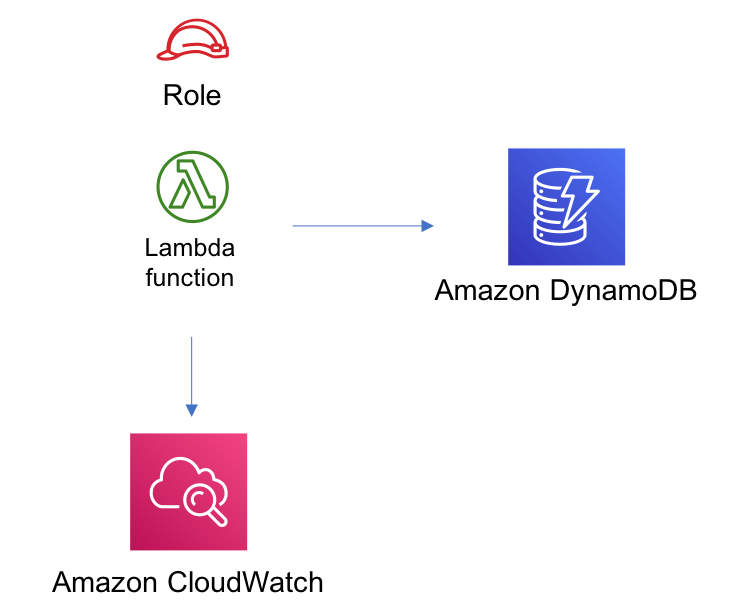

//!!NODE_ROOT <section>
//== aws-lambda-dynamodb module

[.topic]
= aws-lambda-dynamodb
:info_doctype: section
:info_title: aws-lambda-dynamodb

image:https://img.shields.io/badge/cfn--resources-stable-success.svg?style=for-the-badge[Stability:Stable]

[width="100%",cols="<50%,<50%",options="header",]
|===
|*Reference Documentation*:
|https://docs.aws.amazon.com/solutions/latest/constructs/
|===

[width="100%",cols="<46%,54%",options="header",]
|===
|*Language* |*Package*
|image:https://docs.aws.amazon.com/cdk/api/latest/img/python32.png[Python
Logo] Python
|`aws_solutions_constructs.aws_lambda_dynamodb`

|image:https://docs.aws.amazon.com/cdk/api/latest/img/typescript32.png[Typescript
Logo] Typescript |`@aws-solutions-constructs/aws-lambda-dynamodb`

|image:https://docs.aws.amazon.com/cdk/api/latest/img/java32.png[Java
Logo] Java |`software.amazon.awsconstructs.services.lambdadynamodb`
|===

== Overview

This AWS Solutions Construct implements the AWS Lambda function and
Amazon DynamoDB table with the least privileged permissions.

Here is a minimal deployable pattern definition:

====
[role="tablist"]
Typescript::
+
[source,typescript]
----
import { Construct } from 'constructs';
import { Stack, StackProps } from 'aws-cdk-lib';
import { LambdaToDynamoDBProps, LambdaToDynamoDB } from '@aws-solutions-constructs/aws-lambda-dynamodb';
import * as lambda from 'aws-cdk-lib/aws-lambda';

const constructProps: LambdaToDynamoDBProps = {
  lambdaFunctionProps: {
    code: lambda.Code.fromAsset(`lambda`),
    runtime: lambda.Runtime.NODEJS_20_X,
    handler: 'index.handler'
  },
};

new LambdaToDynamoDB(this, 'test-lambda-dynamodb-stack', constructProps);
----

Python::
+
[source,python]
----
from aws_solutions_constructs.aws_lambda_dynamodb import LambdaToDynamoDBProps, LambdaToDynamoDB
from aws_cdk import (
    aws_lambda as _lambda,
    Stack
)
from constructs import Construct

LambdaToDynamoDB(self, 'test_lambda_dynamodb_stack',
                    lambda_function_props=_lambda.FunctionProps(
                        code=_lambda.Code.from_asset(
                            'lambda'),
                        runtime=_lambda.Runtime.PYTHON_3_11,
                        handler='index.handler'
                    ))
----

Java::
+
[source,java]
----
import software.constructs.Construct;

import software.amazon.awscdk.Stack;
import software.amazon.awscdk.StackProps;
import software.amazon.awscdk.services.lambda.*;
import software.amazon.awscdk.services.lambda.Runtime;
import software.amazon.awsconstructs.services.lambdadynamodb.*;

new LambdaToDynamoDB(this, "test_lambda_dynamodb_stack", new LambdaToDynamoDBProps.Builder()
        .lambdaFunctionProps(new FunctionProps.Builder()
                .runtime(Runtime.NODEJS_20_X)
                .code(Code.fromAsset("lambda"))
                .handler("index.handler")
                .build())
        .build());
----
====

== Pattern Construct Props

[width="100%",cols="<30%,<35%,35%",options="header",]
|===
|*Name* |*Type* |*Description*
|existingLambdaObj?
|https://docs.aws.amazon.com/cdk/api/v2/docs/aws-cdk-lib.aws_lambda.Function.html[`lambda.Function`]
|Existing instance of Lambda Function object, providing both this and
`lambdaFunctionProps` will cause an error.

|lambdaFunctionProps?
|https://docs.aws.amazon.com/cdk/api/v2/docs/aws-cdk-lib.aws_lambda.FunctionProps.html[`lambda.FunctionProps`]
|User provided props to override the default props for the Lambda
function.

|dynamoTableProps?
|https://docs.aws.amazon.com/cdk/api/v2/docs/aws-cdk-lib.aws_dynamodb.TableProps.html[`dynamodb.TableProps`]
|Optional user provided props to override the default props for DynamoDB
Table

|existingTableObj?
|https://docs.aws.amazon.com/cdk/api/v2/docs/aws-cdk-lib.aws_dynamodb.Table.html[`dynamodb.Table`]
|Existing instance of DynamoDB table object, providing both this and
`dynamoTableProps` will cause an error.

StablePermissions? |`string` |Optional table permissions to grant to the
Lambda function. One of the following may be specified: `All`, `Read`,
`ReadWrite`, `Write`.

StableEnvironmentVariableName? |`string` |Optional Name for the Lambda
function environment variable set to the name of the DynamoDB table.
Default: DDB_TABLE_NAME

|existingVpc?
|https://docs.aws.amazon.com/cdk/api/v2/docs/aws-cdk-lib.aws_ec2.IVpc.html[`ec2.IVpc`]
|An optional, existing VPC into which this pattern should be deployed.
When deployed in a VPC, the Lambda function will use ENIs in the VPC to
access network resources and a Gateway Endpoint will be created in the
VPC for Amazon DynamoDB. If an existing VPC is provided, the `deployVpc`
property cannot be `true`. This uses `ec2.IVpc` to allow clients to
supply VPCs that exist outside the stack using the
https://docs.aws.amazon.com/cdk/api/v2/docs/aws-cdk-lib.aws_ec2.Vpc.html#static-fromwbrlookupscope-id-options[`ec2.Vpc.fromLookup()`]
method.

|vpcProps?
|https://docs.aws.amazon.com/cdk/api/v2/docs/aws-cdk-lib.aws_ec2.VpcProps.html[`ec2.VpcProps`]
|Optional user-provided properties to override the default properties
for the new VPC. `enableDnsHostnames`, `enableDnsSupport`, `natGateways`
and `subnetConfiguration` are set by the pattern, so any values for
those properties supplied here will be overridden. If `deployVpc` is not
`true` then this property will be ignored.

|deployVpc? |`boolean` |Whether to create a new VPC based on `vpcProps`
into which to deploy this pattern. Setting this to true will deploy the
minimal, most private VPC to run the pattern:
|===

== Pattern Properties

[width="100%",cols="<30%,<35%,35%",options="header",]
|===
|*Name* |*Type* |*Description*
|lambdaFunction
|https://docs.aws.amazon.com/cdk/api/v2/docs/aws-cdk-lib.aws_lambda.Function.html[`lambda.Function`]
|Returns an instance of lambda.Function created by the construct

|dynamoTable
|https://docs.aws.amazon.com/cdk/api/v2/docs/aws-cdk-lib.aws_dynamodb.Table.html[`dynamodb.Table`]
|Returns an instance of dynamodb.Table created by the construct

|vpc?
|https://docs.aws.amazon.com/cdk/api/v2/docs/aws-cdk-lib.aws_ec2.IVpc.html[`ec2.IVpc`]
|Returns an interface on the VPC used by the pattern (if any). This may
be a VPC created by the pattern or the VPC supplied to the pattern
constructor.
|===

== Default settings

Out of the box implementation of the Construct without any override will
set the following defaults:

=== AWS Lambda Function

* Configure limited privilege access IAM role for Lambda function
* Enable reusing connections with Keep-Alive for NodeJs Lambda function
* Enable X-Ray Tracing
* Set Environment Variables
** (default) DDB_TABLE_NAME
** AWS_NODEJS_CONNECTION_REUSE_ENABLED (for Node 10.x
and higher functions)

=== Amazon DynamoDB Table

* Set the billing mode for DynamoDB Table to On-Demand (Pay per request)
* Enable server-side encryption for DynamoDB Table using AWS managed KMS
Key
* Creates a partition key called '`id`' for DynamoDB Table
* Retain the Table when deleting the CloudFormation stack
* Enable continuous backups and point-in-time recovery

== Architecture

// github block

'''''

© Copyright Amazon.com, Inc. or its affiliates. All Rights Reserved.
