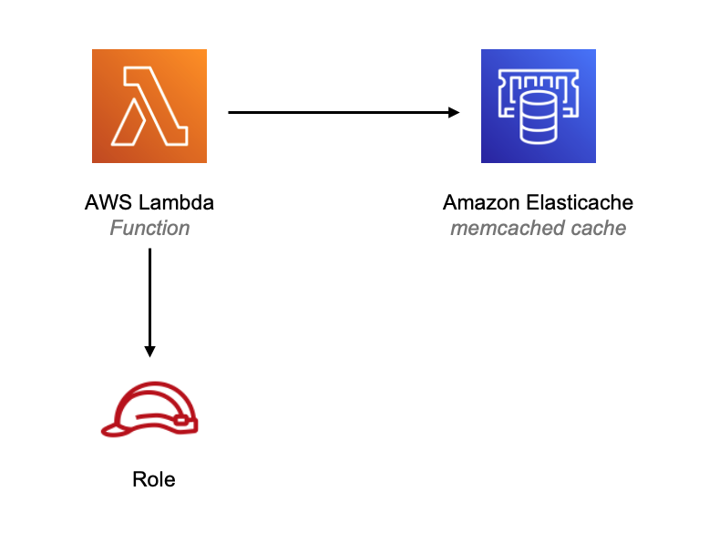

//!!NODE_ROOT <section>
//== aws-lambda-elasticachememcached module

[.topic]
= aws-lambda-elasticachememcached
:info_doctype: section
:info_title: aws-lambda-elasticachememcached

.Stability: Experimental
image::https://img.shields.io/badge/stability-Experimental-important.svg?style=for-the-badge[Stability:Experimental]

[width="100%",cols="<50%,<50%",options="header",]
|===
|*Reference Documentation*:
|https://docs.aws.amazon.com/solutions/latest/constructs/
|===

[width="100%",cols="<46%,54%",options="header",]
|===
|*Language* |*Package*
|image:https://docs.aws.amazon.com/cdk/api/latest/img/python32.png[Python
Logo] Python
|`aws++_++solutions++_++constructs.aws++_++lambda++_++elasticachememcached`

|image:https://docs.aws.amazon.com/cdk/api/latest/img/typescript32.png[Typescript
Logo] Typescript
|`@aws-solutions-constructs/aws-lambda-elasticachememcached`

|image:https://docs.aws.amazon.com/cdk/api/latest/img/java32.png[Java
Logo] Java
|`software.amazon.awsconstructs.services.lambdaelasticachememcached`
|===

== Overview

This AWS Solutions Construct implements an AWS Lambda function connected
to an Amazon Elasticache Memcached cluster.

Here is a minimal deployable pattern definition :

====
[role="tablist"]
Typescript::
+
[source,typescript]
----
import { Construct } from 'constructs';
import { Stack, StackProps } from 'aws-cdk-lib';
import { LambdaToElasticachememcached } from '@aws-solutions-constructs/aws-lambda-elasticachememcached';
import * as lambda from 'aws-cdk-lib/aws-lambda';

new LambdaToElasticachememcached(this, 'LambdaToElasticachememcachedPattern', {
    lambdaFunctionProps: {
        runtime: lambda.Runtime.NODEJS_20_X,
        handler: 'index.handler',
        code: lambda.Code.fromAsset(`lambda`)
    }
});
----

Python::
+
[source,python]
----
from aws_solutions_constructs.aws_lambda_elasticachememcached import LambdaToElasticachememcached
from aws_cdk import (
    aws_lambda as _lambda,
    Stack
)
from constructs import Construct

LambdaToElasticachememcached(self, 'LambdaToCachePattern',
        lambda_function_props=_lambda.FunctionProps(
            code=_lambda.Code.from_asset('lambda'),
            runtime=_lambda.Runtime.PYTHON_3_11,
            handler='index.handler'
        )
        )
----

Java::
+
[source,java]
----
import software.constructs.Construct;

import software.amazon.awscdk.Stack;
import software.amazon.awscdk.StackProps;
import software.amazon.awscdk.services.lambda.*;
import software.amazon.awscdk.services.lambda.Runtime;
import software.amazon.awsconstructs.services.lambdaelasticachememcached.*;

new LambdaToElasticachememcached(this, "LambdaToCachePattern", new LambdaToElasticachememcachedProps.Builder()
        .lambdaFunctionProps(new FunctionProps.Builder()
                .runtime(Runtime.NODEJS_20_X)
                .code(Code.fromAsset("lambda"))
                .handler("index.handler")
                .build())
        .build());
----
====

== Pattern Construct Props

[width="100%",cols="<30%,<35%,35%",options="header",]
|===
|*Name* |*Type* |*Description*
|existingLambdaObj?
|https://docs.aws.amazon.com/cdk/api/v2/docs/aws-cdk-lib.aws_lambda.Function.html[`lambda.Function`]
|Existing instance of Lambda Function object, providing both this and
`lambdaFunctionProps` will cause an error.

|lambdaFunctionProps?
|https://docs.aws.amazon.com/cdk/api/v2/docs/aws-cdk-lib.aws_lambda.FunctionProps.html[`lambda.FunctionProps`]
|Optional user provided props to override the default props for the
Lambda function.

|existingVpc?
|https://docs.aws.amazon.com/cdk/api/v2/docs/aws-cdk-lib.aws_ec2.IVpc.html[`ec2.IVpc`]
|An optional, existing VPC into which this pattern should be deployed.
When deployed in a VPC, the Lambda function will use ENIs in the VPC to
access network resources and an Interface Endpoint will be created in
the VPC for Amazon Elasticache. If an existing VPC is provided, the
`deployVpc` property cannot be `true`. This uses `ec2.IVpc` to allow
clients to supply VPCs that exist outside the stack using the
https://docs.aws.amazon.com/cdk/api/v2/docs/aws-cdk-lib.aws_ec2.Vpc.html#static-fromwbrlookupscope-id-options[`ec2.Vpc.fromLookup()`]
method.

|vpcProps?
|https://docs.aws.amazon.com/cdk/api/v2/docs/aws-cdk-lib.aws_ec2.VpcProps.html[`ec2.VpcProps`]
|Optional user provided properties to override the default properties
for the new VPC. `subnetConfiguration` is set by the pattern, so any
values for those properties supplied here will be overridden.

|cacheEndpointEnvironmentVariableName? |string |Optional Name for the
Lambda function environment variable set to the cache endpoint. Default:
CACHE++_++ENDPOINT

|cacheProps?
|https://docs.aws.amazon.com/cdk/api/v2/docs/aws-cdk-lib.aws_elasticache.CfnCacheClusterProps.html[`cache.CfnCacheClusterProps`]
|Optional user provided props to override the default props for the
Elasticache Cluster. Providing both this and `existingCache` will cause
an error.

|existingCache?
|https://docs.aws.amazon.com/cdk/api/v2/docs/aws-cdk-lib.aws_elasticache.CfnCacheCluster.html#attrconfigurationendpointport[`cache.CfnCacheCluster`]
|Existing instance of Elasticache Cluster object, providing both this
and `cacheProps` will cause an error. If you provide this, you must
provide the associated VPC in existingVpc.
|===

== Pattern Properties

[width="100%",cols="<30%,<35%,35%",options="header",]
|===
|*Name* |*Type* |*Description*
|lambdaFunction
|https://docs.aws.amazon.com/cdk/api/v2/docs/aws-cdk-lib.aws_lambda.Function.html[`lambda.Function`]
|Returns an instance of the Lambda function used by the pattern.

|vpc
|https://docs.aws.amazon.com/cdk/api/v2/docs/aws-cdk-lib.aws_ec2.IVpc.html[`ec2.IVpc`]
|Returns an interface on the VPC used by the pattern. This may be a VPC
created by the pattern or the VPC supplied to the pattern constructor.

|cache
|https://docs.aws.amazon.com/cdk/api/v2/docs/aws-cdk-lib.aws_elasticache.CfnCacheCluster.html#attrconfigurationendpointport[`cache.CfnCacheCluster`]
|The Elasticache Memcached cluster used by the construct.
|===

== Default settings

Out of the box implementation of the Construct without any override will
set the following defaults:

==== AWS Lambda Function

* Configure limited privilege access IAM role for Lambda function
* Enable reusing connections with Keep-Alive for NodeJs Lambda function
* Enable X-Ray Tracing
* Attached to self referencing security group to grant access to cache
* Set Environment Variables
** (default) CACHE++_++ENDPOINT
** AWS++_++NODEJS++_++CONNECTION++_++REUSE++_++ENABLED (for Node 10.x
and higher functions)

==== Amazon Elasticache Memcached Cluster

* Creates multi node, cross-az cluster by default
** 2 cache nodes, type: cache.t3.medium
* Self referencing security group attached to cluster endpoint

== Architecture

.Architecture Diagram

'''''

© Copyright Amazon.com, Inc. or its affiliates. All Rights Reserved.
