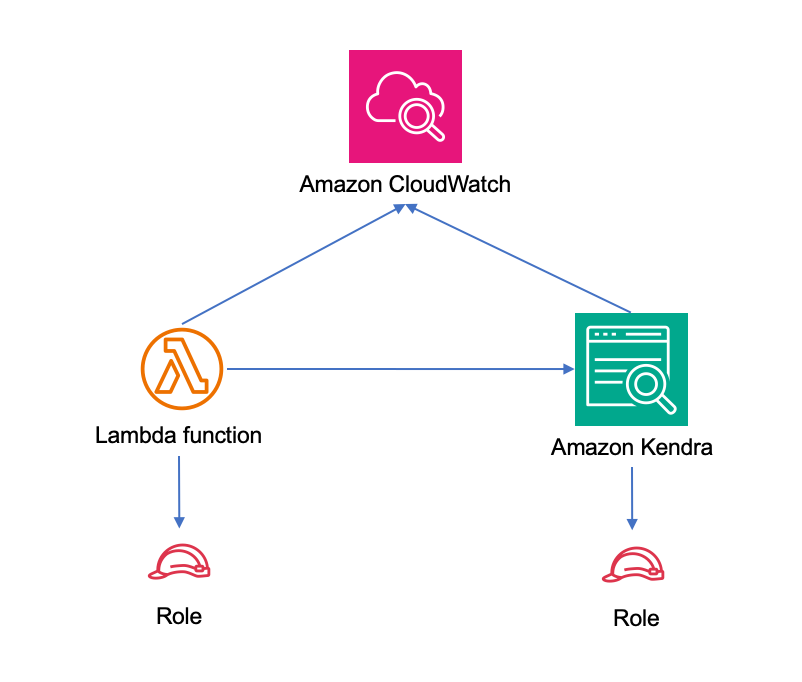

# aws-lambda-kendra module

* * *


> All classes are under active development and subject to non-backward compatible changes or removal in any
> future version. These are not subject to the [Semantic Versioning](https://semver.org/) model.
> This means that while you may use them, you may need to update your source code when upgrading to a newer version of this package.

* * *

| **Reference Documentation**: | <span style="font-weight: normal;">https://docs.aws.amazon.com/solutions/latest/constructs/</span> |
| --- | --- |

| **Language** | **Package** |
| --- | --- |
|  Python | `aws_solutions_constructs.aws_lambda_kendra` |
|  Typescript | `@aws-solutions-constructs/aws-lambda-kendra` |
|  Java | `software.amazon.awsconstructs.services.lambdakendra` |

## Overview

This AWS Solutions Construct implements an AWS Lambda function and Amazon Kendra index with the least privileged permissions.

Here is a minimal deployable pattern definition:

Typescript

```typescript
import { Construct } from 'constructs';
import { Stack, StackProps, Aws } from 'aws-cdk-lib';
import { LambdaToKendra } from '@aws-solutions-constructs/aws-lambda-kendra';
import * as lambda from "aws-cdk-lib/aws-lambda";
import * as s3 from "aws-cdk-lib/aws-s3";

const lambdaProps: lambda.FunctionProps = {
  code: lambda.Code.fromAsset(`lambda`),
  runtime: lambda.Runtime.NODEJS_18_X,
  handler: 'index.handler'
};

new LambdaToKendra(this, 'sample', {
  lambdaFunctionProps: lambdaProps,
  kendraIndexProps: {},
  kendraDataSourceProps: [{
    type: 'S3',
    dataSourceConfiguration: {
      s3Configuration: {
        bucketName: 'your-bucket-name',
      }
    }
  ],
});
```

Python

```python
TBD
```

Java

```java
TBD
```

## Pattern Construct Props

| **Name** | **Type** | **Description** |
| --- | --- | --- |
| existingLambdaObj? | [`lambda.Function`](https://docs.aws.amazon.com/cdk/api/v2/docs/aws-cdk-lib.aws_lambda.Function.html) | Existing instance of Lambda Function object, providing both this and `lambdaFunctionProps` will cause an error. |
| lambdaFunctionProps? | [`lambda.FunctionProps`](https://docs.aws.amazon.com/cdk/api/v2/docs/aws-cdk-lib.aws_lambda.FunctionProps.html) | User provided props to override the default props for the Lambda function. |
| kendraIndexProps? | [`kendra.CfnIndexProps`](https://docs.aws.amazon.com/cdk/api/v2/docs/aws-cdk-lib.aws_kendra.CfnIndex.html) | Optional user provided props to override the default props for the Kendra index. Providing both these and existingKendraIndexObj is an error. |
| kendraDataSourcesProps | [`CfnDataSourceProps[]`](https://docs.aws.amazon.com/cdk/api/v2/docs/aws-cdk-lib.aws_kendra.CfnDataSource.html) | A list of data sources that will provide data to the Kendra index. *At least 1 must be specified*. We will do majority of processing for some data sources (S3 crawler initially), but for others the props must be complete (e.g. proper roleArn, etc.) |
| indexPermissions? | `string[]` | Optional - index permissions to grant to the Lambda function. One or more of the following may be specified: `Read`, `SubmitFeedback` and `Write`. Default is `["Read", "SubmitFeedback"]`. Read is all the operations IAM defines as Read and List. SubmitFeedback is only the SubmitFeedback action. Write is all the operations IAM defines as Write and Tag. This functionality may be overridden by providing a specific role arn in lambdaFunctionProps |
| existingKendraIndexObj? | [`kendra.cfnIndex`](https://docs.aws.amazon.com/cdk/api/v2/docs/aws-cdk-lib.aws_kendra.CfnIndex.html) | An existing Kendra index to which the Lambda function will be granted access. Supplying along with kendraIndexProps or kendraDataSourceProps will throw an error. |
| existingVpc? | [`ec2.IVpc`](https://docs.aws.amazon.com/cdk/api/v2/docs/aws-cdk-lib.aws_ec2.IVpc.html) | An optional, existing VPC into which this pattern should be deployed. When deployed in a VPC, the Lambda function will use ENIs in the VPC to access network resources. If an existing VPC is provided, the `deployVpc` property cannot be `true`. This uses `ec2.IVpc` to allow clients to supply VPCs that exist outside the stack using the [`ec2.Vpc.fromLookup()`](https://docs.aws.amazon.com/cdk/api/v2/docs/aws-cdk-lib.aws_ec2.Vpc.html#static-fromwbrlookupscope-id-options) method. |
| vpcProps? | [`ec2.VpcProps`](https://docs.aws.amazon.com/cdk/api/v2/docs/aws-cdk-lib.aws_ec2.VpcProps.html) | Optional user provided properties to override the default properties for the new VPC. `enableDnsHostnames`, `enableDnsSupport`, `natGateways` and `subnetConfiguration` are set by the pattern, so any values for those properties supplied here will be overridden. If `deployVpc` is not `true` then this property will be ignored. |
| deployVpc? | `boolean` | Whether to create a new VPC based on `vpcProps` into which to deploy this pattern. Setting this to true will deploy the minimal, most private VPC to run the pattern:<br>\- One isolated subnet in each Availability Zone used by the CDK program<br>\- `enableDnsHostnames` and `enableDnsSupport` will both be set to true<br>If this property is `true` then `existingVpc` cannot be specified. Defaults to `false`. |

## Pattern Properties

| **Name** | **Type** | **Description** |
| --- | --- | --- |
| lambdaFunction | [`lambda.Function`](https://docs.aws.amazon.com/cdk/api/v2/docs/aws-cdk-lib.aws_lambda.Function.html) | Returns an instance of `lambda.Function` managed by the construct |
| kendraIndex | [`kendra.cfnIndex`](https://docs.aws.amazon.com/cdk/api/v2/docs/aws-cdk-lib.aws_kendra.CfnIndex.html) | Returns an instance of `kendra.cfnIndex` managed by the construct |
| kendraDataSources | DataSourceProperties[] (this interface is defined by Solutions Constructs and described below) | A list of data sources created for this construct/index, each in an object that includes the role for that data source. |
| lambdaRole | [`iam.Role`](https://docs.aws.amazon.com/cdk/api/v2/docs/aws-cdk-lib.aws_iam.Role.html) | The role assumed by the Lambda function |
| vpc? | [`ec2.IVpc`](https://docs.aws.amazon.com/cdk/api/v2/docs/aws-cdk-lib.aws_ec2.IVpc.html) | Returns an interface on the VPC used by the pattern (if any). This may be a VPC created by the pattern or the VPC supplied to the pattern constructor. |

interface DataSourceProperties {
  role?: [`iam.Role`](https://docs.aws.amazon.com/cdk/api/v2/docs/aws-cdk-lib.aws_iam.Role.html),
  source: | [`CfnDataSource`](https://docs.aws.amazon.com/cdk/api/v2/docs/aws-cdk-lib.aws_kendra.CfnDataSource.html)
}
## Lambda Function

This pattern requires a lambda function that can access a Kendra index.

## Default settings

Out of the box implementation of the Construct without any overrides will set the following defaults:

### AWS Lambda Function

- Configure limited privilege access IAM role for Lambda function
- Enable reusing connections with Keep-Alive for Node.js Lambda function
- Enable X-Ray Tracing
- Set Environment Variables
    - (default) KENDRA_INDEX_ID
    - AWS_NODEJS_CONNECTION_REUSE_ENABLED

### Amazon Kendra Index

- Creates Amazon Kendra endpoint in VPC if appropriate
- Defaults to DEVELOPER_EDITION

**Amazon Kendra DataSources**

- Sets up correct IAM roles to access data for:
    - S3 data sources
    - Which others should we support in MLP? https://docs.aws.amazon.com/kendra/latest/dg/iam-roles.html
- Adds each data source to Kendra index

## Architecture



* * *

© Copyright Amazon.com, Inc. or its affiliates. All Rights Reserved.