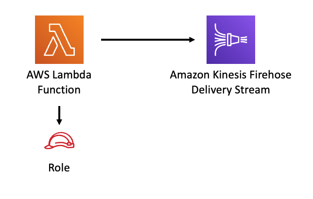

//!!NODE_ROOT <section>
//== aws-lambda-kinesisfirehose module

[.topic]
= aws-lambda-kinesisfirehose
:info_doctype: section
:info_title: aws-lambda-kinesisfirehose

image::https://img.shields.io/badge/stability-Experimental-important.svg?style=for-the-badge[Stability:Experimental]

[width="100%",cols="<50%,<50%",options="header",]
|===
|*Reference Documentation*:
|https://docs.aws.amazon.com/solutions/latest/constructs/
|===

[width="100%",cols="<46%,54%",options="header",]
|===
|*Language* |*Package*
|image:https://docs.aws.amazon.com/cdk/api/latest/img/python32.png[Python
Logo] Python
|`aws_solutions_constructs.aws_lambda_kinesisfirehose`

|image:https://docs.aws.amazon.com/cdk/api/latest/img/typescript32.png[Typescript
Logo] Typescript |`@aws-solutions-constructs/aws-lambda-kinesisfirehose`

|image:https://docs.aws.amazon.com/cdk/api/latest/img/java32.png[Java
Logo] Java
|`software.amazon.awsconstructs.services.lambdakinesisfirehose`
|===

== Overview

This AWS Solutions Construct implements an AWS Lambda function connected
to an existing Amazon Kinesis Firehose Delivery Stream.

Here is a minimal deployable pattern definition :

====
[role="tablist"]
Typescript::
+
[source,typescript]
----
import { Construct } from 'constructs';
import { Stack, StackProps } from 'aws-cdk-lib';
import { LambdaToS3 } from '@aws-solutions-constructs/aws-lambda-kinesisfirehose';
import * as lambda from 'aws-cdk-lib/aws-lambda';

// The construct requires an existing Firehose Delivery Stream, this can be created in raw CDK or extracted
// from a previously instantiated construct that created an Firehose Delivery Stream
const existingFirehoseDeliveryStream = previouslyCreatedKinesisFirehoseToS3Construct.kinesisFirehose;

new LambdaToKinesisFirehose(this, 'LambdaToFirehosePattern', {
  lambdaFunctionProps: {
      runtime: lambda.Runtime.NODEJS_20_X,
      handler: 'index.handler',
      code: lambda.Code.fromAsset(`lambda`)
  },
  existingKinesisFirehose: existingFirehoseDeliveryStream
});
----

Python::
+
[source,python]
----
from aws_solutions_constructs.aws_lambda_kinesisfirehose import LambdaToKinesisFirehose
from aws_cdk import (
    aws_lambda as _lambda,
    Stack
)
from constructs import Construct

# The construct requires an existing Firehose Delivery Stream, this can be created in raw CDK or extracted
# from a previously instantiated construct that created an Firehose Delivery Stream
existingFirehoseDeliveryStream = previouslyCreatedKinesisFirehoseToS3Construct.kinesisFirehose;

LambdaToKinesisFirehose(self, 'LambdaToFirehosePattern',
        existingKinesisFirehose=existingFirehoseDeliveryStream,
        lambda_function_props=_lambda.FunctionProps(
            code=_lambda.Code.from_asset('lambda'),
            runtime=_lambda.Runtime.PYTHON_3_11,
            handler='index.handler'
        )
        )
----

Java::
+
[source,java]
----
import software.constructs.Construct;

import software.amazon.awscdk.Stack;
import software.amazon.awscdk.StackProps;
import software.amazon.awscdk.services.lambda.*;
import software.amazon.awscdk.services.lambda.Runtime;
import software.amazon.awsconstructs.services.lambdakinesisfirehose.*;

// The construct requires an existing Firehose Delivery Stream, this can be created in raw CDK or extracted
// from a previously instantiated construct that created an Firehose Delivery Stream
existingFirehoseDeliveryStream = previouslyCreatedKinesisFirehoseToS3Construct.kinesisFirehose;

new LambdaToKinesisFirehose(this, "LambdaToFirehosePattern", new LambdaToKinesisFirehoseProps.Builder()
        .existingKinesisFirehose(existingFirehoseDeliveryStream)
        .lambdaFunctionProps(new FunctionProps.Builder()
                .runtime(Runtime.NODEJS_20_X)
                .code(Code.fromAsset("lambda"))
                .handler("index.handler")
                .build())
        .build());
----
====

== Pattern Construct Props

[width="100%",cols="<30%,<35%,35%",options="header",]
|===
|*Name* |*Type* |*Description*
|existingLambdaObj?
|https://docs.aws.amazon.com/cdk/api/v2/docs/aws-cdk-lib.aws_lambda.Function.html[`lambda.Function`]
|Existing instance of Lambda Function object, providing both this and
`lambdaFunctionProps` will cause an error.

|lambdaFunctionProps?
|https://docs.aws.amazon.com/cdk/api/v2/docs/aws-cdk-lib.aws_lambda.FunctionProps.html[`lambda.FunctionProps`]
|Optional user provided props to override the default props for the
Lambda function.

|existingKinesisFirehose
|https://docs.aws.amazon.com/cdk/api/v2/docs/aws-cdk-lib.aws_kinesisfirehose.CfnDeliveryStream.html[kinesisfirehose.CfnDeliveryStream]
|An existing Kinesis Firehose Delivery Stream to which the Lambda
function can put data. Note - the delivery stream construct must have
already been created and have the deliveryStreamName set. This construct
will _not_ create a new Delivery Stream.

|existingVpc?
|https://docs.aws.amazon.com/cdk/api/v2/docs/aws-cdk-lib.aws_ec2.IVpc.html[`ec2.IVpc`]
|An optional, existing VPC into which this pattern should be deployed.
When deployed in a VPC, the Lambda function will use ENIs in the VPC to
access network resources and an Interface Endpoint will be created in
the VPC for Amazon Kinesis Data Firehose. If an existing VPC is
provided, the `deployVpc` property cannot be `true`. This uses
`ec2.IVpc` to allow clients to supply VPCs that exist outside the stack
using the
https://docs.aws.amazon.com/cdk/api/v2/docs/aws-cdk-lib.aws_ec2.Vpc.html#static-fromwbrlookupscope-id-options[`ec2.Vpc.fromLookup()`]
method.

|vpcProps?
|https://docs.aws.amazon.com/cdk/api/v2/docs/aws-cdk-lib.aws_ec2.VpcProps.html[`ec2.VpcProps`]
|Optional user provided properties to override the default properties
for the new VPC. `enableDnsHostnames`, `enableDnsSupport`, `natGateways`
and `subnetConfiguration` are set by the pattern, so any values for
those properties supplied here will be overridden. If `deployVpc` is not
`true` then this property will be ignored.

|deployVpc? |`boolean` |Whether to create a new VPC based on `vpcProps`
into which to deploy this pattern. Setting this to true will deploy the
minimal, most private VPC to run the pattern:

|firehoseEnvironmentVariableName? |`string` |Optional Name for the
Lambda function environment variable set to the name of the delivery
stream. Default: FIREHOSE_DELIVERYSTREAM_NAME
|===

== Pattern Properties

[width="100%",cols="<30%,<35%,35%",options="header",]
|===
|*Name* |*Type* |*Description*
|lambdaFunction
|https://docs.aws.amazon.com/cdk/api/v2/docs/aws-cdk-lib.aws_lambda.Function.html[`lambda.Function`]
|Returns an instance of the Lambda function created by the pattern.

|kinesisFirehose
|https://docs.aws.amazon.com/cdk/api/v2/docs/aws-cdk-lib.aws_kinesisfirehose.CfnDeliveryStream.html[kinesisfirehose.CfnDeliveryStream]
|The Kinesis Firehose Delivery Stream used by the construct.

|vpc?
|https://docs.aws.amazon.com/cdk/api/v2/docs/aws-cdk-lib.aws_ec2.IVpc.html[`ec2.IVpc`]
|Returns an interface on the VPC used by the pattern (if any). This may
be a VPC created by the pattern or the VPC supplied to the pattern
constructor.
|===

== Default settings

Out of the box implementation of the Construct without any override will
set the following defaults:

==== AWS Lambda Function

* Configure limited privilege access IAM role for Lambda function
* Enable reusing connections with Keep-Alive for NodeJs Lambda function
* Enable X-Ray Tracing
* Set Environment Variables
** (default) FIREHOSE_DELIVERYSTREAM_NAME
** AWS_NODEJS_CONNECTION_REUSE_ENABLED

==== Amazon Kinesis Firehose Delivery Stream

* This construct must be provided a configured Stream construct, it does
not change this Stream.

== Architecture

\\ github block

'''''

© Copyright Amazon.com, Inc. or its affiliates. All Rights Reserved.
