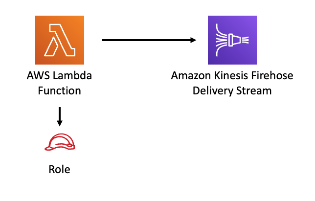

# aws-lambda-kinesisfirehose module
<!--BEGIN STABILITY BANNER-->

---


---
<!--END STABILITY BANNER-->

| **Reference Documentation**:| <span style="font-weight: normal">https://docs.aws.amazon.com/solutions/latest/constructs/</span>|
|:-------------|:-------------|
<div style="height:8px"></div>

| **Language**     | **Package**        |
|:-------------|-----------------|
| Python|`aws_solutions_constructs.aws_lambda_kinesisfirehose`|
| Typescript|`@aws-solutions-constructs/aws-lambda-kinesisfirehose`|
| Java|`software.amazon.awsconstructs.services.lambdakinesisfirehose`|

## Overview
This AWS Solutions Construct implements an AWS Lambda function connected to an existing Amazon Kinesis Firehose Delivery Stream.

Here is a minimal deployable pattern definition :

Typescript
``` typescript
import { Construct } from 'constructs';
import { Stack, StackProps } from 'aws-cdk-lib';
import { LambdaToS3 } from '@aws-solutions-constructs/aws-lambda-kinesisfirehose';
import * as lambda from 'aws-cdk-lib/aws-lambda';

// The construct requires an existing Firehose Delivery Stream, this can be created in raw CDK or extracted
// from a previously instantiated construct that created an Firehose Delivery Stream
const existingFirehoseDeliveryStream = previouslyCreatedKinesisFirehoseToS3Construct.kinesisFirehose;

new LambdaToKinesisFirehose(this, 'LambdaToFirehosePattern', {
    lambdaFunctionProps: {
        runtime: lambda.Runtime.NODEJS_14_X,
        handler: 'index.handler',
        code: lambda.Code.fromAsset(`lambda`)
    },
  existingKinesisFirehose: existingFirehoseDeliveryStream
});
```

Python
```python
from aws_solutions_constructs.aws_lambda_kinesisfirehose import LambdaToKinesisFirehose
from aws_cdk import (
    aws_lambda as _lambda,
    Stack
)
from constructs import Construct

# The construct requires an existing Firehose Delivery Stream, this can be created in raw CDK or extracted
# from a previously instantiated construct that created an Firehose Delivery Stream
const existingFirehoseDeliveryStream = previouslyCreatedKinesisFirehoseToS3Construct.kinesisFirehose;

LambdaToKinesisFirehose(self, 'LambdaToFirehosePattern',
        existingKinesisFirehose=existingFirehoseDeliveryStream,
        lambda_function_props=_lambda.FunctionProps(
            code=_lambda.Code.from_asset('lambda'),
            runtime=_lambda.Runtime.PYTHON_3_9,
            handler='index.handler'
        )
        )
```

Java
``` java
import software.constructs.Construct;

import software.amazon.awscdk.Stack;
import software.amazon.awscdk.StackProps;
import software.amazon.awscdk.services.lambda.*;
import software.amazon.awscdk.services.lambda.Runtime;
import software.amazon.awsconstructs.services.lambdakinesisfirehose.*;

// The construct requires an existing Firehose Delivery Stream, this can be created in raw CDK or extracted
// from a previously instantiated construct that created an Firehose Delivery Stream
const existingFirehoseDeliveryStream = previouslyCreatedKinesisFirehoseToS3Construct.kinesisFirehose;

new LambdaToKinesisFirehose(this, "LambdaToFirehosePattern", new LambdaToKinesisFirehoseProps.Builder()
        .existingKinesisFirehose(existingFirehoseDeliveryStream)
        .lambdaFunctionProps(new FunctionProps.Builder()
                .runtime(Runtime.NODEJS_14_X)
                .code(Code.fromAsset("lambda"))
                .handler("index.handler")
                .build())
        .build());
```

## Pattern Construct Props

| **Name**     | **Type**        | **Description** |
|:-------------|:----------------|-----------------|
|existingLambdaObj?|[`lambda.Function`](https://docs.aws.amazon.com/cdk/api/v2/docs/aws-cdk-lib.aws_lambda.Function.html)|Existing instance of Lambda Function object, providing both this and `lambdaFunctionProps` will cause an error.|
|lambdaFunctionProps?|[`lambda.FunctionProps`](https://docs.aws.amazon.com/cdk/api/v2/docs/aws-cdk-lib.aws_lambda.FunctionProps.html)|Optional user provided props to override the default props for the Lambda function.|
|existingKinesisFirehose|[kinesisfirehose.CfnDeliveryStream](https://docs.aws.amazon.com/cdk/api/v2/docs/aws-cdk-lib.aws_kinesisfirehose.CfnDeliveryStream.html)|An existing Kinesis Firehose Delivery Stream to which the Lambda function can put data. Note - the delivery stream construct must have already been created and have the deliveryStreamName set. This construct will *not* create a new Delivery Stream.|
|existingVpc?|[`ec2.IVpc`](https://docs.aws.amazon.com/cdk/api/v2/docs/aws-cdk-lib.aws_ec2.IVpc.html)|An optional, existing VPC into which this pattern should be deployed. When deployed in a VPC, the Lambda function will use ENIs in the VPC to access network resources and an Interface Endpoint will be created in the VPC for Amazon Kinesis Data Firehose. If an existing VPC is provided, the `deployVpc` property cannot be `true`. This uses `ec2.IVpc` to allow clients to supply VPCs that exist outside the stack using the [`ec2.Vpc.fromLookup()`](https://docs.aws.amazon.com/cdk/api/v2/docs/aws-cdk-lib.aws_ec2.Vpc.html#static-fromwbrlookupscope-id-options) method.|
|vpcProps?|[`ec2.VpcProps`](https://docs.aws.amazon.com/cdk/api/v2/docs/aws-cdk-lib.aws_ec2.VpcProps.html)|Optional user provided properties to override the default properties for the new VPC. `enableDnsHostnames`, `enableDnsSupport`, `natGateways` and `subnetConfiguration` are set by the pattern, so any values for those properties supplied here will be overrriden. If `deployVpc` is not `true` then this property will be ignored.|
|deployVpc?|`boolean`|Whether to create a new VPC based on `vpcProps` into which to deploy this pattern. Setting this to true will deploy the minimal, most private VPC to run the pattern:<ul><li> One isolated subnet in each Availability Zone used by the CDK program</li><li>`enableDnsHostnames` and `enableDnsSupport` will both be set to true</li></ul>If this property is `true` then `existingVpc` cannot be specified. Defaults to `false`.|
|firehoseEnvironmentVariableName?|`string`|Optional Name for the Lambda function environment variable set to the name of the delivery stream. Default: FIREHOSE_DELIVERYSTREAM_NAME |

## Pattern Properties

| **Name**     | **Type**        | **Description** |
|:-------------|:----------------|-----------------|
|lambdaFunction|[`lambda.Function`](https://docs.aws.amazon.com/cdk/api/v2/docs/aws-cdk-lib.aws_lambda.Function.html)|Returns an instance of the Lambda function created by the pattern.|
|kinesisFirehose|[kinesisfirehose.CfnDeliveryStream](https://docs.aws.amazon.com/cdk/api/v2/docs/aws-cdk-lib.aws_kinesisfirehose.CfnDeliveryStream.html)|The Kinesis Firehose Delivery Stream used by the construct.|
|vpc?|[`ec2.IVpc`](https://docs.aws.amazon.com/cdk/api/v2/docs/aws-cdk-lib.aws_ec2.IVpc.html)|Returns an interface on the VPC used by the pattern (if any). This may be a VPC created by the pattern or the VPC supplied to the pattern constructor.|

## Default settings

Out of the box implementation of the Construct without any override will set the following defaults:

### AWS Lambda Function
* Configure limited privilege access IAM role for Lambda function
* Enable reusing connections with Keep-Alive for NodeJs Lambda function
* Enable X-Ray Tracing
* Set Environment Variables
  * (default) FIREHOSE_DELIVERYSTREAM_NAME
  * AWS_NODEJS_CONNECTION_REUSE_ENABLED

### Amazon Kinesis Firehose Delivery Stream
* This construct must be provided a configured Stream construct, it does not change this Stream.

## Architecture


***
&copy; Copyright Amazon.com, Inc. or its affiliates. All Rights Reserved.
