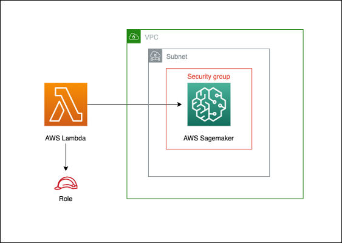

# aws-lambda-sagemaker module
<!--BEGIN STABILITY BANNER-->

---


> All classes are under active development and subject to non-backward compatible changes or removal in any
> future version. These are not subject to the [Semantic Versioning](https://semver.org/) model.
> This means that while you may use them, you may need to update your source code when upgrading to a newer version of this package.

---
<!--END STABILITY BANNER-->

| **Reference Documentation**:| <span style="font-weight: normal">https://docs.aws.amazon.com/solutions/latest/constructs/</span>|
|:-------------|:-------------|
<div style="height:8px"></div>

| **Language**     | **Package**        |
|:-------------|-----------------|
| Python|`aws_solutions_constructs.aws_lambda_sagemaker`|
| Typescript|`@aws-solutions-constructs/aws-lambda-sagemaker`|
| Java|`software.amazon.awsconstructs.services.lambdasagemaker`|

This AWS Solutions Construct implements the AWS Lambda function and Amazon Sagemaker Notebook with the least privileged permissions.

Here is a minimal deployable pattern definition:

``` javascript
const { LambdaToSagemakerProps,  LambdaToSagemaker } = require('@aws-solutions-constructs/aws-lambda-sagemaker');

const props: LambdaToSagemakerProps = {
    lambdaFunctionProps: {
        code: lambda.Code.asset(`${__dirname}/lambda`),
        runtime: lambda.Runtime.NODEJS_12_X,
        handler: 'index.handler'
    },
};

new LambdaToSagemaker(stack, 'test-lambda-sagemaker-stack', props);

```

## Initializer

``` text
new LambdaToSagemaker(scope: Construct, id: string, props: LambdaToSagemakerProps);
```

_Parameters_

* scope [`Construct`](https://docs.aws.amazon.com/cdk/api/latest/docs/@aws-cdk_core.Construct.html)
* id `string`
* props [`LambdaToSagemakerProps`](#pattern-construct-props)

## Pattern Construct Props

| **Name**     | **Type**        | **Description** |
|:-------------|:----------------|-----------------|
|existingLambdaObj?|[`lambda.Function`](https://docs.aws.amazon.com/cdk/api/latest/docs/@aws-cdk_aws-lambda.Function.html)|Existing instance of Lambda Function object, if this is set then the lambdaFunctionProps is ignored.|
|lambdaFunctionProps?|[`lambda.FunctionProps`](https://docs.aws.amazon.com/cdk/api/latest/docs/@aws-cdk_aws-lambda.FunctionProps.html)|User provided props to override the default props for the Lambda function.|
|sagemakerNotebookProps?|[`sagemaker.CfnNotebookInstanceProps`](https://docs.aws.amazon.com/cdk/api/latest/docs/@aws-cdk_aws-sagemaker.CfnNotebookInstance.html)|Optional user provided props to override the default props for a Sagemaker Notebook.|
deployInsideVpc?|[`boolean`]()|Optional user provided props to deploy inside vpc.|
|subnetId?|`string`|Optional user provided props of a subnet id for vpc configuration.|
|securityGroupIds?|`string`|Optional user provided props of security group ids for vpc configuration.|
|enableEncryption?|`boolean`|Use a KMS Key, either managed by this CDK app, or imported. If importing an encryption key, it must be specified in the encryptionKey property for this construct.|
|encryptionKey?|[`kms.Key`](https://docs.aws.amazon.com/cdk/api/latest/docs/@aws-cdk_aws-kms.Key.html)|An optional, imported encryption key to encrypt the Sagemaker Notebook instance with.|
|existingNotebookObj?|[`sagemaker.CfnNotebookInstanceProps`](https://docs.aws.amazon.com/cdk/api/latest/docs/@aws-cdk_aws-sagemaker.CfnNotebookInstance.html)|Existing instance of notebook object. If this is set then the sagemakerNotebookProps is ignored|

## Pattern Properties

| **Name**     | **Type**        | **Description** |
|:-------------|:----------------|-----------------|
|lambdaFunction|[`lambda.Function`](https://docs.aws.amazon.com/cdk/api/latest/docs/@aws-cdk_aws-lambda.Function.html)|Returns an instance of lambda.Function created by the construct|
|sagemakerNotebook|[`sagemaker.CfnNotebookInstanceProps`](https://docs.aws.amazon.com/cdk/api/latest/docs/@aws-cdk_aws-sagemaker.CfnNotebookInstance.html)|Returns an instance of sagemaker.CfnNotebookInstanceProps created by the construct|
|sagemakerRole|[`iam.Role`](https://docs.aws.amazon.com/cdk/api/latest/docs/@aws-cdk_aws-iam.Role.html)|Returns the iam.Role created by the construct|

## Default settings

Out of the box implementation of the Construct without any override will set the following defaults:

### AWS Lambda Function
* Configure least privilege access IAM role for Lambda function
* Enable reusing connections with Keep-Alive for NodeJs Lambda function

### Amazon SageMaker
* Deploy SageMaker NotebookInstance inside VPC
* Enable server-side encryption for SageMaker NotebookInstance using Customer Managed KMS Key

## Architecture


***
&copy; Copyright 2020 Amazon.com, Inc. or its affiliates. All Rights Reserved.