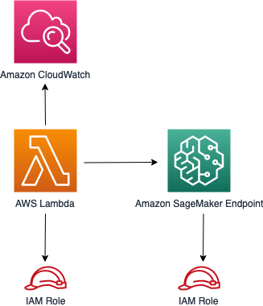

//!!NODE_ROOT <section>
//== aws-lambda-sagemakerendpoint module

[.topic]
= aws-lambda-sagemakerendpoint
:info_doctype: section
:info_title: aws-lambda-sagemakerendpoint

image:https://img.shields.io/badge/stability-Experimental-important.svg?style=for-the-badge[Stability:Experimental]

____
All classes are under active development and subject to non-backward
compatible changes or removal in any future version. These are not
subject to the https://semver.org/[Semantic Versioning] model. This
means that while you may use them, you may need to update your source
code when upgrading to a newer version of this package.
____

'''''

[width="100%",cols="<23%,<77%",options="header",]
|===
|*Reference Documentation*:
|https://docs.aws.amazon.com/solutions/latest/constructs/
|===

[width="100%",cols="<60%,40%",options="header",]
|===
|*Language* |*Package*
|image:https://docs.aws.amazon.com/images/solutions/latest/constructs/images/python32.png[Python
Logo] Python
|`aws_solutions_constructs.aws_lambda_sagemakerendpoint`

|image:https://docs.aws.amazon.com/images/solutions/latest/constructs/images/typescript32.png[Typescript
Logo] Typescript
|`@aws-solutions-constructs/aws-lambda-sagemakerendpoint`

|image:https://docs.aws.amazon.com/images/solutions/latest/constructs/images/java32.png[Java
Logo] Java
|`software.amazon.awsconstructs.services.lambdasagemakerendpoint`
|===

== Overview

This AWS Solutions Construct implements an AWS Lambda function connected
to an Amazon Sagemaker Endpoint.

Here is a minimal deployable pattern definition:

====
[role="tablist"]
Typescript::
+
[source,typescript]
----
import { Construct } from 'constructs';
import { Stack, StackProps, Duration } from 'aws-cdk-lib';
import * as lambda from 'aws-cdk-lib/aws-lambda';
import { LambdaToSagemakerEndpoint, LambdaToSagemakerEndpointProps } from '@aws-solutions-constructs/aws-lambda-sagemakerendpoint';

const constructProps: LambdaToSagemakerEndpointProps = {
  modelProps: {
    primaryContainer: {
      image: '<AccountId>.dkr.ecr.<region>.amazonaws.com/linear-learner:latest',
      modelDataUrl: "s3://<bucket-name>/<prefix>/model.tar.gz",
    },
  },
  lambdaFunctionProps: {
    runtime: lambda.Runtime.PYTHON_3_8,
    code: lambda.Code.fromAsset(`lambda`),
    handler: 'index.handler',
    timeout: Duration.minutes(5),
    memorySize: 128,
  },
};

new LambdaToSagemakerEndpoint(this, 'LambdaToSagemakerEndpointPattern', constructProps);
----

Python::
+
[source,python]
----
from constructs import Construct
from aws_solutions_constructs.aws_lambda_sagemakerendpoint import LambdaToSagemakerEndpoint, LambdaToSagemakerEndpointProps
from aws_cdk import (
    aws_lambda as _lambda,
    aws_sagemaker as sagemaker,
    Duration,
    Stack
)
from constructs import Construct

LambdaToSagemakerEndpoint(
    self, 'LambdaToSagemakerEndpointPattern',
    model_props=sagemaker.CfnModelProps(
        primary_container=sagemaker.CfnModel.ContainerDefinitionProperty(
            image='<AccountId>.dkr.ecr.<region>.amazonaws.com/linear-learner:latest',
            model_data_url='s3://<bucket-name>/<prefix>/model.tar.gz',
        ),
        execution_role_arn="executionRoleArn"
    ),
    lambda_function_props=_lambda.FunctionProps(
        code=_lambda.Code.from_asset('lambda'),
        runtime=_lambda.Runtime.PYTHON_3_14,
        handler='index.handler',
        timeout=Duration.minutes(5),
        memory_size=128
    ))
----

Java::
+
[source,java]
----
import software.constructs.Construct;

import software.amazon.awscdk.Stack;
import software.amazon.awscdk.StackProps;
import software.amazon.awscdk.Duration;
import software.amazon.awscdk.services.lambda.*;
import software.amazon.awscdk.services.lambda.Runtime;
import software.amazon.awscdk.services.sagemaker.*;
import software.amazon.awsconstructs.services.lambdasagemakerendpoint.*;

new LambdaToSagemakerEndpoint(this, "LambdaToSagemakerEndpointPattern",
        new LambdaToSagemakerEndpointProps.Builder()
                .modelProps(new CfnModelProps.Builder()
                        .primaryContainer(new CfnModel.ContainerDefinitionProperty.Builder()
                                .image("<AccountId>.dkr.ecr.<region>.amazonaws.com/linear_learner:latest")
                                .modelDataUrl("s3://<bucket_name>/<prefix>/model.tar.gz")
                                .build())
                        .executionRoleArn("executionRoleArn")
                        .build())
                .lambdaFunctionProps(new FunctionProps.Builder()
                        .runtime(Runtime.NODEJS_22_X)
                        .code(Code.fromAsset("lambda"))
                        .handler("index.handler")
                        .timeout(Duration.minutes(5))
                        .build())
                .build());
----
====

== Pattern Construct Props

[width="100%",cols="<30%,<35%,35%",options="header",]
|===
|*Name* |*Type* |*Description*
|existingLambdaObj?
|https://docs.aws.amazon.com/cdk/api/v2/docs/aws-cdk-lib.aws_lambda.Function.html[`lambda.Function`]
|Optional - instance of an existing Lambda Function object, providing both this and `lambdaFunctionProps` will cause an error.

|lambdaFunctionProps?
|https://docs.aws.amazon.com/cdk/api/v2/docs/aws-cdk-lib.aws_lambda.FunctionProps.html[`lambda.FunctionProps`]
|Optional - user provided props to override the default props for the Lambda function. Providing both this and `existingLambdaObj` causes an error.

|existingSagemakerEndpointObj?
|https://docs.aws.amazon.com/cdk/api/v2/docs/aws-cdk-lib.aws_sagemaker.CfnEndpoint.html[`sagemaker.CfnEndpoint`]
|An optional, existing SageMaker Endpoint to be used. Providing both
this and `endpointProps?` will cause an error.

|modelProps?
|https://docs.aws.amazon.com/cdk/api/v2/docs/aws-cdk-lib.aws_sagemaker.CfnModelProps.html[`sagemaker.CfnModelProps`]
{vbar} `any` |User-provided properties to override the default
properties for the SageMaker Model. At least
`modelProps?.primaryContainer` must be provided to create a model. By
default, the pattern will create a role with the minimum required
permissions, but the client can provide a custom role with additional
capabilities using `modelProps?.executionRoleArn`.

|endpointConfigProps?
|https://docs.aws.amazon.com/cdk/api/v2/docs/aws-cdk-lib.aws_sagemaker.CfnEndpointConfigProps.html[`sagemaker.CfnEndpointConfigProps`]
|Optional user-provided properties to override the default properties
for the SageMaker Endpoint Config.

|endpointProps?
|https://docs.aws.amazon.com/cdk/api/v2/docs/aws-cdk-lib.aws_sagemaker.CfnEndpointProps.html[`sagemaker.CfnEndpointProps`]
|Optional user-provided properties to override the default properties
for the SageMaker Endpoint Config.

|existingVpc?
|https://docs.aws.amazon.com/cdk/api/v2/docs/aws-cdk-lib.aws_ec2.IVpc.html[`ec2.IVpc`]
|An optional, existing VPC into which this construct should be deployed.
When deployed in a VPC, the Lambda function and Sagemaker Endpoint will
use ENIs in the VPC to access network resources. An Interface Endpoint
will be created in the VPC for Amazon SageMaker Runtime, and Amazon S3
VPC Endpoint. If an existing VPC is provided, the `deployVpc?` property
cannot be `true`.

|vpcProps?
|https://docs.aws.amazon.com/cdk/api/v2/docs/aws-cdk-lib.aws_ec2.VpcProps.html[`ec2.VpcProps`]
|Optional user-provided properties to override the default properties
for the new VPC. `enableDnsHostnames`, `enableDnsSupport`, `natGateways`
and `subnetConfiguration` are set by the Construct, so any values for
those properties supplied here will be overridden. If `deployVpc?` is
not `true` then this property will be ignored.

|deployVpc? |`boolean` |Whether to create a new VPC based on `vpcProps`
into which to deploy this pattern. Setting this to true will deploy the
minimal, most private VPC to run the pattern:

|sagemakerEnvironmentVariableName? |`string` |Optional Name for the
Lambda function environment variable set to the name of the SageMaker
endpoint. Default: SAGEMAKER_ENDPOINT_NAME
|===

== Pattern Properties

[width="100%",cols="<10%,<45%,45%",options="header",]
|===
|*Name* |*Type* |*Description*
|lambdaFunction
|https://docs.aws.amazon.com/cdk/api/v2/docs/aws-cdk-lib.aws_lambda.Function.html[`lambda.Function`]
|Returns an instance of the Lambda function created by the pattern.

|sagemakerEndpoint
|https://docs.aws.amazon.com/cdk/api/v2/docs/aws-cdk-lib.aws_sagemaker.CfnEndpoint.html[`sagemaker.CfnEndpoint`]
|Returns an instance of the SageMaker Endpoint created by the pattern.

|sagemakerEndpointConfig?
|https://docs.aws.amazon.com/cdk/api/v2/docs/aws-cdk-lib.aws_sagemaker.CfnEndpointConfig.html[`sagemaker.CfnEndpointConfig`]
|Returns an instance of the SageMaker EndpointConfig created by the
pattern, if `existingSagemakerEndpointObj?` is not provided.

|sagemakerModel?
|https://docs.aws.amazon.com/cdk/api/v2/docs/aws-cdk-lib.aws_sagemaker.CfnModel.html[`sagemaker.CfnModel`]
|Returns an instance of the SageMaker Model created by the pattern, if
`existingSagemakerEndpointObj?` is not provided.

|vpc? |`ec2.IVpc` |Returns an instance of the VPC created by the
pattern, if `deployVpc?` is `true`, or `existingVpc?` is provided.
|===

== Default settings

Out of the box implementation of the Construct without any override will
set the following defaults:

=== AWS Lambda Function

* Configure limited privilege access IAM role for Lambda function
* Enable reusing connections with Keep-Alive for NodeJs Lambda function
* Allow the function to invoke the SageMaker endpoint for Inferences
* Configure the function to access resources in the VPC, where the
SageMaker endpoint is deployed
* Enable X-Ray Tracing
* Set environment variables:
** (default) SAGEMAKER_ENDPOINT_NAME
** AWS_NODEJS_CONNECTION_REUSE_ENABLED (for Node 10.x
and higher functions).

=== Amazon SageMaker Endpoint

* Configure limited privilege to create SageMaker resources
* Deploy SageMaker model, endpointConfig, and endpoint
* Configure the SageMaker endpoint to be deployed in a VPC
* Deploy S3 VPC Endpoint and SageMaker Runtime VPC Interface

== Architecture

== Example Lambda Function Implementation

While Solutions Constructs does not publish code for the Lambda function to interact with SageMaker, this repo has several SageMaker examples: https://github.com/awsdocs/aws-doc-sdk-examples/tree/main/javascriptv3/example_code/sagemaker[examples]. (these examples are in JavaScript, but examples in other languages can also be found at this site)

// github block

'''''

© Copyright Amazon.com, Inc. or its affiliates. All Rights Reserved.
