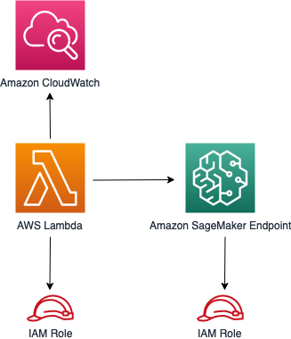

# aws-lambda-sagemakerendpoint module

<!--BEGIN STABILITY BANNER-->

---


> All classes are under active development and subject to non-backward compatible changes or removal in any
> future version. These are not subject to the [Semantic Versioning](https://semver.org/) model.
> This means that while you may use them, you may need to update your source code when upgrading to a newer version of this package.

---

<!--END STABILITY BANNER-->

| **Reference Documentation**: | <span style="font-weight: normal">https://docs.aws.amazon.com/solutions/latest/constructs/</span> |
| :--------------------------- | :------------------------------------------------------------------------------------------------ |


<div style="height:8px"></div>

| **Language**                                                                                   | **Package**                                                      |
| :--------------------------------------------------------------------------------------------- | ---------------------------------------------------------------- |
|  Python             | `aws_solutions_constructs.aws_lambda_sagemakerendpoint`          |
|  Typescript | `@aws-solutions-constructs/aws-lambda-sagemakerendpoint`         |
|  Java                   | `software.amazon.awsconstructs.services.lambdasagemakerendpoint` |

This AWS Solutions Construct implements an AWS Lambda function connected to an Amazon Sagemaker Endpoint.

Here is a minimal deployable pattern definition in Typescript:

```typescript
import * as iam from '@aws-cdk/aws-iam';
import { Duration } from '@aws-cdk/core';
import * as lambda from '@aws-cdk/aws-lambda';
import {
  LambdaToSagemakerEndpoint,
  LambdaToSagemakerEndpointProps,
} from '@aws-solutions-constructs/aws-lambda-sagemakerendpoint';

// Create IAM Role to be assumed by Sagemaker. You may want to scope down the Role permissions
const sagemakerRole = new iam.Role(stack, 'SagemakerRole', {
  assumedBy: new iam.ServicePrincipal('sagemaker.amazonaws.com'),
});
sagemakerRole.addManagedPolicy(iam.ManagedPolicy.fromAwsManagedPolicyName('AmazonSageMakerFullAccess'));
sagemakerRole.addToPolicy(
  new iam.PolicyStatement({
    actions: ['s3:GetObject', 's3:PutObject', 's3:DeleteObject', 's3:ListBucket'],
    resources: ['arn:aws:s3:::*'],
  })
);
const patternProps: LambdaToSagemakerEndpointProps = {
  modelProps: {
    executionRoleArn: sagemakerRole.roleArn,
    primaryContainer: {
      image: '<AccountId>.dkr.ecr.<region>.amazonaws.com/linear-learner:latest',
      modelDataUrl: 's3://<bucket-name>/<prefix>/model.tar.gz',
    },
  },
  lambdaFunctionProps: {
    runtime: lambda.Runtime.PYTHON_3_8,
    code: lambda.Code.fromAsset(`${__dirname}/lambda`),
    handler: 'index.handler',
    timeout: Duration.minutes(5),
    memorySize: 128,
  },
  role: sagemakerRole,
};

new LambdaToSagemakerEndpoint(this, 'LambdaToSagemakerEndpointPattern', props);
```

## Initializer

```text
new LambdaToSagemakerEndpoint(this, 'LambdaToSagemakerEndpointPattern', props);
```

_Parameters_

- scope [`Construct`](https://docs.aws.amazon.com/cdk/api/latest/docs/@aws-cdk_core.Construct.html)
- id `string`
- props [`LambdaToSagemakerEndpointProps`](#pattern-construct-props)

## Pattern Construct Props

| **Name**                      | **Type**                                                                                                                                 | **Description**                                                                                                                                                                                                                                                                                                                                                                                                                                                                                                                                                                                                                                                                       |
| :---------------------------- | :--------------------------------------------------------------------------------------------------------------------------------------- | ------------------------------------------------------------------------------------------------------------------------------------------------------------------------------------------------------------------------------------------------------------------------------------------------------------------------------------------------------------------------------------------------------------------------------------------------------------------------------------------------------------------------------------------------------------------------------------------------------------------------------------------------------------------------------------- |
| existingLambdaObj?            | [`lambda.Function`](https://docs.aws.amazon.com/cdk/api/latest/docs/@aws-cdk_aws-lambda.Function.html)                                   | An optional, existing Lambda function to be used instead of the default function. If an existing function is provided, the `lambdaFunctionProps` property will be ignored.                                                                                                                                                                                                                                                                                                                                                                                                                                                                                                            |
| lambdaFunctionProps?          | [`lambda.FunctionProps`](https://docs.aws.amazon.com/cdk/api/latest/docs/@aws-cdk_aws-lambda.FunctionProps.html)                         | Optional user-provided properties to override the default properties for the Lambda function. Ignored if an `existingLambdaObj` is provided.                                                                                                                                                                                                                                                                                                                                                                                                                                                                                                                                          |  |
| existingSagemakerEndpointObj? | [`sagemaker.CfnEndpoint`](https://docs.aws.amazon.com/cdk/api/latest/docs/@aws-cdk_aws-sagemaker.CfnEndpoint.html)                       | An optional, existing Sagemaker Enpoint to be used. if this is set then the `modelProps?`, `endpointConfigProps?`, and `endpointProps?` are ignored                                                                                                                                                                                                                                                                                                                                                                                                                                                                                                                                   |
| modelProps?                   | [`sagemaker.CfnModelProps`](https://docs.aws.amazon.com/cdk/api/latest/docs/@aws-cdk_aws-sagemaker.CfnModelProps.html)                   | Optional user-provided properties to override the default properties for the Sagemaker Model. Ignored if `existingSagemakerEndpointObj?` is provided.                                                                                                                                                                                                                                                                                                                                                                                                                                                                                                                                 |
| endpointConfigProps?          | [`sagemaker.CfnEndpointConfigProps`](https://docs.aws.amazon.com/cdk/api/latest/docs/@aws-cdk_aws-sagemaker.CfnEndpointConfigProps.html) | Optional user-provided properties to override the default properties for the Sagemaker Endpoint Config. Ignored if `existingSagemakerEndpointObj?` is provided.                                                                                                                                                                                                                                                                                                                                                                                                                                                                                                                       |
| endpointProps?                | [`sagemaker.CfnEndpointProps`](https://docs.aws.amazon.com/cdk/api/latest/docs/@aws-cdk_aws-sagemaker.CfnEndpointProps.html)             | Optional user-provided properties to override the default properties for the Sagemaker Endpoint Config. Ignored if `existingSagemakerEndpointObj?` is provided.                                                                                                                                                                                                                                                                                                                                                                                                                                                                                                                       |
| existingVpc?                  | `ec2.IVpc`                                                                                                                               | An optional, existing VPC into which this construct should be deployed. When deployed in a VPC, the Lambda function and Sagemaker Endpoint will use ENIs in the VPC to access network resources. An Interface Endpoint will be created in the VPC for Amazon Sagemaker Runtime, and Amazon S3 VPC Endpoint. If an existing VPC is provided, the `deployVpc?` property cannot be `true`.                                                                                                                                                                                                                                                                                               |
| vpcProps?                     | `ec2.VpcProps`                                                                                                                           | Optional user-provided properties to override the default properties for the new VPC. `enableDnsHostnames`, `enableDnsSupport`, `natGateways` and `subnetConfiguration` are set by the Construct, so any values for those properties supplied here will be overrriden. If `deployVpc?` is not `true` then this property will be ignored.                                                                                                                                                                                                                                                                                                                                              |
| deployVpc?                    | `boolean`                                                                                                                                | Whether to create a new VPC based on defaults properties, or user-provided `vpcProps`, into which to deploy this construct. Setting this to `true` will deploy the minimal, most private VPC to run the construct. By default, the resources will be deployed in isolated subnets. If the `deployNatGateWay?` is set to `true`, resources will be deployed in private subnets with two NatGateWays deployed in the public subnets. One isolated, or private, subnet in each Availability Zone used by the CDK program. `enableDnsHostnames` and `enableDnsSupport` will both be set to true. If this property is `true` then `existingVpc?` cannot be specified. Defualts to `false`. |
| deployNatGateway?             | `boolean`                                                                                                                                | Whether to deploy Natgatways in the new VPC (if `deployVpc?` is `true`) to give resources access to the Internet. If `deployNatGateway?` is `true`, the construct creates one Public and one Private subnets for each Availability Zone used by the CDK program. Otherwise, it creates one Isolated subnet per Availability Zone only. Two NatGateways are deployed (for high-availability). Defualts to `false`.                                                                                                                                                                                                                                                                     |
| role?                         | `iam.Role`                                                                                                                               | IAM Role, with all required permissions, to be assumed by Sagemaker Service to create resources. The Role is not required if `existingSagemakerEndpointObj?` is provided.                                                                                                                                                                                                                                                                                                                                                                                                                                                                                                             |

## Pattern Properties

| **Name**                 | **Type**                                                                                                                       | **Description**                                                                                                                 |
| :----------------------- | :----------------------------------------------------------------------------------------------------------------------------- | ------------------------------------------------------------------------------------------------------------------------------- |
| lambdaFunction           | [`lambda.Function`](https://docs.aws.amazon.com/cdk/api/latest/docs/@aws-cdk_aws-lambda.Function.html)                         | Returns an instance of the Lambda function created by the pattern.                                                              |
| sagemakerEndpoint        | [`sagemaker.CfnEndpoint`](https://docs.aws.amazon.com/cdk/api/latest/docs/@aws-cdk_aws-sagemaker.CfnEndpoint.html)             | Returns an instance of the Sagemaker Endpoint created by the pattern.                                                           |
| sagemakerEndpointConfig? | [`sagemaker.CfnEndpointConfig`](https://docs.aws.amazon.com/cdk/api/latest/docs/@aws-cdk_aws-sagemaker.CfnEndpointConfig.html) | Returns an instance of the SageMaker EndpointConfig created by the pattern, if `existingSagemakerEndpointObj?` is not provided. |
| sagemakerModel?          | [`sagemaker.CfnModel`](https://docs.aws.amazon.com/cdk/api/latest/docs/@aws-cdk_aws-sagemaker.CfnModel.html)                   | Returns an instance of the Sagemaker Model created by the pattern, if `existingSagemakerEndpointObj?` is not provided.          |
| vpc?                     | `ec2.IVpc`                                                                                                                     | Returns an instance of the VPC created by the pattern, if `deployVpc?` is `true`, or `existingVpc?` is provided.                |

## Default settings

Out of the box implementation of the Construct without any override will set the following defaults:

### AWS Lambda Function

- Configure limited privilege access IAM role for Lambda function.
- Enable reusing connections with Keep-Alive for NodeJs Lambda function.
- Allow the function to invoke the Sagemaker endpoint for Inferences.
- Configure the function to access resources in the VPC, where the Sagemaker endpoint is deployed.
- Enable X-Ray Tracing.

### Amazon Sagemaker Endpoint

- Deploy Sagemaker model, endpointConfig, and endpoint.
- Enable server-side encryption for Sagemaker Endpoint using customer managed AWS KMS Key.
- Configure the Sagemaker endpoint to be deployed in a VPC.
- Deploy S3 VPC Endpoint and Sagemaker Runtime VPC Interface.
- Enforce encryption of data in transit

## Architecture



---

&copy; Copyright 2020 Amazon.com, Inc. or its affiliates. All Rights Reserved.
