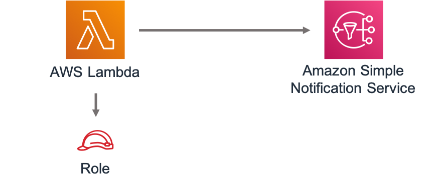

# aws-lambda-sns module
<!--BEGIN STABILITY BANNER-->

---


> All classes are under active development and subject to non-backward compatible changes or removal in any
> future version. These are not subject to the [Semantic Versioning](https://semver.org/) model.
> This means that while you may use them, you may need to update your source code when upgrading to a newer version of this package.

---
<!--END STABILITY BANNER-->

| **Reference Documentation**:| <span style="font-weight: normal">https://docs.aws.amazon.com/solutions/latest/constructs/</span>|
|:-------------|:-------------|
<div style="height:8px"></div>

| **Language**     | **Package**        |
|:-------------|-----------------|
| Python|`aws_solutions_constructs.aws_lambda_sns`|
| Typescript|`@aws-solutions-constructs/aws-lambda-sns`|
| Java|`software.amazon.awsconstructs.services.lambdasns`|

This AWS Solutions Construct implements an AWS Lambda function connected to an Amazon SNS topic.

Here is a minimal deployable pattern definition in Typescript:

``` typescript
import { LambdaToSns, LambdaToSnsProps } from "@aws-solutions-constructs/aws-lambda-sns";

new LambdaToSns(this, 'test-lambda-sns', {
    lambdaFunctionProps: {
        runtime: lambda.Runtime.NODEJS_12_X,
        handler: 'index.handler',
        code: lambda.Code.fromAsset(`${__dirname}/lambda`)
    }
});

```

## Initializer

``` text
new LambdaToSns(scope: Construct, id: string, props: LambdaToSnsProps);
```

_Parameters_

* scope [`Construct`](https://docs.aws.amazon.com/cdk/api/latest/docs/@aws-cdk_core.Construct.html)
* id `string`
* props [`LambdaToSnsProps`](#pattern-construct-props)

## Pattern Construct Props

| **Name**     | **Type**        | **Description** |
|:-------------|:----------------|-----------------|
|existingLambdaObj?|[`lambda.Function`](https://docs.aws.amazon.com/cdk/api/latest/docs/@aws-cdk_aws-lambda.Function.html)|Existing instance of Lambda Function object, if this is set then the lambdaFunctionProps is ignored.|
|lambdaFunctionProps?|[`lambda.FunctionProps`](https://docs.aws.amazon.com/cdk/api/latest/docs/@aws-cdk_aws-lambda.FunctionProps.html)|User provided props to override the default props for the Lambda function.|
|existingTopicObj?|[`sns.Topic`](https://docs.aws.amazon.com/cdk/api/latest/docs/@aws-cdk_aws-lambda.Function.html)|Existing instance of SNS Topic object, if this is set then the topicProps is ignored.|
|topicProps?|[`sns.TopicProps`](https://docs.aws.amazon.com/cdk/api/latest/docs/@aws-cdk_aws-sns.TopicProps.html)|Optional user provided properties to override the default properties for the SNS topic.|

## Pattern Properties

| **Name**     | **Type**        | **Description** |
|:-------------|:----------------|-----------------|
|lambdaFunction|[`lambda.Function`](https://docs.aws.amazon.com/cdk/api/latest/docs/@aws-cdk_aws-lambda.Function.html)|Returns an instance of the Lambda function created by the pattern.|
|snsTopic|[`sns.Topic`](https://docs.aws.amazon.com/cdk/api/latest/docs/@aws-cdk_aws-sns.Topic.html)|Returns an instance of the SNS topic created by the pattern.|

## Default settings

Out of the box implementation of the Construct without any override will set the following defaults:

### AWS Lambda Function
* Configure limited privilege access IAM role for Lambda function
* Enable reusing connections with Keep-Alive for NodeJs Lambda function
* Enable X-Ray Tracing
* Set Environment Variables
  * SNS_TOPIC_NAME
  * SNS_TOPIC_ARN
  * AWS_NODEJS_CONNECTION_REUSE_ENABLED (for Node 10.x and higher functions)

### Amazon SNS Topic
* Configure least privilege access permissions for SNS Topic
* Enable server-side encryption forSNS Topic using AWS managed KMS Key
* Enforce encryption of data in transit

## Architecture


***
&copy; Copyright 2020 Amazon.com, Inc. or its affiliates. All Rights Reserved.