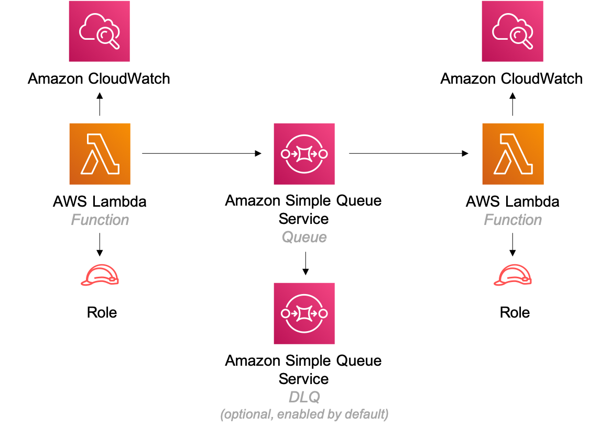

//!!NODE_ROOT <section>
//== aws-lambda-sqs-lambda module

[.topic]
= aws-lambda-sqs-lambda
:info_doctype: section
:info_title: aws-lambda-sqs-lambda

image:https://img.shields.io/badge/cfn--resources-stable-success.svg?style=for-the-badge[Stability:Stable]

[width="100%",cols="<50%,<50%",options="header",]
|===
|*Reference Documentation*:
|https://docs.aws.amazon.com/solutions/latest/constructs/
|===

[width="100%",cols="<46%,54%",options="header",]
|===
|*Language* |*Package*
|image:https://docs.aws.amazon.com/cdk/api/latest/img/python32.png[Python
Logo] Python
|`aws_solutions_constructs.aws_lambda_sqs_lambda`

|image:https://docs.aws.amazon.com/cdk/api/latest/img/typescript32.png[Typescript
Logo] Typescript |`@aws-solutions-constructs/aws-lambda-sqs-lambda`

|image:https://docs.aws.amazon.com/cdk/api/latest/img/java32.png[Java
Logo] Java |`software.amazon.awsconstructs.services.lambdasqslambda`
|===

== Overview

This AWS Solutions Construct implements (1) an AWS Lambda function that
is configured to send messages to a queue; (2) an Amazon SQS queue; and
(3) an AWS Lambda function configured to consume messages from the
queue.

Here is a minimal deployable pattern definition:

====
[role="tablist"]
Typescript::
+
[source,typescript]
----
import { Construct } from 'constructs';
import { Stack, StackProps } from 'aws-cdk-lib';
import { LambdaToSqsToLambda, LambdaToSqsToLambdaProps } from "@aws-solutions-constructs/aws-lambda-sqs-lambda";
import * as lambda from 'aws-cdk-lib/aws-lambda';

new LambdaToSqsToLambda(this, 'LambdaToSqsToLambdaPattern', {
  producerLambdaFunctionProps: {
      runtime: lambda.Runtime.NODEJS_20_X,
      handler: 'index.handler',
      code: lambda.Code.fromAsset(`producer-lambda`)
  },
  consumerLambdaFunctionProps: {
    runtime: lambda.Runtime.NODEJS_20_X,
    handler: 'index.handler',
    code: lambda.Code.fromAsset(`consumer-lambda`)
  }
});
----

Python::
+
[source,python]
----
from aws_solutions_constructs.aws_lambda_sqs_lambda import LambdaToSqsToLambda
from aws_cdk import (
    aws_lambda as _lambda,
    Stack
)
from constructs import Construct

LambdaToSqsToLambda(
    self, 'LambdaToSqsToLambdaPattern',
    producer_lambda_function_props=_lambda.FunctionProps(
        code=_lambda.Code.from_asset('producer_lambda'),
        runtime=_lambda.Runtime.PYTHON_3_11,
        handler='index.handler'
    ),
    consumer_lambda_function_props=_lambda.FunctionProps(
        code=_lambda.Code.from_asset('consumer_lambda'),
        runtime=_lambda.Runtime.PYTHON_3_11,
        handler='index.handler'
    )
)
----

Java::
+
[source,java]
----
import software.constructs.Construct;

import software.amazon.awscdk.Stack;
import software.amazon.awscdk.StackProps;
import software.amazon.awscdk.services.lambda.*;
import software.amazon.awscdk.services.lambda.Runtime;
import software.amazon.awsconstructs.services.lambdasqslambda.*;

new LambdaToSqsToLambda(this, "LambdaToSqsToLambdaPattern", new LambdaToSqsToLambdaProps.Builder()
        .producerLambdaFunctionProps(new FunctionProps.Builder()
                .runtime(Runtime.NODEJS_20_X)
                .code(Code.fromAsset("producer-lambda"))
                .handler("index.handler")
                .build())
        .consumerLambdaFunctionProps(new FunctionProps.Builder()
                .runtime(Runtime.NODEJS_20_X)
                .code(Code.fromAsset("consumer-lambda"))
                .handler("index.handler")
                .build())
        .build());
----
====

== Pattern Construct Props

[width="100%",cols="<30%,<35%,35%",options="header",]
|===
|*Name* |*Type* |*Description*
|existingProducerLambdaObj?
|https://docs.aws.amazon.com/cdk/api/v2/docs/aws-cdk-lib.aws_lambda.Function.html[`lambda.Function`]
|An optional, existing Lambda function to be used instead of the default
function for sending messages to the queue. Providing both this and
`producerLambdaFunctionProps` will cause an error.

|producerLambdaFunctionProps?
|https://docs.aws.amazon.com/cdk/api/v2/docs/aws-cdk-lib.aws_lambda.FunctionProps.html[`lambda.FunctionProps`]
|Optional user-provided properties to override the default properties
for the producer Lambda function.

|existingQueueObj?
|https://docs.aws.amazon.com/cdk/api/v2/docs/aws-cdk-lib.aws_sqs.Queue.html[`sqs.Queue`]
|An optional, existing SQS queue to be used instead of the default
queue. Providing both this and `queueProps` will cause an error.

|queueProps?
|https://docs.aws.amazon.com/cdk/api/v2/docs/aws-cdk-lib.aws_sqs.QueueProps.html[`sqs.QueueProps`]
|Optional user-provided properties to override the default properties
for the SQS queue. Providing both this and `existingQueueObj` will cause
an error.

|deployDeadLetterQueue? |`boolean` |Whether to create a secondary queue
to be used as a dead letter queue. Defaults to `true`.

|deadLetterQueueProps?
|https://docs.aws.amazon.com/cdk/api/v2/docs/aws-cdk-lib.aws_sqs.QueueProps.html[`sqs.QueueProps`]
|Optional user-provided props to override the default props for the dead
letter queue. Only used if the `deployDeadLetterQueue` property is set
to `true`.

|maxReceiveCount? |`number` |The number of times a message can be
unsuccessfully dequeued before being moved to the dead letter queue.
Defaults to `15`.

|existingConsumerLambdaObj?
|https://docs.aws.amazon.com/cdk/api/v2/docs/aws-cdk-lib.aws_lambda.Function.html[`lambda.Function`]
|An optional, existing Lambda function to be used instead of the default
function for receiving/consuming messages from the queue. Providing both
this and `consumerLambdaFunctionProps` will cause an error.

|consumerLambdaFunctionProps?
|https://docs.aws.amazon.com/cdk/api/v2/docs/aws-cdk-lib.aws_lambda.FunctionProps.html[`lambda.FunctionProps`]
|Optional user-provided properties to override the default properties
for the consumer Lambda function.

|queueEnvironmentVariableName? |`string` |Optional Name for the Lambda
function environment variable set to the URL of the queue. Default:
SQS_QUEUE_URL

|sqsEventSourceProps?
|https://docs.aws.amazon.com/cdk/api/v2/docs/aws-cdk-lib.aws_lambda_event_sources.SqsEventSourceProps.html[`SqsEventSourceProps`]
|Optional user provided properties for the queue event source.

|existingVpc?
|https://docs.aws.amazon.com/cdk/api/v2/docs/aws-cdk-lib.aws_ec2.IVpc.html[`ec2.IVpc`]
|An optional, existing VPC into which this pattern should be deployed.
When deployed in a VPC, the Lambda function will use ENIs in the VPC to
access network resources and an Interface Endpoint will be created in
the VPC for Amazon SQS. If an existing VPC is provided, the `deployVpc`
property cannot be `true`. This uses `ec2.IVpc` to allow clients to
supply VPCs that exist outside the stack using the
https://docs.aws.amazon.com/cdk/api/v2/docs/aws-cdk-lib.aws_ec2.Vpc.html#static-fromwbrlookupscope-id-options[`ec2.Vpc.fromLookup()`]
method.

|vpcProps?
|https://docs.aws.amazon.com/cdk/api/v2/docs/aws-cdk-lib.aws_ec2.VpcProps.html[`ec2.VpcProps`]
|Optional user-provided properties to override the default properties
for the new VPC. `enableDnsHostnames`, `enableDnsSupport`, `natGateways`
and `subnetConfiguration` are set by the pattern, so any values for
those properties supplied here will be overridden. If `deployVpc` is not
`true` then this property will be ignored.

|deployVpc? |`boolean` |Whether to create a new VPC based on `vpcProps`
into which to deploy this pattern. Setting this to true will deploy the
minimal, most private VPC to run the pattern:
|===

== Pattern Properties

[width="100%",cols="<30%,<35%,35%",options="header",]
|===
|*Name* |*Type* |*Description*
|producerLambdaFunction
|https://docs.aws.amazon.com/cdk/api/v2/docs/aws-cdk-lib.aws_lambda.Function.html[`lambda.Function`]
|Returns an instance of the producer Lambda function created by the
pattern.

|sqsQueue
|https://docs.aws.amazon.com/cdk/api/v2/docs/aws-cdk-lib.aws_sqs.Queue.html[`sqs.Queue`]
|Returns an instance of the SQS queue created by the pattern.

|deadLetterQueue?
|https://docs.aws.amazon.com/cdk/api/v2/docs/aws-cdk-lib.aws_sqs.Queue.html[`sqs.Queue {vbar} undefined`]
|Returns an instance of the dead letter queue created by the pattern, if
one is deployed.

|consumerLambdaFunction
|https://docs.aws.amazon.com/cdk/api/v2/docs/aws-cdk-lib.aws_lambda.Function.html[`lambda.Function`]
|Returns an instance of the consumer Lambda function created by the
pattern.

|vpc?
|https://docs.aws.amazon.com/cdk/api/v2/docs/aws-cdk-lib.aws_ec2.IVpc.html[`ec2.IVpc`]
|Returns an interface on the VPC used by the pattern (if any). This may
be a VPC created by the pattern or the VPC supplied to the pattern
constructor.
|===

== Default Settings

Out-of-the-box implementation of this Construct (without any overridden
properties) will adhere to the following defaults:

=== AWS Lambda Functions

* Configure limited privilege access IAM role for Lambda functions.
* Enable reusing connections with Keep-Alive for NodeJs Lambda
functions.
* Enable X-Ray Tracing
* Set Environment Variables
** AWS_NODEJS_CONNECTION_REUSE_ENABLED (for Node 10.x
and higher functions)

=== Amazon SQS Queue

* Deploy a dead letter queue for the primary queue.
* Enable server-side encryption for the primary queue using an AWS
Managed KMS Key.
* Enforce encryption of data in transit

== Architecture

// github block

'''''

© Copyright Amazon.com, Inc. or its affiliates. All Rights Reserved.
