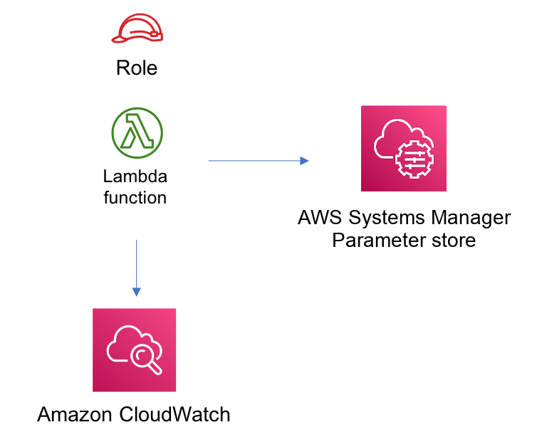

# aws-lambda-ssm-string-parameter module
<!--BEGIN STABILITY BANNER-->

---


> All classes are under active development and subject to non-backward compatible changes or removal in any
> future version. These are not subject to the [Semantic Versioning](https://semver.org/) model.
> This means that while you may use them, you may need to update your source code when upgrading to a newer version of this package.

---
<!--END STABILITY BANNER-->

| **Reference Documentation**:| <span style="font-weight: normal">https://docs.aws.amazon.com/solutions/latest/constructs/</span>|
|:-------------|:-------------|
<div style="height:8px"></div>

| **Language**     | **Package**        |
|:-------------|-----------------|
| Python|`aws_solutions_constructs.aws_lambda_ssm_string_parameter`|
| Typescript|`@aws-solutions-constructs/aws-lambda-ssm-string-parameter`|
| Java|`software.amazon.awsconstructs.services.lambdassmstringparameter`|

This AWS Solutions Construct implements the AWS Lambda function and AWS Systems Manager Parameter Store String parameter with the least privileged permissions.

Here is a minimal deployable pattern definition in Typescript:

``` javascript
const { LambdaToSsmStringParameterProps,  LambdaToSsmStringParameter } from '@aws-solutions-constructs/aws-lambda-ssm-string-parameter';

const props: LambdaToSsmStringParameterProps = {
    lambdaFunctionProps: {
      runtime: lambda.Runtime.NODEJS_14_X,
      // This assumes a handler function in lib/lambda/index.js
      code: lambda.Code.fromAsset(`${__dirname}/lambda`),
      handler: 'index.handler'
    },
};

new LambdaToSsmStringParameter(this, 'test-lambda-ssm-string-parameter-stack', props);

```

## Initializer

``` text
new LambdaToSsmStringParameter(scope: Construct, id: string, props: LambdaToSsmStringParameterProps);
```

_Parameters_

* scope [`Construct`](https://docs.aws.amazon.com/cdk/api/latest/docs/@aws-cdk_core.Construct.html)
* id `string`
* props [`LambdaToSsmStringParameterProps`](#pattern-construct-props)

## Pattern Construct Props

| **Name**     | **Type**        | **Description** |
|:-------------|:----------------|-----------------|
|existingLambdaObj?|[`lambda.Function`](https://docs.aws.amazon.com/cdk/api/latest/docs/@aws-cdk_aws-lambda.Function.html)|Existing instance of Lambda Function object, if this is set then the lambdaFunctionProps is ignored.|
|lambdaFunctionProps?|[`lambda.FunctionProps`](https://docs.aws.amazon.com/cdk/api/latest/docs/@aws-cdk_aws-lambda.FunctionProps.html)|User provided props to override the default props for the Lambda function.|
|stringParameterProps?|[`ssm.StringParameterProps`](https://docs.aws.amazon.com/cdk/api/latest/docs/@aws-cdk_aws-ssm.StringParameterProps.html)|Optional user provided props to override the default props for SSM String parameter. If existingStringParameterObj is not set stringParameterProps is required.|
|existingStringParameterObj?|[`ssm.StringParameter`](https://docs.aws.amazon.com/cdk/api/latest/docs/@aws-cdk_aws-ssm.StringParameter.html)|Existing instance of SSM String parameter object, If this is set then the stringParameterProps is ignored|
|stringParameterEnvironmentVariableName?|`string`|Optional Name for the SSM String parameter environment variable set for the Lambda function.|
|existingVpc?|[`ec2.IVpc`](https://docs.aws.amazon.com/cdk/api/latest/docs/@aws-cdk_aws-ec2.IVpc.html)|An optional, existing VPC into which this pattern should be deployed. When deployed in a VPC, the Lambda function will use ENIs in the VPC to access network resources and an Interface Endpoint will be created in the VPC for AWS Systems Manager Parameter. If an existing VPC is provided, the `deployVpc` property cannot be `true`. This uses `ec2.IVpc` to allow clients to supply VPCs that exist outside the stack using the [`ec2.Vpc.fromLookup()`](https://docs.aws.amazon.com/cdk/api/latest/docs/@aws-cdk_aws-ec2.Vpc.html#static-fromwbrlookupscope-id-options) method.|
|vpcProps?|[`ec2.VpcProps`](https://docs.aws.amazon.com/cdk/api/latest/docs/@aws-cdk_aws-ec2.VpcProps.html)|Optional user-provided properties to override the default properties for the new VPC. `enableDnsHostnames`, `enableDnsSupport`, `natGateways` and `subnetConfiguration` are set by the pattern, so any values for those properties supplied here will be overrriden. If `deployVpc` is not `true` then this property will be ignored.|
|deployVpc?|`boolean`|Whether to create a new VPC based on `vpcProps` into which to deploy this pattern. Setting this to true will deploy the minimal, most private VPC to run the pattern:<ul><li> One isolated subnet in each Availability Zone used by the CDK program</li><li>`enableDnsHostnames` and `enableDnsSupport` will both be set to true</li></ul>If this property is `true` then `existingVpc` cannot be specified. Defaults to `false`.|

## Pattern Properties

| **Name**     | **Type**        | **Description** |
|:-------------|:----------------|-----------------|
|lambdaFunction|[`lambda.Function`](https://docs.aws.amazon.com/cdk/api/latest/docs/@aws-cdk_aws-lambda.Function.html)|Returns an instance of lambda.Function created by the construct|
|stringParameter|[`ssm.StringParameter`](https://docs.aws.amazon.com/cdk/api/latest/docs/@aws-cdk_aws-ssm.StringParameter.html)|Returns an instance of ssm.StringParameter created by the construct|
|vpc?|[`ec2.IVpc`](https://docs.aws.amazon.com/cdk/api/latest/docs/@aws-cdk_aws-ec2.IVpc.html)|Returns an interface on the VPC used by the pattern (if any). This may be a VPC created by the pattern or the VPC supplied to the pattern constructor.|

## Default settings

Out of the box implementation of the Construct without any override will set the following defaults:

### AWS Lambda Function
* Configure limited privilege access IAM role for Lambda function
* Enable reusing connections with Keep-Alive for NodeJs Lambda function
* Enable X-Ray Tracing
* Set Environment Variables
  * (default) SSM_STRING_PARAMETER_NAME
  * AWS_NODEJS_CONNECTION_REUSE_ENABLED (for Node 10.x and higher functions)

### Amazon AWS Systems Manager Parameter Store String
* Enable read-only access for the associated AWS Lambda Function
* Creates a new SSM String parameter with the values provided
* Retain the SSM String parameter when deleting the CloudFormation stack

## Architecture


***
&copy; Copyright 2021 Amazon.com, Inc. or its affiliates. All Rights Reserved.
