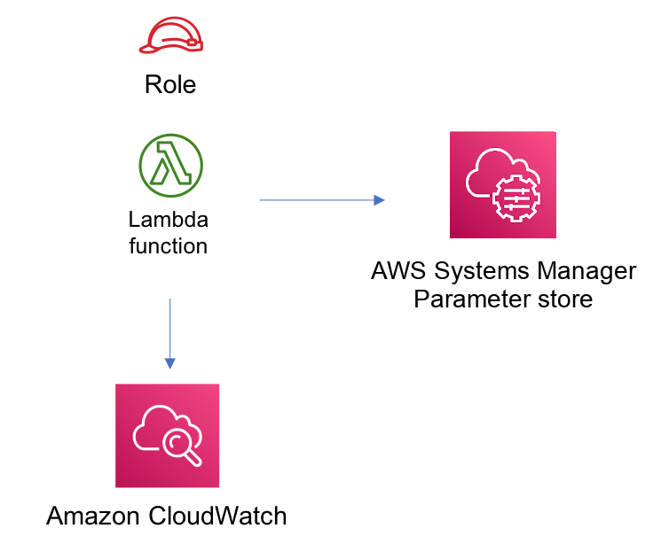

//!!NODE_ROOT <section>
//== aws-lambda-ssmstringparameter module

[.topic]
= aws-lambda-ssmstringparameter
:info_doctype: section
:info_title: aws-lambda-ssmstringparameter

image::https://img.shields.io/badge/stability-Experimental-important.svg?style=for-the-badge[Stability:Experimental]

____
All classes are under active development and subject to non-backward
compatible changes or removal in any future version. These are not
subject to the https://semver.org/[Semantic Versioning] model. This
means that while you may use them, you may need to update your source
code when upgrading to a newer version of this package.
____

[width="100%",cols="<50%,<50%",options="header",]
|===
|*Reference Documentation*:
|https://docs.aws.amazon.com/solutions/latest/constructs/
|===

[width="100%",cols="<46%,54%",options="header",]
|===
|*Language* |*Package*
|image:https://docs.aws.amazon.com/cdk/api/latest/img/python32.png[Python
Logo] Python
|`aws_solutions_constructs.aws_lambda_ssm_string_parameter`

|image:https://docs.aws.amazon.com/cdk/api/latest/img/typescript32.png[Typescript
Logo] Typescript
|`@aws-solutions-constructs/aws-lambda-ssmstringparameter`

|image:https://docs.aws.amazon.com/cdk/api/latest/img/java32.png[Java
Logo] Java
|`software.amazon.awsconstructs.services.lambdassmstringparameter`
|===

== Overview

This AWS Solutions Construct implements the AWS Lambda function and AWS
Systems Manager Parameter Store String parameter with the least
privileged permissions.

Here is a minimal deployable pattern definition:

====
[role="tablist"]
Typescript::
+
[source,typescript]
----
import { Construct } from 'constructs';
import { Stack, StackProps } from 'aws-cdk-lib';
import { LambdaToSsmstringparameterProps,  LambdaToSsmstringparameter } from '@aws-solutions-constructs/aws-lambda-ssmstringparameter';
import * as lambda from 'aws-cdk-lib/aws-lambda';

const constructProps: LambdaToSsmstringparameterProps = {
  lambdaFunctionProps: {
    runtime: lambda.Runtime.NODEJS_20_X,
    code: lambda.Code.fromAsset(`lambda`),
    handler: 'index.handler'
  },
  stringParameterProps: { stringValue: "test-string-value" }
};

new LambdaToSsmstringparameter(this, 'test-lambda-ssmstringparameter-stack', constructProps);
----

Python::
+
[source,python]
----
from aws_solutions_constructs.aws_lambda_ssmstringparameter import LambdaToSsmstringparameter
from aws_cdk import (
    aws_lambda as _lambda,
    aws_ssm as ssm,
    Stack
)
from constructs import Construct

LambdaToSsmstringparameter(
    self, 'test-lambda-ssmstringparameter-stack',
    lambda_function_props=_lambda.FunctionProps(
        code=_lambda.Code.from_asset('lambda'),
        runtime=_lambda.Runtime.PYTHON_3_11,
        handler='index.handler'
    ),
    string_parameter_props=ssm.StringParameterProps(
        string_value="test-string-value")
)
----

Java::
+
[source,java]
----
import software.constructs.Construct;

import software.amazon.awscdk.Stack;
import software.amazon.awscdk.StackProps;
import software.amazon.awscdk.services.lambda.*;
import software.amazon.awscdk.services.lambda.Runtime;
import software.amazon.awscdk.services.ssm.*;
import software.amazon.awsconstructs.services.lambdassmstringparameter.*;

new LambdaToSsmstringparameter(this, "test-lambda-ssmstringparameter-stack",
        new LambdaToSsmstringparameterProps.Builder()
                .lambdaFunctionProps(new FunctionProps.Builder()
                        .runtime(Runtime.NODEJS_20_X)
                        .code(Code.fromAsset("lambda"))
                        .handler("index.handler")
                        .build())
                .stringParameterProps(new StringParameterProps.Builder()
                        .stringValue("test-string-value")
                        .build())
                .build());
----
====

== Pattern Construct Props

[width="100%",cols="<30%,<35%,35%",options="header",]
|===
|*Name* |*Type* |*Description*
|existingLambdaObj?
|https://docs.aws.amazon.com/cdk/api/v2/docs/aws-cdk-lib.aws_lambda.Function.html[`lambda.Function`]
|Existing instance of Lambda Function object, providing both this and
`lambdaFunctionProps` will cause an error.

|lambdaFunctionProps?
|https://docs.aws.amazon.com/cdk/api/v2/docs/aws-cdk-lib.aws_lambda.FunctionProps.html[`lambda.FunctionProps`]
|User provided props to override the default props for the Lambda
function.

|existingStringParameterObj?
|https://docs.aws.amazon.com/cdk/api/v2/docs/aws-cdk-lib.aws_ssm.StringParameter.html[`ssm.StringParameter`]
|Existing instance of SSM String parameter object, providing both this
and `stringParameterProps` will cause an error

|stringParameterProps?
|https://docs.aws.amazon.com/cdk/api/v2/docs/aws-cdk-lib.aws_ssm.StringParameterProps.html[`ssm.StringParameterProps`]
|Optional user provided props to override the default props for SSM
String parameter. If existingStringParameterObj is not set
stringParameterProps is required. The only supported
https://docs.aws.amazon.com/cdk/api/v2/docs/aws-cdk-lib.aws_ssm.StringParameterProps.html#type[`ssm.StringParameterProps.type`]
is
https://docs.aws.amazon.com/cdk/api/v2/docs/aws-cdk-lib.aws_ssm.ParameterType.html#string[`STRING`]
if a different value is provided it will be overridden.

|stringParameterEnvironmentVariableName? |`string` |Optional Name for
the Lambda function environment variable set to the name of the
parameter. Default: SSM_STRING_PARAMETER_NAME

|existingVpc?
|https://docs.aws.amazon.com/cdk/api/v2/docs/aws-cdk-lib.aws_ec2.IVpc.html[`ec2.IVpc`]
|An optional, existing VPC into which this pattern should be deployed.
When deployed in a VPC, the Lambda function will use ENIs in the VPC to
access network resources and an Interface Endpoint will be created in
the VPC for AWS Systems Manager Parameter. If an existing VPC is
provided, the `deployVpc` property cannot be `true`. This uses
`ec2.IVpc` to allow clients to supply VPCs that exist outside the stack
using the
https://docs.aws.amazon.com/cdk/api/v2/docs/aws-cdk-lib.aws_ec2.Vpc.html#static-fromwbrlookupscope-id-options[`ec2.Vpc.fromLookup()`]
method.

|vpcProps?
|https://docs.aws.amazon.com/cdk/api/v2/docs/aws-cdk-lib.aws_ec2.VpcProps.html[`ec2.VpcProps`]
|Optional user-provided properties to override the default properties
for the new VPC. `enableDnsHostnames`, `enableDnsSupport`, `natGateways`
and `subnetConfiguration` are set by the pattern, so any values for
those properties supplied here will be overridden. If `deployVpc` is not
`true` then this property will be ignored.

|deployVpc? |`boolean` |Whether to create a new VPC based on `vpcProps`
into which to deploy this pattern. Setting this to true will deploy the
minimal, most private VPC to run the pattern:

|stringParameterPermissions |`string` |Optional SSM String parameter
permissions to grant to the Lambda function. One of the following may be
specified: "`Read`", "`ReadWrite`".
|===

== Pattern Properties

[width="100%",cols="<30%,<35%,35%",options="header",]
|===
|*Name* |*Type* |*Description*
|lambdaFunction
|https://docs.aws.amazon.com/cdk/api/v2/docs/aws-cdk-lib.aws_lambda.Function.html[`lambda.Function`]
|Returns an instance of lambda.Function created by the construct

|stringParameter
|https://docs.aws.amazon.com/cdk/api/v2/docs/aws-cdk-lib.aws_ssm.StringParameter.html[`ssm.StringParameter`]
|Returns an instance of ssm.StringParameter created by the construct

|vpc?
|https://docs.aws.amazon.com/cdk/api/v2/docs/aws-cdk-lib.aws_ec2.IVpc.html[`ec2.IVpc`]
|Returns an interface on the VPC used by the pattern (if any). This may
be a VPC created by the pattern or the VPC supplied to the pattern
constructor.
|===

== Default settings

Out of the box implementation of the Construct without any override will
set the following defaults:

=== AWS Lambda Function

* Configure limited privilege access IAM role for Lambda function
* Enable reusing connections with Keep-Alive for NodeJs Lambda function
* Enable X-Ray Tracing
* Set Environment Variables
** (default) SSM_STRING_PARAMETER_NAME
** AWS_NODEJS_CONNECTION_REUSE_ENABLED (for Node 10.x
and higher functions)

=== Amazon AWS Systems Manager Parameter Store String

* Enable read-only access for the associated AWS Lambda Function
* Creates a new SSM String parameter with the values provided
* Retain the SSM String parameter when deleting the CloudFormation stack

== Architecture

// github block

'''''

© Copyright Amazon.com, Inc. or its affiliates. All Rights Reserved.
