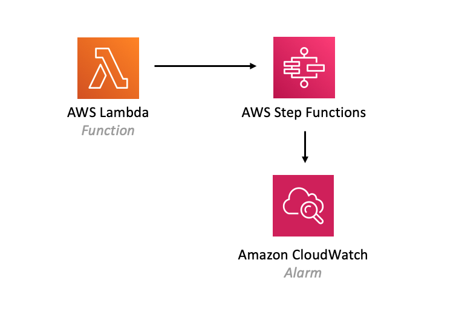

# aws-lambda-stepfunctions module
<!--BEGIN STABILITY BANNER-->

---


---
<!--END STABILITY BANNER-->

| **Reference Documentation**:| <span style="font-weight: normal">https://docs.aws.amazon.com/solutions/latest/constructs/</span>|
|:-------------|:-------------|
<div style="height:8px"></div>

| **Language**     | **Package**        |
|:-------------|-----------------|
| Python|`aws_solutions_constructs.aws_lambda_stepfunctions`|
| Typescript|`@aws-solutions-constructs/aws-lambda-stepfunctions`|
| Java|`software.amazon.awsconstructs.services.lambdastepfunctions`|

## Overview
This AWS Solutions Construct implements an AWS Lambda function connected to an AWS Step Functions.

Here is a minimal deployable pattern definition:

Typescript
``` typescript
import { Construct } from 'constructs';
import { Stack, StackProps } from 'aws-cdk-lib';
import { LambdaToStepfunctions } from '@aws-solutions-constructs/aws-lambda-stepfunctions';
import * as stepfunctions from 'aws-cdk-lib/aws-stepfunctions';
import * as lambda from 'aws-cdk-lib/aws-lambda';

const startState = new stepfunctions.Pass(this, 'StartState');

new LambdaToStepfunctions(this, 'LambdaToStepfunctionsPattern', {
  lambdaFunctionProps: {
    runtime: lambda.Runtime.NODEJS_16_X,
    handler: 'index.handler',
    code: lambda.Code.fromAsset(`lambda`)
  },
  stateMachineProps: {
    definition: startState
  }
});
```

Python
```python
from aws_solutions_constructs.aws_lambda_stepfunctions import LambdaToStepfunctions
from aws_cdk import (
    aws_lambda as _lambda,
    aws_stepfunctions as stepfunctions,
    Stack
)
from constructs import Construct

start_state = stepfunctions.Pass(self, 'start_state')

LambdaToStepfunctions(
    self, 'test-lambda-stepfunctions-stack',
    lambda_function_props=_lambda.FunctionProps(
        code=_lambda.Code.from_asset('lambda'),
        runtime=_lambda.Runtime.PYTHON_3_9,
        handler='index.handler'
    ),
    state_machine_props=stepfunctions.StateMachineProps(
        definition=start_state)
)
```

Java
``` java
import software.constructs.Construct;

import software.amazon.awscdk.Stack;
import software.amazon.awscdk.StackProps;
import software.amazon.awscdk.services.lambda.*;
import software.amazon.awscdk.services.lambda.Runtime;
import software.amazon.awscdk.services.stepfunctions.*;
import software.amazon.awsconstructs.services.lambdastepfunctions.*;

final Pass startState = new Pass(this, "StartState");

new LambdaToStepfunctions(this, "test-lambda-stepfunctions-stack",
        new LambdaToStepfunctionsProps.Builder()
                .lambdaFunctionProps(new FunctionProps.Builder()
                        .runtime(Runtime.NODEJS_16_X)
                        .code(Code.fromAsset("lambda"))
                        .handler("index.handler")
                        .build())
                .stateMachineProps(new StateMachineProps.Builder()
                        .definition(startState)
                        .build())
                .build());
```

## Pattern Construct Props

| **Name**     | **Type**        | **Description** |
|:-------------|:----------------|-----------------|
|existingLambdaObj?|[`lambda.Function`](https://docs.aws.amazon.com/cdk/api/v2/docs/aws-cdk-lib.aws_lambda.Function.html)|Existing instance of Lambda Function object, providing both this and `lambdaFunctionProps` will cause an error.|
|lambdaFunctionProps?|[`lambda.FunctionProps`](https://docs.aws.amazon.com/cdk/api/v2/docs/aws-cdk-lib.aws_lambda.FunctionProps.html)|User provided props to override the default props for the Lambda function.|
|stateMachineProps|[`sfn.StateMachineProps`](https://docs.aws.amazon.com/cdk/api/v2/docs/aws-cdk-lib.aws_stepfunctions.StateMachineProps.html)|User provided props for the sfn.StateMachine.|
|createCloudWatchAlarms|`boolean`|Whether to create recommended CloudWatch alarms|
|logGroupProps?|[`logs.LogGroupProps`](https://docs.aws.amazon.com/cdk/api/v2/docs/aws-cdk-lib.aws_logs.LogGroupProps.html)|User provided props to override the default props for for the CloudWatchLogs LogGroup.|
|stateMachineEnvironmentVariableName?|`string`|Optional Name for the Lambda function environment variable set to the ARN of the state machine. Default: STATE_MACHINE_ARN |
|existingVpc?|[`ec2.IVpc`](https://docs.aws.amazon.com/cdk/api/v2/docs/aws-cdk-lib.aws_ec2.IVpc.html)|An optional, existing VPC into which this pattern should be deployed. When deployed in a VPC, the Lambda function will use ENIs in the VPC to access network resources and an Interface Endpoint will be created in the VPC for Amazon Step Functions. If an existing VPC is provided, the `deployVpc` property cannot be `true`. This uses `ec2.IVpc` to allow clients to supply VPCs that exist outside the stack using the [`ec2.Vpc.fromLookup()`](https://docs.aws.amazon.com/cdk/api/v2/docs/aws-cdk-lib.aws_ec2.Vpc.html#static-fromwbrlookupscope-id-options) method.|
|vpcProps?|[`ec2.VpcProps`](https://docs.aws.amazon.com/cdk/api/v2/docs/aws-cdk-lib.aws_ec2.VpcProps.html)|Optional user-provided properties to override the default properties for the new VPC. `enableDnsHostnames`, `enableDnsSupport`, `natGateways` and `subnetConfiguration` are set by the pattern, so any values for those properties supplied here will be overridden. If `deployVpc` is not `true` then this property will be ignored.|
|deployVpc?|`boolean`|Whether to create a new VPC based on `vpcProps` into which to deploy this pattern. Setting this to true will deploy the minimal, most private VPC to run the pattern:<ul><li> One isolated subnet in each Availability Zone used by the CDK program</li><li>`enableDnsHostnames` and `enableDnsSupport` will both be set to true</li></ul>If this property is `true` then `existingVpc` cannot be specified. Defaults to `false`.|


## Pattern Properties

| **Name**     | **Type**        | **Description** |
|:-------------|:----------------|-----------------|
|lambdaFunction|[`lambda.Function`](https://docs.aws.amazon.com/cdk/api/v2/docs/aws-cdk-lib.aws_lambda.Function.html)|Returns an instance of the Lambda function created by the pattern.|
|stateMachine|[`sfn.StateMachine`](https://docs.aws.amazon.com/cdk/api/v2/docs/aws-cdk-lib.aws_stepfunctions.StateMachine.html)|Returns an instance of StateMachine created by the construct.|
|stateMachineLogGroup|[`logs.ILogGroup`](https://docs.aws.amazon.com/cdk/api/v2/docs/aws-cdk-lib.aws_logs.ILogGroup.html)|Returns an instance of the ILogGroup created by the construct for StateMachine|
|cloudwatchAlarms?|[`cloudwatch.Alarm[]`](https://docs.aws.amazon.com/cdk/api/v2/docs/aws-cdk-lib.aws_cloudwatch.Alarm.html)|Returns a list of alarms created by the construct.|
|vpc?|[`ec2.IVpc`](https://docs.aws.amazon.com/cdk/api/v2/docs/aws-cdk-lib.aws_ec2.IVpc.html)|Returns an interface on the VPC used by the pattern (if any). This may be a VPC created by the pattern or the VPC supplied to the pattern constructor.|

## Default settings

Out of the box implementation of the Construct without any override will set the following defaults:

### AWS Lambda Function
* Configure limited privilege access IAM role for Lambda function
* Enable reusing connections with Keep-Alive for NodeJs Lambda function
* Enable X-Ray Tracing
* Set Environment Variables
  * (default) STATE_MACHINE_ARN
  * AWS_NODEJS_CONNECTION_REUSE_ENABLED (for Node 10.x and higher functions)

### AWS Step Functions
* Enable CloudWatch logging for API Gateway
* Deploy best practices CloudWatch Alarms for the Step Functions

## Architecture


***
&copy; Copyright Amazon.com, Inc. or its affiliates. All Rights Reserved.
