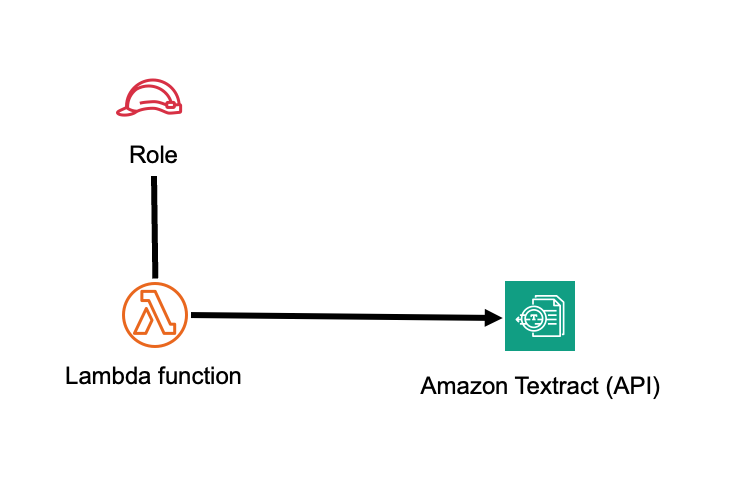
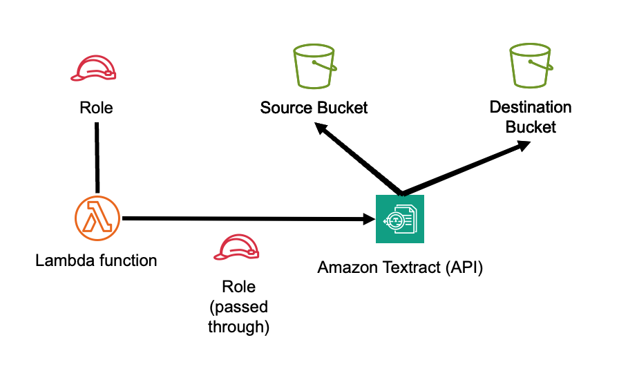

//!!NODE_ROOT <section>
//== aws-lambda-textract module

[.topic]
= aws-lambda-textract
:info_doctype: section
:info_title: aws-lambda-textract

image:https://img.shields.io/badge/stability-Experimental-important.svg?style=for-the-badge[Stability:Experimental]

[width="100%",cols="<50%,<50%",options="header",]
|===
|*Reference Documentation*:
|https://docs.aws.amazon.com/solutions/latest/constructs/
|===

[width="100%",cols="<46%,54%",options="header",]
|===
|*Language* |*Package*
|image:https://docs.aws.amazon.com/images/solutions/latest/constructs/images/python32.png[Python
Logo] Python |`aws_solutions_constructs.aws_lambda_textract`

|image:https://docs.aws.amazon.com/images/solutions/latest/constructs/images/typescript32.png[Typescript
Logo] Typescript |`@aws-solutions-constructs/aws-lambda-textract`

|image:https://docs.aws.amazon.com/images/solutions/latest/constructs/images/java32.png[Java
Logo] Java |`software.amazon.awsconstructs.services.lambdatextract`
|===

== Overview

This AWS Solutions Construct implements an AWS Lambda function connected
to Amazon Textract service. For asynchronous document analysis jobs, the construct
can optionally create source and destination S3 buckets with appropriate IAM
permissions for the Lambda function to interact with both buckets and Amazon
Textract service.

Here is a minimal deployable pattern definition:

====
[role="tablist"]
Typescript::
+
[source,typescript]
----
import { Construct } from 'constructs';
import { Stack, StackProps } from 'aws-cdk-lib';
import { LambdaToTextract } from '@aws-solutions-constructs/aws-lambda-textract';
import * as lambda from 'aws-cdk-lib/aws-lambda';

new LambdaToTextract(this, 'LambdaToTextractPattern', {
    lambdaFunctionProps: {
        runtime: lambda.Runtime.NODEJS_22_X,
        handler: 'index.handler',
        code: lambda.Code.fromAsset(`lambda`)
    }
});
----

Python::
+
[source,python]
----
from aws_solutions_constructs.aws_lambda_textract import LambdaToTextract
from aws_cdk import (
    aws_lambda as _lambda,
    Stack
)
from constructs import Construct

LambdaToTextract(self, 'LambdaToTextractPattern',
        lambda_function_props=_lambda.FunctionProps(
            code=_lambda.Code.from_asset('lambda'),
            runtime=_lambda.Runtime.PYTHON_3_14,
            handler='index.handler'
        )
        )
----

Java::
+
[source,java]
----
import software.constructs.Construct;

import software.amazon.awscdk.Stack;
import software.amazon.awscdk.StackProps;
import software.amazon.awscdk.services.lambda.*;
import software.amazon.awscdk.services.lambda.Runtime;
import software.amazon.awsconstructs.services.lambdatextract.*;

new LambdaToTextract(this, "LambdaToTextractPattern", new LambdaToTextractProps.Builder()
        .lambdaFunctionProps(new FunctionProps.Builder()
                .runtime(Runtime.NODEJS_22_X)
                .code(Code.fromAsset("lambda"))
                .handler("index.handler")
                .build())
        .build());
----
====

== Pattern Construct Props

[width="100%",cols="<30%,<35%,35%",options="header",]
|===
|*Name* |*Type* |*Description*
|existingLambdaObj?
|https://docs.aws.amazon.com/cdk/api/v2/docs/aws-cdk-lib.aws_lambda.Function.html[`lambda.Function`]
|Existing instance of Lambda Function object, providing both this and
`lambdaFunctionProps` will cause an error.

|lambdaFunctionProps?
|https://docs.aws.amazon.com/cdk/api/v2/docs/aws-cdk-lib.aws_lambda.FunctionProps.html[`lambda.FunctionProps`]
|Optional - user provided props to override the default props for the Lambda function. Providing both this and `existingLambdaObj` causes an error.
Function will have these Textract permissions: ['textract:DetectDocumentText', 'textract:AnalyzeDocument', 'textract:AnalyzeExpense', 'textract:AnalyzeID'].
When asyncJobs is true, ['textract:Start/GetDocumentTextDetection', 'textract:Start/GetDocumentAnalysis',
'textract:Start/GetDocumentAnalysis', 'textract:Start/GetLendingAnalysis' ]

|asyncJobs? |`boolean` |Whether to enable asynchronous document analysis jobs. When true, source and destination S3 buckets will be created and the Lambda function will be granted permissions to start and get status of document analysis jobs. Default: false

|existingSourceBucketObj?
|https://docs.aws.amazon.com/cdk/api/v2/docs/aws-cdk-lib.aws_s3.IBucket.html[`s3.IBucket`]
|Existing instance of S3 Bucket object for source documents. If this is provided, then also
providing sourceBucketProps causes an error. Only valid when asyncJobs is true.

|sourceBucketProps?
|https://docs.aws.amazon.com/cdk/api/v2/docs/aws-cdk-lib.aws_s3.BucketProps.html[`s3.BucketProps`]
|Optional user provided props to override the default props for the source S3
Bucket. Only valid when asyncJobs is true.

|existingDestinationBucketObj?
|https://docs.aws.amazon.com/cdk/api/v2/docs/aws-cdk-lib.aws_s3.IBucket.html[`s3.IBucket`]
|Existing instance of S3 Bucket object for analysis results. If this is provided, then also
providing destinationBucketProps causes an error. Only valid when asyncJobs is true.

|destinationBucketProps?
|https://docs.aws.amazon.com/cdk/api/v2/docs/aws-cdk-lib.aws_s3.BucketProps.html[`s3.BucketProps`]
|Optional user provided props to override the default props for the destination S3
Bucket. Only valid when asyncJobs is true.

|useSameBucket? |`boolean` |Whether to use the same S3 bucket for both source and destination files.
When true, only the source bucket will be created and used for both purposes. Only valid when asyncJobs is true. Default: false

|createCustomerManagedOutputBucket? |`boolean` |Whether to create a bucket to receive the output of Textract batch jobs. If this is yes, the construct will set up an S3 bucket for output, if this is false, then Textract jobs will send their output to an AWS managed S3 bucket. Default: true

|existingVpc?
|https://docs.aws.amazon.com/cdk/api/v2/docs/aws-cdk-lib.aws_ec2.IVpc.html[`ec2.IVpc`]
|An optional, existing VPC into which this pattern should be deployed.
When deployed in a VPC, the Lambda function will use ENIs in the VPC to
access network resources and Interface Endpoints will be created in
the VPC for Amazon Textract. If asyncJobs is true, Interface Endpoints for Amazon S3 will also be created. If an existing VPC is provided, the `deployVpc`
property cannot be `true`. This uses `ec2.IVpc` to allow clients to
supply VPCs that exist outside the stack using the
https://docs.aws.amazon.com/cdk/api/v2/docs/aws-cdk-lib.aws_ec2.Vpc.html#static-fromwbrlookupscope-id-options[`ec2.Vpc.fromLookup()`]
method.

|vpcProps?
|https://docs.aws.amazon.com/cdk/api/v2/docs/aws-cdk-lib.aws_ec2.VpcProps.html[`ec2.VpcProps`]
|Optional user provided properties to override the default properties
for the new VPC. `enableDnsHostnames`, `enableDnsSupport`, `natGateways`
and `subnetConfiguration` are set by the pattern, so any values for
those properties supplied here will be overridden. If `deployVpc` is not
`true` then this property will be ignored.

|deployVpc? |`boolean` |Whether to create a new VPC based on `vpcProps`
into which to deploy this pattern. Setting this to true will deploy the
minimal, most private VPC to run the pattern.

|sourceBucketEnvironmentVariableName? |`string` |Optional Name for the Lambda
function environment variable set to the name of the source bucket. Only valid when asyncJobs is true. Default:
SOURCE_BUCKET_NAME

|destinationBucketEnvironmentVariableName? |`string` |Optional Name for the Lambda
function environment variable set to the name of the destination bucket. Only valid when asyncJobs is true. Default:
DESTINATION_BUCKET_NAME

|dataAccessRoleArnEnvironmentVariableName? |`string` |Optional Name for the Lambda
function environment variable set to the ARN of the IAM role used for asynchronous document analysis jobs. Only valid when asyncJobs is true. Default:
SNS_ROLE_ARN

|snsNotificationTopicArnEnvironmentVariableName? |`string` |Optional Name for the Lambda
function environment variable set to the ARN of the SNS topic used for asynchronous job completion notifications. Only valid when asyncJobs is true. Default:
SNS_TOPIC_ARN

|existingNotificationTopicObj?
|https://docs.aws.amazon.com/cdk/api/v2/docs/aws-cdk-lib.aws_lambda.Function.html[`sns.Topic`]
|Optional - existing instance of SNS topic object, providing both this and `notificationTopicProps` will cause an error. Only valid when asyncJobs is true.

|existingNotificationTopicEncryptionKey?
|https://docs.aws.amazon.com/cdk/api/v2/docs/aws-cdk-lib.aws_kms.Key.html[`kms.Key`]
|If an existing topic is provided in the `existingNotificationTopicObj` property, and that topic is encrypted with a customer managed KMS key, this property must specify that key. Only valid when asyncJobs is true.

|notificationTopicProps?
|https://docs.aws.amazon.com/cdk/api/v2/docs/aws-cdk-lib.aws_sns.TopicProps.html[`sns.TopicProps`]
|Optional - user provided properties to override the default properties for the SNS topic. Providing both this and `existingNotificationTopicObj` causes an error. Only valid when asyncJobs is true.

|enableNotificationTopicEncryptionWithCustomerManagedKey? |`boolean` |If no key is
provided, this flag determines whether the SNS Topic is encrypted with a
new CMK or an AWS managed key. This flag is ignored if any of the
following are defined: notificationTopicProps.masterKey, notificationTopicEncryptionKey or
notificationTopicEncryptionKeyProps. Only valid when asyncJobs is true.

|notificationTopicEncryptionKey?
|https://docs.aws.amazon.com/cdk/api/v2/docs/aws-cdk-lib.aws_kms.Key.html[`kms.Key`]
|An optional, imported encryption key to encrypt the SNS Topic with. Only valid when asyncJobs is true.

|notificationTopicEncryptionKeyProps?
|https://docs.aws.amazon.com/cdk/api/v2/docs/aws-cdk-lib.aws_kms.Key.html#construct-props[`kms.KeyProps`]
|Optional user provided properties to override the default properties
for the KMS encryption key used to encrypt the SNS Topic with. Only valid when asyncJobs is true.

|sourceLoggingBucketProps?
|https://docs.aws.amazon.com/cdk/api/v2/docs/aws-cdk-lib.aws_s3.BucketProps.html[`s3.BucketProps`]
|Optional user provided props to override the default props for the source S3
Logging Bucket. Only valid when asyncJobs is true.

|destinationLoggingBucketProps?
|https://docs.aws.amazon.com/cdk/api/v2/docs/aws-cdk-lib.aws_s3.BucketProps.html[`s3.BucketProps`]
|Optional user provided props to override the default props for the destination S3
Logging Bucket. Only valid when asyncJobs is true.

|logSourceS3AccessLogs? |boolean |Whether to turn on Access Logging for the source S3
bucket. Creates an S3 bucket with associated storage costs for the logs.
Enabling Access Logging is a best practice. Only valid when asyncJobs is true. default - true

|logDestinationS3AccessLogs? |boolean |Whether to turn on Access Logging for the destination S3
bucket. Creates an S3 bucket with associated storage costs for the logs.
Enabling Access Logging is a best practice. Only valid when asyncJobs is true. default - true
|===

== Pattern Properties

[width="100%",cols="<30%,<35%,35%",options="header",]
|===
|*Name* |*Type* |*Description*
|lambdaFunction
|https://docs.aws.amazon.com/cdk/api/v2/docs/aws-cdk-lib.aws_lambda.Function.html[`lambda.Function`]
|Returns an instance of the Lambda function created by the pattern.

|sourceBucket?
|https://docs.aws.amazon.com/cdk/api/v2/docs/aws-cdk-lib.aws_s3.Bucket.html[`s3.Bucket`]
|Returns an instance of the source S3 bucket if it is created by the pattern.

|destinationBucket?
|https://docs.aws.amazon.com/cdk/api/v2/docs/aws-cdk-lib.aws_s3.Bucket.html[`s3.Bucket`]
|Returns an instance of the destination S3 bucket if it is created by the pattern.

|sourceLoggingBucket?
|https://docs.aws.amazon.com/cdk/api/v2/docs/aws-cdk-lib.aws_s3.Bucket.html[`s3.Bucket`]
|Returns an instance of s3.Bucket created by the construct as the
logging bucket for the source bucket.

|destinationLoggingBucket?
|https://docs.aws.amazon.com/cdk/api/v2/docs/aws-cdk-lib.aws_s3.Bucket.html[`s3.Bucket`]
|Returns an instance of s3.Bucket created by the construct as the
logging bucket for the destination bucket.

|snsNotificationTopic?
|https://docs.aws.amazon.com/cdk/api/v2/docs/aws-cdk-lib.aws_sns.Topic.html[`sns.Topic`]
|Returns an instance of the SNS topic created for asynchronous job completion notifications when asyncJobs is true.

|notificationTopicEncryptionKey?
|https://docs.aws.amazon.com/cdk/api/v2/docs/aws-cdk-lib.aws_kms.IKey.html[`kms.IKey`]
|Returns an instance of kms.IKey used for the SNS Topic.

|vpc?
|https://docs.aws.amazon.com/cdk/api/v2/docs/aws-cdk-lib.aws_ec2.IVpc.html[`ec2.IVpc`]
|Returns an interface on the VPC used by the pattern (if any). This may
be a VPC created by the pattern or the VPC supplied to the pattern
constructor.

|sourceBucketInterface?
|https://docs.aws.amazon.com/cdk/api/v2/docs/aws-cdk-lib.aws_s3.IBucket.html[`s3.IBucket`]
|Returns an interface of s3.IBucket used by the construct for the source bucket whether created by the pattern or supplied from the client.

|destinationBucketInterface?
|https://docs.aws.amazon.com/cdk/api/v2/docs/aws-cdk-lib.aws_s3.IBucket.html[`s3.IBucket`]
|Returns an interface of s3.IBucket used by the construct for the destination bucket whether created by the pattern or supplied from the client.
|===

== Default settings

Out of the box implementation of the Construct without any override will
set the following defaults:

=== AWS Lambda Function

* Configure limited privilege access IAM role for Lambda function
* Enable reusing connections with Keep-Alive for NodeJs Lambda function
* Enable X-Ray Tracing
* Set Environment Variables
** (default) SOURCE_BUCKET_NAME (when asyncJobs is true)
** (default) DESTINATION_BUCKET_NAME (when asyncJobs is true)
** (default) SNS_ROLE_ARN (when asyncJobs is true)
** (default) SNS_TOPIC_ARN (when asyncJobs is true)
** AWS_NODEJS_CONNECTION_REUSE_ENABLED (for Node 10.x
and higher functions)
* Grant permissions to use Amazon Textract service (['textract:DetectDocumentText', 'textract:AnalyzeDocument', 'textract:AnalyzeExpense', 'textract:AnalyzeID'] by default)
* When asyncJobs is true, grant permissions to start and get status of document analysis jobs (textract:StartDocumentAnalysis, textract:StartDocumentTextDetection, textract:StartExpenseAnalysis, textract:GetDocumentAnalysis, textract:GetDocumentTextDetection, textract:GetExpenseAnalysis), read from source bucket, and read and write to destination bucket

=== Amazon S3 Buckets (when asyncJobs is true)

* Configure Access logging for both S3 Buckets
* Enable server-side encryption for both S3 Buckets using AWS managed KMS Key
* Enforce encryption of data in transit
* Turn on the versioning for both S3 Buckets
* Don't allow public access for both S3 Buckets
* Retain the S3 Buckets when deleting the CloudFormation stack
* Applies Lifecycle rule to move noncurrent object versions to Glacier
storage after 90 days

=== Amazon SNS Topic (when asyncJobs is true)

* Configure server-side encryption using AWS managed KMS Key
* Create topic for asynchronous job completion notifications

=== Amazon Textract Service

* Lambda function will have permissions to call ['textract:DetectDocumentText', 'textract:AnalyzeDocument', 'textract:AnalyzeExpense', 'textract:AnalyzeID'] operations

**When asyncJobs is true**

*  Lambda function will add permissions to call [ 'textract:StartDocumentTextDetection', 'textract:GetDocumentTextDetection', 'textract:StartDocumentAnalysis', 'textract:GetDocumentAnalysis', 'textract:StartExpenseAnalysis', 'textract:GetExpenseAnalysis', 'textract:StartLendingAnalysis', 'textract:GetLendingAnalysis' ]
* When asyncJobs is true, an SNS topic will be created and the Lambda function is granted permission to call ['sns:Publish']

=== Amazon VPC

* If deployVpc is true, a minimal VPC will be created with:
** Interface Endpoints for Amazon Textract
** Interface Endpoints for Amazon S3 (when asyncJobs is true)
** Interface Endpoints for Amazon SNS (when asyncJobs is true)
** Private subnets for Lambda function
** Appropriate security groups and routing

== Architecture

**Default Implementation**

**Default Implementation when asyncJobs = true**

// github block

'''''

© Copyright Amazon.com, Inc. or its affiliates. All Rights Reserved.
