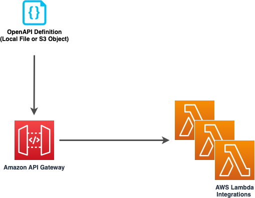

# aws-openapigateway-lambda module
<!--BEGIN STABILITY BANNER-->

---


---
<!--END STABILITY BANNER-->

| **Reference Documentation**:| <span style="font-weight: normal">https://docs.aws.amazon.com/solutions/latest/constructs/</span>|
|:-------------|:-------------|
<div style="height:8px"></div>

| **Language**     | **Package**        |
|:-------------|-----------------|
| Python|`aws_solutions_constructs.aws_openapigateway_lambda`|
| Typescript|`@aws-solutions-constructs/aws-openapigateway-lambda`|
| Java|`software.amazon.awsconstructs.services.openapigatewaylambda`|

## Overview

This AWS Solutions Construct implements an Amazon API Gateway REST API defined by an OpenAPI specification file connected to an AWS Lambda function.

Here is a minimal deployable pattern definition. 

**NOTE** The referenced `openapi/apiDefinition.yaml` openapi definition file and `messages-lambda` lambda package directory for the three code samples below can both be found under this constructs `test` folder (`<repository_root>/source/patterns/@aws-solutions-constructs/aws-openapigateway-lambda/test`)

Typescript
``` typescript
import { Stack, StackProps } from 'aws-cdk-lib';
import { Construct } from 'constructs';
import { OpenApiGatewayToLambda } from '@aws-solutions-constructs/aws-openapigateway-lambda';
import { Asset } from 'aws-cdk-lib/aws-s3-assets';
import * as path from 'path';
import * as lambda from 'aws-cdk-lib/aws-lambda';

const apiDefinitionAsset = new Asset(this, 'ApiDefinitionAsset', {
  path: path.join(__dirname, 'openapi/apiDefinition.yaml')
});

new OpenApiGatewayToLambda(this, 'OpenApiGatewayToLambda', {
  apiDefinitionAsset,
  apiIntegrations: [
    {
      id: 'MessagesHandler',
      lambdaFunctionProps: {
        runtime: lambda.Runtime.NODEJS_18_X,
        handler: 'index.handler',
        code: lambda.Code.fromAsset(`${__dirname}/messages-lambda`),
      }
    }
  ]
});
```

Python
``` python
from aws_cdk import (
    Stack,
    aws_s3_assets as s3_assets,
    aws_lambda as lambda_,
)
from constructs import Construct
from aws_solutions_constructs.aws_openapigateway_lambda import OpenApiGatewayToLambda, ApiIntegration

class TestStack(Stack):

    def __init__(self, scope: Construct, construct_id: str, **kwargs) -> None:
        super().__init__(scope, construct_id, **kwargs)

        api_definition_asset = s3_assets.Asset(self, "ApiDefinitionAsset", path="./openapi/apiDefinition.yaml")

        api_integration = ApiIntegration(id="MessagesHandler", lambda_function_props={
            "runtime": lambda_.Runtime.NODEJS_18_X,
            "handler": "index.handler",
            "code": lambda_.Code.from_asset("./messages-lambda")
        })

        openapigateway_to_lambda = OpenApiGatewayToLambda(self,
            id="OpenApiGatewayToLambda",
            api_integrations=[api_integration],
            api_definition_asset=api_definition_asset
        )
```

Java
``` java
import software.amazon.awscdk.services.lambda.Code;
import software.amazon.awscdk.services.lambda.FunctionProps;
import software.amazon.awscdk.services.s3.assets.Asset;
import software.amazon.awscdk.services.s3.assets.AssetProps;
import software.amazon.awsconstructs.services.openapigatewaylambda.ApiIntegration;
import software.amazon.awsconstructs.services.openapigatewaylambda.OpenApiGatewayToLambda;
import software.amazon.awsconstructs.services.openapigatewaylambda.OpenApiGatewayToLambdaProps;
import software.constructs.Construct;
import software.amazon.awscdk.Stack;
import software.amazon.awscdk.StackProps;

import java.util.Collections;

import static software.amazon.awscdk.services.lambda.Runtime.NODEJS_18_X;

final Asset apiDefinitionAsset = new Asset(this, "ApiDefinition", AssetProps.builder().path("openapi/apiDefinition.yaml").build());

final ApiIntegration apiIntegration = ApiIntegration.builder()
    .id("MessagesHandler")
    .lambdaFunctionProps(new FunctionProps.Builder()
        .runtime(NODEJS_18_X)
        .code(Code.fromAsset("messages-lambda"))
        .handler("index.handler")
        .build())
    .build();

new OpenApiGatewayToLambda(this, "OpenApiGatewayToLambda", OpenApiGatewayToLambdaProps.builder()
    .apiDefinitionAsset(apiDefinitionAsset)
    .apiIntegrations(Collections.singletonList(apiIntegration))
    .build());
```

## Pattern Construct Props

| **Name**     | **Type**        | **Description** |
|:-------------|:----------------|-----------------|
|apiGatewayProps?|[`apigateway.RestApiBaseProps`](https://docs.aws.amazon.com/cdk/api/v2/docs/aws-cdk-lib.aws_apigateway.RestApiBaseProps.html)|Optional user-provided props to override the default props for the API.|
|apiDefinitionBucket?|[`s3.IBucket`](https://docs.aws.amazon.com/cdk/api/v2/docs/aws-cdk-lib.aws_s3.IBucket.html)|S3 Bucket where the OpenAPI spec file is located. When specifying this property, `apiDefinitionKey` must also be specified.|
|apiDefinitionKey?|`string`|S3 Object name of the OpenAPI spec file. When specifying this property, `apiDefinitionBucket` must also be specified.|
|apiDefinitionAsset?|[`aws_s3_assets.Asset`](https://docs.aws.amazon.com/cdk/api/v2/docs/aws-cdk-lib.aws_s3_assets.Asset.html)|Local file asset of the OpenAPI spec file.|
|apiIntegrations|`ApiIntegration[]`|One or more key-value pairs that contain an id for the api integration and either an existing lambda function or an instance of the LambdaProps. Please see the `Overview of how the OpenAPI file transformation works` section below for more usage details.|
|logGroupProps?|[`logs.LogGroupProps`](https://docs.aws.amazon.com/cdk/api/v2/docs/aws-cdk-lib.aws_logs.LogGroupProps.html)|User provided props to override the default props for for the CloudWatchLogs LogGroup.|

## Pattern Properties

| **Name**     | **Type**        | **Description** |
|:-------------|:----------------|-----------------|
|apiLambdaFunctions|`ApiLambdaFunction[]`|Returns an array of ApiLambdaFunction objects, where each has an `id` of the `apiIntegration` and the corresponding `lambda.Function` that it maps to.|
|apiGateway|[`api.SpecRestApi`](https://docs.aws.amazon.com/cdk/api/v2/docs/aws-cdk-lib.aws_apigateway.SpecRestApi.html)|Returns an instance of the API Gateway REST API created by the pattern.|
|apiGatewayCloudWatchRole?|[`iam.Role`](https://docs.aws.amazon.com/cdk/api/v2/docs/aws-cdk-lib.aws_iam.Role.html)|Returns an instance of the iam.Role created by the construct for API Gateway for CloudWatch access.|
|apiGatewayLogGroup|[`logs.LogGroup`](https://docs.aws.amazon.com/cdk/api/v2/docs/aws-cdk-lib.aws_logs.LogGroup.html)|Returns an instance of the LogGroup created by the construct for API Gateway access logging to CloudWatch.|

## Overview of how the OpenAPI file transformation works
This construct automatically transforms an incoming OpenAPI Definition (residing locally or in S3) by auto-populating the `uri` fields of the `x-amazon-apigateway-integration` integrations with the resolved value of the backing lambda functions. It does so by allowing the user to specify the `apiIntegrations` property and then correlates it with the api definition. 

Looking at an example - a user creates an instantiation of `apiIntegrations` that specifies one integration named `MessagesHandler` that passes in a set of `lambda.FunctionProps` and a second integration named `PhotosHandler` that passes in an existing `lambda.Function`: 

```typescript
const apiIntegrations: ApiIntegration[] = [
  {
    id: 'MessagesHandler',
    lambdaFunctionProps: {
      runtime: lambda.Runtime.NODEJS_18_X,
      handler: 'index.handler',
      code: lambda.Code.fromAsset(`${__dirname}/messages-lambda`),
    }
  },
  {
    id: 'PhotosHandler',
    existingLambdaObj: new lambda.Function(this, 'PhotosLambda', {
      runtime: lambda.Runtime.NODEJS_18_X,
      handler: 'index.handler',
      code: lambda.Code.fromAsset(`${__dirname}/photos-lambda`),
    })
  }
]
```

And a corresponding api definition with `GET` and `POST` methods on a `/messages` resource and a `GET` method on a `/photos` resource. 

```
openapi: "3.0.1"
info:
  title: "api"
  version: "2023-02-20T20:46:08Z"
paths:
  /messages:
    get:
      x-amazon-apigateway-integration:
        httpMethod: "POST"
        uri: MessagesHandler
        passthroughBehavior: "when_no_match"
        type: "aws_proxy"
    post:
      x-amazon-apigateway-integration:
        httpMethod: "POST"
        uri: MessagesHandler
        passthroughBehavior: "when_no_match"
        type: "aws_proxy"
  /photos:
    get:
      x-amazon-apigateway-integration:
        httpMethod: "POST"
        uri: PhotosHandler
        passthroughBehavior: "when_no_match"
        type: "aws_proxy"
```

When the construct is created or updated, it will overwrite the `MessagesHandler` string with the fully resolved lambda proxy uri of the `MessagesHandlerLambdaFunction`, e.g., `arn:${Aws.PARTITION}:apigateway:${Aws.REGION}:lambda:path/2015-03-31/functions/${messagesLambda.functionArn}/invocations`, and similarly for the `PhotosHandler` string and `PhotosHandlerLambdaFunction`, resulting in a valid OpenAPI spec file that is then passed to the `SpecRestApi` construct.

For more information on specifying an API with OpenAPI, please see the [OpenAPI Specification](https://spec.openapis.org/oas/latest.html)

## ApiIntegration Details
This construct defines a custom type, `ApiIntegration`, that is specified as a required prop. The type has a required property, `id`, and two optional properties `existingLambdaObj` and `lambdaFunctionProps`. The `id` property is used to map the corresponding lambda function being defined with the placeholder string in the OpenAPI template file, and is not a CDK construct ID. Exactly one of `existingLambdaObj` or `lambdaFunctionProps` must be specified or the construct will throw an error.

## Default settings

Out of the box implementation of the Construct without any override will set the following defaults:

### Amazon API Gateway
* Deploy an edge-optimized API endpoint
* Enable CloudWatch logging for API Gateway
* Configure least privilege access IAM role for API Gateway
* Enable X-Ray Tracing

### AWS Lambda Function
* Configure limited privilege access IAM roles for Lambda functions
* Enable reusing connections with Keep-Alive for NodeJs Lambda functions
* Enable X-Ray Tracing
* Set Environment Variables
  * AWS_NODEJS_CONNECTION_REUSE_ENABLED (for Node 10.x and higher functions)

## Architecture


***
&copy; Copyright Amazon.com, Inc. or its affiliates. All Rights Reserved.
