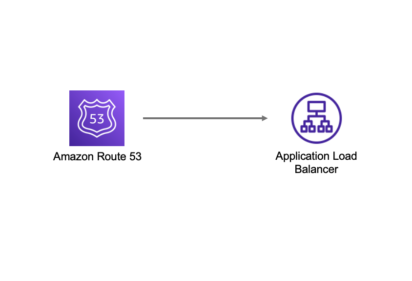

//!!NODE_ROOT <section>
//== aws-route53-alb module

[.topic]
= aws-route53-alb
:info_doctype: section
:info_title: aws-route53-alb

image::https://img.shields.io/badge/stability-Experimental-important.svg?style=for-the-badge[Stability:Experimental]

____
All classes are under active development and subject to non-backward
compatible changes or removal in any future version. These are not
subject to the https://semver.org/[Semantic Versioning] model. This
means that while you may use them, you may need to update your source
code when upgrading to a newer version of this package.
____

[width="100%",cols="<50%,<50%",options="header",]
|===
|*Reference Documentation*:
|https://docs.aws.amazon.com/solutions/latest/constructs/
|===

[width="100%",cols="<46%,54%",options="header",]
|===
|*Language* |*Package*
|image:https://docs.aws.amazon.com/cdk/api/latest/img/python32.png[Python
Logo] Python |`aws_solutions_constructs.aws_route53_alb`

|image:https://docs.aws.amazon.com/cdk/api/latest/img/typescript32.png[Typescript
Logo] Typescript |`@aws-solutions-constructs/aws-route53-alb`

|image:https://docs.aws.amazon.com/cdk/api/latest/img/java32.png[Java
Logo] Java |`software.amazon.awsconstructs.services.route53alb`
|===

== Overview

This AWS Solutions Construct implements an Amazon Route53 Hosted Zone
routing to an Application Load Balancer

Here is a minimal deployable pattern definition:

====
[role="tablist"]
Typescript::
+
[source,typescript]
----
import { Construct } from 'constructs';
import { Stack, StackProps } from 'aws-cdk-lib';
import { Route53ToAlb } from '@aws-solutions-constructs/aws-route53-alb';

// Note - all alb constructs turn on ELB logging by default, so require that an environment including account
// and region be provided when creating the stack
//
// new MyStack(app, 'id', {env: {account: '123456789012', region: 'us-east-1' }});
new Route53ToAlb(this, 'Route53ToAlbPattern', {
  privateHostedZoneProps: {
    zoneName: 'www.example.com',
  },
  publicApi: false,
});
----

Python::
+
[source,python]
----
from aws_solutions_constructs.aws_route53_alb import Route53ToAlb
from aws_cdk import (
    aws_route53 as route53,
    Stack
)
from constructs import Construct

# Note - all alb constructs turn on ELB logging by default, so require that an environment including account
# and region be provided when creating the stack
#
# MyStack(app, 'id', env=cdk.Environment(account='123456789012', region='us-east-1'))
Route53ToAlb(self, 'Route53ToAlbPattern',
                public_api=False,
                private_hosted_zone_props=route53.HostedZoneProps(
                    zone_name='www.example.com',
                )
                )
----

Java::
+
[source,java]
----
import software.constructs.Construct;

import software.amazon.awscdk.Stack;
import software.amazon.awscdk.StackProps;
import software.amazon.awscdk.services.route53.*;
import software.amazon.awsconstructs.services.route53alb.*;

// Note - all alb constructs turn on ELB logging by default, so require that an environment including account
// and region be provided when creating the stack
//
// new MyStack(app, "id", StackProps.builder()
//         .env(Environment.builder()
//                 .account("123456789012")
//                 .region("us-east-1")
//                 .build());
new Route53ToAlb(this, "Route53ToAlbPattern",
        new Route53ToAlbProps.Builder()
                .privateHostedZoneProps(new HostedZoneProps.Builder()
                        .zoneName("www.example.com")
                        .build())
                .publicApi(false)
                .build());
----
====

== Pattern Construct Props

This construct cannot create a new Public Hosted Zone, if you are
creating a public API you must supply an existing Public Hosted Zone
that will be reconfigured with a new Alias record. Public Hosted Zones
are configured with public domain names and are not well suited to be
launched and torn down dynamically, so this construct will only
reconfigure existing Public Hosted Zones.

This construct can create Private Hosted Zones. If you want a Private
Hosted Zone, then you can either provide an existing Private Hosted Zone
or a privateHostedZoneProps value with at least the Domain Name defined.

[width="100%",cols="<30%,<35%,35%",options="header",]
|===
|*Name* |*Type* |*Description*
|privateHostedZoneProps?
|https://docs.aws.amazon.com/cdk/api/v2/docs/aws-cdk-lib.aws_route53.PrivateHostedZoneProps.html[route53.PrivateHostedZoneProps]
|Optional custom properties for a new Private Hosted Zone. Cannot be
specified for a public API. Cannot specify a VPC, it will use the VPC in
existingVpc or the VPC created by the construct. Providing both this and
existingHostedZoneInterfaceis an error.

|existingHostedZoneInterface?
|https://docs.aws.amazon.com/cdk/api/v2/docs/aws-cdk-lib.aws_route53.IHostedZone.html[route53.IHostedZone]
|Existing Public or Private Hosted Zone (type must match publicApi
setting). Specifying both this and privateHostedZoneProps is an error.
If this is a Private Hosted Zone, the associated VPC must be provided as
the existingVpc property

|loadBalancerProps?
|https://docs.aws.amazon.com/cdk/api/v2/docs/aws-cdk-lib.aws_elasticloadbalancingv2.ApplicationLoadBalancerProps.html[elasticloadbalancingv2.ApplicationLoadBalancerProps]
|Optional custom properties for a new loadBalancer. Providing both this
and existingLoadBalancer is an error. This cannot specify a VPC, it will
use the VPC in existingVpc or the VPC created by the construct.

|existingLoadBalancerObj?
|https://docs.aws.amazon.com/cdk/api/v2/docs/aws-cdk-lib.aws_elasticloadbalancingv2.ApplicationLoadBalancer.html[elasticloadbalancingv2.ApplicationLoadBalancer]
|Existing Application Load Balancer to incorporate into the construct
architecture. Providing both this and loadBalancerProps is an error. The
VPC containing this loadBalancer must match the VPC provided in
existingVpc.

|vpcProps?
|https://docs.aws.amazon.com/cdk/api/v2/docs/aws-cdk-lib.aws_ec2.VpcProps.html[ec2.VpcProps]
|Optional custom properties for a VPC the construct will create. This
VPC will be used by the new ALB and any Private Hosted Zone the
construct creates (that’s why loadBalancerProps and
privateHostedZoneProps can’t include a VPC). Providing both this and
existingVpc is an error.

|existingVpc?
|https://docs.aws.amazon.com/cdk/api/v2/docs/aws-cdk-lib.aws_ec2.IVpc.html[ec2.IVpc]
|An existing VPC in which to deploy the construct. Providing both this
and vpcProps is an error. If the client provides an existing load
balancer and/or existing Private Hosted Zone, those constructs must
exist in this VPC.

|logAlbAccessLogs? |boolean |Whether to turn on Access Logs for the
Application Load Balancer. Uses an S3 bucket with associated storage
costs.Enabling Access Logging is a best practice. default - true

|albLoggingBucketProps?
|https://docs.aws.amazon.com/cdk/api/v2/docs/aws-cdk-lib.aws_s3.BucketProps.html[s3.BucketProps]
|Optional properties to customize the bucket used to store the ALB
Access Logs. Supplying this and setting logAlbAccessLogs to false is an
error. @default - none
|===

[verse]
--
publicApi | boolean | Whether the construct is deploying a private or public API. This has implications for the Hosted Zone, VPC and ALB. |
--

== Pattern Properties

[width="100%",cols="<30%,<35%,35%",options="header",]
|===
|*Name* |*Type* |*Description*
|hostedZone
|https://docs.aws.amazon.com/cdk/api/v2/docs/aws-cdk-lib.aws_route53.IHostedZone.html[route53.IHostedZone]
|The hosted zone used by the construct (whether created by the construct
or providedb by the client)

|vpc
|https://docs.aws.amazon.com/cdk/api/v2/docs/aws-cdk-lib.aws_ec2.IVpc.html[ec2.IVpc]
|The VPC used by the construct (whether created by the construct or
providedb by the client)

|loadBalancer
|https://docs.aws.amazon.com/cdk/api/v2/docs/aws-cdk-lib.aws_elasticloadbalancingv2.ApplicationLoadBalancer.html[elasticloadbalancingv2.ApplicationLoadBalancer]
|The Load Balancer used by the construct (whether created by the
construct or providedb by the client)
|===

== Default settings

Out of the box implementation of the Construct without any override will
set the following defaults:

==== Amazon Route53

* Adds an ALIAS record to the new or provided Hosted Zone that routes to
the construct’s ALB

==== Application Load Balancer

* Creates an Application Load Balancer with no Listener or target. The
construct can incorporate an existing, fully configured ALB if provided.

== Architecture

// github block

'''''

© Copyright Amazon.com, Inc. or its affiliates. All Rights Reserved.
