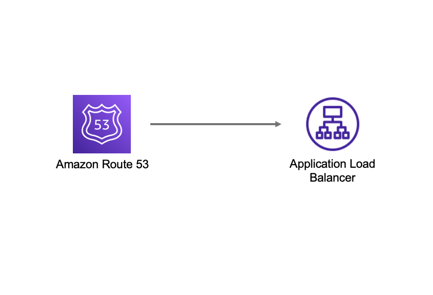

# aws-route53-alb module
<!--BEGIN STABILITY BANNER-->

---


> All classes are under active development and subject to non-backward compatible changes or removal in any
> future version. These are not subject to the [Semantic Versioning](https://semver.org/) model.
> This means that while you may use them, you may need to update your source code when upgrading to a newer version of this package.

---
<!--END STABILITY BANNER-->

| **Reference Documentation**:| <span style="font-weight: normal">https://docs.aws.amazon.com/solutions/latest/constructs/</span>|
|:-------------|:-------------|
<div style="height:8px"></div>

| **Language**     | **Package**        |
|:-------------|-----------------|
| Python|`aws_solutions_constructs.aws_route53_alb`|
| Typescript|`@aws-solutions-constructs/aws-route53-alb`|
| Java|`software.amazon.awsconstructs.services.route53alb`|

This AWS Solutions Construct implements an Amazon Route53 Hosted Zone routing to an Application Load Balancer

Here is a minimal deployable pattern definition:

Typescript
``` typescript
import { Route53ToAlb } from '@aws-solutions-constructs/aws-route53-alb';

new Route53ToAlb(this, 'Route53ToAlbPattern', {
  privateHostedZoneProps: {
    zoneName: 'www.example.com',
  }
  publicApi: false,
});
```

Python
```python
from aws_solutions_constructs.aws_route53_alb import Route53ToAlb
from aws_cdk import aws_route53 as route53

Route53ToAlb(self, 'Route53ToAlbPattern',
             private_hosted_zone_props=route53.PrivateHostedZoneProps(
                 zone_name='www.example.com',
             )
             public_api=False,
             )
```

Java
``` java
import software.amazon.awsconstructs.services.route53alb.*;
import software.amazon.awscdk.services.route53.*;

new Route53ToAlb(this, "Route53ToAlbPattern",
    new Route53ToAlbProps.Builder()
        .privateHostedZoneProps(new PrivateHostedZoneProps.Builder()
          .zoneName("www.example.com")
          .build())
        .publicApi(false)
        .build());
```

## Pattern Construct Props

This construct cannot create a new Public Hosted Zone, if you are creating a public API you must supply an existing Public Hosted Zone that will be reconfigured with a new Alias record. Public Hosted Zones are configured with public domain names and are not well suited to be launched and torn down dynamically, so this construct will only reconfigure existing Public Hosted Zones.

This construct can create Private Hosted Zones. If you want a Private Hosted Zone, then you can either provide an existing Private Hosted Zone or a privateHostedZoneProps value with at least the Domain Name defined.

| **Name**     | **Type**        | **Description** |
|:-------------|:----------------|-----------------|
| privateHostedZoneProps? | [route53.PrivateHostedZoneProps](https://docs.aws.amazon.com/cdk/api/latest/docs/@aws-cdk_aws-route53.PrivateHostedZoneProps.html) | Optional custom properties for a new Private Hosted Zone. Cannot be specified for a public API. Cannot specify a VPC, it will use the VPC in existingVpc or the VPC created by the construct. Providing both this and existingHostedZoneInterfaceis an error. |
| existingHostedZoneInterface? | [route53.IHostedZone](https://docs.aws.amazon.com/cdk/api/latest/docs/@aws-cdk_aws-route53.IHostedZone.html) | Existing Public or Private Hosted Zone (type must match publicApi setting). Specifying both this and privateHostedZoneProps is an error. If this is a Private Hosted Zone, the associated VPC must be provided as the existingVpc property |
| loadBalancerProps? | [elasticloadbalancingv2.ApplicationLoadBalancerProps](https://docs.aws.amazon.com/cdk/api/latest/docs/@aws-cdk_aws-elasticloadbalancingv2.ApplicationLoadBalancerProps.html) | Optional custom properties for a new loadBalancer. Providing both this and existingLoadBalancer is an error. This cannot specify a VPC, it will use the VPC in existingVpc or the VPC created by the construct. |
| existingLoadBalancerObj? | [elasticloadbalancingv2.ApplicationLoadBalancer](https://docs.aws.amazon.com/cdk/api/latest/docs/@aws-cdk_aws-elasticloadbalancingv2.ApplicationLoadBalancer.html) | Existing Application Load Balancer to incorporate into the construct architecture. Providing both this and loadBalancerProps is an error. The VPC containing this loadBalancer must match the VPC provided in existingVpc. |
| vpcProps? | [ec2.VpcProps](https://docs.aws.amazon.com/cdk/api/latest/docs/@aws-cdk_aws-ec2.VpcProps.html) | Optional custom properties for a VPC the construct will create. This VPC will be used by the new ALB and any Private Hosted Zone the construct creates (that's why loadBalancerProps and privateHostedZoneProps can't include a VPC). Providing both this and existingVpc is an error. |
| existingVpc? | [ec2.IVpc](https://docs.aws.amazon.com/cdk/api/latest/docs/@aws-cdk_aws-ec2.IVpc.html) | An existing VPC in which to deploy the construct. Providing both this and vpcProps is an error. If the client provides an existing load balancer and/or existing Private Hosted Zone, those constructs must exist in this VPC. |
| logAlbAccessLogs? | boolean| Whether to turn on Access Logs for the Application Load Balancer. Uses an S3 bucket with associated storage costs.Enabling Access Logging is a best practice. default - true |
| albLoggingBucketProps? | [s3.BucketProps](https://docs.aws.amazon.com/cdk/api/latest/docs/@aws-cdk_aws-s3.BucketProps.html) | Optional properties to customize the bucket used to store the ALB Access Logs. Supplying this and setting logAccessLogs to false is an error. @default - none |

| publicApi | boolean | Whether the construct is deploying a private or public API. This has implications for the Hosted Zone, VPC and ALB. |


## Pattern Properties

| **Name**     | **Type**        | **Description** |
|:-------------|:----------------|-----------------|
| hostedZone | [route53.IHostedZone](https://docs.aws.amazon.com/cdk/api/latest/docs/@aws-cdk_aws-route53.IHostedZone.html) | The hosted zone used by the construct (whether created by the construct or providedb by the client) |
| vpc | [ec2.IVpc](https://docs.aws.amazon.com/cdk/api/latest/docs/@aws-cdk_aws-ec2.IVpc.html) | The VPC used by the construct (whether created by the construct or providedb by the client) |
| loadBalancer | [elasticloadbalancingv2.ApplicationLoadBalancer](https://docs.aws.amazon.com/cdk/api/latest/docs/@aws-cdk_aws-elasticloadbalancingv2.ApplicationLoadBalancer.html) | The Load Balancer used by the construct (whether created by the construct or providedb by the client) |

## Default settings

Out of the box implementation of the Construct without any override will set the following defaults:

### Amazon Route53
* Adds an ALIAS record to the new or provided Hosted Zone that routes to the construct's ALB

### Application Load Balancer
* Creates an Application Load Balancer with no Listener or target. The consruct can incorporate an existing, fully configured ALB if provided.

## Architecture


***
&copy; Copyright 2021 Amazon.com, Inc. or its affiliates. All Rights Reserved.
