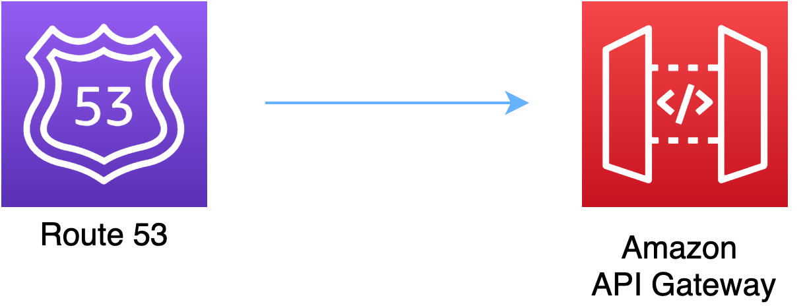

# aws-route53-apigateway module
<!--BEGIN STABILITY BANNER-->

---


> All classes are under active development and subject to non-backward compatible changes or removal in any
> future version. These are not subject to the [Semantic Versioning](https://semver.org/) model.
> This means that while you may use them, you may need to update your source code when upgrading to a newer version of this package.

---
<!--END STABILITY BANNER-->

| **Reference Documentation**:| <span style="font-weight: normal">https://docs.aws.amazon.com/solutions/latest/constructs/</span>|
|:-------------|:-------------|
<div style="height:8px"></div>

| **Language**     | **Package**        |
|:-------------|-----------------|
| Python|`aws_solutions_constructs.aws_route53_apigateway`|
| Typescript|`@aws-solutions-constructs/aws-route53-apigateway`|
| Java|`software.amazon.awsconstructs.services.route53apigateway`|

## Overview

This AWS Solutions Construct implements an Amazon Route 53 connected to a configured Amazon API Gateway REST API.

Here is a minimal deployable pattern definition:

Typescript
``` typescript
import * as route53 from "@aws-cdk/aws-route53";
import * as acm from "aws-cdk-lib/aws-certificatemanager";
import { Route53ToApiGateway } from '@aws-solutions-constructs/aws-route53-apigateway';

// The construct requires an existing REST API, this can be created in raw CDK or extracted
// from a previously instantiated construct that created an API Gateway REST API
const existingRestApi = previouslyCreatedApigatewayToLambdaConstruct.apiGateway;

const ourHostedZone = route53.HostedZone.fromLookup(this, 'HostedZone', {
    domainName: "example.com",
});

const certificate = acm.Certificate.fromCertificateArn(
    this,
    "fake-cert",
    "arn:aws:acm:us-east-1:123456789012:certificate/11112222-3333-1234-1234-123456789012"
);

// This construct can only be attached to a configured API Gateway.
new Route53ToApiGateway(this, 'Route53ToApiGatewayPattern', {
    existingApiGatewayInterface: existingRestApi,
    existingHostedZoneInterface: ourHostedZone,
    publicApi: true,
    existingCertificateInterface: certificate
});
```

Python
```python
from aws_solutions_constructs.aws_route53_apigateway import Route53ToApiGateway
from aws_cdk import (
    aws_route53 as route53,
    aws_certificatemanager as acm,
    Stack
)
from constructs import Construct

# The construct requires an existing REST API, this can be created in raw CDK or extracted
# from a previously instantiated construct that created an API Gateway REST API
existingRestApi = previouslyCreatedApigatewayToLambdaConstruct.apiGateway

ourHostedZone = route53.HostedZone.from_lookup(self, 'HostedZone',
                                                domain_name="example.com",
                                                )

# Obtain a pre-existing certificate from your account
certificate = acm.Certificate.from_certificate_arn(
    self,
    'existing-cert',
    "arn:aws:acm:us-east-1:123456789012:certificate/11112222-3333-1234-1234-123456789012"
)

# This construct can only be attached to a configured API Gateway.
Route53ToApiGateway(self, 'Route53ToApigatewayPattern',
                    existing_api_gateway_interface=existingRestApi,
                    existing_hosted_zone_interface=ourHostedZone,
                    public_api=True,
                    existing_certificate_interface=certificate
                    )

```

Java
``` java
import software.constructs.Construct;

import software.amazon.awscdk.Stack;
import software.amazon.awscdk.StackProps;
import software.amazon.awscdk.services.route53.*;
import software.amazon.awscdk.services.apigateway.*;
import software.amazon.awscdk.services.certificatemanager.*;
import software.amazon.awsconstructs.services.route53apigateway.*;

// The construct requires an existing REST API, this can be created in raw CDK
// or extracted from a previously instantiated construct that created an API
// Gateway REST API
final IRestApi existingRestApi = previouslyCreatedApigatewayToLambdaConstruct.getApiGateway();

final IHostedZone ourHostedZone = HostedZone.fromLookup(this, "HostedZone",
        new HostedZoneProviderProps.Builder()
                .domainName("example.com")
                .build());

// Obtain a pre-existing certificate from your account
final ICertificate certificate = Certificate.fromCertificateArn(
        this,
        "existing-cert",
        "arn:aws:acm:us-east-1:123456789012:certificate/11112222-3333-1234-1234-123456789012");

// This construct can only be attached to a configured API Gateway.
new Route53ToApiGateway(this, "Route53ToApiGatewayPattern",
        new Route53ToApiGatewayProps.Builder()
                .existingApiGatewayInterface(existingRestApi)
                .existingHostedZoneInterface(ourHostedZone)
                .publicApi(true)
                .existingCertificateInterface(certificate)
                .build());
```

## Pattern Construct Props

This construct cannot create a new Public Hosted Zone, if you are creating a public API you must supply an existing Public Hosted Zone that will be reconfigured with a new Alias record. Public Hosted Zones are configured with public domain names and are not well suited to be launched and torn down dynamically, so this construct will only reconfigure existing Public Hosted Zones.

This construct can create Private Hosted Zones. If you want a Private Hosted Zone, then you can either provide an existing Private Hosted Zone or a privateHostedZoneProps value with at least the Domain Name defined. If you are using privateHostedZoneProps, an existing wildcard certificate (*.example.com) must be issued from a previous domain to be used in the newly created Private Hosted Zone. New certificate creation and validation do not take place in this construct. A private Rest API already exists in a VPC, so that VPC must be provided in the existingVpc prop. There is no scenario where this construct can create a new VPC (since it can't create a new API), so the vpcProps property is not supported on this construct.

| **Name**     | **Type**        | **Description** |
|:-------------|:----------------|-----------------|
| publicApi | boolean | Whether the construct is deploying a private or public API. This has implications for the Hosted Zone and VPC. |
| privateHostedZoneProps? | [route53.PrivateHostedZoneProps](https://docs.aws.amazon.com/cdk/api/latest/docs/@aws-cdk_aws-route53.PrivateHostedZoneProps.html) | Optional custom properties for a new Private Hosted Zone. Cannot be specified for a public API. Cannot specify a VPC, it will use the VPC in existingVpc or the VPC created by the construct. Providing both this and existingHostedZoneInterface is an error. |
| existingHostedZoneInterface? | [route53.IHostedZone](https://docs.aws.amazon.com/cdk/api/latest/docs/@aws-cdk_aws-route53.IHostedZone.html) | Existing Public or Private Hosted Zone (type must match publicApi setting). Specifying both this and privateHostedZoneProps is an error. If this is a Private Hosted Zone, the associated VPC must be provided as the existingVpc property.|
| existingVpc? | [ec2.IVpc](https://docs.aws.amazon.com/cdk/api/latest/docs/@aws-cdk_aws-ec2.IVpc.html) | An existing VPC in which to deploy the construct.|
|existingApiGatewayInterface|[api.IRestApi](https://docs.aws.amazon.com/cdk/api/latest/docs/@aws-cdk_aws-apigateway.IRestApi.html)|The existing API Gateway instance that will be connected to the Route 53 hosted zone. *Note that Route 53 can only be connected to a configured API Gateway, so this construct only accepts an existing IRestApi and does not accept apiGatewayProps.*|
| existingCertificateInterface |[certificatemanager.ICertificate](https://docs.aws.amazon.com/cdk/api/v1/docs/@aws-cdk_aws-certificatemanager.ICertificate.html)| An existing AWS Certificate Manager certificate for your custom domain name.|

## Pattern Properties

| **Name**     | **Type**        | **Description** |
|:-------------|:----------------|-----------------|
|hostedZone|[route53.IHostedZone](https://docs.aws.amazon.com/cdk/api/latest/docs/@aws-cdk_aws-route53.IHostedZone.html)|The hosted zone used by the construct (whether created by the construct or provided by the client) |
| vpc? | [ec2.IVpc](https://docs.aws.amazon.com/cdk/api/latest/docs/@aws-cdk_aws-ec2.IVpc.html) | The VPC used by the construct. |
|apiGateway|[api.RestApi](https://docs.aws.amazon.com/cdk/api/latest/docs/@aws-cdk_aws-apigateway.RestApi.html)|Returns an instance of the API Gateway REST API created by the pattern.|
|certificate|[certificatemanager.ICertificate](https://docs.aws.amazon.com/cdk/api/v1/docs/@aws-cdk_aws-certificatemanager.ICertificate.html)| THe certificate used by the construct (whether create by the construct or provided by the client)

## Default settings
Out of the box implementation of the Construct without any override will set the following defaults:

### Amazon Route53
* Adds an ALIAS record to the new or provided Hosted Zone that routes to the construct's API Gateway

### Amazon API Gateway
* User provided API Gateway object is used as-is
* Sets up custom domain name mapping to API

## Architecture



***
&copy; Copyright 2022 Amazon.com, Inc. or its affiliates. All Rights Reserved.
