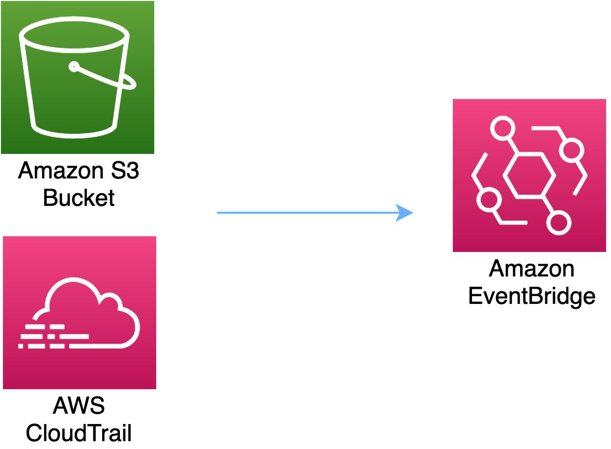

# aws-s3-eventbridge module
<!--BEGIN STABILITY BANNER-->

---


> All classes are under active development and subject to non-backward compatible changes or removal in any
> future version. These are not subject to the [Semantic Versioning](https://semver.org/) model.
> This means that while you may use them, you may need to update your source code when upgrading to a newer version of this package.

---
<!--END STABILITY BANNER-->

| **Reference Documentation**:| <span style="font-weight: normal">https://docs.aws.amazon.com/solutions/latest/constructs/</span>|
|:-------------|:-------------|
<div style="height:8px"></div>

| **Language**     | **Package**        |
|:-------------|-----------------|
| Python|`aws_solutions_constructs.aws_s3_eventbridge`|
| Typescript|`@aws-solutions-constructs/aws-s3-eventbridge`|
| Java|`software.amazon.awsconstructs.services.s3eventbridge`|

This AWS Solutions Construct implements an Amazon S3 bucket connected to an Amazon EventBridge.

Here is a minimal deployable pattern definition in Typescript:

``` typescript
import { S3ToEventbridge, S3ToEventbridgeProps } from '@aws-solutions-constructs/aws-s3-eventbridge';
import { EventbridgeToStepfunctions, EventbridgeToStepfunctionsProps } from '@aws-solutions-constructs/aws-s3-stepfunctions';
import * as stepfunctions from '@aws-cdk/aws-stepfunctions';

const startState = new stepfunctions.Pass(stack, 'StartState');

const s3ToEventbridge = new S3ToEventbridge(this, 's3-eventbridge', {});
const eventBus = s3ToEventbridge.eventBus;

new EventbridgeToStepfunctions(this, 'test-s3-stepfunctions-stack', {
    stateMachineProps: {
      definition: startState
    },
    existingEventBusInterface: eventBus
});
```

## Initializer

``` text
new S3ToEventbridge(scope: Construct, id: string, props: S3ToStepfunctionsProps);
```

_Parameters_

* scope [`Construct`](https://docs.aws.amazon.com/cdk/api/latest/docs/@aws-cdk_core.Construct.html)
* id `string`
* props [`S3ToEventbridgeProps`](#pattern-construct-props)

## Pattern Construct Props

| **Name**     | **Type**        | **Description** |
|:-------------|:----------------|-----------------|
|existingBucketObj?|[`s3.IBucket`](https://docs.aws.amazon.com/cdk/api/latest/docs/@aws-cdk_aws-s3.IBucket.html)|Existing instance of S3 Bucket object. If this is provided, then also providing bucketProps is an error. |
|bucketProps?|[`s3.BucketProps`](https://docs.aws.amazon.com/cdk/api/latest/docs/@aws-cdk_aws-s3.BucketProps.html)|Optional user provided props to override the default props for the S3 Bucket.|
|eventRuleProps?|[`events.RuleProps`](https://docs.aws.amazon.com/cdk/api/latest/docs/@aws-cdk_aws-events.RuleProps.html)|Optional user provided eventRuleProps to override the defaults.|
|deployCloudTrail?|`boolean`|Whether to deploy a Trail in AWS CloudTrail to log API events in Amazon S3. Defaults to `true`.|
|loggingBucketProps?|[`s3.BucketProps`](https://docs.aws.amazon.com/cdk/api/latest/docs/@aws-cdk_aws-s3.BucketProps.html)|Optional user provided props to override the default props for the S3 Logging Bucket.|
|logS3AccessLogs?| boolean|Whether to turn on Access Logging for the S3 bucket. Creates an S3 bucket with associated storage costs for the logs. Enabling Access Logging is a best practice. default - true|

## Pattern Properties

| **Name**     | **Type**        | **Description** |
|:-------------|:----------------|-----------------|
|s3Bucket?|[`s3.Bucket`](https://docs.aws.amazon.com/cdk/api/latest/docs/@aws-cdk_aws-s3.Bucket.html)|Returns an instance of the s3.Bucket created by the construct.|
|s3LoggingBucket?|[`s3.Bucket`](https://docs.aws.amazon.com/cdk/api/latest/docs/@aws-cdk_aws-s3.Bucket.html)|Returns an instance of s3.Bucket created by the construct as the logging bucket for the primary bucket.|
|cloudtrail|[`cloudtrail.Trail`](https://docs.aws.amazon.com/cdk/api/latest/docs/@aws-cdk_aws-cloudtrail.Trail.html)|Returns an instance of the cloudtrail.Trail created by the construct.|
|cloudtrailBucket|[`s3.Bucket`](https://docs.aws.amazon.com/cdk/api/latest/docs/@aws-cdk_aws-s3.Bucket.html)|Returns an instance of the s3.Bucket created by the construct for CloudTrail.|
|cloudtrailLoggingBucket|[`s3.Bucket`](https://docs.aws.amazon.com/cdk/api/latest/docs/@aws-cdk_aws-s3.Bucket.html)|Returns an instance of s3.Bucket created by the construct as the logging bucket for the primary CloudTrail bucket.|
|s3BucketInterface|[`s3.IBucket`](https://docs.aws.amazon.com/cdk/api/latest/docs/@aws-cdk_aws-s3.IBucket.html)|Returns an instance of s3.IBucket created by the construct.|
|eventBus|[`events.IEventBus`](https://docs.aws.amazon.com/cdk/api/latest/docs/@aws-cdk_aws-events.IEventBus.html)|Returns the instance of events.IEventBus used by the construct.|
|eventsRule|[`events.Rule`](https://docs.aws.amazon.com/cdk/api/latest/docs/@aws-cdk_aws-events.Rule.html)|Returns an instance of events.Rule created by the construct.|

## Default settings

Out of the box implementation of the Construct without any override will set the following defaults:

### Amazon S3 Bucket
* Configure Access logging for S3 Bucket
* Enable server-side encryption for S3 Bucket using AWS managed KMS Key
* Enforce encryption of data in transit
* Turn on the versioning for S3 Bucket
* Don't allow public access for S3 Bucket
* Retain the S3 Bucket when deleting the CloudFormation stack
* Applies Lifecycle rule to move noncurrent object versions to Glacier storage after 90 days

### AWS CloudTrail
* Configure a Trail in AWS CloudTrail to log API events in Amazon S3 related to the Bucket created by the Construct

## Architecture


***
&copy; Copyright 2021 Amazon.com, Inc. or its affiliates. All Rights Reserved.