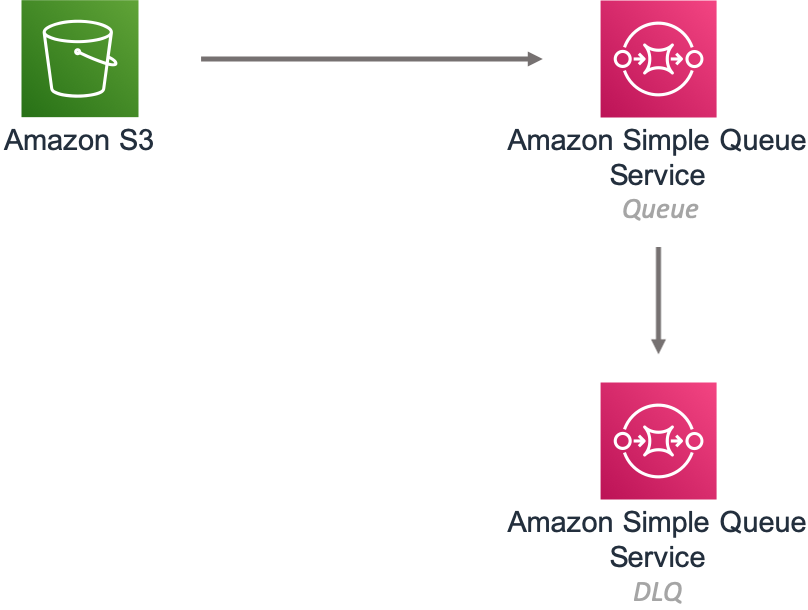

//!!NODE_ROOT <section>
//== aws-s3-sqs module

[.topic]
= aws-s3-sqs
:info_doctype: section
:info_title: aws-s3-sqs

image:https://img.shields.io/badge/cfn--resources-stable-success.svg?style=for-the-badge[Stability:Stable]

[width="100%",cols="<50%,<50%",options="header",]
|===
|*Reference Documentation*:
|https://docs.aws.amazon.com/solutions/latest/constructs/
|===

[width="100%",cols="<46%,54%",options="header",]
|===
|*Language* |*Package*
|image:https://docs.aws.amazon.com/cdk/api/latest/img/python32.png[Python
Logo] Python |`aws_solutions_constructs.aws_s3_sqs`

|image:https://docs.aws.amazon.com/cdk/api/latest/img/typescript32.png[Typescript
Logo] Typescript |`@aws-solutions-constructs/aws-s3-sqs`

|image:https://docs.aws.amazon.com/cdk/api/latest/img/java32.png[Java
Logo] Java |`software.amazon.awsconstructs.services.s3sqs`
|===

== Overview

This AWS Solutions Construct implements an Amazon S3 Bucket that is
configured to send notifications to an Amazon SQS queue.

Here is a minimal deployable pattern definition:

====
[role="tablist"]
Typescript::
+
[source,typescript]
----
import { Construct } from 'constructs';
import { Stack, StackProps } from 'aws-cdk-lib';
import { S3ToSqs } from "@aws-solutions-constructs/aws-s3-sqs";

new S3ToSqs(this, 'S3ToSQSPattern', {});
----

Python::
+
[source,python]
----
from aws_solutions_constructs.aws_s3_sqs import S3ToSqs
from aws_cdk import Stack
from constructs import Construct

S3ToSqs(self, 'S3ToSQSPattern')
----

Java::
+
[source,java]
----
import software.constructs.Construct;

import software.amazon.awscdk.Stack;
import software.amazon.awscdk.StackProps;
import software.amazon.awsconstructs.services.s3sqs.*;

new S3ToSqs(this, "S3ToSQSPattern", new S3ToSqsProps.Builder()
        .build());
----
====

== Pattern Construct Props

[width="100%",cols="<30%,<35%,35%",options="header",]
|===
|*Name* |*Type* |*Description*
|existingBucketObj?
|https://docs.aws.amazon.com/cdk/api/v2/docs/aws-cdk-lib.aws_s3.IBucket.html[`s3.Bucket`]
|Existing instance of S3 Bucket object. If this is provided, then also
providing bucketProps is an error.

|bucketProps?
|https://docs.aws.amazon.com/cdk/api/v2/docs/aws-cdk-lib.aws_s3.BucketProps.html[`s3.BucketProps`]
|Optional user provided props to override the default props for the S3
Bucket.

|s3EventTypes?
|https://docs.aws.amazon.com/cdk/api/v2/docs/aws-cdk-lib.aws_s3.EventType.html[`s3.EventType[\]`]
|The S3 event types that will trigger the notification. Defaults to
s3.EventType.OBJECT_CREATED.

|s3EventFilters?
|https://docs.aws.amazon.com/cdk/api/v2/docs/aws-cdk-lib.aws_s3.NotificationKeyFilter.html[`s3.NotificationKeyFilter[\]`]
|S3 object key filter rules to determine which objects trigger this
event. If not specified no filter rules will be applied.

|existingQueueObj?
|https://docs.aws.amazon.com/cdk/api/v2/docs/aws-cdk-lib.aws_sqs.Queue.html[`sqs.Queue`]
|Existing SQS queue to be used instead of the default queue. Providing
both this and `queueProps` will cause an error. If the SQS queue is
encrypted, the KMS key utilized for encryption must be a customer
managed CMK.

|queueProps?
|https://docs.aws.amazon.com/cdk/api/v2/docs/aws-cdk-lib.aws_sqs.QueueProps.html[`sqs.QueueProps`]
|Optional user provided props to override the default props for the SQS
queue.

|deadLetterQueueProps?
|https://docs.aws.amazon.com/cdk/api/v2/docs/aws-cdk-lib.aws_sqs.QueueProps.html[`sqs.QueueProps`]
|Optional user provided props to override the default props for the dead
letter SQS queue.

|deployDeadLetterQueue? |`boolean` |Whether to create a secondary queue
to be used as a dead letter queue. Defaults to true.

|maxReceiveCount? |`number` |The number of times a message can be
unsuccessfully dequeued before being moved to the dead letter queue.
Defaults to 15.

|enableEncryptionWithCustomerManagedKey? |`boolean` |If no key is
provided, this flag determines whether the queue is encrypted with a new
CMK or an AWS managed key. This flag is ignored if any of the following
are defined: queueProps.encryptionMasterKey, encryptionKey or
encryptionKeyProps.

|encryptionKey?
|https://docs.aws.amazon.com/cdk/api/v2/docs/aws-cdk-lib.aws_kms.Key.html[`kms.Key`]
|An optional, imported encryption key to encrypt the SQS Queue with.

|encryptionKeyProps?
|https://docs.aws.amazon.com/cdk/api/v2/docs/aws-cdk-lib.aws_kms.Key.html#construct-props[`kms.KeyProps`]
|Optional user provided properties to override the default properties
for the KMS encryption key used to encrypt the SQS queue with.

|loggingBucketProps?
|https://docs.aws.amazon.com/cdk/api/v2/docs/aws-cdk-lib.aws_s3.BucketProps.html[`s3.BucketProps`]
|Optional user provided props to override the default props for the S3
Logging Bucket.

|logS3AccessLogs? |boolean |Whether to turn on Access Logging for the S3
bucket. Creates an S3 bucket with associated storage costs for the logs.
Enabling Access Logging is a best practice. default - true
|===

== Pattern Properties

[width="100%",cols="<30%,<35%,35%",options="header",]
|===
|*Name* |*Type* |*Description*
|sqsQueue
|https://docs.aws.amazon.com/cdk/api/v2/docs/aws-cdk-lib.aws_sqs.Queue.html[`sqs.Queue`]
|Returns an instance of the SQS queue created by the pattern.

|deadLetterQueue?
|https://docs.aws.amazon.com/cdk/api/v2/docs/aws-cdk-lib.aws_sqs.Queue.html[`sqs.Queue`]
|Returns an instance of the dead-letter SQS queue created by the
pattern.

|encryptionKey
|https://docs.aws.amazon.com/cdk/api/v2/docs/aws-cdk-lib.aws_kms.IKey.html[`kms.IKey`]
|Returns an instance of kms.Key used for the SQS queue.

|s3Bucket?
|https://docs.aws.amazon.com/cdk/api/v2/docs/aws-cdk-lib.aws_s3.Bucket.html[`s3.Bucket`]
|Returns an instance of the s3.Bucket created by the construct

|s3LoggingBucket?
|https://docs.aws.amazon.com/cdk/api/v2/docs/aws-cdk-lib.aws_s3.Bucket.html[`s3.Bucket`]
|Returns an instance of s3.Bucket created by the construct as the
logging bucket for the primary bucket.

|s3BucketInterface
|https://docs.aws.amazon.com/cdk/api/v2/docs/aws-cdk-lib.aws_s3.IBucket.html[`s3.IBucket`]
|Returns an instance of s3.IBucket created by the construct.
|===

== Default settings

Out of the box implementation of the Construct without any override will
set the following defaults:

=== Amazon S3 Bucket

* Configure Access logging for S3 Bucket
* Enable server-side encryption for S3 Bucket using AWS managed KMS Key
* Enforce encryption of data in transit
* Turn on the versioning for S3 Bucket
* Don’t allow public access for S3 Bucket
* Retain the S3 Bucket when deleting the CloudFormation stack
* Applies Lifecycle rule to move noncurrent object versions to Glacier
storage after 90 days

=== Amazon SQS Queue

* Configure least privilege access permissions for SQS Queue
* Deploy SQS dead-letter queue for the source SQS Queue
* Enable server-side encryption for SQS Queue using Customer managed KMS
Key
* Enforce encryption of data in transit

== Architecture

// github block

'''''

© Copyright Amazon.com, Inc. or its affiliates. All Rights Reserved.
