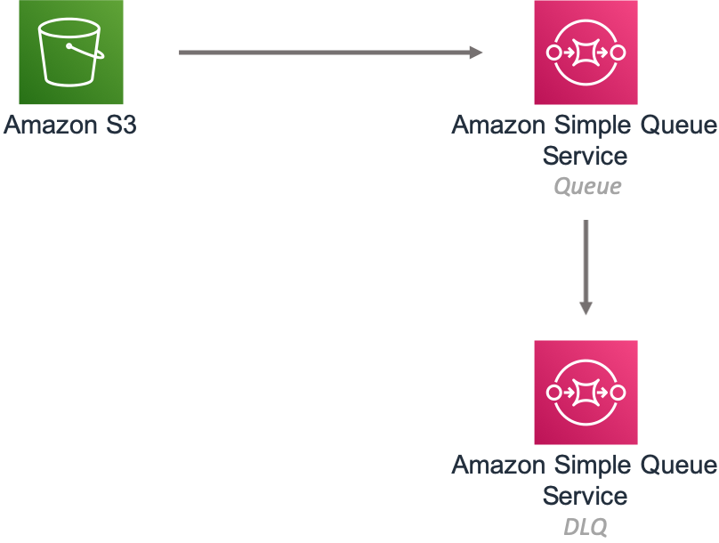

# aws-s3-sqs module
<!--BEGIN STABILITY BANNER-->

---


> All classes are under active development and subject to non-backward compatible changes or removal in any
> future version. These are not subject to the [Semantic Versioning](https://semver.org/) model.
> This means that while you may use them, you may need to update your source code when upgrading to a newer version of this package.

---
<!--END STABILITY BANNER-->

| **Reference Documentation**:| <span style="font-weight: normal">https://docs.aws.amazon.com/solutions/latest/constructs/</span>|
|:-------------|:-------------|
<div style="height:8px"></div>

| **Language**     | **Package**        |
|:-------------|-----------------|
| Python|`aws_solutions_constructs.aws_s3_sqs`|
| Typescript|`@aws-solutions-constructs/aws-s3-sqs`|
| Java|`software.amazon.awsconstructs.services.s3sqs`|

This AWS Solutions Construct implements an Amazon S3 Bucket that is configured to send notifications to an Amazon SQS queue.


Here is a minimal deployable pattern definition:

Typescript
``` typescript
import {S3ToSqs} from "@aws-solutions-constructs/aws-s3-sqs";

new S3ToSqs(stack, 'S3ToSQSPattern', {});
```

Python
```python
from aws_solutions_constructs.aws_s3_sqs import S3ToSqs

S3ToSqs(self, 'S3ToSQSPattern')
```

Java
``` java
import software.amazon.awsconstructs.services.s3sqs.*;

new S3ToSqs(this, "S3ToSQSPattern", new S3ToSqsProps.Builder()
        .build());
```

## Pattern Construct Props

| **Name**     | **Type**        | **Description** |
|:-------------|:----------------|-----------------|
|existingBucketObj?|[`s3.Bucket`](https://docs.aws.amazon.com/cdk/api/latest/docs/@aws-cdk_aws-s3.IBucket.html)|Existing instance of S3 Bucket object. If this is provided, then also providing bucketProps is an error. |
|bucketProps?|[`s3.BucketProps`](https://docs.aws.amazon.com/cdk/api/latest/docs/@aws-cdk_aws-s3.BucketProps.html)|Optional user provided props to override the default props for the S3 Bucket.|
|s3EventTypes?|[`s3.EventType[]`](https://docs.aws.amazon.com/cdk/api/latest/docs/@aws-cdk_aws-s3.EventType.html)|The S3 event types that will trigger the notification. Defaults to s3.EventType.OBJECT_CREATED.|
|s3EventFilters?|[`s3.NotificationKeyFilter[]`](https://docs.aws.amazon.com/cdk/api/latest/docs/@aws-cdk_aws-s3.NotificationKeyFilter.html)|S3 object key filter rules to determine which objects trigger this event. If not specified no filter rules will be applied.|
|existingQueueObj?|[`sqs.Queue`](https://docs.aws.amazon.com/cdk/api/latest/docs/@aws-cdk_aws-sqs.Queue.html)|Existing SQS queue to be used instead of the default queue. Providing both this and `queueProps` will cause an error. If the SQS queue is encrypted, the KMS key utilized for encryption must be a customer managed CMK.|
|queueProps?|[`sqs.QueueProps`](https://docs.aws.amazon.com/cdk/api/latest/docs/@aws-cdk_aws-sqs.QueueProps.html)|Optional user provided props to override the default props for the SQS queue.|
|deadLetterQueueProps?|[`sqs.QueueProps`](https://docs.aws.amazon.com/cdk/api/latest/docs/@aws-cdk_aws-sqs.QueueProps.html)|Optional user provided props to override the default props for the dead letter SQS queue.|
|deployDeadLetterQueue?|`boolean`|Whether to create a secondary queue to be used as a dead letter queue. Defaults to true.|
|maxReceiveCount?|`number`|The number of times a message can be unsuccessfully dequeued before being moved to the dead letter queue. Defaults to 15.|
|enableEncryptionWithCustomerManagedKey?|`boolean`|Use a KMS Key, either managed by this CDK app, or imported. If importing an encryption key, it must be specified in the encryptionKey property for this construct.|
|encryptionKey?|[`kms.Key`](https://docs.aws.amazon.com/cdk/api/latest/docs/@aws-cdk_aws-kms.Key.html)|Optional imported encryption key to encrypt the SQS queue.|
|encryptionKeyProps?|[`kms.KeyProps`](https://docs.aws.amazon.com/cdk/api/latest/docs/@aws-cdk_aws-kms.KeyProps.html)|Optional user provided properties to override the default properties for the KMS encryption key.|
|loggingBucketProps?|[`s3.BucketProps`](https://docs.aws.amazon.com/cdk/api/latest/docs/@aws-cdk_aws-s3.BucketProps.html)|Optional user provided props to override the default props for the S3 Logging Bucket.|
|logS3AccessLogs?| boolean|Whether to turn on Access Logging for the S3 bucket. Creates an S3 bucket with associated storage costs for the logs. Enabling Access Logging is a best practice. default - true|

## Pattern Properties

| **Name**     | **Type**        | **Description** |
|:-------------|:----------------|-----------------|
|sqsQueue|[`sqs.Queue`](https://docs.aws.amazon.com/cdk/api/latest/docs/@aws-cdk_aws-sqs.Queue.html)|Returns an instance of the SQS queue created by the pattern.|
|deadLetterQueue?|[`sqs.Queue`](https://docs.aws.amazon.com/cdk/api/latest/docs/@aws-cdk_aws-sqs.Queue.html)|Returns an instance of the dead-letter SQS queue created by the pattern.|
|encryptionKey|[`kms.IKey`](https://docs.aws.amazon.com/cdk/api/latest/docs/@aws-cdk_aws-kms.IKey.html)|Returns an instance of kms.Key used for the SQS queue.|
|s3Bucket?|[`s3.Bucket`](https://docs.aws.amazon.com/cdk/api/latest/docs/@aws-cdk_aws-s3.Bucket.html)|Returns an instance of the s3.Bucket created by the construct|
|s3LoggingBucket?|[`s3.Bucket`](https://docs.aws.amazon.com/cdk/api/latest/docs/@aws-cdk_aws-s3.Bucket.html)|Returns an instance of s3.Bucket created by the construct as the logging bucket for the primary bucket.|
|s3BucketInterface|[`s3.IBucket`](https://docs.aws.amazon.com/cdk/api/latest/docs/@aws-cdk_aws-s3.IBucket.html)|Returns an instance of s3.IBucket created by the construct.|

## Default settings

Out of the box implementation of the Construct without any override will set the following defaults:

### Amazon S3 Bucket
* Configure Access logging for S3 Bucket
* Enable server-side encryption for S3 Bucket using AWS managed KMS Key
* Enforce encryption of data in transit
* Turn on the versioning for S3 Bucket
* Don't allow public access for S3 Bucket
* Retain the S3 Bucket when deleting the CloudFormation stack
* Applies Lifecycle rule to move noncurrent object versions to Glacier storage after 90 days

### Amazon SQS Queue
* Configure least privilege access permissions for SQS Queue
* Deploy SQS dead-letter queue for the source SQS Queue
* Enable server-side encryption for SQS Queue using Customer managed KMS Key
* Enforce encryption of data in transit

## Architecture


***
&copy; Copyright 2021 Amazon.com, Inc. or its affiliates. All Rights Reserved.
