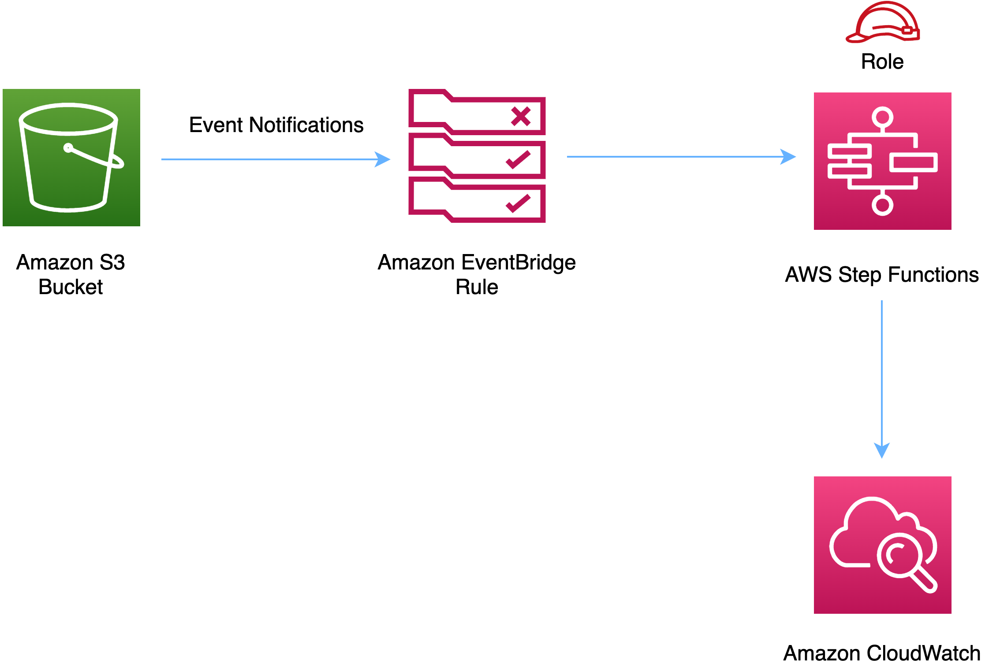

# aws-s3-step-function module
<!--BEGIN STABILITY BANNER-->

---


> Some of our early constructs don’t meet the naming standards that evolved for the library. We are releasing completely feature compatible versions with corrected names. The underlying implementation code is the same regardless of whether you deploy the construct using the old or new name. We will support both names for all 1.x releases, but in 2.x we will only publish the correctly named constructs. This construct is being replaced by the functionally identical aws-s3-stepfunctions.

> All classes are under active development and subject to non-backward compatible changes or removal in any
> future version. These are not subject to the [Semantic Versioning](https://semver.org/) model.
> This means that while you may use them, you may need to update your source code when upgrading to a newer version of this package.

---
<!--END STABILITY BANNER-->

| **Reference Documentation**:| <span style="font-weight: normal">https://docs.aws.amazon.com/solutions/latest/constructs/</span>|
|:-------------|:-------------|
<div style="height:8px"></div>

| **Language**     | **Package**        |
|:-------------|-----------------|
| Python|`aws_solutions_constructs.aws_s3_step_function`|
| Typescript|`@aws-solutions-constructs/aws-s3-step-function`|
| Java|`software.amazon.awsconstructs.services.s3stepfunction`|

This AWS Solutions Construct implements an Amazon S3 bucket connected to an AWS Step Function.

*Note - This construct uses Amazon EventBridge (Amazon CloudWatch Events) to trigger AWS Step Functions. EventBridge is more flexible, but triggering Step Functions with S3 Event Notifications has less latency and is more cost effective. If cost and/or latency is an issue, you should consider deploy aws-s3-lambda and aws-lambda-stepfunctions in place of this construct.*

Here is a minimal deployable pattern definition in Typescript:

``` typescript
import { S3ToStepFunction, S3ToStepFunctionProps } from '@aws-solutions-constructs/aws-s3-step-function';
import * as stepfunctions from '@aws-cdk/aws-stepfunctions';

const startState = new stepfunctions.Pass(stack, 'StartState');

new S3ToStepFunction(this, 'test-s3-step-function-stack', {
    stateMachineProps: {
      definition: startState
    }
});
```

## Initializer

``` text
new S3ToStepFunction(scope: Construct, id: string, props: S3ToStepFunctionProps);
```

_Parameters_

* scope [`Construct`](https://docs.aws.amazon.com/cdk/api/latest/docs/@aws-cdk_core.Construct.html)
* id `string`
* props [`S3ToStepFunctionProps`](#pattern-construct-props)

## Pattern Construct Props

| **Name**     | **Type**        | **Description** |
|:-------------|:----------------|-----------------|
|existingBucketObj?|[`s3.IBucket`](https://docs.aws.amazon.com/cdk/api/latest/docs/@aws-cdk_aws-s3.IBucket.html)|Existing instance of S3 Bucket object. If this is provided, then also providing bucketProps is an error. |
|bucketProps?|[`s3.BucketProps`](https://docs.aws.amazon.com/cdk/api/latest/docs/@aws-cdk_aws-s3.BucketProps.html)|User provided props to override the default props for the S3 Bucket.|
|stateMachineProps|[`sfn.StateMachineProps`](https://docs.aws.amazon.com/cdk/api/latest/docs/@aws-cdk_aws-stepfunctions.StateMachineProps.html)|Optional user provided props to override the default props for sfn.StateMachine|
|eventRuleProps?|[`events.RuleProps`](https://docs.aws.amazon.com/cdk/api/latest/docs/@aws-cdk_aws-events.RuleProps.html)|Optional user provided eventRuleProps to override the defaults|
|deployCloudTrail?|`boolean`|Whether to deploy a Trail in AWS CloudTrail to log API events in Amazon S3. Defaults to `true`.|
|createCloudWatchAlarms|`boolean`|Whether to create recommended CloudWatch alarms|
|logGroupProps?|[`logs.LogGroupProps`](https://docs.aws.amazon.com/cdk/api/latest/docs/@aws-cdk_aws-logs.LogGroupProps.html)|User provided props to override the default props for for the CloudWatchLogs LogGroup.|

## Pattern Properties

| **Name**     | **Type**        | **Description** |
|:-------------|:----------------|-----------------|
|stateMachine|[`sfn.StateMachine`](https://docs.aws.amazon.com/cdk/api/latest/docs/@aws-cdk_aws-stepfunctions.StateMachine.html)|Returns an instance of sfn.StateMachine created by the construct|
|stateMachineLogGroup|[`logs.ILogGroup`](https://docs.aws.amazon.com/cdk/api/latest/docs/@aws-cdk_aws-logs.ILogGroup.html)|Returns an instance of the ILogGroup created by the construct for StateMachine|
|cloudwatchAlarms?|[`cloudwatch.Alarm[]`](https://docs.aws.amazon.com/cdk/api/latest/docs/@aws-cdk_aws-cloudwatch.Alarm.html)|Returns a list of cloudwatch.Alarm created by the construct|
|s3Bucket?|[`s3.Bucket`](https://docs.aws.amazon.com/cdk/api/latest/docs/@aws-cdk_aws-s3.Bucket.html)|Returns an instance of the s3.Bucket created by the construct|
|s3LoggingBucket?|[`s3.Bucket`](https://docs.aws.amazon.com/cdk/api/latest/docs/@aws-cdk_aws-s3.Bucket.html)|Returns an instance of s3.Bucket created by the construct as the logging bucket for the primary bucket.|
|cloudtrail|[`cloudtrail.Trail`](https://docs.aws.amazon.com/cdk/api/latest/docs/@aws-cdk_aws-cloudtrail.Trail.html)|Returns an instance of the cloudtrail.Trail created by the construct|
|cloudtrailBucket|[`s3.Bucket`](https://docs.aws.amazon.com/cdk/api/latest/docs/@aws-cdk_aws-s3.Bucket.html)|Returns an instance of the s3.Bucket created by the construct for CloudTrail|
|cloudtrailLoggingBucket|[`s3.Bucket`](https://docs.aws.amazon.com/cdk/api/latest/docs/@aws-cdk_aws-s3.Bucket.html)|Returns an instance of s3.Bucket created by the construct as the logging bucket for the primary CloudTrail bucket.|

## Default settings

Out of the box implementation of the Construct without any override will set the following defaults:

### Amazon S3 Bucket
* Configure Access logging for S3 Bucket
* Enable server-side encryption for S3 Bucket using AWS managed KMS Key
* Enforce encryption of data in transit
* Turn on the versioning for S3 Bucket
* Don't allow public access for S3 Bucket
* Retain the S3 Bucket when deleting the CloudFormation stack
* Applies Lifecycle rule to move noncurrent object versions to Glacier storage after 90 days

### AWS CloudTrail
* Configure a Trail in AWS CloudTrail to log API events in Amazon S3 related to the Bucket created by the Construct

### Amazon CloudWatch Events Rule
* Grant least privilege permissions to CloudWatch Events to trigger the Lambda Function

### AWS Step Function
* Enable CloudWatch logging for API Gateway
* Deploy best practices CloudWatch Alarms for the Step Function

## Architecture


***
&copy; Copyright 2021 Amazon.com, Inc. or its affiliates. All Rights Reserved.
