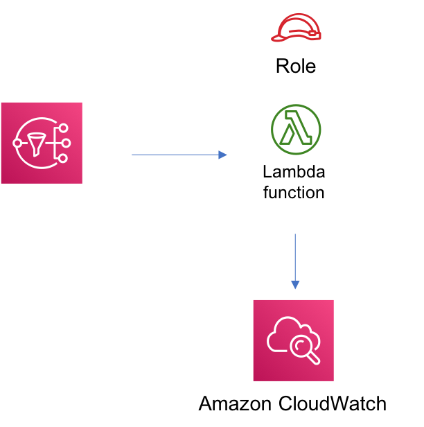

# aws-sns-lambda module
<!--BEGIN STABILITY BANNER-->

---


> All classes are under active development and subject to non-backward compatible changes or removal in any
> future version. These are not subject to the [Semantic Versioning](https://semver.org/) model.
> This means that while you may use them, you may need to update your source code when upgrading to a newer version of this package.

---
<!--END STABILITY BANNER-->

| **Reference Documentation**:| <span style="font-weight: normal">https://docs.aws.amazon.com/solutions/latest/constructs/</span>|
|:-------------|:-------------|
<div style="height:8px"></div>

| **Language**     | **Package**        |
|:-------------|-----------------|
| Python|`aws_solutions_constructs.aws_sns_lambda`|
| Typescript|`@aws-solutions-constructs/aws-sns-lambda`|
| Java|`software.amazon.awsconstructs.services.snslambda`|

This AWS Solutions Construct implements an Amazon SNS connected to an AWS Lambda function.

Here is a minimal deployable pattern definition:

``` javascript
const { SnsToLambdaProps, SnsToLambda } = require('@aws-solutions-constructs/aws-sns-lambda');

const stack = new Stack(app, 'test-sns-lambda');

// Definitions
const props: SnsToLambdaProps = {
    lambdaFunctionProps: {
        runtime: lambda.Runtime.NODEJS_12_X,
        handler: 'index.handler',
        code: lambda.Code.asset(`${__dirname}/lambda`)
    }
};

new SnsToLambda(stack, 'test-sns-lambda', props);

```

## Initializer

``` text
new SnsToLambda(scope: Construct, id: string, props: SnsToLambdaProps);
```

_Parameters_

* scope [`Construct`](https://docs.aws.amazon.com/cdk/api/latest/docs/@aws-cdk_core.Construct.html)
* id `string`
* props [`S3ToLambdaProps`](#pattern-construct-props)

## Pattern Construct Props

| **Name**     | **Type**        | **Description** |
|:-------------|:----------------|-----------------|
|existingLambdaObj?|[`lambda.Function`](https://docs.aws.amazon.com/cdk/api/latest/docs/@aws-cdk_aws-lambda.Function.html)|Existing instance of Lambda Function object, if this is set then the lambdaFunctionProps is ignored.|
|lambdaFunctionProps?|[`lambda.FunctionProps`](https://docs.aws.amazon.com/cdk/api/latest/docs/@aws-cdk_aws-lambda.FunctionProps.html)|User provided props to override the default props for the Lambda function.|
|topicProps?|[`sns.TopicProps`](https://docs.aws.amazon.com/cdk/api/latest/docs/@aws-cdk_aws-sns.TopicProps.html)|Optional user provided properties to override the default properties for the SNS topic.|
|enableEncryption?|`boolean`|Use a KMS Key, either managed by this CDK app, or imported. If importing an encryption key, it must be specified in the encryptionKey property for this construct.|
|encryptionKey?|[`kms.Key`](https://docs.aws.amazon.com/cdk/api/latest/docs/@aws-cdk_aws-kms.Key.html)|An optional, imported encryption key to encrypt the SNS topic with.|

## Pattern Properties

| **Name**     | **Type**        | **Description** |
|:-------------|:----------------|-----------------|
|lambdaFunction|[`lambda.Function`](https://docs.aws.amazon.com/cdk/api/latest/docs/@aws-cdk_aws-lambda.Function.html)|Returns an instance of the Lambda function created by the pattern.|
|snsTopic|[`sns.Topic`](https://docs.aws.amazon.com/cdk/api/latest/docs/@aws-cdk_aws-sns.Topic.html)|Returns an instance of the SNS topic created by the pattern.|
|encryptionKey|[`kms.Key`](https://docs.aws.amazon.com/cdk/api/latest/docs/@aws-cdk_aws-kms.Key.html)|Returns an instance of kms.Key used for the SNS topic.|

## Default settings

Out of the box implementation of the Construct without any override will set the following defaults:

### Amazon SNS Topic
* Configure least privilege access permissions for SNS Topic
* Enable server-side encryption forSNS Topic using Customer managed KMS Key
* Enforce encryption of data in transit

### AWS Lambda Function
* Configure least privilege access IAM role for Lambda function
* Enable reusing connections with Keep-Alive for NodeJs Lambda function

## Architecture


***
&copy; Copyright 2020 Amazon.com, Inc. or its affiliates. All Rights Reserved.