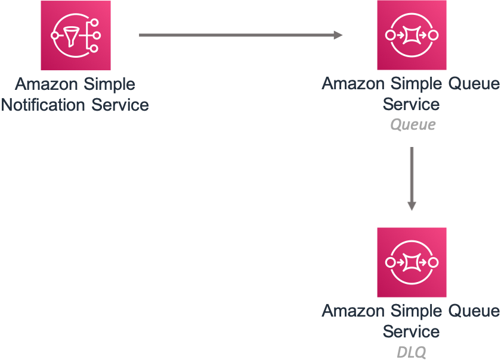

# aws-sns-sqs module
<!--BEGIN STABILITY BANNER-->

---


> All classes are under active development and subject to non-backward compatible changes or removal in any
> future version. These are not subject to the [Semantic Versioning](https://semver.org/) model.
> This means that while you may use them, you may need to update your source code when upgrading to a newer version of this package.

---
<!--END STABILITY BANNER-->

| **Reference Documentation**:| <span style="font-weight: normal">https://docs.aws.amazon.com/solutions/latest/constructs/</span>|
|:-------------|:-------------|
<div style="height:8px"></div>

| **Language**     | **Package**        |
|:-------------|-----------------|
| Python|`aws_solutions_constructs.aws_sns_sqs`|
| Typescript|`@aws-solutions-constructs/aws-sns-sqs`|
| Java|`software.amazon.awsconstructs.services.snssqs`|

## Overview
This AWS Solutions Construct implements an Amazon SNS topic connected to an Amazon SQS queue.

Here is a minimal deployable pattern definition:

Typescript
``` typescript
import { Construct } from 'constructs';
import { Stack, StackProps } from 'aws-cdk-lib';
import { SnsToSqs, SnsToSqsProps } from "@aws-solutions-constructs/aws-sns-sqs";
import * as iam from 'aws-cdk-lib/aws-iam';

const snsToSqsStack = new SnsToSqs(this, 'SnsToSqsPattern', {});

// Grant yourself permissions to use the Customer Managed KMS Key
const policyStatement = new iam.PolicyStatement({
    actions: ["kms:Encrypt", "kms:Decrypt"],
    effect: iam.Effect.ALLOW,
    principals: [ new iam.AccountRootPrincipal() ],
    resources: [ "*" ]
});

snsToSqsStack.queueEncryptionKey?.addToResourcePolicy(policyStatement);
snsToSqsStack.topicEncryptionKey?.addToResourcePolicy(policyStatement);
```

Python
``` python
from aws_solutions_constructs.aws_sns_sqs import SnsToSqs
from aws_cdk import (
    aws_iam as iam,
    Stack
)
from constructs import Construct

construct_stack = SnsToSqs(self, 'SnsToSqsPattern')

policy_statement = iam.PolicyStatement(
    actions=["kms:Encrypt", "kms:Decrypt"],
    effect=iam.Effect.ALLOW,
    principals=[iam.AccountRootPrincipal()],
    resources=["*"]
)

construct_stack.queue_encryption_key.add_to_resource_policy(policy_statement)
construct_stack.topic_encryption_key.add_to_resource_policy(policy_statement)
```

Java
``` java
import software.constructs.Construct;
import java.util.List;

import software.amazon.awscdk.Stack;
import software.amazon.awscdk.StackProps;
import software.amazon.awscdk.services.iam.*;
import software.amazon.awsconstructs.services.snssqs.*;

final SnsToSqs constructStack = new SnsToSqs(this, "SnsToSqsPattern",
        new SnsToSqsProps.Builder()
                .build());

// Grant yourself permissions to use the Customer Managed KMS Key
final PolicyStatement policyStatement = PolicyStatement.Builder.create()
        .actions(List.of("kms:Encrypt", "kms:Decrypt"))
        .effect(Effect.ALLOW)
        .principals(List.of(new AccountRootPrincipal()))
        .resources(List.of("*"))
        .build();

constructStack.getQueueEncryptionKey().addToResourcePolicy(policyStatement);
constructStack.getTopicEncryptionKey().addToResourcePolicy(policyStatement);
```
## New Interface as of v2.58.0

As of Solutions Constructs v2.58.0, we have updated the interface of SnsToSqs. The original implementation shared a KMS customer managed key between the topic and queue. There was a single set of construct props to define this key and a single  property to access the single key. The new interface does not share a key, but uses a separate key for each resource and allows clients to control and access these keys independently.

In  CDK v2.32.0, the CDK introduced an improvement in SNS Subscriptions that narrowed the permissions to access the SQS encryption key to the specific SNS topic (it was formerly the entire SNS service). This feature created a circular reference in SnsToSqs constructs due to the shared KMS keys, but since the improvement was gated behind the feature flag `@aws-cdk/aws-sns-subscriptions:restrictSqsDescryption`, it had no impact on existing applications. Newly generated CDK apps had the feature flag turned on by default, so would have to adjust settings to avoid the circular reference (the minimal deployment code would not work).

In addition, attempting to share the key between resources led to odd implementation choices in the construct - the implementation was highly biased towards the topic. For instance, if an existingTopic was provided but a CMK was still created to encrypt the queue that CMK was not available in the `encryptionKey` property.

Code using the original, single key props should continue to work - while that portion of the construct interface is deprecated it is not going away any time soon. Any code using any of those props, or with the new feature flag not enabled, will continue to use the old implementation. We wrote many unit tests confirming the old implementation will continue to work the same, warts and all. We do  recommend that you migrate to use the new key features to take advantage of the finer grained IAM policy for the key and more control over key behavior within the construct.

Any code that references one of the new key properties (or that enables the new feature flag) will use the new functionality.

## Pattern Construct Props

| **Name**     | **Type**        | **Description** |
|:-------------|:----------------|-----------------|
|existingTopicObj?|[`sns.Topic`](https://docs.aws.amazon.com/cdk/api/v2/docs/aws-cdk-lib.aws_sns.Topic.html)|An optional, existing SNS topic to be used instead of the default topic. Providing both this and `topicProps` will cause an error.|
|topicProps?|[`sns.TopicProps`](https://docs.aws.amazon.com/cdk/api/v2/docs/aws-cdk-lib.aws_sns.TopicProps.html)|Optional user provided properties to override the default properties for the SNS topic.|
|encryptTopicWithCmk|`boolean`|Whether to encrypt the Topic with a customer managed KMS key (CMK). This is the default behavior, and this property defaults to true - if it is explicitly set to false then the Topic is encrypted with an Amazon managed KMS key. For a completely unencrypted Topic (not recommended), create the Topic separately from the construct and pass it in using the existingTopicObject.|
|topicEncryptionKeyProps|[`kms.KeyProps`](https://docs.aws.amazon.com/cdk/api/v2/docs/aws-cdk-lib.aws_kms.Key.html#construct-props)|An optional subset of key properties to override the default properties used by constructs (`enableKeyRotation: true`). These properties will be used in constructing the CMK used to encrypt the SNS topic.|
|existingTopicEncryptionKey|[`kms.Key`](https://docs.aws.amazon.com/cdk/api/v2/docs/aws-cdk-lib.aws_kms.Key.html)|An optional CMK that will be used by the construct to encrypt the new SNS Topic.|
|existingQueueObj?|[`sqs.Queue`](https://docs.aws.amazon.com/cdk/api/v2/docs/aws-cdk-lib.aws_sqs.Queue.html)|An optional, existing SQS queue to be used instead of the default queue. Providing both this and `queueProps` will cause an error.|
|queueProps?|[`sqs.QueueProps`](https://docs.aws.amazon.com/cdk/api/v2/docs/aws-cdk-lib.aws_sqs.QueueProps.html)|Optional user provided properties to override the default properties for the SQS queue.|
|encryptQueueWithCmk|`boolean`|Whether to encrypt the Queue with a customer managed KMS key (CMK). This is the default behavior, and this property defaults to true - if it is explicitly set to false then the Queue is encrypted with an Amazon managed KMS key. For a completely unencrypted Queue (not recommended), create the Queue separately from the construct and pass it in using the existingQueueObject. Since SNS subscriptions do not currently support SQS queues with AWS managed encryption keys, setting this to false will always result in an error from the underlying CDK - we have still included this property for consistency with topics and to be ready if the services one day support this functionality.|
|queueEncryptionKeyProps|[`kms.KeyProps`](https://docs.aws.amazon.com/cdk/api/v2/docs/aws-cdk-lib.aws_kms.Key.html#construct-props)|An optional subset of key properties to override the default properties used by constructs (`enableKeyRotation: true`). These properties will be used in constructing the CMK used to encrypt the SQS queue.|
|existingQueueEncryptionKey|[`kms.Key`](https://docs.aws.amazon.com/cdk/api/v2/docs/aws-cdk-lib.aws_kms.Key.html)|An optional CMK that will be used by the construct to encrypt the new SQS queue.|
|deployDeadLetterQueue?|`boolean`|Whether to create a secondary queue to be used as a dead letter queue. Defaults to true.|
|deadLetterQueueProps?|[`sqs.QueueProps`](https://docs.aws.amazon.com/cdk/api/v2/docs/aws-cdk-lib.aws_sqs.QueueProps.html)|Optional user-provided props to override the default props for the dead letter SQS queue.|
|maxReceiveCount?|`number`|The number of times a message can be unsuccessfully dequeued before being moved to the dead letter queue. Defaults to 15.|
|sqsSubscriptionProps?|[`subscriptions.SqsSubscriptionProps`](https://docs.aws.amazon.com/cdk/api/v2/docs/aws-cdk-lib.aws_sns_subscriptions.SqsSubscriptionProps.html)|Optional user-provided props to override the default props for sqsSubscriptionProps.|

## Pattern Properties

| **Name**     | **Type**        | **Description** |
|:-------------|:----------------|-----------------|
|snsTopic|[`sns.Topic`](https://docs.aws.amazon.com/cdk/api/v2/docs/aws-cdk-lib.aws_sns.Topic.html)|Returns an instance of the SNS topic created by the pattern.|
|topicEncryptionKey?|[`kms.Key`](https://docs.aws.amazon.com/cdk/api/v2/docs/aws-cdk-lib.aws_kms.Key.html)|Returns the KMS key used to encrypt the topic within the construct. Note - this is only set if the construct assigns the key, if the key is passed in topicProps it will not appear here.|
|sqsQueue|[`sqs.Queue`](https://docs.aws.amazon.com/cdk/api/v2/docs/aws-cdk-lib.aws_sqs.Queue.html)|Returns an instance of the SQS queue created by the pattern.|
|queueEncryptionKey?|[`kms.Key`](https://docs.aws.amazon.com/cdk/api/v2/docs/aws-cdk-lib.aws_kms.Key.html)|Returns the KMS key used to encrypt the queue within the construct. Note - this is only set if the construct assigns the key, if the key is passed in topicProps it will not appear here.|
|deadLetterQueue?|[`sqs.Queue`](https://docs.aws.amazon.com/cdk/api/v2/docs/aws-cdk-lib.aws_sqs.Queue.html)|Returns an instance of the dead-letter SQS queue created by the pattern.|

## Deprecated Pattern Construct Props

| **Name**     | **Type**        | **Description** |
|:-------------|:----------------|-----------------|
|enableEncryptionWithCustomerManagedKey?|`boolean`|If no key is provided, this flag determines whether the queue is encrypted with a new CMK or an AWS managed key. This flag is ignored if any of the following are defined: topicProps.masterKey, queueProps.encryptionMasterKey, encryptionKey or encryptionKeyProps. We recommend you migrate your code to use  encryptQueueWithCmk and encryptTopicWithCmk in place of this prop value.|
|encryptionKey?|[`kms.Key`](https://docs.aws.amazon.com/cdk/api/v2/docs/aws-cdk-lib.aws_kms.Key.html)|An optional, imported encryption key to encrypt the SQS Queue and SNS Topic with. We recommend you migrate your code to use  queueEncryptionKey and topicEncryptionKey in place of this prop value.|
|encryptionKeyProps?|[`kms.KeyProps`](https://docs.aws.amazon.com/cdk/api/v2/docs/aws-cdk-lib.aws_kms.Key.html#construct-props)|Optional user provided properties to override the default properties for the KMS encryption key used to encrypt the SQS topic and queue with. We recommend you migrate your code to use  queueEncryptionKeyProps and topicEncryptionKeyProps in place of this prop value.|

## Deprecated Pattern Properties

| **Name**     | **Type**        | **Description** |
|:-------------|:----------------|-----------------|
|encryptionKey|[`kms.Key`](https://docs.aws.amazon.com/cdk/api/v2/docs/aws-cdk-lib.aws_kms.Key.html)|Returns an instance of kms.Key used for the SQS queue, and SNS Topic.|

## Default settings

Out of the box implementation of the Construct without any override will set the following defaults:

### Amazon SNS Topic
* Configure least privilege access permissions for SNS Topic
* Enable server-side encryption for SNS Topic using Customer managed KMS Key
* Enforce encryption of data in transit

### Amazon SQS Queue
* Configure least privilege access permissions for SQS Queue
* Deploy SQS dead-letter queue for the source SQS Queue
* Enable server-side encryption for SQS Queue using Customer managed KMS Key
* Enforce encryption of data in transit

## Architecture


***
&copy; Copyright Amazon.com, Inc. or its affiliates. All Rights Reserved.
