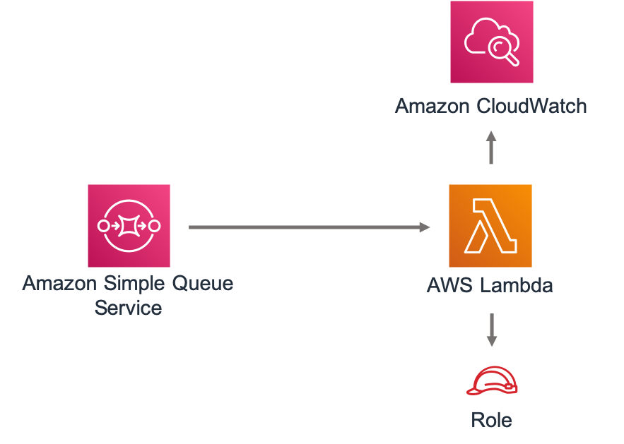

# aws-sqs-lambda module
<!--BEGIN STABILITY BANNER-->

---


> All classes are under active development and subject to non-backward compatible changes or removal in any
> future version. These are not subject to the [Semantic Versioning](https://semver.org/) model.
> This means that while you may use them, you may need to update your source code when upgrading to a newer version of this package.

---
<!--END STABILITY BANNER-->

| **Reference Documentation**:| <span style="font-weight: normal">https://docs.aws.amazon.com/solutions/latest/constructs/</span>|
|:-------------|:-------------|
<div style="height:8px"></div>

| **Language**     | **Package**        |
|:-------------|-----------------|
| Python|`aws_solutions_constructs.aws_sqs_lambda`|
| Typescript|`@aws-solutions-constructs/aws-sqs-lambda`|
| Java|`software.amazon.awsconstructs.services.sqslambda`|

This AWS Solutions Construct implements an Amazon SQS queue connected to an AWS Lambda function.

Here is a minimal deployable pattern definition in Typescipr:

``` typescript
import { SqsToLambda, SqsToLambdaProps } from "@aws-solutions-constructs/aws-sqs-lambda";

new SqsToLambda(this, 'SqsToLambdaPattern', {
    lambdaFunctionProps: {
        runtime: lambda.Runtime.NODEJS_10_X,
        handler: 'index.handler',
        code: lambda.Code.fromAsset(`${__dirname}/lambda`)
    }
});

```

## Initializer

``` text
new SqsToLambda(scope: Construct, id: string, props: SqsToLambdaProps);
```

_Parameters_

* scope [`Construct`](https://docs.aws.amazon.com/cdk/api/latest/docs/@aws-cdk_core.Construct.html)
* id `string`
* props [`SqsToLambdaProps`](#pattern-construct-props)

## Pattern Construct Props

| **Name**     | **Type**        | **Description** |
|:-------------|:----------------|-----------------|
|existingLambdaObj?|[`lambda.Function`](https://docs.aws.amazon.com/cdk/api/latest/docs/@aws-cdk_aws-lambda.Function.html)|Existing instance of Lambda Function object, if this is set then the lambdaFunctionProps is ignored.|
|lambdaFunctionProps?|[`lambda.FunctionProps`](https://docs.aws.amazon.com/cdk/api/latest/docs/@aws-cdk_aws-lambda.FunctionProps.html)|User provided props to override the default props for the Lambda function.|
|existingQueueObj?|[`sqs.Queue`](https://docs.aws.amazon.com/cdk/api/latest/docs/@aws-cdk_aws-sqs.Queue.html)|An optional, existing SQS queue to be used instead of the default queue. If an existing queue is provided, the `queueProps` property will be ignored.|
|queueProps?|[`sqs.QueueProps`](https://docs.aws.amazon.com/cdk/api/latest/docs/@aws-cdk_aws-sqs.QueueProps.html)|Optional user-provided props to override the default props for the SQS queue.|
|deadLetterQueueProps?|[`sqs.QueueProps`](https://docs.aws.amazon.com/cdk/api/latest/docs/@aws-cdk_aws-sqs.QueueProps.html)|Optional user-provided props to override the default props for the dead letter SQS queue.|
|deployDeadLetterQueue?|`boolean`|Whether to create a secondary queue to be used as a dead letter queue. Defaults to true.|
|maxReceiveCount?|`number`|The number of times a message can be unsuccessfully dequeued before being moved to the dead letter queue. Defaults to 15.|

## Pattern Properties

| **Name**     | **Type**        | **Description** |
|:-------------|:----------------|-----------------|
|lambdaFunction|[`lambda.Function`](https://docs.aws.amazon.com/cdk/api/latest/docs/@aws-cdk_aws-lambda.Function.html)|Returns an instance of the Lambda function created by the pattern.|
|sqsQueue|[`sqs.Queue`](https://docs.aws.amazon.com/cdk/api/latest/docs/@aws-cdk_aws-sqs.Queue.html)|Returns an instance of the SQS queue created by the pattern.|
|deadLetterQueue?|[`sqs.Queue`](https://docs.aws.amazon.com/cdk/api/latest/docs/@aws-cdk_aws-sqs.Queue.html)|Returns an instance of the dead-letter SQS queue created by the pattern.|

## Default settings

Out of the box implementation of the Construct without any override will set the following defaults:

### Amazon SQS Queue
* Deploy SQS dead-letter queue for the source SQS Queue
* Enable server-side encryption for source SQS Queue using AWS Managed KMS Key
* Enforce encryption of data in transit

### AWS Lambda Function
* Configure limited privilege access IAM role for Lambda function
* Enable reusing connections with Keep-Alive for NodeJs Lambda function
* Enable X-Ray Tracing

## Architecture


***
&copy; Copyright 2020 Amazon.com, Inc. or its affiliates. All Rights Reserved.
