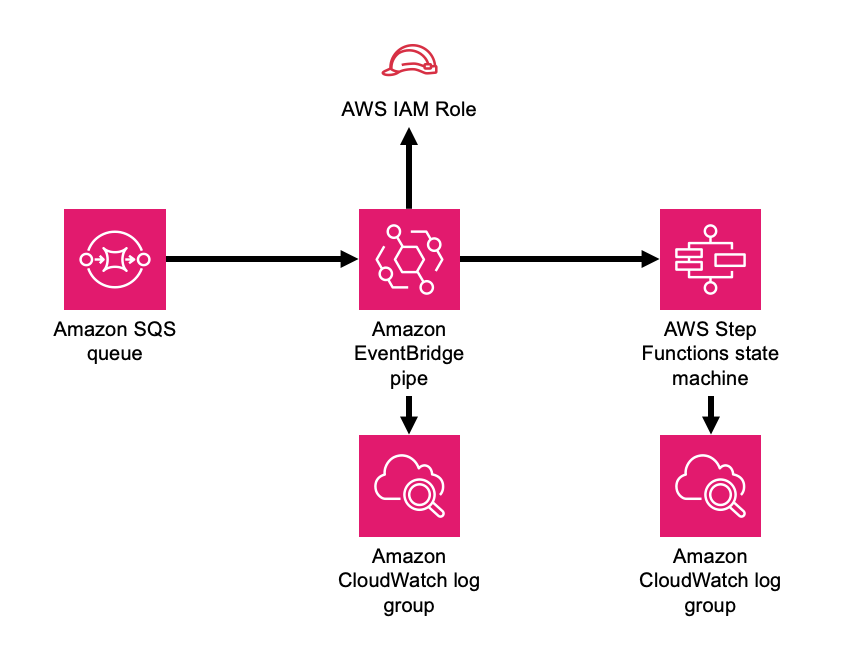

# aws-sqs-pipes-stepfunctions module
<!--BEGIN STABILITY BANNER-->

---


---
<!--END STABILITY BANNER-->

| **Reference Documentation**:| <span style="font-weight: normal">https://docs.aws.amazon.com/solutions/latest/constructs/</span>|
|:-------------|:-------------|
<div style="height:8px"></div>

| **Language**     | **Package**        |
|:-------------|-----------------|
| Python|`aws_solutions_constructs.aws_sqs_pipes_stepfunctions`|
| Typescript|`@aws-solutions-constructs/aws-sqs-pipes-stepfunctions`|
| Java|`software.amazon.awsconstructs.services.sqspipesstepfunctions`|

## Overview
This AWS Solutions Construct implements an AWS SQS queue whose messages are passed to an AWS Step Functions state machine by an Amazon Eventbridge pipe.

Here is a minimal deployable pattern definition:

Typescript
``` typescript
import { Construct } from 'constructs';
import { Stack, StackProps } from 'aws-cdk-lib';
import * as stepfunctions from 'aws-cdk-lib/aws-stepfunctions';
import { SqsToPipesToStepfunctions, SqsToPipesToStepfunctionsProps } from "@aws-solutions-constructs/aws-sqs-pipes-stepfunctions";

const startState = new stepfunctions.Pass(this, 'StartState');

new SqsToPipesToStepfunctions(this, 'SqsToLambdaToStepfunctionsPattern', {
  stateMachineProps: {
    definition: startState
  }
});
```

Python
``` python
Coming soon
```

Java
``` java
Coming soon
```

## Pattern Construct Props

| **Name**     | **Type**        | **Description** |
|:-------------|:----------------|-----------------|
|existingQueueObj?|[`sqs.Queue`](https://docs.aws.amazon.com/cdk/api/v2/docs/aws-cdk-lib.aws_sqs.Queue.html)|An optional, existing SQS queue to be used instead of the default queue. Providing both this and `queueProps` will cause an error.|
|queueProps?|[`sqs.QueueProps`](https://docs.aws.amazon.com/cdk/api/v2/docs/aws-cdk-lib.aws_sqs.QueueProps.html)|Optional user provided properties to override the default properties for the SQS queue.|
|encryptQueueWithCmk|`boolean`|Whether to encrypt the Queue with a customer managed KMS key (CMK). This is the default behavior, and this property defaults to true - if it is explicitly set to false then the Queue is encrypted with an Amazon managed KMS key. For a completely unencrypted Queue (not recommended), create the Queue separately from the construct and pass it in using the existingQueueObject. Since SNS subscriptions do not currently support SQS queues with AWS managed encryption keys, setting this to false will always result in an error from the underlying CDK - we have still included this property for consistency with topics and to be ready if the services one day support this functionality.|
|queueEncryptionKeyProps|[`kms.KeyProps`](https://docs.aws.amazon.com/cdk/api/v2/docs/aws-cdk-lib.aws_kms.Key.html#construct-props)|An optional subset of key properties to override the default properties used by constructs (`enableKeyRotation: true`). These properties will be used in constructing the CMK used to encrypt the SQS queue.|
|existingQueueEncryptionKey|[`kms.Key`](https://docs.aws.amazon.com/cdk/api/v2/docs/aws-cdk-lib.aws_kms.Key.html)|An optional CMK that will be used by the construct to encrypt the new SQS queue.|
|deployDeadLetterQueue?|`boolean`|Whether to create a secondary queue to be used as a dead letter queue. Defaults to true.|
|deadLetterQueueProps?|[`sqs.QueueProps`](https://docs.aws.amazon.com/cdk/api/v2/docs/aws-cdk-lib.aws_sqs.QueueProps.html)|Optional user-provided props to override the default props for the dead letter SQS queue.|
|maxReceiveCount?|`number`|The number of times a message can be unsuccessfully dequeued before being moved to the dead letter queue. Defaults to 15.|
|stateMachineProps|[`sfn.StateMachineProps`](https://docs.aws.amazon.com/cdk/api/v2/docs/aws-cdk-lib.aws_stepfunctions.StateMachineProps.html)|User provided props for the sfn.StateMachine.|
|createCloudWatchAlarms|`boolean`|Whether to create recommended CloudWatch alarms|
| logGroupProps | [logs.logGroupProps ](https://docs.aws.amazon.com/cdk/api/v2/docs/aws-cdk-lib.aws_logs.LogGroupProps.html)| Optional user provided props to override the default props for for the CloudWatchLogs LogGroup for the state machine. |
|pipeProps?|[ pipes.CfnPipeProps ](https://docs.aws.amazon.com/cdk/api/v2/docs/aws-cdk-lib.aws_pipes.CfnPipeProps.html)|Optional customer provided settings for the EventBridge pipe. source, target, roleArn and enrichment settings are set by the construct and cannot be overriden here. The construct will generate default sourceParameters, targetParameters and logConfiguration (found [here](link)) that can be overriden by populating those values in these props. If the client wants to implement enrichment or a filter, this is where that information can be provided. Any other props can be freely overridden.|
| enrichmentFunction | [lambda.Function ](https://docs.aws.amazon.com/cdk/api/v2/docs/aws-cdk-lib.aws_lambda.Function.html) | Optional - Lambda function that the construct will configure to be called to enrich the message between source and target. The construct will configure the pipe IAM role to allow invoking the function (but will not affect the IArole assigned to the function). Specifying both this and enrichmentStateMachine is an error. Default - undefined |
| enrichmentStateMachine | [sfn.StateMachine ](https://docs.aws.amazon.com/cdk/api/v2/docs/aws-cdk-lib.aws_stepfunctions.StateMachine.html) | Optional - Step Functions state machine that the construct will configure to be called to enrich the message between source and target. The construct will configure the pipe IAM role to allow executing the state machine (but will not affect the IAM role assigned to the state machine). Specifying both this and enrichmentStateMachine is an error. Default - undefined |
|pipesLogLevel|PipesLogLevel|Threshold for what messages the new pipe sends to the log, PipesLogLevel.OFF, PipesLogLevel.ERROR, PipesLogLevel.INFO, , PipesLogLevel.TRACE. Setting the level to OFF will prevent any log group from being created. If pipeProps.logConfiguration is provided, it controls all aspects of logging - if pipeProps.logConfiguration is provided then specifying this or pipeLogProps is an error. |
|pipeLogProps|[logs.LogGroupProps]()| Default behavior is for the this construct to create a new CloudWatch Logs log group for the pipe. These props are used to override defaults set by AWS or this construct. If there are concerns about the cost of log storage, this is where a client can specify a shorter retention duration (in days) |

## Pattern Properties

| **Name**     | **Type**        | **Description** |
|:-------------|:----------------|-----------------|
|stateMachine|[`sfn.StateMachine`](https://docs.aws.amazon.com/cdk/api/v2/docs/aws-cdk-lib.aws_stepfunctions.StateMachine.html)|Returns an instance of StateMachine created by the construct.|
|stateMachineLogGroup|[`logs.ILogGroup`](https://docs.aws.amazon.com/cdk/api/v2/docs/aws-cdk-lib.aws_logs.ILogGroup.html)|Returns an instance of the ILogGroup created by the construct for StateMachine|
|cloudwatchAlarms?|[`cloudwatch.Alarm[]`](https://docs.aws.amazon.com/cdk/api/v2/docs/aws-cdk-lib.aws_cloudwatch.Alarm.html)|Returns a list of alarms created by the construct.|
|sqsQueue|[`sqs.Queue`](https://docs.aws.amazon.com/cdk/api/v2/docs/aws-cdk-lib.aws_sqs.Queue.html)|Returns an instance of the SQS queue created by the pattern. |
|deadLetterQueue?|[`sqs.Queue`](https://docs.aws.amazon.com/cdk/api/v2/docs/aws-cdk-lib.aws_sqs.Queue.html)|Returns an instance of the dead letter queue created by the pattern, if one is deployed.|
|encryptionKey?|[kms.IKey](https://docs.aws.amazon.com/cdk/api/v2/docs/aws-cdk-lib.aws_kms.IKey.html)|Returns an instance of kms.Key used for the SQS queue if key is customer managed.|
|pipe|[ pipes.CfnPipe](https://docs.aws.amazon.com/cdk/api/v2/docs/aws-cdk-lib.aws_pipes.CfnPipe.html)| The L1 pipe construct created by this Solutions Construct. |
| pipeRole | [iam.Role ](https://docs.aws.amazon.com/cdk/api/v2/docs/aws-cdk-lib.aws_iam.Role.html) | The role created that allows the pipe to access both the source and the target. |

## Default settings

Out of the box implementation of the Construct without any override will set the following defaults:

### Amazon SQS Queue
* Deploy SQS dead-letter queue for the source SQS Queue.
* Enable server-side encryption for source SQS Queue using AWS Managed KMS Key.
* Enforce encryption of data in transit

### AWS Step Functions State Machine
* Deploy Step Functions standard state machine
* Create CloudWatch log group with /vendedlogs/ prefix in name
* Deploy best practices CloudWatch Alarms for the Step Functions

### AWS EventBridge Pipe
* Pipe configured with an SQS queue source and state machine target
* A least privilege IAM role assigned to the pipe to access the queue and state machine
* CloudWatch logs set up at the 'TBD' level
* Encrypted with an AWS managed KMS key

## Architecture


***
&copy; Copyright Amazon.com, Inc. or its affiliates. All Rights Reserved.